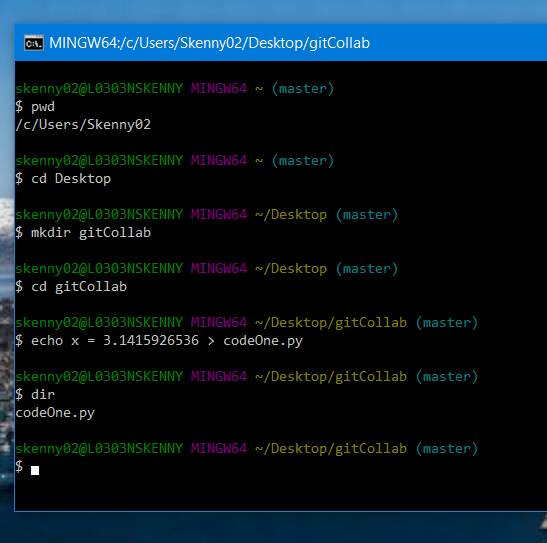

# Collaboration / Workflow Exercises

Git and Github are powerful tools that can be used in different ways depending on the preferences of the team. The steps here will demonstrate two approaches.

- [ ] Single repo, multiple contributors (good for small teams)
- [ ] Fork and pull request workflow (Github flow, good for open source)

## Small Team Workflow

For this workflow, you use a single repo on Github and have multiple contributors with write permissions. This can be done with either a private or public repo, and  

1. Make a repo (on Github)
2. Add your neighbor as a contributor (on Github)
3. Both of you follow the pull-edit-commit-push workflow
4. Occassionally you will get a merge conflict!

Add more -- dealing with merge conflicts.

TODO: add detailed steps to add neighbor as contributor and try this out.

### Create a new repository using git
Let's create a new repository using the command line with Git Bash.  This will be the repository where you and your neighbor will contribute

1. Open Git Bash
2. Navigate to the directory where you would like to create a directory (a.k.a. folder) where your repository will reside.
3. Create the directory and a file within this directory.  This file can be a text file (i.e., .txt) or a file with code (e.g., .py, .R).

  
Expand detailed Github Steps Here

4. Write a few lines in the file you just created.
5. Convert the directory into a repository.
6. Upload the directory into GitHub

### Steps adding neighbor as contributor

1. Log into your GitHub account 
2. Click on the green “New” button to the left of the webpage.

## Fork and Pull Request

When you are working on an open source project, you may receive contributions from people outside of your organization who you have never met or spoken to offline. They don't have edit permissions on your repo, so how do they contribute improvements to your code?

Outside collaborator takes following steps:

1. Forks a copy of the repo to their own account
2. Clones the fork to their local machine
3. Make a new branch with proposed edits
4. Push edits/new branch back to their Github account
5. Open a pull request to the original upstream repository

Then the original repository owner:

6. Inspects the proposed changes
7. Merges the proposed changes into the main repo (or request changes, or discuss, or reject the request)

TODO: add detailed steps to fork the presentation repo.

