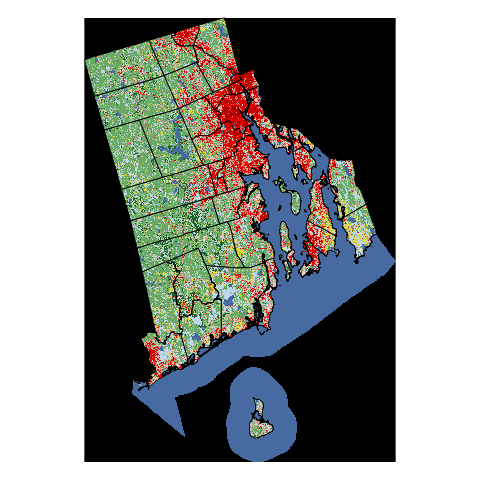
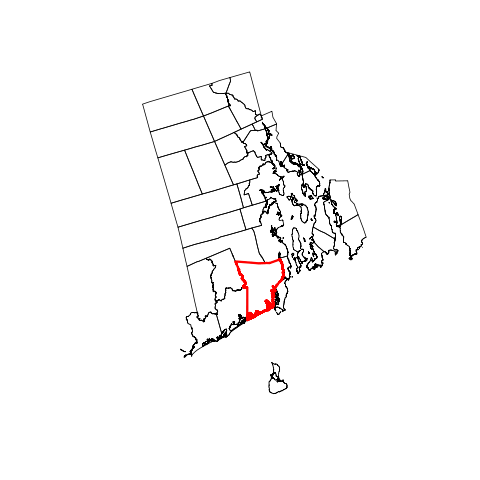
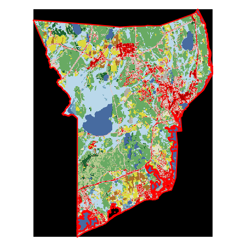

[Just the Code](gis_demo.R)

Free and open source software solutions for GIS have come a long way in the last several years as the tools to handle file I/O, vector analysis, and raster processing have matured.  Built on top of many of these libraries are some farily well known options and include [QGIS](http://www.qgis.org/en/site/), [GRASS](https://grass.osgeo.org/), and [PostGIS](http://postgis.net/).  During this same time, we have seen the rise of the [R Language for Statistical Computing](https://www.r-project.org/) and not to be left behind many of the same libraries are now supported in R.  So given all of these options, plus the tools many use provided by [esri](https://www.esri.com) there is a rich ecosystem of options for GIS analysts.  

The purpose of this lightning demo is to provide a small taste of GIS capabilities that are available in R.  I will run through the set-up required to get going, show examples of reading in and exploring both raster and vector, show some visualization options, and do some simple analysis. Additionally, this demo assumes a minimum level of familiarity with R.  If you are new to R and would like to learn more, a fun place to start is [rforcats.net](http://rforcats.net). 

##Get R set up to do GIS
Our first task is to make sure we have everything in place to do spatial analysis.  The core packages that will provide nearly all of the GIS functionality you need on a daily basis are:

- `sp`: provides the base data structure for vector (and other) data.  This is the foundation that most GIS in R is built on.
- `raster`: provides the base data strcuture for raster data as well as a bit of visualization and analysis tools.  I prefer this over using `sp` for raster data becuase `raster` leaves data on disk and does not pull it all in to memory.
- `rgdal`: R client for Geospatial Data Abstraction Library (GDAL) and handles file I/O plus projections.  Does require access to GDAL and PROJ.4.  These are part of the package on Windows (e.g. trivial to install), but external libraries need to be loaded on Linux and Mac.
- `rgeos`: R client for the Geometry Engine, Open Source (GEOS).  This provides vector analysis capabilities.  Similar to `rgdal` external libraries are needed, but are part of Windows binaries and needed for Linux and Mac.

To get this set up all we need to do is:


```r
#if not already installed
install.packages(c("sp","raster","rgdal","rgeos"))
```


```r
library("sp")
library("raster")
library("rgdal")
library("rgeos")
```

##Read in data
First, let's go find some data. As I am in Rhode Island, I will keep it local and get our data from the [Rhode Island Geographic Information System (RIGIS)](http://rigis.org).


```r
#Get the Town Boundaries
towns_url <- "http://rigis.org/geodata/bnd/muni97c.zip"
download.file(towns_url,"data/ri_towns.zip")
unzip("data/ri_towns.zip",exdir = "data")

#Get Landcover
#Using NLCD becuase I wanted a raster example!
lc_url <-"http://gisdata.usgs.gov/tdds/downloadfile.php?TYPE=nlcd2011_lc_state&FNAME=NLCD2011_LC_Rhode_Island.zip"
download.file(lc_url,"data/ri_lulc.zip")
unzip("data/ri_lulc.zip",exdir ="data")
```

We now have some vector data (the towns) and raster data (the land cover) locally.  How do we pull that into R?  Frist the town boundaries, which are in shapefiles.


```r
#Read in the vector town boundary
ri_towns <- readOGR("data","muni97b")
```

```
## OGR data source with driver: ESRI Shapefile 
## Source: "data", layer: "muni97b"
## with 421 features
## It has 12 fields
```

That wasn't too bad.  Essentially (for shapefiles, anyway) the first argument is the folder where the shapefiles reside and the second argument is the name of the shapefile (without the `.shp` extension).

Rasters are pretty easy too.  In this case we are reading in a GeoTiff file. 


```r
#Read in the raster landcover
ri_lulc <- raster("data/NLCD2011_LC_Rhode_Island.tif")
```

##Explore that data
So, not much really happened there.  Let's look around at these just to make sure we got something.


```r
#List the objects in memory
ls()
```

```
##  [1] "codes"        "idx"          "map"          "proj4"       
##  [5] "ri_lulc"      "ri_towns"     "ri_towns_geo" "saveas"      
##  [9] "sk_bnd"       "sk_lulc"      "towns_url"    "values"      
## [13] "x"
```

```r
#Let's look at the towns
#Default view (from the raster package, actually)
ri_towns
```

```
## class       : SpatialPolygonsDataFrame 
## features    : 421 
## extent      : 220310.4, 432040.9, 23048.49, 340916.6  (xmin, xmax, ymin, ymax)
## coord. ref. : +proj=tmerc +lat_0=41.08333333333334 +lon_0=-71.5 +k=0.99999375 +x_0=99999.99999999999 +y_0=0 +ellps=GRS80 +datum=NAD83 +units=us-ft +no_defs +towgs84=0,0,0 
## variables   : 12
## names       :         AREA,    PERIMETER, RITOWN5K_, RITOWN5K_I,       NAME, MCD, CFIPS,     COUNTY, OSP, CFIPS_MCD, TWNCODE, LAND 
## min values  : 1.003758e+04,     22.76307,         2,          1, BARRINGTON,   0,     0,    BRISTOL,   0,         0,      BA,    N 
## max values  : 9.982708e+04, 388647.11922,       422,        421, WOONSOCKET,  80,    10, WASHINGTON,  39,      9040,      WY,    Y
```

```r
#Look at the attributes for my town
#ri_towns[ri_towns$NAME=="SOUTH KINGSTOWN",]
#A few rogue poly's that need to be dealt with (RIGIS is on it!)
ri_towns[ri_towns$NAME=="SOUTH KINGSTOWN" & !is.na(ri_towns$NAME),]
```

```
## class       : SpatialPolygonsDataFrame 
## features    : 33 
## extent      : 293569.4, 342676.3, 101120.6, 160990.8  (xmin, xmax, ymin, ymax)
## coord. ref. : +proj=tmerc +lat_0=41.08333333333334 +lon_0=-71.5 +k=0.99999375 +x_0=99999.99999999999 +y_0=0 +ellps=GRS80 +datum=NAD83 +units=us-ft +no_defs +towgs84=0,0,0 
## variables   : 12
## names       :         AREA,   PERIMETER, RITOWN5K_, RITOWN5K_I,            NAME, MCD, CFIPS,     COUNTY, OSP, CFIPS_MCD, TWNCODE, LAND 
## min values  : 1.022623e+04,    210.0716,       128,        102, SOUTH KINGSTOWN,  35,     9, WASHINGTON,  32,      9035,      SK,    N 
## max values  : 8.427670e+03, 388647.1192,       375,        417, SOUTH KINGSTOWN,  35,     9, WASHINGTON,  32,      9035,      SK,    Y
```

```r
#Now for the raster
ri_lulc
```

```
## class       : RasterLayer 
## dimensions  : 3487, 2442, 8515254  (nrow, ncol, ncell)
## resolution  : 30, 30  (x, y)
## extent      : 1969215, 2042475, 2269215, 2373825  (xmin, xmax, ymin, ymax)
## coord. ref. : +proj=aea +lat_1=29.5 +lat_2=45.5 +lat_0=23 +lon_0=-96 +x_0=0 +y_0=0 +ellps=GRS80 +datum=NAD83 +units=m +no_defs +towgs84=0,0,0 
## data source : /data/projects/gis_r_demo/data/NLCD2011_LC_Rhode_Island.tif 
## names       : NLCD2011_LC_Rhode_Island 
## values      : 0, 255  (min, max)
## attributes  :
##         ID OID Value      Count Red Green Blue NLCD.2011.Land.Cover.Class
##  from:   0   0     0 7854240512   0     0    0               Unclassified
##  to  : 255 255   255          0   0     0    0                           
##  Opacity
##        1
##        0
```


So, for the eagle eyes, you may have noticed that coordinate reference systems don't match.  We will need to take care of that.  And for the sake of time, I'll transform the towns to match the land cover.


```r
ri_towns <- spTransform(ri_towns,CRS(proj4string(ri_lulc)))
```

##Visualize it

We have our data in, we've looked at some of information, but this is all about GIS in R and what would a GIS demo be without some maps.  There are lots of ways to create maps in R and this area is receiveing a lot of development attention.  I'll show two ways to do this: using base tools and using `leaflet` to map the data with [leaflet.js](http://leafletjs.com/).  

I won't spend time on cartography per se, but thought I'd show some examples of maps created in R to show what is possible:

### London Bike Map
[](http://spatialanalysis.co.uk/wp-content/uploads/2012/02/bike_ggplot.png)

### Facebook Connections
[](http://paulbutler.org/archives/visualizing-facebook-friends/facebook_map.png)

Let's first look at our data with base functions.  It is pretty straightforward.


```r
#Plot landcover first
plot(ri_lulc)
#Now add the towns
plot(ri_towns, add = TRUE)
```




Next, I'll show is using our data in R, with the `leaflet` package (and javascript library) to build interactive web maps.

Before we move on, we will need the package.


```r
#Get the package
install.packages("leaflet")
library("leaflet")
```


Plus, since this is `leaflet`, projected data is going to be a challenge.  Like most web tiles, the `leaflet` tiles are served (by default) in Web Mercator ([EPSG:3857](http://wiki.openstreetmap.org/wiki/EPSG:3857)).  It is assumed that your coordinates are unprojected in WGS84.  Converstion to EPSG:3857 happens behind the scenes.


```r
proj4 <- CRS("+ellps=WGS84 +proj=longlat +datum=WGS84 +no_defs")
ri_towns_geo <- spTransform(ri_towns,proj4)
```

Now let's create the `leaflet` map.


```r
map <- leaflet()
map <- addTiles(map)
map <- addPolygons(map,data=ri_towns_geo, popup = ri_towns$NAME)
#Not Run: Takes a while.  Does projection behind the scenes.
#map <- addRasterImage(map, data = ri_lulc)
map
```


Link to output [`leaflet` map](https://cdn.rawgit.com/usepa/gis_r_demo/master/map.html)

##Analyze it
Last thing we would expect to be able to do with any GIS is some geospatial analysis.  For this demo we will keep it simple and pull out some land use and landcover summaries for Burlington.

First, let's extract just South Kingstown from the towns.


```r
#Use base R indexing to grab this
idx <- ri_towns[["NAME"]] == "SOUTH KINGSTOWN" & !is.na(ri_towns[["NAME"]])
sk_bnd <- ri_towns[idx,]
sk_bnd
```

```
## class       : SpatialPolygonsDataFrame 
## features    : 33 
## extent      : 1997764, 2012689, 2297463, 2316429  (xmin, xmax, ymin, ymax)
## coord. ref. : +proj=aea +lat_1=29.5 +lat_2=45.5 +lat_0=23 +lon_0=-96 +x_0=0 +y_0=0 +ellps=GRS80 +datum=NAD83 +units=m +no_defs +towgs84=0,0,0 
## variables   : 12
## names       :         AREA,   PERIMETER, RITOWN5K_, RITOWN5K_I,            NAME, MCD, CFIPS,     COUNTY, OSP, CFIPS_MCD, TWNCODE, LAND 
## min values  : 1.022623e+04,    210.0716,       128,        102, SOUTH KINGSTOWN,  35,     9, WASHINGTON,  32,      9035,      SK,    N 
## max values  : 8.427670e+03, 388647.1192,       375,        417, SOUTH KINGSTOWN,  35,     9, WASHINGTON,  32,      9035,      SK,    Y
```

```r
#And plot it with base
plot(ri_towns)
plot(sk_bnd, border="red", lwd = 3, add=T)
```




Now we can use the boundary to clip out the land use/land cover.


```r
#Plot landcover first
plot(sk_lulc)
#Now add the towns
plot(sk_bnd, border="red",add = T, lwd = 3)
```




Last thing to do is summarize our stats:


```r
values <- getValues(sk_lulc)
values <- data.frame(table(values))
values$Perc <- round(100 * (values$Freq/sum(values$Freq)),1)
```

Well, I can never remember the NLCD codes, so lets add that in. I grabbed them earlier and saved them as a `.csv`.

```r
codes <- read.csv("data/nlcd_2011_codes.csv")
values <- merge(values,codes,by.x="values",by.y="code")
knitr::kable(values[,3:4])
```


| Perc|description                  |
|----:|:----------------------------|
|  8.5|Water                        |
|  6.9|Developed, Open Space        |
|  7.3|Developed, Low Intensity     |
|  5.2|Developed, Medium Intensity  |
|  1.0|Developed High Intensity     |
|  1.5|Bare Rock/Sand/Clay          |
| 29.4|Deciduous Forest             |
|  2.0|Evergreen Forest             |
|  4.1|Mixed Forest                 |
|  0.6|Shrub/Scrub                  |
|  3.3|Grasslands/Herbaceous        |
|  7.1|Pasture/Hay                  |
|  1.6|Cultivated Crops             |
| 18.7|Woody Wetlands               |
|  2.8|Emergent Herbaceous Wetlands |

Whew!  Did I finish in 5 minutes.  Most likely not even close.

*Note :* Much of this demo was inspired by a previous demo I did in [Vermont in 2015](http://jwhollister.com/rgis_lightning_demo)

## EPA Disclaimer
The United States Environmental Protection Agency (EPA) GitHub project code is provided on an "as is" basis and the user assumes responsibility for its use.  EPA has relinquished control of the information and no longer has responsibility to protect the integrity , confidentiality, or availability of the information.  Any reference to specific commercial products, processes, or services by service mark, trademark, manufacturer, or otherwise, does not constitute or imply their endorsement, recommendation or favoring by EPA.  The EPA seal and logo shall not be used in any manner to imply endorsement of any commercial product or activity by EPA or the United States Government.

[](http://creativecommons.org/publicdomain/zero/1.0/)
