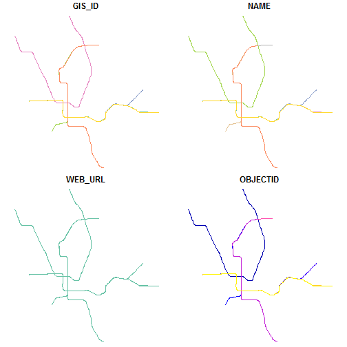
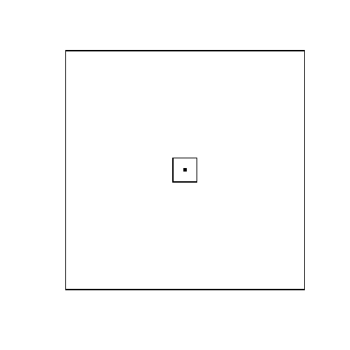
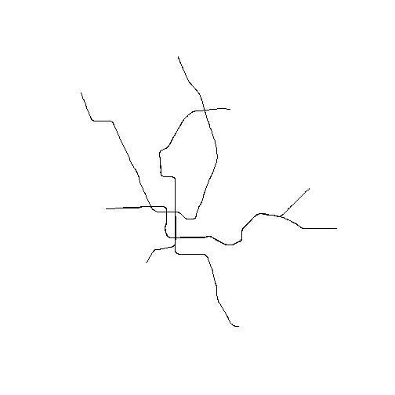

# Reading and Writing Raster and Vector Data
So, now that we have the base packages installed and loaded we can work on getting our data into and out of R.  While it is possible to store spatial data as R objects (e.g. via .Rda/Rdata files) that is probably not the best approach.  It is better to store spatial data in widley used files (e.g. shapefiles,.tiff, or geojson) or in spatial databases (e.g. file geodatabse or PostGIS) and then read that data into R for analysis then writing the results back out to your file format of choice.  In this lesson we will explore several ways to read in multiple vector and raster data types.

## Lesson Outline
- [Vector data: shapefiles](#vector-data-shapefiles)
- [Vector data: file geodatabase](#vector-data-file-geodatabase])
- [Vector data: geojson](#vector-data-geojson)
- [Raster data: GeoTIFF](#raster-data-geotiff)
- [Raster data: ASCII](#raster-data-arcinfo-ascii)
- [Writing rasters](#writing-rasters)
- [Geospatial data packages](#geospatial-data-packages)

## Lesson Exercises
- [Exercise 2.1](#exercise-21)
- [Exercise 2.2](#exercise-22)

## Get the example data
For this workshop, I have collected several example datasets to use and have included them in this repository.  So, let's first grab the dataset.  It is stored as a zip file.  You can download it [directly from this link](https://github.com/USEPA/intro_gis_with_r/blob/master/data.zip?raw=true), or we could use R.  I prefer to use the `httr` package becuase base `download.file` can act funny on different platforms.


```r
library(httr)
url <- "https://github.com/USEPA/intro_gis_with_r/blob/master/data.zip?raw=true"
GET(url,write_disk("data.zip",overwrite = TRUE))
```

Oh and while we are being a bit #rstats crazy...  Let unzip it with R too!


```r
unzip("data.zip",overwrite = TRUE)
```


## Vector data: shapefiles
For many, shapefiles are going to be the most common way to interact with spatial data.  In R, there are many ways to read in shapefiles.  We are going to focus using `rgdal` becuase it is flexible and provides a common interface to multiple file types.  But to be fair, I'll also quickly show a another option from `maptools`.

### Reading in Shapfiles
To read in a shapefile using `rgdal`, we want to use the `readOGR` function.  This function is the primary way to interact with vector data using `rgdal`.  There are many arguments to this function, but the two you need are the "dsn" and "layer".  For a shapefile the "dsn" is the path (in our case probably "data") and the "layer" is the name of the shapefile without any extensions.  The function call to read the DC Metro shapefile from out example data looks like: 


```r
dc_metro <- readOGR("data","Metro_Lines")
```

```
## OGR data source with driver: ESRI Shapefile 
## Source: "data", layer: "Metro_Lines"
## with 8 features
## It has 4 fields
```

We will get more into working with `sp` object and visualizing spatail data later, but just to prove that this did something:


```r
summary(dc_metro)
```

```
## Object of class SpatialLinesDataFrame
## Coordinates:
##         min       max
## x -77.08576 -76.91327
## y  38.83827  38.97984
## Is projected: FALSE 
## proj4string :
## [+proj=longlat +datum=WGS84 +no_defs +ellps=WGS84 +towgs84=0,0,0]
## Data attributes:
##        GIS_ID               NAME                                 WEB_URL 
##  Metro_001:2   blue           :1   http://wmata.com/rail/maps/map.cfm:8  
##  Metro_002:2   green          :1                                         
##  Metro_003:1   orange         :1                                         
##  Metro_004:1   orange - rush +:1                                         
##  Metro_005:1   red            :1                                         
##  Metro_006:1   silver         :1                                         
##                (Other)        :2                                         
##     OBJECTID   
##  Min.   :1.00  
##  1st Qu.:2.75  
##  Median :4.50  
##  Mean   :4.50  
##  3rd Qu.:6.25  
##  Max.   :8.00  
## 
```

```r
plot(dc_metro)
```



As I mentioned earlier, there are other ways to read in shapefiles.  Two common ways are with the `maptools` and `shapefiles` packages


```r
dc_metro_mt<-maptools::readShapeLines("data/Metro_Lines")
summary(dc_metro_mt)
```

```
## Object of class SpatialLinesDataFrame
## Coordinates:
##         min       max
## x -77.08576 -76.91327
## y  38.83827  38.97984
## Is projected: NA 
## proj4string : [NA]
## Data attributes:
##        GIS_ID               NAME                                 WEB_URL 
##  Metro_001:2   blue           :1   http://wmata.com/rail/maps/map.cfm:8  
##  Metro_002:2   green          :1                                         
##  Metro_003:1   orange         :1                                         
##  Metro_004:1   orange - rush +:1                                         
##  Metro_005:1   red            :1                                         
##  Metro_006:1   silver         :1                                         
##                (Other)        :2                                         
##     OBJECTID   
##  Min.   :1.00  
##  1st Qu.:2.75  
##  Median :4.50  
##  Mean   :4.50  
##  3rd Qu.:6.25  
##  Max.   :8.00  
## 
```
 
Couple of notes on this  First the `maptools` functions require that you know your geomtery type, whereas, `readOGR` will get that from the data.  I did test to see if the the `maptools::readShapeLines` was any quicker than `rgdal::readOGR` and in my huge sample of one, it was. Lastly, `readShapeLines` is a one-trick pony.  It reads in shapefiles and that is it.  As we will see, `readOGR` works across a range of vector data types and thus, is what I would recomend for most vector data I/O tasks.

### Writing shapefiles

Writing shapefiles is just as easy as reading them, assuming you have an `sp` object to work with.  We will just show this using `readOGR`.

Before we do this, we can prove that the shapefile doesn't exist.


```
## [1] TRUE TRUE TRUE TRUE
```

```r
list.files("data","dc_metro")
```

```
## character(0)
```

Now to write the shapefile:


```r
writeOGR(dc_metro,"data","dc_metro",driver="ESRI Shapefile")

#Is it there?
list.files("data","dc_metro")
```

```
## [1] "dc_metro.dbf" "dc_metro.prj" "dc_metro.shp" "dc_metro.shx"
```

So same "dsn" and "layer" arguments as before.  Only differnce is that the first argument is the `sp` object you want to write out to a shapefile.  

## Vector data: file geodatabase
A recent addition to the GDAL world is the ability to read ESRI File Geodatabases.  This is easy to access on windows as the latest version of GDAL is wrapped up as part of the `rgdal` install and thus you get access to the appropriate drivers.  This is a bit more challenging on Linux (even more so on the antiquated RHEL 6 that is EPAs approved OS) as you need to have GDAL 1.11.x +.  In any event, if you use file geodatabases, you can read those directly into R with readOGR. Difference here is the "dsn" is the name of the file geodatabase (with path info if needed), and the "layer" is the feature class.


```r
#List feature classes
ogrListLayers("data/spx.gdb")
```

```
## [1] "points"    "points2"   "points3"   "polygons"  "polygons2" "polygons3"
## [7] "polygons4" "polygons5"
## attr(,"driver")
## [1] "OpenFileGDB"
## attr(,"nlayers")
## [1] 8
```

```r
examp_fgdb <- readOGR(dsn = "data/spx.gdb", layer="polygons5")
```

```
## OGR data source with driver: OpenFileGDB 
## Source: "data/spx.gdb", layer: "polygons5"
## with 600 features
## It has 0 fields
```

And to be sure it worked:


```r
summary(examp_fgdb)
```

```
## Object of class SpatialPolygonsDataFrame
## Coordinates:
##      min   max
## x -1e+06 1e+06
## y -1e+06 1e+06
## Is projected: NA 
## proj4string : [NA]
## Data attributes:
##       FID       
##  Min.   :  1.0  
##  1st Qu.:150.8  
##  Median :300.5  
##  Mean   :300.5  
##  3rd Qu.:450.2  
##  Max.   :600.0
```

```r
plot(examp_fgdb)
```



Writing to a file geodatabase from R is not yet possible.

## Vector data: geojson

Last vector example we will show is geojson.  For most desktop GIS users this will not be encountered too often, but as more and more GIS moves to the web, geojson will become increasingly common.  We will still rely on `readOGR` for the geojson.

### Reading in geojson

To read in with `rgdal` we use "dsn" and "layer" a bit differently.  The "dsn" is the name (and path) of the file, and "layer" is going to be set as "OGRGeoJSON". 


```r
dc_metro_sttn <- readOGR("data/dc_metrostations.geojson", "OGRGeoJSON")
```

```
## Error in ogrInfo(dsn = dsn, layer = layer, encoding = encoding, use_iconv = use_iconv, : 
## 	GDAL Error 3: Cannot open file 'data/dc_metrostations.geojson'
```

And to see that something is there...


```r
#Let's use the defualt print 
dc_metro_sttn
```

```
## Error in eval(expr, envir, enclos): object 'dc_metro_sttn' not found
```

```r
#And add a few more things to our plot
plot(dc_metro)
```



```r
plot(dc_metro_sttn, col = "red")
```

```
## Error in plot(dc_metro_sttn, col = "red"): error in evaluating the argument 'x' in selecting a method for function 'plot': Error: object 'dc_metro_sttn' not found
```

### Writing geojson

Just as with shapefiles, writing to a geojson file can be accomplished with `writeOGR`.


```r
writeOGR(dc_metro_sttn,"data/stations.geojson", "OGRGeoJSON", 
         driver="GeoJSON")
```

```
## Error in inherits(obj, "Spatial"): object 'dc_metro_sttn' not found
```

Lastly, if you commonly work with geojson files, there is the `geojsonio` package from [rOpenSci](https://ropensci.org/) that provides a number of tools for reading, writing, and converting geojson files.  It is certainly worth exploring as it provides additiona functionality beyond the `rgdal` toolset.

## Exercise 2.1
For this first exercise we will just focus on getting a shapefile read into R.  We will be using the sticky notes I handed out to let me know who needs help and who has finished the exercise.  Once everyone is done, we will move on.

1. Using `rgdal::readOGR` to read in the US Census Tiger Line Files of the state boundaries.  Assign it to an object called `us_states`.
2. Once it is read in use `summary` to look at some of the basics and then plot the data.


## Raster data: GeoTIFF
We will just show a couple of examples as reading in rasters is a bit more straightforward than vector.  Our first examples will be GeoTIFF.

I will show one example with `rgdal`, but then we are going to switch to using `raster` for the remainder of the examples.  We'll see why pretty quickly with this example.

The `rgdal` function for reading in rasters is `readGDAL`.  For rasters, it essentially has a single argument we need to worry about, "fname".


```r
dc_elev_gdal <- readGDAL("data/dc_ned.tif")
```

```
## data/dc_ned.tif has GDAL driver GTiff 
## and has 798 rows and 921 columns
```

```r
raster::print(dc_elev_gdal) #using the raster print method
```

```
## class       : SpatialGridDataFrame 
## dimensions  : 798, 921, 734958, 1  (nrow, ncol, ncell, nlayers)
## resolution  : 0.0002777778, 0.0002777778  (x, y)
## extent      : -77.15306, -76.89722, 38.77639, 38.99806  (xmin, xmax, ymin, ymax)
## coord. ref. : +proj=longlat +datum=NAD83 +no_defs +ellps=GRS80 +towgs84=0,0,0 
## names       :             band1 
## min values  : -7.87732982635498 
## max values  :  132.220932006836
```

Using `raster` is just as easy


```r
dc_elev <- raster("data/dc_ned.tif")
dc_elev
```

```
## class       : RasterLayer 
## dimensions  : 798, 921, 734958  (nrow, ncol, ncell)
## resolution  : 0.0002777778, 0.0002777778  (x, y)
## extent      : -77.15306, -76.89722, 38.77639, 38.99806  (xmin, xmax, ymin, ymax)
## coord. ref. : +proj=longlat +datum=NAD83 +no_defs +ellps=GRS80 +towgs84=0,0,0 
## data source : /home/jhollist/projects/intro_gis_with_r/lessons/data/dc_ned.tif 
## names       : dc_ned 
## values      : -5.316066, 131.4813  (min, max)
```

So it wasn't too obvious, but if we look closer ...


```r
system.time(readGDAL("data/dc_ned.tif"))
```

```
## data/dc_ned.tif has GDAL driver GTiff 
## and has 798 rows and 921 columns
```

```
##    user  system elapsed 
##   0.060   0.008   0.071
```

```r
system.time(raster("data/dc_ned.tif"))
```

```
##    user  system elapsed 
##   0.012   0.000   0.010
```

The speed here is due to the fact that `raster` actually leaves the data on disk as opposed to pulling it all into memory.  Some operations will actually be faster on the `SpatialGrid` objects, but with bigger rasters reading in can be a challenge.  In addition, a lot of the typical raster operations come from the `raster` package and it is just a bit easier to work with `raster` objects as opposed to `sp` for this.  Lastly, it is what I prefer, so there's that.  We will stick with `raster` for the rest of the workshop.

## Raster data: ArcInfo ASCII

Just to show another example, let's look at ASCII.


```r
dc_elev_ascii <- raster("data/dc_ned.asc")
dc_elev_ascii
```

```
## class       : RasterLayer 
## dimensions  : 798, 921, 734958  (nrow, ncol, ncell)
## resolution  : 0.0002777778, 0.0002777778  (x, y)
## extent      : -77.15306, -76.89722, 38.77639, 38.99806  (xmin, xmax, ymin, ymax)
## coord. ref. : NA 
## data source : /home/jhollist/projects/intro_gis_with_r/lessons/data/dc_ned.asc 
## names       : dc_ned
```

That is really it for reading in rasters.

## Writing rasters:
Writing out to a raster file is done with `writeRaster`.  It has three arguments, "x" which is the `raster` object, "filename" which is the output file, and "format" wich is the output raster format.  In practice, you can usually get away with not sepcifying the format as `raster` will try to infer the file format.  If you want to see the possible formats you can use `writeFormats()`.

To write out to a GeoTIFF:


```r
writeRaster(dc_elev,"dc_elev_example.tif", overwrite = T)
```

## Exercise 2.2
For this exercise let's get some practice with reading in raster data using the `raster` function.

1. Read in "dc_nlcd.tif". Assign it to an object names `dc_nlcd`.
2. Plot the object to make sure everything is working well.


## Geospatial data packages
There are a few packages on CRAN that provide access to spatial data. While this isn't necessarily data I/O, it is somewhat related.  We won't go into details as the process is for these are unique to the packages and a bit different than the more generic approach we are working on here.  That being said, these are useful and you should be aware of the.

A couple of interesting examples.

- `maps`: This has been around for a while and is still actively maintained so it's a good first place to look for spatial data. Contains mostly boundary datasets (e.g. counties) and has both US and international data. 
- `USCensus2010`:  Provides access to census data directly in R.  I haven't dug into this one much, so can't say too much.  There is also a package for the 2000 census. 

