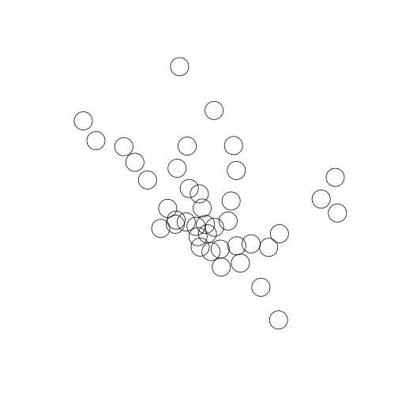
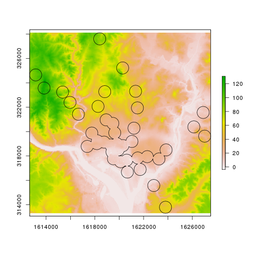
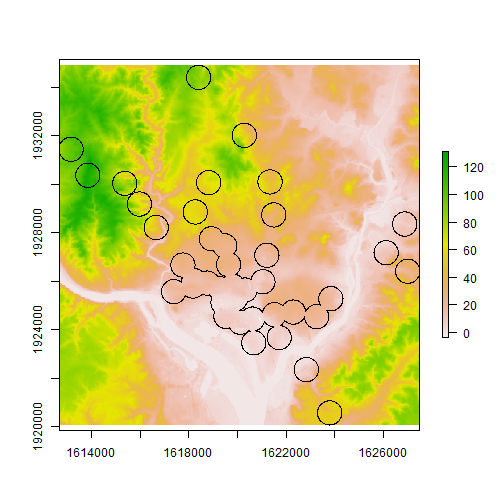

# Basic GIS Analysis with R
We now have the required packages installed and know how to read data into R. Our next step is to start doing some GIS analysis with R. Throughout the course of this lesson will show how to do some basic manipulation of the `raster` and `sp` objects and then show a few examples of relatively straightforward analyses.  We will only be scratching the surface here, but hopefully this will provide a starting point for more work doing spatial analysis in R.  ***Note:*** *Much of this lesson assumes some familiarity with R and working with data frames.*

## Lesson Outline
- [Explore and manipulate](#explore-and-manipulate)
- [Projections](#projections)
- [Brief introduction to rgeos](#brief-introduction-to-rgeos)
- [Working with rasters](#working-with-rasters)
- [Other geospatial packages](#other-geospatial-packages)

## Lesson Exercises
- [Exercise 3.1](#exercise-31)
- [Exercise 3.2](#exercise-32)
- [Exercise 3.3](#exercise-33)

## Explore and manipulate
One of the nice things about `SpatialXDataFrame` objects is that many of the tricks you know for working with data frames will also work.  This allows us to subset our spatial data, summarize data, etc. in a very R like way.

Let's start working through some examples using the two Metro datasets.


```
## OGR data source with driver: ESRI Shapefile 
## Source: "data", layer: "Metro_Lines"
## with 8 features
## It has 4 fields
```

```
## OGR data source with driver: GeoJSON 
## Source: "data/metrostations.geojson", layer: "OGRGeoJSON"
## with 40 features
## It has 6 fields
```

We've already seen how to use the default print statements to look at the basics


```r
dc_metro
```

```
## class       : SpatialLinesDataFrame 
## features    : 8 
## extent      : -77.08576, -76.91327, 38.83827, 38.97984  (xmin, xmax, ymin, ymax)
## coord. ref. : +proj=longlat +ellps=WGS84 +datum=WGS84 +no_defs +towgs84=0,0,0 
## variables   : 4
## names       :    GIS_ID,            NAME,                            WEB_URL, OBJECTID 
## min values  : Metro_001,            blue, http://wmata.com/rail/maps/map.cfm,        1 
## max values  : Metro_006, yellow - rush +, http://wmata.com/rail/maps/map.cfm,        8
```

```r
dc_metro_sttn
```

```
## class       : SpatialPointsDataFrame 
## features    : 40 
## extent      : -77.085, -76.93526, 38.84567, 38.97609  (xmin, xmax, ymin, ymax)
## coord. ref. : +proj=longlat +ellps=WGS84 +datum=WGS84 +no_defs +towgs84=0,0,0 
## variables   : 6
## names       : OBJECTID,   GIS_ID,                          NAME,                                                WEB_URL,                 LINE,                    ADDRESS 
## min values  :        1, mstn_001,                     Anacostia,  http://wmata.com/rail/station_detail.cfm?station_id=1, blue, orange, silver, 1001 CONNECTICUT AVENUE NW 
## max values  :       40, mstn_040, Woodley Park-Zoo Adams Morgan, http://wmata.com/rail/station_detail.cfm?station_id=90,   red, green, yellow, 919 RHODE ISLAND AVENUE NE
```

We can get more info on the data with:


```r
head(dc_metro_sttn)
```

```
##   OBJECTID   GIS_ID                 NAME
## 1        1 mstn_007     Columbia Heights
## 2        2 mstn_020 Georgia Ave Petworth
## 3        3 mstn_034               Takoma
## 4        4 mstn_004        Brookland-CUA
## 5        5 mstn_017          Fort Totten
## 6        6 mstn_003         Benning Road
##                                                  WEB_URL
## 1 http://wmata.com/rail/station_detail.cfm?station_id=75
## 2 http://wmata.com/rail/station_detail.cfm?station_id=76
## 3 http://wmata.com/rail/station_detail.cfm?station_id=29
## 4 http://wmata.com/rail/station_detail.cfm?station_id=27
## 5 http://wmata.com/rail/station_detail.cfm?station_id=28
## 6 http://wmata.com/rail/station_detail.cfm?station_id=90
##                   LINE                ADDRESS
## 1        green, yellow    3030 14TH STREET NW
## 2        green, yellow 3700 GEORGIA AVENUE NW
## 3                  red    327 CEDAR STREET NW
## 4                  red 801 MICHIGAN AVENUE NE
## 5   red, green, yellow 550 GALLOWAY STREET NE
## 6 blue, orange, silver   4500 BENNING ROAD NE
```

```r
summary(dc_metro_sttn)
```

```
## Object of class SpatialPointsDataFrame
## Coordinates:
##                 min       max
## coords.x1 -77.08500 -76.93526
## coords.x2  38.84567  38.97609
## Is projected: FALSE 
## proj4string :
## [+proj=longlat +ellps=WGS84 +datum=WGS84 +no_defs +towgs84=0,0,0]
## Number of points: 40
## Data attributes:
##     OBJECTID          GIS_ID                   NAME   
##  Min.   : 1.00   mstn_001: 1   Anacostia         : 1  
##  1st Qu.:10.75   mstn_002: 1   Archives-Navy Meml: 1  
##  Median :20.50   mstn_003: 1   Benning Road      : 1  
##  Mean   :20.50   mstn_004: 1   Brookland-CUA     : 1  
##  3rd Qu.:30.25   mstn_005: 1   Capitol South     : 1  
##  Max.   :40.00   mstn_006: 1   Cleveland Park    : 1  
##                  (Other) :34   (Other)           :34  
##                                                     WEB_URL  
##  http://wmata.com/rail/station_detail.cfm?station_id=1  : 1  
##  http://wmata.com/rail/station_detail.cfm?station_id=10 : 1  
##  http://wmata.com/rail/station_detail.cfm?station_id=108: 1  
##  http://wmata.com/rail/station_detail.cfm?station_id=11 : 1  
##  http://wmata.com/rail/station_detail.cfm?station_id=21 : 1  
##  http://wmata.com/rail/station_detail.cfm?station_id=23 : 1  
##  (Other)                                                :34  
##                    LINE                           ADDRESS  
##  red                 :13   1001 CONNECTICUT AVENUE NW : 1  
##  blue, orange, silver:10   1101 HOWARD ROAD SE        : 1  
##  green, yellow       : 6   1200 INDEPENDENCE AVENUE SW: 1  
##  green               : 4   1290 ALABAMA AVENUE SE     : 1  
##  orange              : 2   1300 U STREET NW           : 1  
##  red, green, yellow  : 2   1400 I STREET NW           : 1  
##  (Other)             : 3   (Other)                    :34
```

```r
names(dc_metro_sttn)
```

```
## [1] "OBJECTID" "GIS_ID"   "NAME"     "WEB_URL"  "LINE"     "ADDRESS"
```

```r
# Look at individual columns
dc_metro_sttn$NAME
```

```
##  [1] Columbia Heights                            
##  [2] Georgia Ave Petworth                        
##  [3] Takoma                                      
##  [4] Brookland-CUA                               
##  [5] Fort Totten                                 
##  [6] Benning Road                                
##  [7] Deanwood                                    
##  [8] NoMa - Gallaudet U                          
##  [9] Tenleytown-AU                               
## [10] Friendship Heights                          
## [11] Foggy Bottom-GWU                            
## [12] Farragut West                               
## [13] Farragut North                              
## [14] Dupont Circle                               
## [15] Woodley Park-Zoo Adams Morgan               
## [16] LEnfant Plaza                               
## [17] Smithsonian                                 
## [18] Federal Triangle                            
## [19] Archives-Navy Meml                          
## [20] Waterfront                                  
## [21] Navy Yard - Ballpark                        
## [22] Federal Center SW                           
## [23] Judiciary Sq                                
## [24] Capitol South                               
## [25] McPherson Sq                                
## [26] Metro Center                                
## [27] Gallery Pl-Chinatown                        
## [28] Mt Vernon Sq - 7th St Convention Center     
## [29] U St/African-Amer Civil War Memorial/Cardozo
## [30] Shaw-Howard Univ                            
## [31] Union Station                               
## [32] Congress Heights                            
## [33] Anacostia                                   
## [34] Eastern Market                              
## [35] Potomac Ave                                 
## [36] Stadium Armory                              
## [37] Rhode Island Ave                            
## [38] Minnesota Ave                               
## [39] Van Ness-UDC                                
## [40] Cleveland Park                              
## 40 Levels: Anacostia Archives-Navy Meml Benning Road ... Woodley Park-Zoo Adams Morgan
```

And to get into the guts of the `sp` objects:


```r
str(dc_metro)
```

```
## Formal class 'SpatialLinesDataFrame' [package "sp"] with 4 slots
##   ..@ data       :'data.frame':	8 obs. of  4 variables:
##   .. ..$ GIS_ID  : Factor w/ 6 levels "Metro_001","Metro_002",..: 4 5 3 2 2 1 1 6
##   .. ..$ NAME    : Factor w/ 8 levels "blue","green",..: 5 7 3 2 8 1 4 6
##   .. ..$ WEB_URL : Factor w/ 1 level "http://wmata.com/rail/maps/map.cfm": 1 1 1 1 1 1 1 1
##   .. ..$ OBJECTID: int [1:8] 1 2 3 4 5 6 7 8
##   ..@ lines      :List of 8
##   .. ..$ :Formal class 'Lines' [package "sp"] with 2 slots
##   .. .. .. ..@ Lines:List of 1
##   .. .. .. .. ..$ :Formal class 'Line' [package "sp"] with 1 slot
##   .. .. .. .. .. .. ..@ coords: num [1:1028, 1:2] -77 -77 -77 -77 -77 ...
##   .. .. .. ..@ ID   : chr "0"
##   .. ..$ :Formal class 'Lines' [package "sp"] with 2 slots
##   .. .. .. ..@ Lines:List of 1
##   .. .. .. .. ..$ :Formal class 'Line' [package "sp"] with 1 slot
##   .. .. .. .. .. .. ..@ coords: num [1:284, 1:2] -77 -77 -77 -77 -77 ...
##   .. .. .. ..@ ID   : chr "1"
##   .. ..$ :Formal class 'Lines' [package "sp"] with 2 slots
##   .. .. .. ..@ Lines:List of 1
##   .. .. .. .. ..$ :Formal class 'Line' [package "sp"] with 1 slot
##   .. .. .. .. .. .. ..@ coords: num [1:1066, 1:2] -77.1 -77.1 -77.1 -77.1 -77.1 ...
##   .. .. .. ..@ ID   : chr "2"
##   .. ..$ :Formal class 'Lines' [package "sp"] with 2 slots
##   .. .. .. ..@ Lines:List of 1
##   .. .. .. .. ..$ :Formal class 'Line' [package "sp"] with 1 slot
##   .. .. .. .. .. .. ..@ coords: num [1:837, 1:2] -77 -77 -77 -77 -77 ...
##   .. .. .. ..@ ID   : chr "3"
##   .. ..$ :Formal class 'Lines' [package "sp"] with 2 slots
##   .. .. .. ..@ Lines:List of 1
##   .. .. .. .. ..$ :Formal class 'Line' [package "sp"] with 1 slot
##   .. .. .. .. .. .. ..@ coords: num [1:78, 1:2] -77 -77 -77 -77 -77 ...
##   .. .. .. ..@ ID   : chr "4"
##   .. ..$ :Formal class 'Lines' [package "sp"] with 2 slots
##   .. .. .. ..@ Lines:List of 1
##   .. .. .. .. ..$ :Formal class 'Line' [package "sp"] with 1 slot
##   .. .. .. .. .. .. ..@ coords: num [1:1035, 1:2] -77.1 -77.1 -77.1 -77.1 -77.1 ...
##   .. .. .. ..@ ID   : chr "5"
##   .. ..$ :Formal class 'Lines' [package "sp"] with 2 slots
##   .. .. .. ..@ Lines:List of 1
##   .. .. .. .. ..$ :Formal class 'Line' [package "sp"] with 1 slot
##   .. .. .. .. .. .. ..@ coords: num [1:108, 1:2] -77 -77 -77 -77 -76.9 ...
##   .. .. .. ..@ ID   : chr "6"
##   .. ..$ :Formal class 'Lines' [package "sp"] with 2 slots
##   .. .. .. ..@ Lines:List of 5
##   .. .. .. .. ..$ :Formal class 'Line' [package "sp"] with 1 slot
##   .. .. .. .. .. .. ..@ coords: num [1:109, 1:2] -77 -77 -77 -77 -77 ...
##   .. .. .. .. ..$ :Formal class 'Line' [package "sp"] with 1 slot
##   .. .. .. .. .. .. ..@ coords: num [1:50, 1:2] -77.1 -77.1 -77.1 -77.1 -77.1 ...
##   .. .. .. .. ..$ :Formal class 'Line' [package "sp"] with 1 slot
##   .. .. .. .. .. .. ..@ coords: num [1:272, 1:2] -77 -77 -77 -77 -77 ...
##   .. .. .. .. ..$ :Formal class 'Line' [package "sp"] with 1 slot
##   .. .. .. .. .. .. ..@ coords: num [1:239, 1:2] -77 -77 -77 -77 -77 ...
##   .. .. .. .. ..$ :Formal class 'Line' [package "sp"] with 1 slot
##   .. .. .. .. .. .. ..@ coords: num [1:373, 1:2] -77 -77 -77 -77 -77 ...
##   .. .. .. ..@ ID   : chr "7"
##   ..@ bbox       : num [1:2, 1:2] -77.1 38.8 -76.9 39
##   .. ..- attr(*, "dimnames")=List of 2
##   .. .. ..$ : chr [1:2] "x" "y"
##   .. .. ..$ : chr [1:2] "min" "max"
##   ..@ proj4string:Formal class 'CRS' [package "sp"] with 1 slot
##   .. .. ..@ projargs: chr "+proj=longlat +ellps=WGS84 +datum=WGS84 +no_defs +towgs84=0,0,0"
```

Yikes!

Now for the fun part.  We can use indexing/subsetting tools we already know to pull out individual features based on the data stored in the `sp` objects data frame.  For instance:


```r
# select with base indexing
est_mrkt <- dc_metro_sttn[dc_metro_sttn$NAME == "Eastern Market", ]
est_mrkt
```

```
## class       : SpatialPointsDataFrame 
## features    : 1 
## extent      : -76.996, -76.996, 38.88463, 38.88463  (xmin, xmax, ymin, ymax)
## coord. ref. : +proj=longlat +ellps=WGS84 +datum=WGS84 +no_defs +towgs84=0,0,0 
## variables   : 6
## names       : OBJECTID,   GIS_ID,           NAME,                                                WEB_URL,                 LINE,                    ADDRESS 
## min values  :       34, mstn_011, Eastern Market, http://wmata.com/rail/station_detail.cfm?station_id=60, blue, orange, silver, 701 PENNSYLVANIA AVENUE SE 
## max values  :       34, mstn_011, Eastern Market, http://wmata.com/rail/station_detail.cfm?station_id=60, blue, orange, silver, 701 PENNSYLVANIA AVENUE SE
```

```r
# select with subset (plus a Lil Rhody Shout Out!)
ri <- subset(dc_metro_sttn, NAME == "Rhode Island Ave")
ri
```

```
## class       : SpatialPointsDataFrame 
## features    : 1 
## extent      : -76.99594, -76.99594, 38.92107, 38.92107  (xmin, xmax, ymin, ymax)
## coord. ref. : +proj=longlat +ellps=WGS84 +datum=WGS84 +no_defs +towgs84=0,0,0 
## variables   : 6
## names       : OBJECTID,   GIS_ID,             NAME,                                                WEB_URL, LINE,                    ADDRESS 
## min values  :       37, mstn_030, Rhode Island Ave, http://wmata.com/rail/station_detail.cfm?station_id=26,  red, 919 RHODE ISLAND AVENUE NE 
## max values  :       37, mstn_030, Rhode Island Ave, http://wmata.com/rail/station_detail.cfm?station_id=26,  red, 919 RHODE ISLAND AVENUE NE
```

```r
# select multiple items
red_line_sttn <- subset(dc_metro_sttn, grepl("red", LINE))
red_line_sttn
```

```
## class       : SpatialPointsDataFrame 
## features    : 16 
## extent      : -77.085, -76.99454, 38.8961, 38.97609  (xmin, xmax, ymin, ymax)
## coord. ref. : +proj=longlat +ellps=WGS84 +datum=WGS84 +no_defs +towgs84=0,0,0 
## variables   : 6
## names       : OBJECTID,   GIS_ID,                          NAME,                                               WEB_URL,               LINE,                    ADDRESS 
## min values  :        3, mstn_004,                 Brookland-CUA, http://wmata.com/rail/station_detail.cfm?station_id=1,                red, 1001 CONNECTICUT AVENUE NW 
## max values  :       40, mstn_040, Woodley Park-Zoo Adams Morgan, http://wmata.com/rail/station_detail.cfm?station_id=9, red, green, yellow, 919 RHODE ISLAND AVENUE NE
```

Adding data is just the same as for adding data to data frames.  I found some ridership data for the different stations and summarized that, by station, into "station_rides.csv".  Let's pull that in, and add it to `dc_metro_sttn`.  


```r
station_rides <- read.csv("data/station_rides.csv")
dc_metro_sttn <- merge(dc_metro_sttn, station_rides, by.x = "NAME", by.y = "Ent.Station", 
    all.x = TRUE)
head(dc_metro_sttn)
```

```
##                    NAME OBJECTID   GIS_ID
## 7      Columbia Heights        1 mstn_007
## 20 Georgia Ave Petworth        2 mstn_020
## 34               Takoma        3 mstn_034
## 4         Brookland-CUA        4 mstn_004
## 17          Fort Totten        5 mstn_017
## 3          Benning Road        6 mstn_003
##                                                   WEB_URL
## 7  http://wmata.com/rail/station_detail.cfm?station_id=75
## 20 http://wmata.com/rail/station_detail.cfm?station_id=76
## 34 http://wmata.com/rail/station_detail.cfm?station_id=29
## 4  http://wmata.com/rail/station_detail.cfm?station_id=27
## 17 http://wmata.com/rail/station_detail.cfm?station_id=28
## 3  http://wmata.com/rail/station_detail.cfm?station_id=90
##                    LINE                ADDRESS  X avg_wkday
## 7         green, yellow    3030 14TH STREET NW 17   12608.3
## 20        green, yellow 3700 GEORGIA AVENUE NW NA        NA
## 34                  red    327 CEDAR STREET NW 72    6023.5
## 4                   red 801 MICHIGAN AVENUE NE NA        NA
## 17   red, green, yellow 550 GALLOWAY STREET NE 33    7442.0
## 3  blue, orange, silver   4500 BENNING ROAD NE  6    3067.2
```

So, now we can use these values to select.


```r
busy_sttn <- subset(dc_metro_sttn, avg_wkday >= 10000)
busy_sttn
```

```
## class       : SpatialPointsDataFrame 
## features    : 7 
## extent      : -77.04342, -77.00742, 38.88803, 38.92785  (xmin, xmax, ymin, ymax)
## coord. ref. : +proj=longlat +ellps=WGS84 +datum=WGS84 +no_defs +towgs84=0,0,0 
## variables   : 8
## names       :             NAME, OBJECTID,   GIS_ID,                                                WEB_URL,                      LINE,                    ADDRESS,  X, avg_wkday 
## min values  : Columbia Heights,        1, mstn_007,  http://wmata.com/rail/station_detail.cfm?station_id=1,      blue, orange, silver, 1001 CONNECTICUT AVENUE NW, 17,   11671.6 
## max values  :    Union Station,       31, mstn_037, http://wmata.com/rail/station_detail.cfm?station_id=75, red, blue, orange, silver,         900 18TH STREET NW, 76,   32611.1
```


## Projections
Although many GIS provide project-on-the-fly (jwh editorial: WORST THING EVER), R does not.  To get our maps to work and analysis to be correct, we need to know how to modify the projections of our data so that they match up.  A description of projections is way beyond the scope of this workshop, but these links provide some good background info and details:

- [USGS](http://egsc.usgs.gov/isb//pubs/MapProjections/projections.html)
- [NCEAS](https://www.nceas.ucsb.edu/~frazier/RSpatialGuides/OverviewCoordinateReferenceSystems.pdf)

And for more on projecting there's some good info in the [rOpenSci draft spatial data viz Task View](https://github.com/ropensci/maptools#projecting-data)

For our purposes we will be using `spTransform` to reproject data.  We need to supply two arguments, "x", the object we are transforming, and "CRSobj" which is the details of the new projection.  We will assume that we have good data read into R and that the original projection is already defined.  This is the case with all of the example data.

There are many ways to specify the "CRSobj".  We will be using [Proj.4](https://trac.osgeo.org/proj/) strings and the `CRS` function for this.  We can get the Proj.4 strings from other datasets, or specify them from scratch.  To get them from scratch, the easiest thing to do is search at [spatialreference.org](http://spatialreference.org/).  You can either search there, or just use Google.  For instance, if we want the [ESRI Albers Equal Area projection as Proj.4](www.google.com/search?q=ESRI Albers Equal Area projection as Proj.4) gets it as the first result.  Just select the [Proj4](http://spatialreference.org/ref/esri/usa-contiguous-albers-equal-area-conic/proj4/) link from the list.

So, if we want to reproject our data using this projection:


```r
esri_alb_p4 <- "+proj=aea +lat_1=29.5 +lat_2=45.5 +lat_0=37.5 +lon_0=-96 +x_0=0 +y_0=0 +ellps=GRS80 +datum=NAD83 +units=m +no_defs"
dc_metro_alb <- spTransform(dc_metro, CRS(esri_alb_p4))
```

Luckily, it is pretty common to have several datasets with one of which in the projections you want to use.  We can then just pull the Proj4 string from that.


```r
dc_metro_sttn_prj <- spTransform(dc_metro_sttn, CRS(proj4string(dc_metro_alb)))
```

Projecting rasters is a bit different.  We will use `raster::projectRaster` to accomplish this. Be aware that this is looking for a Proj4 string for the "crs", and not a CRSobj.  


```r
dc_elev_prj <- projectRaster(dc_elev, crs = proj4string(dc_metro_sttn_prj))
```

## Exercise 3.1
In this first exercise we will work on manipulating the Tiger Lines file of the states that we pulled in as part of lesson 2 and assigned to `us_states`.

1. Assign just the DC boundary to an object named `dc_bnd`.
2. Re-project `dc_bnd` to match the projection of `dc_nlcd`.  Assign this to an object named `dc_bnd_prj`.

## Brief introduction to rgeos
In this section we are going to start working with many of the "typical" GIS type analyses, specifically buffers and a few overlays. We will use mostly `rgeos` but will also look a bit at `sp::over`.

Let's start with a buffer. We will use the albers projected stations for these examples


```r
sttn_buff_500 <- gBuffer(dc_metro_sttn_prj, width = 500)
plot(sttn_buff_500)
```

 

We can see that overlapping buffers merged in this case.  If we wanted a buffer for each station we can use the "byid" argument.


```r
sttn_buff_500_id <- gBuffer(dc_metro_sttn_prj, width = 500, byid = TRUE)
plot(sttn_buff_500_id)
```

 

Now we get a 500 meter circle around each of the stations.  Let's move on to one of the overlay commands in `rgeos`,the difference.


```r
# Create something to take difference of
sttn_buff_100 <- gBuffer(dc_metro_sttn_prj, width = 100)
sttn_diff <- gDifference(sttn_buff_500, sttn_buff_100)
sttn_diff
```

```
## class       : SpatialPolygons 
## features    : 1 
## extent      : 1612646, 1627514, 313290.8, 328111.7  (xmin, xmax, ymin, ymax)
## coord. ref. : +proj=aea +lat_1=29.5 +lat_2=45.5 +lat_0=37.5 +lon_0=-96 +x_0=0 +y_0=0 +ellps=GRS80 +datum=NAD83 +units=m +no_defs +towgs84=0,0,0
```

```r
# pulls into individual polygons, instead of a single multi-polygon.
sttn_diff <- disaggregate(sttn_diff)
sttn_diff
```

```
## class       : SpatialPolygons 
## features    : 18 
## extent      : 1612646, 1627514, 313290.8, 328111.7  (xmin, xmax, ymin, ymax)
## coord. ref. : +proj=aea +lat_1=29.5 +lat_2=45.5 +lat_0=37.5 +lon_0=-96 +x_0=0 +y_0=0 +ellps=GRS80 +datum=NAD83 +units=m +no_defs +towgs84=0,0,0
```

```r
plot(sttn_diff)
```

 

Lastly, let's pull out some of the basic geographic info on our datasets using `rgeos`.  That is provided by `gArea` and `gLength`. Let's get the area and perimeter of the all the land 500 meters from a metro station


```r
gLength(sttn_diff)
```

```
## [1] 116586.2
```

```r
gArea(sttn_diff)
```

```
## [1] 25844073
```

```r
# likely want area of each poly
gArea(sttn_diff, byid = TRUE)
```

```
##          1          2          3          4          5          6 
##   741640.8   741640.8 13236179.2   741640.8   741640.8   741640.8 
##          7          8          9         10         11         12 
##   741640.8   741640.8   741640.8   741640.8   741640.8   741640.8 
##         13         14         15         16         17         18 
##   741640.8   741640.8   741640.8   741640.8   741640.8   741640.8
```

We have left most of `rgeos` untouched, but hopefully shown enough to get you started.  

## Exercise 3.2
We will work with the re-projected `dc_bnd_prj` lets set this up for some further analysis.

1. Buffer the DC boundary by 1000 meters. Save it to dc_bnd_1000
2. Assign an object that represents only the area 1000 meters outside of DC (hint: gDifference).
3. Determine the area of both the DC boundary as well as just the surrounding 1000 meters.

## Working with rasters
Let's move on to rasters.  We will be doing mostly work with base R to summarize information stored in rasters and use our vector datasets to interact with those rasters and then we will show a few functions from `raster`.

We've already seen how to get some of the basic info of a raster.  To re-hash:


```r
dc_elev
```

```
## class       : RasterLayer 
## dimensions  : 798, 921, 734958  (nrow, ncol, ncell)
## resolution  : 0.0002777778, 0.0002777778  (x, y)
## extent      : -77.15306, -76.89722, 38.77639, 38.99806  (xmin, xmax, ymin, ymax)
## coord. ref. : +proj=longlat +ellps=GRS80 +datum=NAD83 +no_defs +towgs84=0,0,0 
## data source : /data/projects/DataInformatics/intro_gis_with_r/lessons/data/dc_ned.tif 
## names       : dc_ned 
## values      : -5.316066, 131.4813  (min, max)
```

This gives us the basics.  There are many options for looking at the values stored in the raster.  I usually default to `values` which returns the values as a vector which we can then use in R functions.

For instance, mean elevation in `dc_elev` could be calculated with 


```r
mean(values(dc_elev), na.omit = T)
```

```
## [1] 48.76833
```

If our raster contains categorical data (e.g. LULC), we can work with that too.  We don't have a ready example so lets use another `raster` function to reclassify our elevation data and then look at some summary stats of that.


```r
# reclass elevation into H, M, L
elev_summ <- summary(values(dc_elev))
# this is the format for the look up table expected by reclassify
rcl <- matrix(c(-Inf, elev_summ[2], 1, elev_summ[2], elev_summ[5], 2, elev_summ[5], 
    Inf, 3), nrow = 3, byrow = T)
dc_elev_class <- reclassify(dc_elev, rcl)
dc_elev_class
```

```
## class       : RasterLayer 
## dimensions  : 798, 921, 734958  (nrow, ncol, ncell)
## resolution  : 0.0002777778, 0.0002777778  (x, y)
## extent      : -77.15306, -76.89722, 38.77639, 38.99806  (xmin, xmax, ymin, ymax)
## coord. ref. : +proj=longlat +ellps=GRS80 +datum=NAD83 +no_defs +towgs84=0,0,0 
## data source : in memory
## names       : layer 
## values      : 1, 3  (min, max)
```

So now we have categorical data, we can do cross-tabs on the values and calculate percent in each category.


```r
elev_class_perc <- table(values(dc_elev_class))/length(values(dc_elev_class))
elev_class_perc
```

```
## 
##         1         2         3 
## 0.2499912 0.4999850 0.2500238
```

The last task we will show is using vector to data to clip out our raster data.  We can do this with crop and mask.  We do the crop first as it will subset our raster based on the extent.  In most cases this is a significantly smaller area than the full raster dataset and speeds up the subsequent mask. We will do this with the projected versions.


```r
dc_elev_crop <- crop(dc_elev_prj, sttn_buff_500)
plot(dc_elev_crop)
plot(sttn_buff_500, add = T)
```

 

So, with this limited to just the extent of our dataset we can now clip out the values for each of the circles with.


```r
dc_elev_sttns <- mask(dc_elev_crop, sttn_buff_500)
plot(dc_elev_sttns)
plot(sttn_buff_500, add = T, border = "red", lwd = 2)
```

 

That gives us just the elevation within 500 meters of the Metro stations.  Probably not really interesting information, but we have it!  It might be more interesting to get the average elevation of each metro station.  Our workflow would be different as we would need to look at this on a per-station basis.  Might require a loop or a different approach all together.  Certainly possible, but beyond what we have time for today.

## Exercise 3.3
Let's combine all of this together and calculate some landcover summary statistics

1. Clip out the NLCD from within the DC boundaries.
2. Clip out the NLCD from the surrounding 1000 meters.
3. Summarize the land use/land cover statistics and report percent of each landcover type both within the DC boundary and within the surrounding 1000 meters.

## Other Geospatial packages
In this section, I'll introduce a few other packages that I have used or know about that provide some common analyses that may not be readily available via the base packages.  For a complete annotated listing though, the [CRAN Spatial Analysis Task View](https://cran.r-project.org/web/views/Spatial.html) should be your first stop.  The task view provides a full list of packages for working with spatial data, geostatistics, spatial regression, etc.  

Some of the other packages I have used for various tasks have been:
- [gdistance](https://cran.r-project.org/web/packages/gdistance/index.html): Provides tools for calculating distances across a grid.  Computes things like cost distance, accumulate costs, shortest path, etc. The [vignette for gdistance](https://cran.r-project.org/web/packages/gdistance/vignettes/gdistance1.pdf) is a good place to start for an overview of the package.
- [geosphere](https://cran.r-project.org/web/packages/geosphere/index.html): `geosphere` provides tools for spherical trigonometry and allows working directly with latitude, longitude, and bearing.  For more, look at the [vignette](https://cran.r-project.org/web/packages/geosphere/vignettes/geosphere.pdf).
- [SDMTools](https://cran.r-project.org/web/packages/SDMTools/index.html): This package provides functions to work with species distribution models.  In addition though, it also has implementations of most of the metrics available in the venerable landscape ecology tool, [FRAGSTATS](http://www.umass.edu/landeco/research/fragstats/fragstats.html).

