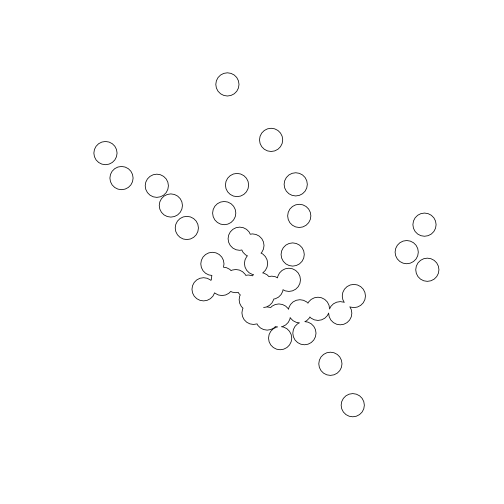

# Basic GIS Analysis with R
We now have the required packages installed and know how to read data into R. Our next step is to start doing some GIS analysis with R. Throughout the course of this lesson will show how to do some basic manipulation of the `raster` and `sp` objects and then show a few examples of some relatively straightforward analyses.  We will only be scratching the surface here, but hoepfully this will provide a starting point for more work doing spatial analysis in R.  ***Note:*** *Much of this lesson assumes some familiarity with R and working with data frames.*

## Lesson Outline
- [Explore and manipulate](#explore-and-manipulate)
- [Projections](#projections)
- [Intro to rgeos:Overlay and Buffer](#intro-to-rgeos-overlay-buffer-and-misc)
- [Working with rasters](#working-with-rasters)
- [Other geospatial packages](#other-geospatial-packages)

## Lesson Exercises
- [Exercise 3.1](#exercise-31)
- [Exercise 3.2](#exercise-32)
- [Exercise 3.3](#exercise-33)

## Explore and manipulate
One of the nice things about `SpatialXDataFrame` objects is that many of the tricks you know for working with data frames will also work.  This allows us subset our spatial data, summarize data, etc. in an R way.

Let's start working through some examples using the two Metro datasets.


```
## OGR data source with driver: ESRI Shapefile 
## Source: "data", layer: "Metro_Lines"
## with 8 features
## It has 4 fields
```

```
## OGR data source with driver: GeoJSON 
## Source: "data/metrostations.geojson", layer: "OGRGeoJSON"
## with 40 features
## It has 6 fields
```

We've already seen how to use the default print statements to look at the basics


```r
dc_metro
```

```
## class       : SpatialLinesDataFrame 
## features    : 8 
## extent      : -77.08576, -76.91327, 38.83827, 38.97984  (xmin, xmax, ymin, ymax)
## coord. ref. : +proj=longlat +datum=WGS84 +no_defs +ellps=WGS84 +towgs84=0,0,0 
## variables   : 4
## names       :    GIS_ID,            NAME,                            WEB_URL, OBJECTID 
## min values  : Metro_001,            blue, http://wmata.com/rail/maps/map.cfm,        1 
## max values  : Metro_006, yellow - rush +, http://wmata.com/rail/maps/map.cfm,        8
```

```r
dc_metro_sttn
```

```
## class       : SpatialPointsDataFrame 
## features    : 40 
## extent      : -77.085, -76.93526, 38.84567, 38.97609  (xmin, xmax, ymin, ymax)
## coord. ref. : +proj=longlat +datum=WGS84 +no_defs +ellps=WGS84 +towgs84=0,0,0 
## variables   : 6
## names       : OBJECTID,   GIS_ID,                          NAME,                                                WEB_URL,                 LINE,                    ADDRESS 
## min values  :        1, mstn_001,                     Anacostia,  http://wmata.com/rail/station_detail.cfm?station_id=1, blue, orange, silver, 1001 CONNECTICUT AVENUE NW 
## max values  :        9, mstn_040, Woodley Park-Zoo Adams Morgan, http://wmata.com/rail/station_detail.cfm?station_id=90,   red, green, yellow, 919 RHODE ISLAND AVENUE NE
```

We can get more info on the data with:


```r
head(dc_metro_sttn)
```

```
##   OBJECTID   GIS_ID                 NAME
## 1        1 mstn_007     Columbia Heights
## 2        2 mstn_020 Georgia Ave Petworth
## 3        3 mstn_034               Takoma
## 4        4 mstn_004        Brookland-CUA
## 5        5 mstn_017          Fort Totten
## 6        6 mstn_003         Benning Road
##                                                  WEB_URL
## 1 http://wmata.com/rail/station_detail.cfm?station_id=75
## 2 http://wmata.com/rail/station_detail.cfm?station_id=76
## 3 http://wmata.com/rail/station_detail.cfm?station_id=29
## 4 http://wmata.com/rail/station_detail.cfm?station_id=27
## 5 http://wmata.com/rail/station_detail.cfm?station_id=28
## 6 http://wmata.com/rail/station_detail.cfm?station_id=90
##                   LINE                ADDRESS
## 1        green, yellow    3030 14TH STREET NW
## 2        green, yellow 3700 GEORGIA AVENUE NW
## 3                  red    327 CEDAR STREET NW
## 4                  red 801 MICHIGAN AVENUE NE
## 5   red, green, yellow 550 GALLOWAY STREET NE
## 6 blue, orange, silver   4500 BENNING ROAD NE
```

```r
summary(dc_metro_sttn)
```

```
## Object of class SpatialPointsDataFrame
## Coordinates:
##                 min       max
## coords.x1 -77.08500 -76.93526
## coords.x2  38.84567  38.97609
## Is projected: FALSE 
## proj4string :
## [+proj=longlat +datum=WGS84 +no_defs +ellps=WGS84 +towgs84=0,0,0]
## Number of points: 40
## Data attributes:
##     OBJECTID          GIS_ID                   NAME   
##  Min.   : 1.00   mstn_001: 1   Anacostia         : 1  
##  1st Qu.:10.75   mstn_002: 1   Archives-Navy Meml: 1  
##  Median :20.50   mstn_003: 1   Benning Road      : 1  
##  Mean   :20.50   mstn_004: 1   Brookland-CUA     : 1  
##  3rd Qu.:30.25   mstn_005: 1   Capitol South     : 1  
##  Max.   :40.00   mstn_006: 1   Cleveland Park    : 1  
##                  (Other) :34   (Other)           :34  
##                                                     WEB_URL  
##  http://wmata.com/rail/station_detail.cfm?station_id=1  : 1  
##  http://wmata.com/rail/station_detail.cfm?station_id=10 : 1  
##  http://wmata.com/rail/station_detail.cfm?station_id=108: 1  
##  http://wmata.com/rail/station_detail.cfm?station_id=11 : 1  
##  http://wmata.com/rail/station_detail.cfm?station_id=21 : 1  
##  http://wmata.com/rail/station_detail.cfm?station_id=23 : 1  
##  (Other)                                                :34  
##                    LINE                           ADDRESS  
##  red                 :13   1001 CONNECTICUT AVENUE NW : 1  
##  blue, orange, silver:10   1101 HOWARD ROAD SE        : 1  
##  green, yellow       : 6   1200 INDEPENDENCE AVENUE SW: 1  
##  green               : 4   1290 ALABAMA AVENUE SE     : 1  
##  orange              : 2   1300 U STREET NW           : 1  
##  red, green, yellow  : 2   1400 I STREET NW           : 1  
##  (Other)             : 3   (Other)                    :34
```

```r
names(dc_metro_sttn)
```

```
## [1] "OBJECTID" "GIS_ID"   "NAME"     "WEB_URL"  "LINE"     "ADDRESS"
```

And to get into the guts of the `sp` objects:


```r
str(dc_metro)
```

```
## Formal class 'SpatialLinesDataFrame' [package "sp"] with 4 slots
##   ..@ data       :'data.frame':	8 obs. of  4 variables:
##   .. ..$ GIS_ID  : Factor w/ 6 levels "Metro_001","Metro_002",..: 4 5 3 2 2 1 1 6
##   .. ..$ NAME    : Factor w/ 8 levels "blue","green",..: 5 7 3 2 8 1 4 6
##   .. ..$ WEB_URL : Factor w/ 1 level "http://wmata.com/rail/maps/map.cfm": 1 1 1 1 1 1 1 1
##   .. ..$ OBJECTID: int [1:8] 1 2 3 4 5 6 7 8
##   ..@ lines      :List of 8
##   .. ..$ :Formal class 'Lines' [package "sp"] with 2 slots
##   .. .. .. ..@ Lines:List of 1
##   .. .. .. .. ..$ :Formal class 'Line' [package "sp"] with 1 slot
##   .. .. .. .. .. .. ..@ coords: num [1:1028, 1:2] -77 -77 -77 -77 -77 ...
##   .. .. .. ..@ ID   : chr "0"
##   .. ..$ :Formal class 'Lines' [package "sp"] with 2 slots
##   .. .. .. ..@ Lines:List of 1
##   .. .. .. .. ..$ :Formal class 'Line' [package "sp"] with 1 slot
##   .. .. .. .. .. .. ..@ coords: num [1:284, 1:2] -77 -77 -77 -77 -77 ...
##   .. .. .. ..@ ID   : chr "1"
##   .. ..$ :Formal class 'Lines' [package "sp"] with 2 slots
##   .. .. .. ..@ Lines:List of 1
##   .. .. .. .. ..$ :Formal class 'Line' [package "sp"] with 1 slot
##   .. .. .. .. .. .. ..@ coords: num [1:1066, 1:2] -77.1 -77.1 -77.1 -77.1 -77.1 ...
##   .. .. .. ..@ ID   : chr "2"
##   .. ..$ :Formal class 'Lines' [package "sp"] with 2 slots
##   .. .. .. ..@ Lines:List of 1
##   .. .. .. .. ..$ :Formal class 'Line' [package "sp"] with 1 slot
##   .. .. .. .. .. .. ..@ coords: num [1:837, 1:2] -77 -77 -77 -77 -77 ...
##   .. .. .. ..@ ID   : chr "3"
##   .. ..$ :Formal class 'Lines' [package "sp"] with 2 slots
##   .. .. .. ..@ Lines:List of 1
##   .. .. .. .. ..$ :Formal class 'Line' [package "sp"] with 1 slot
##   .. .. .. .. .. .. ..@ coords: num [1:78, 1:2] -77 -77 -77 -77 -77 ...
##   .. .. .. ..@ ID   : chr "4"
##   .. ..$ :Formal class 'Lines' [package "sp"] with 2 slots
##   .. .. .. ..@ Lines:List of 1
##   .. .. .. .. ..$ :Formal class 'Line' [package "sp"] with 1 slot
##   .. .. .. .. .. .. ..@ coords: num [1:1035, 1:2] -77.1 -77.1 -77.1 -77.1 -77.1 ...
##   .. .. .. ..@ ID   : chr "5"
##   .. ..$ :Formal class 'Lines' [package "sp"] with 2 slots
##   .. .. .. ..@ Lines:List of 1
##   .. .. .. .. ..$ :Formal class 'Line' [package "sp"] with 1 slot
##   .. .. .. .. .. .. ..@ coords: num [1:108, 1:2] -77 -77 -77 -77 -76.9 ...
##   .. .. .. ..@ ID   : chr "6"
##   .. ..$ :Formal class 'Lines' [package "sp"] with 2 slots
##   .. .. .. ..@ Lines:List of 5
##   .. .. .. .. ..$ :Formal class 'Line' [package "sp"] with 1 slot
##   .. .. .. .. .. .. ..@ coords: num [1:109, 1:2] -77 -77 -77 -77 -77 ...
##   .. .. .. .. ..$ :Formal class 'Line' [package "sp"] with 1 slot
##   .. .. .. .. .. .. ..@ coords: num [1:50, 1:2] -77.1 -77.1 -77.1 -77.1 -77.1 ...
##   .. .. .. .. ..$ :Formal class 'Line' [package "sp"] with 1 slot
##   .. .. .. .. .. .. ..@ coords: num [1:272, 1:2] -77 -77 -77 -77 -77 ...
##   .. .. .. .. ..$ :Formal class 'Line' [package "sp"] with 1 slot
##   .. .. .. .. .. .. ..@ coords: num [1:239, 1:2] -77 -77 -77 -77 -77 ...
##   .. .. .. .. ..$ :Formal class 'Line' [package "sp"] with 1 slot
##   .. .. .. .. .. .. ..@ coords: num [1:373, 1:2] -77 -77 -77 -77 -77 ...
##   .. .. .. ..@ ID   : chr "7"
##   ..@ bbox       : num [1:2, 1:2] -77.1 38.8 -76.9 39
##   .. ..- attr(*, "dimnames")=List of 2
##   .. .. ..$ : chr [1:2] "x" "y"
##   .. .. ..$ : chr [1:2] "min" "max"
##   ..@ proj4string:Formal class 'CRS' [package "sp"] with 1 slot
##   .. .. ..@ projargs: chr "+proj=longlat +datum=WGS84 +no_defs +ellps=WGS84 +towgs84=0,0,0"
```

Now for the fun part.  We can use indexing/subsetting tools we already know to pull out individual features based on the data stored in the `sp` objects data frame.  For instance:


```r
# select with base indexing
est_mrkt <- dc_metro_sttn[dc_metro_sttn$NAME == "Eastern Market", ]
est_mrkt
```

```
## class       : SpatialPointsDataFrame 
## features    : 1 
## extent      : -76.996, -76.996, 38.88463, 38.88463  (xmin, xmax, ymin, ymax)
## coord. ref. : +proj=longlat +datum=WGS84 +no_defs +ellps=WGS84 +towgs84=0,0,0 
## variables   : 6
## names       : OBJECTID,   GIS_ID,           NAME,                                                WEB_URL,                 LINE,                    ADDRESS 
## min values  :       34, mstn_011, Eastern Market, http://wmata.com/rail/station_detail.cfm?station_id=60, blue, orange, silver, 701 PENNSYLVANIA AVENUE SE 
## max values  :       34, mstn_011, Eastern Market, http://wmata.com/rail/station_detail.cfm?station_id=60, blue, orange, silver, 701 PENNSYLVANIA AVENUE SE
```

```r
# select with subset (plus a Lil Rhody Shout Out!)
ri <- subset(dc_metro_sttn, NAME == "Rhode Island Ave")
ri
```

```
## class       : SpatialPointsDataFrame 
## features    : 1 
## extent      : -76.99594, -76.99594, 38.92107, 38.92107  (xmin, xmax, ymin, ymax)
## coord. ref. : +proj=longlat +datum=WGS84 +no_defs +ellps=WGS84 +towgs84=0,0,0 
## variables   : 6
## names       : OBJECTID,   GIS_ID,             NAME,                                                WEB_URL, LINE,                    ADDRESS 
## min values  :       37, mstn_030, Rhode Island Ave, http://wmata.com/rail/station_detail.cfm?station_id=26,  red, 919 RHODE ISLAND AVENUE NE 
## max values  :       37, mstn_030, Rhode Island Ave, http://wmata.com/rail/station_detail.cfm?station_id=26,  red, 919 RHODE ISLAND AVENUE NE
```

```r
# select multiple items
red_line_sttn <- subset(dc_metro_sttn, grepl("red", LINE))
red_line_sttn
```

```
## class       : SpatialPointsDataFrame 
## features    : 16 
## extent      : -77.085, -76.99454, 38.8961, 38.97609  (xmin, xmax, ymin, ymax)
## coord. ref. : +proj=longlat +datum=WGS84 +no_defs +ellps=WGS84 +towgs84=0,0,0 
## variables   : 6
## names       : OBJECTID,   GIS_ID,                          NAME,                                               WEB_URL,               LINE,                    ADDRESS 
## min values  :       10, mstn_004,                 Brookland-CUA, http://wmata.com/rail/station_detail.cfm?station_id=1,                red, 1001 CONNECTICUT AVENUE NW 
## max values  :        9, mstn_040, Woodley Park-Zoo Adams Morgan, http://wmata.com/rail/station_detail.cfm?station_id=9, red, green, yellow, 919 RHODE ISLAND AVENUE NE
```

Adding data is just the same as for adding data to data frames.  I found some ridership data for the different stations and summarized that, by station, into "station_rides.csv".  Let's pull that in, and add it to `dc_metro_sttn`.  


```r
read.csv("data/station_rides.csv")
```

```
##     X                        Ent.Station avg_wkday
## 1   1                       Addison Road    3440.5
## 2   2                          Anacostia    7356.4
## 3   3             Archives-Navy Memorial    9329.6
## 4   4                 Arlington Cemetery    1759.1
## 5   5                           Ballston   11812.6
## 6   6                       Benning Road    3067.2
## 7   7                           Bethesda   10666.5
## 8   8                      Braddock Road    4383.5
## 9   9                      Branch Avenue    6604.6
## 10 10                          Brookland    6672.7
## 11 11                    Capitol Heights    2097.2
## 12 12                      Capitol South    8630.3
## 13 13                           Cheverly    1507.8
## 14 14                          Clarendon    4651.1
## 15 15                     Cleveland Park    4637.5
## 16 16               College Park-U of MD    4533.6
## 17 17                   Columbia Heights   12608.3
## 18 18                   Congress Heights    2912.2
## 19 19                        Court House    7309.1
## 20 20                       Crystal City   13323.9
## 21 21                           Deanwood    1761.2
## 22 22                        Dunn Loring    5116.7
## 23 23                      Dupont Circle   18291.8
## 24 24                  East Falls Church    4186.3
## 25 25                     Eastern Market    6038.7
## 26 26                  Eisenhower Avenue    2025.8
## 27 27                     Farragut North   26012.4
## 28 28                      Farragut West   22365.4
## 29 29                  Federal Center SW    6352.1
## 30 30                   Federal Triangle    9703.1
## 31 31                       Foggy Bottom   22413.2
## 32 32                        Forest Glen    2409.5
## 33 33                        Fort Totten    7442.0
## 34 34              Franconia-Springfield    8884.9
## 35 35                 Friendship Heights    9519.0
## 36 36            Gallery Place-Chinatown   25714.1
## 37 37            Georgia Avenue-Petworth    6147.8
## 38 38                           Glenmont    6076.3
## 39 39                          Greenbelt    6767.0
## 40 40                          Grosvenor    5767.2
## 41 41                         Huntington    8900.5
## 42 42                   Judiciary Square    9120.3
## 43 43                        King Street    8893.3
## 44 44                     L'Enfant Plaza   21731.4
## 45 45                           Landover    2265.6
## 46 46                  Largo Town Center    5021.7
## 47 47                   McPherson Square   16538.4
## 48 48                     Medical Center    5949.5
## 49 49                       Metro Center   28199.5
## 50 50                   Minnesota Avenue    3132.9
## 51 51                       Morgan Blvd.    2227.3
## 52 52              Mt. Vernon Square-UDC    4159.3
## 53 53                          Navy Yard    9662.7
## 54 54                        Naylor Road    3067.9
## 55 55                     New Carrollton    9566.7
## 56 56                       New York Ave    7860.5
## 57 57                           Pentagon   16788.3
## 58 58                      Pentagon City   16145.3
## 59 59                     Potomac Avenue    3879.1
## 60 60              Prince George's Plaza    5196.6
## 61 61 Reagan Washington National Airport    6198.6
## 62 62                Rhode Island Avenue    5494.1
## 63 63                          Rockville    4735.3
## 64 64                            Rosslyn   16390.1
## 65 65                        Shady Grove   13653.2
## 66 66             Shaw-Howard University    4658.7
## 67 67                      Silver Spring   13332.5
## 68 68                        Smithsonian   11671.6
## 69 69                    Southern Avenue    5766.9
## 70 70                     Stadium-Armory    2979.0
## 71 71                           Suitland    6213.6
## 72 72                             Takoma    6023.5
## 73 73                      Tenleytown-AU    7101.2
## 74 74                          Twinbrook    4542.0
## 75 75                   U Street-Cardozo    6847.1
## 76 76                      Union Station   32611.1
## 77 77                    Van Dorn Street    3488.9
## 78 78                       Van Ness-UDC    6624.4
## 79 79                             Vienna   13484.0
## 80 80                Virginia Square-GMU    3663.5
## 81 81                         Waterfront    4440.0
## 82 82                  West Falls Church   10695.5
## 83 83                   West Hyattsville    3862.0
## 84 84                            Wheaton    4270.5
## 85 85                        White Flint    4078.7
## 86 86                   Woodley Park-Zoo    7679.7
```

```r
dc_metro_sttn <- merge(dc_metro_sttn, station_rides, by.x = "NAME", by.y = "Ent.Station", 
    all.x = TRUE)
```

```
## Error in merge(dc_metro_sttn, station_rides, by.x = "NAME", by.y = "Ent.Station", : error in evaluating the argument 'y' in selecting a method for function 'merge': Error: object 'station_rides' not found
```

```r
head(dc_metro_sttn)
```

```
##   OBJECTID   GIS_ID                 NAME
## 1        1 mstn_007     Columbia Heights
## 2        2 mstn_020 Georgia Ave Petworth
## 3        3 mstn_034               Takoma
## 4        4 mstn_004        Brookland-CUA
## 5        5 mstn_017          Fort Totten
## 6        6 mstn_003         Benning Road
##                                                  WEB_URL
## 1 http://wmata.com/rail/station_detail.cfm?station_id=75
## 2 http://wmata.com/rail/station_detail.cfm?station_id=76
## 3 http://wmata.com/rail/station_detail.cfm?station_id=29
## 4 http://wmata.com/rail/station_detail.cfm?station_id=27
## 5 http://wmata.com/rail/station_detail.cfm?station_id=28
## 6 http://wmata.com/rail/station_detail.cfm?station_id=90
##                   LINE                ADDRESS
## 1        green, yellow    3030 14TH STREET NW
## 2        green, yellow 3700 GEORGIA AVENUE NW
## 3                  red    327 CEDAR STREET NW
## 4                  red 801 MICHIGAN AVENUE NE
## 5   red, green, yellow 550 GALLOWAY STREET NE
## 6 blue, orange, silver   4500 BENNING ROAD NE
```

So, now we can use these values to select.


```r
busy_sttn <- subset(dc_metro_sttn, avg_wkday >= 10000)
```

```
## Error in eval(expr, envir, enclos): object 'avg_wkday' not found
```

```r
busy_sttn
```

```
## Error in eval(expr, envir, enclos): object 'busy_sttn' not found
```


## Projections
Although many GIS provide project-on-the-fly (editorial: WORST THING EVER), R does not.  To get our maps to work and analysis to be correct, we need to know how to modify the projectins of our data so that they match up.  A descition of projections is way beyond the scope of this workshop, but these links provide some good background info and details:

- [USGS](http://egsc.usgs.gov/isb//pubs/MapProjections/projections.html)
- [NCEAS](https://www.nceas.ucsb.edu/~frazier/RSpatialGuides/OverviewCoordinateReferenceSystems.pdf)

And for more on projecting there's some good info in the [rOpenSci draft spatial data viz Task View](https://github.com/ropensci/maptools#projecting-data)

For our purposes we will be using `spTransform` to reproject data.  We need to supply two arguments, "x" the object we are transforming and "CRSobj" which is the details of the new projection.  We will assume that we have good data read into R and that the original projection is already defined.  This is the case with all of the example data.

There are many ways to specify the "CRSobj".  We will be using [Proj.4](https://trac.osgeo.org/proj/) strings and the `CRS` function for this.  We can get the Proj.4 strings from other datasets, or specify them from scratch.  
To get them from scratch, the easiest thing to do is search at [spatialreference.org](http://spatialreference.org/).  You can either search there, or just use Google.  For instance, if we want the [ESRI Albers Equal Area projection as Proj.4](www.google.com/search?q=ESRI Albers Equal Area projection as Proj.4) gets it as the first result.  Just select the [Proj4](http://spatialreference.org/ref/esri/usa-contiguous-albers-equal-area-conic/proj4/) from the list.

So, if we want to reproject our data using this projection:


```r
dc_metro_alb <- spTransform(dc_metro, CRS("+proj=aea +lat_1=29.5 +lat_2=45.5 +lat_0=37.5 +lon_0=-96 +x_0=0 +y_0=0 +ellps=GRS80 +datum=NAD83 +units=m +no_defs"))
```

Luckily, it is pretty common to have several datasets and one of which is in the projections you want to use.  We can then just pull the Proj4 string from that.


```r
dc_metro_sttn_prj <- spTransform(dc_metro_sttn, CRS(proj4string(dc_metro_alb)))
```

Projecting rasters is a bit different.  We will use `raster::projectRaster` to accomplish this. Be aware that this is looking for a Proj4 string for the crs, and not a CRSobj.  


```r
# Not Run: Takes a bit of time.
dc_elev_prj <- projectRaster(dc_elev, crs = proj4string(dc_metro_sttn_prj))
```

## Exercise 3.1
In this first exercise we will work on manipulating the Tiger Lines file of the states that we pulled in as part of lesson 2 and assinged to `us_states`.

1. Assign just the DC boundary to an object named `dc_bnd`.
2. Re-project `dc_bnd` to match the projection of `dc_nlcd`.  Assign this to an object named `dc_bnd_prj`.
 
## Intro to rgeos: Overlay, Buffer and Misc.
In this section we are going to start working with many of the "typical" GIS type analyses, specifcially buffers and a few overlays. We will use mostly `rgeos` but will also look a bit at `sp::over`.

Let's start with a buffer. We will use the albers projected stations for these examples


```r
sttn_buff_500 <- gBuffer(dc_metro_sttn_prj, width = 500)
plot(sttn_buff_500)
```

 

We can see that overlapping buffers merged in this case.  If we wanted a buffer for each station we can use the "byid" argument.


```r
sttn_buff_500_id <- gBuffer(dc_metro_sttn_prj, width = 500, byid = TRUE)
plot(sttn_buff_500_id)
```

 

Now we get a 500 meter circle around each of the stations.  Let's move on to one of the overlay commands in `rgeos`,the union. NEED TO WORK ON THIS.  These never do what I think they do...


```r
# Create something to take difference of
sttn_buff_100 <- gBuffer(dc_metro_sttn_prj, width = 100)
sttn_diff <- gUnion(sttn_buff_100, sttn_buff_500, byid = T)
plot(sttn_diff)
```

 

Lastly, let's pull out some of the basic geographic info on our datasets using `rgeos`.  That is provided by `gArea` and `gLength`. Let's get the area and perimeter of the all the land 500 meters from a metro station


```r
gArea(sttn_buff_500)
```

```
## [1] 27080141
```

```r
gPerimeter(sttn_buff_500)
```

```
## Error in eval(expr, envir, enclos): could not find function "gPerimeter"
```

We have left most of `rgeos` untouched, but hopefully shown enough to get you started.  

## Exercise 3.2
We will work with the re-projected `dc_bnd_prj` lets set this up for some further analyis.

1. Buffer the DC boundary by 1000 meters.
2. Using the overlay functions, get an object that represents only the area 1000 meters outside of DC.
3. Determine the area of both the DC boundary as well as the surrounding 1000 meters.

## Working with rasters

## Exercise 3.3
Let's combine all of this together and calculate some landcover summary statistics

1. Clip out the NLCD from within the DC boundaries.
2. Clip out the NLCD from the surrounding 1000 meters.
3. Summarize the land use/land cover statistics and report percent of each landcover type both within the DC boundary and within the surrounding 1000 meters.

## Other Geospatial packages
In this section, I'll introduce a few other packages that I have used or know about that provide some common analyses that may not be readily available via the base packages.  For a complete annotated listing though, the [CRAN Spatial Analysis Task View](https://cran.r-project.org/web/views/Spatial.html) should be your first stop.  The task view provides a full list of packages for working with spatial data, geostatistics, spatial regression, etc.  

Some of the other packages I have used for various tasks have been:
- gdistance: 
- geosphere:
- SDMTools:

