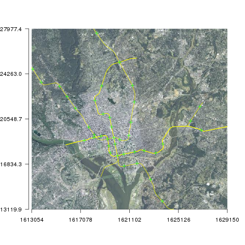

```
## OGR data source with driver: ESRI Shapefile 
## Source: "data", layer: "Metro_Lines"
## with 8 features
## It has 4 fields
```

```
## OGR data source with driver: GeoJSON 
## Source: "data/metrostations.geojson", layer: "OGRGeoJSON"
## with 40 features
## It has 6 fields
```

# Visualizing Spatial Data in R
Visualizing spatial data in interactive and static forms is one of the defining characteristics of GIS.  With interactive visualization and analysis, R, admittedly, is not quite up to the standards of a stand-alone GIS like QGIS or ArcGIS.  That being said, it has come quite a long way in the last several years.  Static visualization (e.g. maps) in R are, in my opinion, on par with anything you can create with a dedicated GIS.  A few (now somewhat dated) examples of maps built with R show this:

- [London Bike Hires](http://spatialanalysis.co.uk/wp-content/uploads/2012/02/bike_ggplot.png)
- [Facebook Users](http://paulbutler.org/archives/visualizing-facebook-friends/facebook_map.png)

Now we won't get to this level in just an hour or so, but we will see how to build static maps, get access to simple interactivity, and then see some of the javascript based mapping packages.

## Lesson Outline
- [Visualizing spatial data with `sp` and `raster`](#visualizing-spatial-data-with-sp-and-raster)
- [Using `ggplot2` and `ggmap`](#using-ggplot2-and-ggmap)
- [Simple interactivity with `quickmapr`](#simple-interactivity-with-quickmapr)
- [Javascript packages: `leaflet` and `mapview`](#javascript-packages-leaflet-and-mapview)

## Lesson Exercises
- [Exercise 4.1](#exercise-41)

## Visualizing spatial data with `sp` and `raster`
The default plotting tools from `sp` and `raster` are good enough for most of your needs and there have been many additional tools added that allow these to be acceptable for making static maps (e.g. [GISTools](https://cran.r-project.org/web/packages/GISTools/)).  We have already seen these functions in action.  We will show these again.

To create a plot of a single layer


```r
plot(dc_metro)
```

 

```r
# Play with symbology
plot(dc_metro, col = "red", lwd = 3)
```

 

```r
# Use data to color
plot(dc_metro, col = dc_metro$NAME, lwd = dc_metro$GIS_ID)
```

 

To create a plot of a multiple layers


```r
plot(dc_metro)
# Add stations, change color,size, and symbol
plot(dc_metro_sttn, add = T, col = "red", pch = 15, cex = 1.2)
```

 

Add some raster data in


```r
plot(dc_elev)
```

```
## Error in .local(.Object, ...): `/home/jhollist/projects/intro_gis_with_r/lessons/data/dc_ned.tif' does not exist in the file system,
## and is not recognised as a supported dataset name.
```

```r
plot(dc_metro, add = T)
```

```
## Error in plot.xy(xy.coords(x, y), type = type, ...): plot.new has not been called yet
```

```r
plot(dc_metro_sttn, add = T, col = "red", pch = 15, cex = 1.2)
```

```
## Error in plot.xy(xy.coords(x, y), type = type, ...): plot.new has not been called yet
```

We can certainly get fancier with the final plot, but that means digging into the details of plotting with base R.  That'd be a workshop in and of itself!

## Simple interactivity with `quickmapr`
At the risk of being self-serving and tooting my own horn, the next package we are going to play with is [`quickmapr`](https://cran.r-project.org/web/packages/quickmapr/index.html).  

While building plots with the default plotting functions is fairly painless, I wanted something that was a bit more straightfoward.  Additionally, the default plots are static and don't have any interactivity built into them and the interactive javascript solutions (coming up) expect unprojected data in lattitude and longitude.  This is the other problem I wanted to address.  This is not meant as a replacment for default plotting nor is it meant to be used to create production quality maps.  It is for use during the course of an analysis.

And before we move on, keep in mind that this is currently version 0.1.1, so it has bugs, but it works well enough that I am willing to go out on a limb and have a large number of people try to break it!

First thing you will need to do is intall it from CRAN and load into your library


```r
install.packages("quickmapr")
library(quickmapr)
```

This package is built around the `qmap` object.  All of the information for creating the plots are stored in this object and it is what allows for the interactivity.

To build this we use the function `qmap`. There are several options available, but all you need to create a plot with multiple layers is the layers to include in the plot.


```r
my_map <- qmap(dc_elev_prj, dc_metro_prj, dc_metro_sttn_prj)
```

 

So, not any different than the defualt plots (becuase it uses those!).  But now, we can do some other fun stuff.

We zoom with `zi`, zo`, and `ze`. We can pan with `p`. We can identify with `i`, and we can get back to our original extent with `f`.


```r
zi(my_map)
p(my_map)
zo(my_map)
i(my_map, 3)
f(my_map)
```

There are a few other tricks built in, but they are experimental.  For example, adding a base images from the National Map (only aerial and topo currently supported).


```r
my_map <- qmap(dc_metro_prj, dc_metro_sttn_prj, colors = c("yellow", "green"), 
    basemap = "topo", resolution = 1000)
```

 

```r
my_map <- qmap(dc_metro_prj, dc_metro_sttn_prj, colors = c("yellow", "green"), 
    basemap = "1m_aerial", resolution = 1000)
```

 

Lastly, while this can handle large datasets, it is still slow.  This is because the default plotting functions are slow as your number of features get into the 10s of thousands.  It works, but isn't nearly as zippy and smooth as a stand-alone GIS.  In short, this provided handy tools for me and allowed me to stick with a single analysis environment.   

## Exercise 4.1
We will create a map of the data we've been working with, the NLCD and boundary.

1. Map your clipped landcover and the DC boundary using the default tools from `sp` and `raster`.
2. Create the same map, but use `quickmapr`.  Try out some of the interactivity tools: zoom, pan, identify.

## Javascript packages: `leaflet` and `mapview`

## Exercise 4.2

## Using `ggplot2` and `ggmap`
