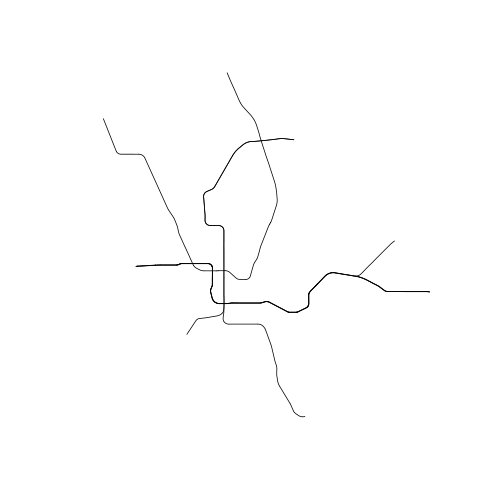
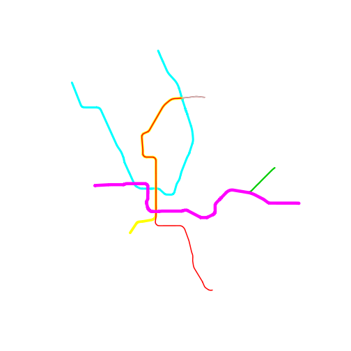
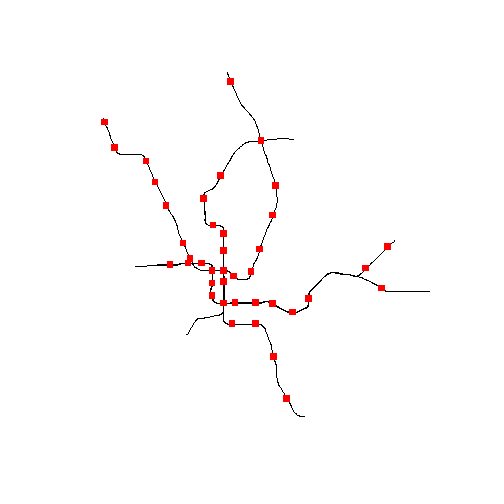
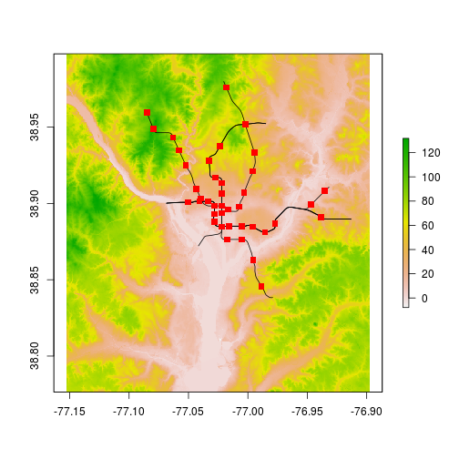
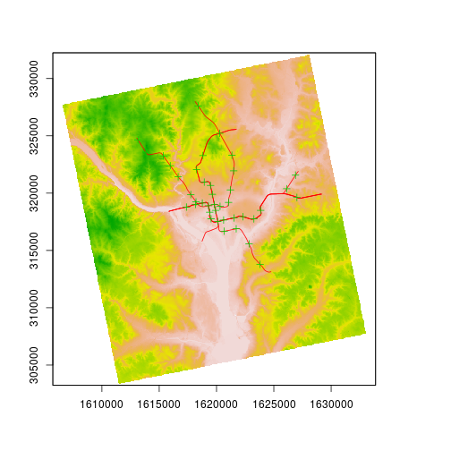
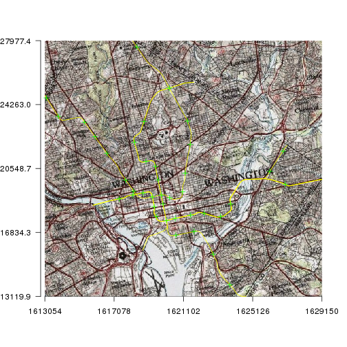

```
## OGR data source with driver: ESRI Shapefile 
## Source: "data", layer: "Metro_Lines"
## with 8 features
## It has 4 fields
```

```
## OGR data source with driver: GeoJSON 
## Source: "data/metrostations.geojson", layer: "OGRGeoJSON"
## with 40 features
## It has 6 fields
```

# Visualizing Spatial Data in R
Visualizing spatial data in interactive and static forms is one of the defining characteristics of GIS.  With interactive visualization and analysis, R, admittedly, is not quite up to the standards of a stand-alone GIS like QGIS or ArcGIS.  That being said, it has come quite a long way in the last several years.  Static visualization (e.g. maps) in R are, in my opinion, on par with anything you can create with a dedicated GIS.  A few (now somewhat dated) examples of maps built with R show this:

- [London Bike Hires](http://spatialanalysis.co.uk/wp-content/uploads/2012/02/bike_ggplot.png)
- [Facebook Users](http://paulbutler.org/archives/visualizing-facebook-friends/facebook_map.png)

Now we won't get to this level in just an hour or so, but we will see how to build static maps, get access to simple interactivity, and then see some of the javascript based mapping packages.

## Lesson Outline
- [Visualizing spatial data with `sp` and `raster`](#visualizing-spatial-data-with-sp-and-raster)
- [Simple interactivity with `quickmapr`](#simple-interactivity-with-quickmapr)
- [Mapping with javascript: `leaflet`](#mapping-with-javascript-leaflet)
- [Other visualization options](#other-visualization-options)

## Lesson Exercises
- [Exercise 4.1](#exercise-41)
- [Exercise 4.2](#exercise-42)

## Visualizing spatial data with `sp` and `raster`
The default plotting tools from `sp` and `raster` are good enough for most of your needs and there have been many additional tools added that allow these to be acceptable for making static maps (e.g. [GISTools](https://cran.r-project.org/web/packages/GISTools/)).  We have already seen these functions in action.  We will show these again.

To create a plot of a single layer


```r
plot(dc_metro)
```

 

```r
# Play with symbology
plot(dc_metro, col = "red", lwd = 3)
```

 

```r
# Use data to color
plot(dc_metro, col = dc_metro$NAME, lwd = dc_metro$GIS_ID)
```

 

To create a plot of a multiple layers


```r
plot(dc_metro)
# Add stations, change color,size, and symbol
plot(dc_metro_sttn, add = T, col = "red", pch = 15, cex = 1.2)
```

 

Add some raster data in


```r
plot(dc_elev)
plot(dc_metro, add = T)
plot(dc_metro_sttn, add = T, col = "red", pch = 15, cex = 1.2)
```

 

We can certainly get fancier with the final plot, but that means digging into the details of plotting with base R.  That'd be a workshop in and of itself!

## Simple interactivity with `quickmapr`
At the risk of being self-serving and tooting my own horn, the next package we are going to play with is [`quickmapr`](https://cran.r-project.org/web/packages/quickmapr/index.html).  

While building plots with the default plotting functions is fairly painless, I wanted something that was a bit more straightfoward.  Additionally, the default plots are static and don't have any interactivity built into them and the interactive javascript solutions (coming up) expect unprojected data in lattitude and longitude.  This is the other problem I wanted to address.  This is not meant as a replacment for default plotting nor is it meant to be used to create production quality maps.  It is for use during the course of an analysis.

And before we move on, keep in mind that this is currently version 0.1.1, so it has bugs, but it works well enough that I am willing to go out on a limb and have a large number of people try to break it!

First thing you will need to do is intall it from CRAN and load into your library


```r
install.packages("quickmapr")
library(quickmapr)
```

This package is built around the `qmap` object.  All of the information for creating the plots are stored in this object and it is what allows for the interactivity.

To build this we use the function `qmap`. There are several options available, but all you need to create a plot with multiple layers is the layers to include in the plot.


```r
my_map <- qmap(dc_elev_prj, dc_metro_prj, dc_metro_sttn_prj)
```

 

So, not any different than the defualt plots (becuase it uses those!).  But now, we can do some other fun stuff.

We zoom with `zi`, zo`, and `ze`. We can pan with `p`. We can identify with `i`, and we can get back to our original extent with `f`.


```r
zi(my_map)
p(my_map)
zo(my_map)
i(my_map, 3)
f(my_map)
```

There are a few other tricks built in, but they are experimental.  For example, adding a base images from the National Map (only aerial and topo currently supported).


```r
my_map <- qmap(dc_metro_prj, dc_metro_sttn_prj, colors = c("yellow", "green"), 
    basemap = "topo", resolution = 600)
```

 

```r
# Not Run my_map<-qmap(dc_metro_prj, dc_metro_sttn_prj,
# colors=c('yellow','green'), basemap='1m_aerial',resolution = 600)
```

Lastly, while this can handle large datasets, it is still slow.  This is because the default plotting functions are slow as your number of features get into the 10s of thousands.  It works, but isn't nearly as zippy and smooth as a stand-alone GIS.  In short, this provided handy tools for me and allowed me to stick with a single analysis environment.   

## Exercise 4.1
We will create a map of the data we've been working with, the NLCD and boundary.

1. Map your clipped landcover and the DC boundary using the default tools from `sp` and `raster`.
2. Create the same map, but use `quickmapr`.  Try out some of the interactivity tools: zoom, pan, identify.

## Mapping with javascript: `leaflet`
Many of the visualization tasks (e.g. zoom, pan, identify) are implemente (and implemented much better) in various javascript libraries.  As such, much of the development in R has been towards packages to access javascript libraries and allow the display of R objects. Our efforts are going to focus on the `leaflet` package which, unsurprisingly, allows us to access the leaflet javascript library.  The `leaflet` package is written and maintained through RStudio.  For more on how to use `leaflet`, check out [RStudio's tutorial](https://rstudio.github.io/leaflet/).

Before we build some maps, let's get everything we need installed and loaded.


```r
install.packages("leaflet")
library(leaflet)
```

Although the maps we can create with `leaflet` are really nice, there is one downside.  It is expected that the data are all in unprojected latitude and longitude, so if you have projected data, that will need to be converted back in to geographic coordinates.  For us, we have examples of data that are already in the correct projection.

One of the nice things about the `leaflet` interface is that it is really easy to work iteratively and build your maps by adding data and options to and exisitng leaflet map. So lest start with the bare minimum.


```r
map <- leaflet()
map <- addTiles(map)
map <- addPolylines(map, data = dc_metro)
map
```

<div id="htmlwidget-9434" style="width:504px;height:504px;" class="leaflet"></div>
<script type="application/json" data-for="htmlwidget-9434">{"x":{"calls":[{"method":"addTiles","args":["http://{s}.tile.openstreetmap.org/{z}/{x}/{y}.png",null,null,{"minZoom":0,"maxZoom":18,"maxNativeZoom":null,"tileSize":256,"subdomains":"abc","errorTileUrl":"","tms":false,"continuousWorld":false,"noWrap":false,"zoomOffset":0,"zoomReverse":false,"opacity":1,"zIndex":null,"unloadInvisibleTiles":null,"updateWhenIdle":null,"detectRetina":false,"reuseTiles":false,"attribution":"&copy; <a href=\"http://openstreetmap.org\">OpenStreetMap</a> contributors, <a href=\"http://creativecommons.org/licenses/by-sa/2.0/\">CC-BY-SA</a>"}]},{"method":"addPolylines","args":[[[{"lng":[-77.0202946592132,-77.0200572912874,-77.0199482889632,-77.0199342942641,-77.0199202995721,-77.0199062933516,-77.0198932909257,-77.0198792962656,-77.0198652900718,-77.0198512954314,-77.0198372892574,-77.0198232943583,-77.019809299745,-77.0197082991478,-77.0196952971396,-77.019681290803,-77.0196672962912,-77.0196542943111,-77.019640299543,-77.0196272975817,-77.0196142956271,-77.0196002893501,-77.0195872989551,-77.0195732926979,-77.01923829775,-77.0192252957981,-77.0192112900745,-77.0191982884113,-77.0191852980263,-77.019171292334,-77.0191582906963,-77.0191442962954,-77.0191312946765,-77.019117289023,-77.0191032946496,-77.0189052974513,-77.0188912916933,-77.0188772977489,-77.0188632922759,-77.018849298351,-77.0188352928977,-77.0188212989925,-77.0188062895207,-77.0187922953718,-77.0187782899583,-77.0187642960929,-77.0186142901339,-77.0177652979939,-77.017680288543,-77.0176662954487,-77.0176522908217,-77.017638297747,-77.0176242931396,-77.0176092960765,-77.0175952914891,-77.0175812982073,-77.0175672936397,-77.0175532890842,-77.0175382920703,-77.0172482906408,-77.0172332938439,-77.0172182970598,-77.0172042927421,-77.0171892959786,-77.0171742876833,-77.0171592909409,-77.0171442944474,-77.0171292977259,-77.0171142894724,-77.017099292772,-77.0169402986159,-77.016925290495,-77.0169102939268,-77.0168952973671,-77.0168802895167,-77.0168652929778,-77.0168502964515,-77.0168352883936,-77.0168202918884,-77.0168052953915,-77.0167902989074,-77.0164992916166,-77.0164842953483,-77.0164702915335,-77.0164562877265,-77.0164422954713,-77.0164282916839,-77.016413295469,-77.0163992914714,-77.0163852877161,-77.0163712955085,-77.0163572917729,-77.0140782917141,-77.0140362966922,-77.0139932864999,-77.0139512916594,-77.0139082931851,-77.0138642908876,-77.0138212924033,-77.0137772902906,-77.0137322960882,-77.0136872902498,-77.013641292135,-77.0134472965745,-77.0132422950778,-77.0130242916708,-77.0127952944315,-77.0125552918974,-77.0123042956719,-77.0120412903988,-77.011769287944,-77.011700286892,-77.0116302937853,-77.0115602892631,-77.0114902964015,-77.0114192884073,-77.0113482920748,-77.0112772958638,-77.011205295901,-77.0111342885515,-77.0110622888349,-77.0083852887191,-77.0083262870697,-77.0082662933223,-77.0082072918417,-77.0081482905598,-77.0080892892472,-77.0080302880191,-77.0079712868754,-77.0079122858161,-77.0078542886731,-77.0077962916131,-77.007463287317,-77.007143288745,-77.0068352918087,-77.0065422850071,-77.0062622836768,-77.0059962915179,-77.0057452891282,-77.0055092879726,-77.0052882878854,-77.0050812849789,-77.0048912904133,-77.0047162849426,-77.0046872866432,-77.0046602843995,-77.0046322899731,-77.0046052878295,-77.0045782856703,-77.0045522873919,-77.0045252853949,-77.0044992871496,-77.0044732890148,-77.0044472908649,-77.003667289339,-77.0036512852553,-77.0036352927258,-77.0036202923603,-77.0036042883287,-77.0035882843142,-77.003573284,-77.0035572915574,-77.0035422913269,-77.0035262873325,-77.003511287135,-77.0033322889312,-77.0033182926271,-77.0033042848011,-77.0032902885746,-77.0032772845014,-77.0032632882589,-77.0032502842154,-77.0032362880492,-77.0032222918535,-77.0032092878544,-77.0031952916895,-77.0030842916477,-77.0030702840881,-77.0030572917936,-77.0030432842652,-77.003030292,-77.0030162845448,-77.0030032923092,-77.0029892848424,-77.0029752889282,-77.002961293071,-77.0029472856511,-77.0027702913582,-77.0027552920232,-77.0027392890053,-77.0027242896657,-77.0027082866822,-77.0026932873766,-77.0026772844277,-77.0026622851936,-77.0026462822424,-77.0026302908825,-77.0026142880037,-77.002614287967,-77.0025452921653,-77.00192529109,-77.0019172842577,-77.0019142846213,-77.0019042818309,-77.0018932868879,-77.0018832841127,-77.0018722892118,-77.0018622864515,-77.0018512915666,-77.0018412887953,-77.0018302823896,-77.0018202911958,-77.0016612873792,-77.0016512847689,-77.0016402900414,-77.0016292837855,-77.0016182890737,-77.001607282834,-77.0015972917979,-77.0015862855738,-77.0015752908716,-77.0015642846637,-77.0015532900001,-76.9997442870496,-76.9997342857875,-76.999723280937,-76.99971228763,-76.9997012827954,-76.9996902895046,-76.999679284686,-76.9996682914111,-76.9996582902023,-76.9996472854125,-76.9996362806259,-76.9992022896978,-76.9991912852306,-76.9991792887285,-76.9991672806999,-76.9991552842153,-76.9991432877276,-76.9991312912604,-76.9991192832666,-76.9991082903928,-76.9990962824162,-76.9990842859837,-76.9987902838376,-76.998779291194,-76.9987672834579,-76.9987552872656,-76.9987432910645,-76.9987312833543,-76.9987192871881,-76.9987072910309,-76.9986962869103,-76.99868429077,-76.9986722831032,-76.9982392875829,-76.998228283798,-76.9982172800211,-76.9982062877873,-76.9981952840265,-76.9981842802739,-76.9981732880898,-76.9981622843532,-76.9981522841704,-76.9981412804495,-76.9981302882718,-76.9966922884915,-76.9953512864369,-76.9953382897406,-76.9953252815224,-76.9953122849146,-76.9952992882524,-76.9952862800677,-76.9952732834944,-76.9952612787807,-76.9952482822301,-76.9952352856245,-76.99522228903,-76.9950182811526,-76.9948352795034,-76.9948172799196,-76.9946742870558,-76.9945352802623,-76.9944182816243,-76.9944152840309,-76.9944122868302,-76.9944052886358,-76.9943992822413,-76.9943932874644,-76.9943882844862,-76.994382278187,-76.9943762834261,-76.9943702885918,-76.9943642823086,-76.9943582874859,-76.9941892857776,-76.9941792794352,-76.9941702879486,-76.9941602815543,-76.9941512786446,-76.9941412838132,-76.9941322809318,-76.9941232779812,-76.99411428666,-76.9941062871202,-76.9940982876747,-76.9940792808379,-76.9940722848147,-76.9940652887182,-76.9940592845612,-76.9940532804126,-76.9940472878064,-76.9940412835935,-76.9940352794726,-76.9940302787357,-76.9940242860819,-76.9940192853611,-76.9938682878148,-76.9938602796846,-76.9938522830189,-76.9938442863722,-76.9938372815575,-76.9938302882909,-76.9938242868525,-76.9938182854278,-76.9938142790802,-76.9938102843619,-76.9938082847989,-76.993808281785,-76.9938172857022,-76.9938372800569,-76.9938672843951,-76.99390628368,-76.9939562846381,-76.9940152804472,-76.9940842857025,-76.9941112779015,-76.9941392848846,-76.9941682835828,-76.9941982855267,-76.9942282874041,-76.9942592809092,-76.9942912776525,-76.9943232859376,-76.9943552825397,-76.9943872791512,-76.9956842779726,-76.9963322789966,-76.9965182801671,-76.9966122832197,-76.9966342874749,-76.9966552884723,-76.9966772811793,-76.9966992853383,-76.9967222811575,-76.9967452884741,-76.9967682842261,-76.9967912798994,-76.9968162820252,-76.99684128407,-76.996918284635,-76.9970012810701,-76.9970902847924,-76.9971222858163,-76.9971552784376,-76.9971882825846,-76.9972222783272,-76.997256285555,-76.9972912843775,-76.9973262831909,-76.9973612819577,-76.9973962806404,-76.9974322825201,-76.9976422848964,-76.9976872810572,-76.9977312854408,-76.9977752782516,-76.9978192824891,-76.9978622834851,-76.9979052843792,-76.9979482852312,-76.9979912860387,-76.9980322803551,-76.9980742893275,-76.998227288129,-76.9983712803737,-76.9984062895428,-76.9984412871635,-76.9984752815154,-76.998509287338,-76.9985422784071,-76.9985752809276,-76.9986082834096,-76.9986402826519,-76.9986722818366,-76.9987052841427,-76.9992842795767,-77.0022372790979,-77.0022692834171,-77.0023002846012,-77.002332288841,-77.0023632899151,-77.0023942794051,-77.0024242888245,-77.0024552897355,-77.0024842844454,-77.0025132791044,-77.0025422852417,-77.0026182815249,-77.002689285157,-77.0027132870948,-77.0027372890275,-77.0027602878151,-77.0027822834977,-77.0028042906701,-77.0028262862725,-77.0028482818352,-77.0028692858279,-77.0028902897422,-77.0029122851857,-77.0030432878598,-77.0030522796209,-77.0030612828619,-77.0030692830458,-77.0030782863167,-77.0030872895373,-77.0030952897457,-77.0031042814243,-77.0031132846255,-77.0031222878635,-77.0031302880031,-77.0032132879783,-77.003222279568,-77.0032322857693,-77.0032412888747,-77.0032512835324,-77.0032602866239,-77.0032702812674,-77.0032792843906,-77.0032892905028,-77.0032982820836,-77.0033082881812,-77.003863289549,-77.0038922805508,-77.0039212830169,-77.0039502854192,-77.0039792877568,-77.0040092815713,-77.004040289804,-77.0040732809896,-77.0041062836901,-77.0041402892701,-77.0041762893792,-77.0042462841902,-77.0043202793991,-77.004400280874,-77.004485285709,-77.0045352812696,-77.0045862797269,-77.0046382811441,-77.00469128552,-77.0047452812577,-77.0048012828786,-77.0048562813965,-77.0049132858592,-77.0049692871512,-77.0050262798655,-77.0053362908941,-77.0054042800748,-77.0054692834363,-77.0055342866512,-77.0055992897211,-77.0056632896657,-77.0057262864075,-77.0057882799486,-77.0058492818997,-77.0059082892887,-77.0059662818733,-77.0060212884608,-77.0060922822534,-77.0061582838578,-77.006221287785,-77.0062642807607,-77.0063062821917,-77.0063462891193,-77.0063842899317,-77.0064202846364,-77.0064562908672,-77.0064902909996,-77.0065232880868,-77.0065572880469,-77.0065892820097,-77.0072492820918,-77.007819290918,-77.0078742840424,-77.0078942896062,-77.007916289416,-77.0079372862868,-77.0079592860258,-77.0079832800028,-77.0080072855805,-77.0080322824903,-77.0080592851576,-77.0080882821625,-77.0081182821323,-77.0081572839189,-77.0081992829074,-77.0082432878395,-77.0082902899632,-77.0083392863805,-77.0083922828711,-77.0084472852922,-77.0085042821161,-77.0085642875193,-77.0086262874421,-77.008690281644,-77.0087572846609,-77.0088252907204,-77.0088962825408,-77.0089692918205,-77.0090432809687,-77.0091202905935,-77.0091982917468,-77.0092772844348,-77.0093582830737,-77.0094412876652,-77.0095252839405,-77.0096102831658,-77.0096962857502,-77.0097832912981,-77.0098712885592,-77.0099602889339,-77.010049289689,-77.0101392819036,-77.0102302890646,-77.0103072909072,-77.010384281355,-77.0104612836127,-77.0105382860104,-77.0106162914332,-77.010693282597,-77.0107702852882,-77.0108472881315,-77.0109252824808,-77.0110022854837,-77.0134282838582,-77.0135122840973,-77.0135952929883,-77.0136792819011,-77.0137622909954,-77.0138462916439,-77.0139292896166,-77.014012287799,-77.0140952861914,-77.0141782851963,-77.0142602930708,-77.0143452869612,-77.0144292901373,-77.0145122908748,-77.0145942891813,-77.0146762879454,-77.014756292938,-77.0148362868713,-77.0149142870419,-77.0149912848123,-77.0150672917114,-77.0151422846911,-77.0152152839281,-77.0152842832219,-77.0153522916571,-77.0154192859687,-77.015485289426,-77.0155502900712,-77.0156132852352,-77.0156772835802,-77.0157392877505,-77.0158012922172,-77.0158642879032,-77.0160042880999,-77.0175692907443,-77.0185292839384,-77.0185512943825,-77.0186172914431,-77.0186822856724,-77.0187482941675,-77.0188142912205,-77.018881291275,-77.0189482911507,-77.0190172851562,-77.0190862905075,-77.0191562870667,-77.0192282892816,-77.0193242837739,-77.0194232866336,-77.0195232917287,-77.0196262933755,-77.0197302857127,-77.0198362949925,-77.0199432949408,-77.0200522884765,-77.0201622841901,-77.0202732935918,-77.0203852936153,-77.0204982845374,-77.0206122888222,-77.0207272952164,-77.0208142873179,-77.0209012903809,-77.0209892845665,-77.0210772899943,-77.0211652951379,-77.0212522855327,-77.0213402900915,-77.0214282943523,-77.0215162873842,-77.0216042916464,-77.0217442868985,-77.0238522855738,-77.0241502942479,-77.0241852930592,-77.0242202918734,-77.0242552906878,-77.0242902891616,-77.0243252879754,-77.0243602867861,-77.0243952855999,-77.0244312873441,-77.0244662861579,-77.0245012964997,-77.0249182940759,-77.0249532925365,-77.0249882909961,-77.0250232894548,-77.0250592908426,-77.0250942892992,-77.0251292873996,-77.0251642858537,-77.0251992958349,-77.0252342942871,-77.0252692927384,-77.0256202909303,-77.0256552893698,-77.0256902874482,-77.0257252858852,-77.0257602958459,-77.025795294281,-77.0258302927151,-77.0258652911482,-77.0259012925101,-77.0259362909412,-77.0259712893715,-77.0263862922355,-77.0264212910258,-77.0264562894452,-77.0264912882317,-77.0265272899512,-77.026562288741,-77.0265972875308,-77.0266322863206,-77.0266672966383,-77.0267022954281,-77.026737294218,-77.0270312909645,-77.028085289427,-77.0291392878895,-77.0322792884746,-77.0323742905867,-77.0324692922464,-77.0325632909764,-77.0326582930938,-77.0327532956731,-77.0328482987181,-77.0329432902432,-77.0330372913006,-77.0331322957657,-77.0332262977824,-77.0333682943471,-77.0335092894544,-77.0336492951169,-77.0337892912281,-77.0339272945373,-77.0340632940049,-77.0341992955114,-77.0342872894154,-77.0343752953977,-77.0344632908805,-77.0345502955131,-77.0346362977698,-77.0347222885732,-77.0348072890199,-77.034892289056,-77.0349772896587,-77.03506229034,-77.0359282949402,-77.0360132965035,-77.036097295203,-77.0361822974349,-77.0362662967998,-77.0363502962448,-77.0364342967913,-77.0365162915327,-77.0365982983979,-77.036680294339,-77.0367602970284,-77.0368832895996,-77.0370032981668,-77.0371192967262,-77.0372332917034,-77.0373432992128,-77.0374503002062,-77.0375532906753,-77.0376522942037,-77.0377472992614,-77.0378382937865,-77.0379252898314,-77.0380072954263,-77.0380862939539,-77.0381332944555,-77.0381792926083,-77.0382242994089,-77.0382673008972,-77.0383092994989,-77.0383512987159,-77.0383912920755,-77.0384312975773,-77.038470299646,-77.0385092902596,-77.0391662925069,-77.0400382927412,-77.0417222989822,-77.0418602939045,-77.0418752967214,-77.0418892964908,-77.0419042993283,-77.0419182991229,-77.0419333019812,-77.0419482933153,-77.04196229314,-77.0419772960296,-77.0419922989295,-77.0420062987844,-77.0421632969495,-77.0421782999794,-77.0421942939589,-77.0422092970046,-77.0422252915976,-77.0422402940779,-77.0422563002221,-77.0422712917862,-77.0422872973597,-77.0423023004692,-77.0423182945345,-77.0424622942681,-77.0424772975024,-77.0424932916832,-77.0425082949386,-77.0425243012719,-77.0425392924228,-77.0425552987779,-77.0425703014791,-77.0425862963211,-77.0426012996403,-77.0426172945098,-77.0427732939701,-77.0427882974141,-77.042803300274,-77.0428173006703,-77.0428322926213,-77.0428472961123,-77.0428612965333,-77.042876300045,-77.0428903004914,-77.0429052924942,-77.0429192929606,-77.0431372923927,-77.0440092960839,-77.0452913022191,-77.0453263007945,-77.0453623031957,-77.0453982941291,-77.0454332928811,-77.0454683038608,-77.0455023002319,-77.0455372998021,-77.0455702931515,-77.045603298728,-77.0456362928324,-77.0457502958122,-77.0458542930523,-77.0459473043614,-77.0460292950534,-77.0460492970214,-77.0460682958684,-77.0460863031279,-77.0461042988844,-77.0461222946742,-77.0461392988719,-77.0461563030953,-77.0461722933033,-77.0461892975947,-77.0462052993942,-77.046275303001,-77.0462893017129,-77.0463022972749,-77.0463153043873,-77.0463293031613,-77.0463422987831,-77.0463562976044,-77.0463702957911,-77.0463852978245,-77.0464002998806,-77.0464153013086,-77.0464942932353,-77.0465842957377,-77.0466833038556,-77.0467922958478,-77.0468163028076,-77.0468413008017,-77.0468652963011,-77.0468902943664,-77.0469153040043,-77.0469412944639,-77.0469672958398,-77.0469922940498,-77.0470182954994,-77.0470442969861,-77.0476833014341,-77.0477093038687,-77.0477352948154,-77.0477612973305,-77.0477872998767,-77.0478133024662,-77.0478402967821,-77.0478662994407,-77.0478933046929,-77.0479202991176,-77.047948296138,-77.0481112982665,-77.0482852992595,-77.0484713031305,-77.048669297773,-77.048877299847,-77.0489153047311,-77.0489532981267,-77.0489922948158,-77.0490302998415,-77.0490692966307,-77.0491092960344,-77.0491483044558,-77.0491873007063,-77.0492273009448,-77.0492662972949,-77.0493193041363,-77.050728296379,-77.0507773013123,-77.0508272973538,-77.050876302444,-77.0509252960805,-77.0509743013209,-77.0510223040839,-77.0510703062087,-77.0511182975952,-77.0511652973117,-77.051212297098,-77.0513923067913,-77.0515633024961,-77.0517243039307,-77.0517633035946,-77.051802304045,-77.0518403012762,-77.0518782985669,-77.0519153041605,-77.051952298293,-77.0519893040153,-77.0520252957013,-77.0520623015586,-77.0520983049044,-77.0521963022579,-77.0530673048377,-77.0576312985193,-77.0585033024679,-77.0624573009496,-77.0633293003553,-77.0635643118582,-77.0636013043398,-77.0636383093148,-77.0636763055075,-77.0637143026611,-77.0637543052577,-77.0637943088187,-77.063835303603,-77.0638783047311,-77.0639223095179,-77.0639683091273,-77.0640343062301,-77.0641033009198,-77.0641753056281,-77.0642513106142,-77.0643303025668,-77.0644123027477,-77.0644983041097,-77.0645863101145,-77.0646773021877,-77.0647703113241,-77.0648673092059,-77.0649663010907,-77.0650673091251,-77.0651703102215,-77.0652763079873,-77.0653833076588,-77.065493303066,-77.0656043118882,-77.0657173021989,-77.0658313040765,-77.0659473114036,-77.0660643071976,-77.066182303887,-77.0663013014747,-77.0664213114737,-77.0665423107984,-77.0666313045545,-77.0667203080029,-77.0668093105291,-77.066898312121,-77.0669883048606,-77.0670773045979,-77.0671673070027,-77.0672563048535,-77.067346307262,-77.0674363087272,-77.0761123077706,-77.076189308525,-77.0762663092699,-77.0763443146997,-77.0764213049819,-77.0764983078846,-77.0765763154704,-77.0766533079127,-77.0767303140594,-77.076807310836,-77.0768843086964,-77.0769743105564,-77.0770643052324,-77.0771543125642,-77.0772423159655,-77.0773303100571,-77.0774173153779,-77.0775023157275,-77.0775873067704,-77.0776703054786,-77.0777513107499,-77.0778313146711,-77.0779103057116,-77.0779873148841,-77.0780623075547,-77.0781353079235,-77.0782063137921,-77.0782763067985,-77.078343314318,-77.0784083053664,-77.0784703098372,-77.0785303104728,-77.0785883155051,-77.0786433130864,-77.0786963150481,-77.07874630846,-77.0787943084541,-77.078831316428,-77.0788673093004,-77.0789023112474,-77.0789353071101,-77.0789673109367,-77.078997307565,-77.0790273053482,-77.0790573147044,-77.0790853053296,-77.0791143111615,-77.0792213097585,-77.0800023161412,-77.0802693135406,-77.0803013170381,-77.0803343138433,-77.080367310718,-77.0803993155156,-77.0804323113694,-77.0804643162824,-77.0804973133816,-77.0805293068741,-77.0805623144971,-77.080594308105,-77.0817633118902,-77.0817953076369,-77.0818283071431,-77.0818603133941,-77.0818923093136,-77.0819253089953,-77.0819573165675,-77.0819893126604,-77.0820223125284,-77.082054307586,-77.0820863153886,-77.0822133134671,-77.0822453100165,-77.0822783103377,-77.082310307003,-77.0823423141075,-77.0823753146042,-77.0824073114527,-77.0824393083482,-77.082472309021,-77.0825043175693,-77.0825363134802,-77.0837053157463,-77.0837383187087,-77.0837703179851,-77.083803308352,-77.0838353077333,-77.0838683109305,-77.0839003104275,-77.0839333125648,-77.0839653121878,-77.0839983156198,-77.084030315348,-77.0845453100052,-77.0845653152757,-77.0853463114761,-77.085757686168],"lat":[38.9798391859072,38.9794098003488,38.9792138000411,38.9791888046055,38.97916380016,38.9791388047228,38.979112800192,38.9790878047494,38.9790628002987,38.9790378048526,38.9790128003983,38.9789868050356,38.9789618005757,38.9787747978876,38.9787498022541,38.9787238068749,38.9786988023968,38.9786738067582,38.9786478023636,38.9786228067217,38.9785978020702,38.9785718066805,38.9785468020237,38.9785208066306,38.9778897999626,38.9778638043592,38.977838799824,38.9778138041304,38.977787799512,38.9777628039798,38.9777377992731,38.9777118038225,38.9776867991125,38.9776618035734,38.9776357991092,38.9772727997269,38.9772468042454,38.9772217996652,38.9771968040933,38.9771717995095,38.977146803934,38.9771217993466,38.9770968039289,38.9770707994245,38.9770458038417,38.9770207992469,38.9767538013175,38.975244802638,38.9750928016168,38.975067805889,38.9750428011529,38.9750178054216,38.9749928006819,38.9749678050982,38.9749428003548,38.9749168047024,38.9748917999554,38.9748668042148,38.9748417996131,38.9743438046009,38.9743187999574,38.9742938043201,38.9742687995265,38.9742438038852,38.9742187992354,38.97419380359,38.9741697988482,38.9741448031987,38.9741197985406,38.9740948028871,38.9738308037103,38.9738057990264,38.973780803347,38.9737557986574,38.9737318028895,38.9737067981957,38.9736818025081,38.9736567978119,38.9736318021203,38.9736067974183,38.9735818017225,38.9730808051301,38.9730558003842,38.9730308045047,38.9730057996151,38.9729808037304,38.9729557988372,38.9729308030898,38.9729047982788,38.9728798023884,38.9728547974863,38.9728298015923,38.9687768048979,38.9687007983924,38.9686258009155,38.9685498033854,38.9684747968654,38.9683997994556,38.9683238019945,38.9682488045498,38.9681747981107,38.9680998007478,38.9680248034822,38.9677267971925,38.9674328004797,38.9671438044161,38.966860799617,38.9665838040368,38.9663127995908,38.9660478043304,38.9657897997714,38.9657268030084,38.9656647972099,38.9656028003781,38.9655408035025,38.9654797975908,38.9654188006423,38.9653578036501,38.9652967977019,38.965236800538,38.9651758035086,38.962908802439,38.9628578019254,38.9628078013677,38.962756800793,38.9627068001042,38.9626557994689,38.9626047988033,38.9625537981075,38.9625027973814,38.9624517965575,38.9624007957043,38.9620917982746,38.9617757996694,38.9614508002198,38.9611187996848,38.9607797982821,38.9604337960521,38.9600808020491,38.9597217982679,38.9593568028144,38.9589867977167,38.9586118009383,38.9582327945432,38.9581678011013,38.9581027985636,38.9580377960581,38.9579728025142,38.9579068000379,38.9578417974325,38.9577767948594,38.9577108013317,38.9576457987063,38.957579796157,38.9556257955276,38.9555867992438,38.9555477939489,38.9555077977115,38.9554688014203,38.9554297961185,38.955389799874,38.955350794567,38.9553117982356,38.9552718020146,38.9552327966704,38.9547467968765,38.9547068005654,38.9546667952444,38.9546277988471,38.9545878025022,38.954547797175,38.9545078008265,38.9544687954132,38.9544287990885,38.9543887937262,38.9543487973976,38.9540198003858,38.9539797950313,38.9539397986566,38.9538998023066,38.95385979692,38.953820800484,38.9537807950937,38.953740798736,38.953700802376,38.9536617969236,38.9536218005599,38.9531397993742,38.9531007939167,38.9530617974888,38.953021801117,38.952982795676,38.9529427992995,38.9529037938537,38.9528647973907,38.9528248010302,38.9527857955768,38.9527467991294,38.9527457992112,38.9525727968803,38.9510188005711,38.9509987933253,38.9509927938638,38.9509667961472,38.9509397985272,38.9509138008086,38.9508877940965,38.9508617963758,38.9508357986699,38.9508088010286,38.9507827943123,38.9507567965872,38.9503667946909,38.9503407969495,38.950314799221,38.9502888014916,38.9502627947525,38.9502367970207,38.9502107992738,38.9501848015398,38.9501577948775,38.9501317971412,38.9501057994035,38.9457407934399,38.9457147955112,38.9456887975791,38.945662799646,38.9456367927032,38.9456107947677,38.945584796831,38.9455587988931,38.9455327919487,38.9455057940891,38.9454797961477,38.9444887925737,38.9444627945854,38.944436796589,38.9444107985912,38.9443848005921,38.9443597935031,38.9443337955012,38.9443077974979,38.944281799501,38.9442557924868,38.9442297944796,38.9435927978359,38.9435667998045,38.9435407927529,38.9435147947084,38.9434897965824,38.943463798535,38.9434378004864,38.9434117934282,38.9433857953879,38.9433597973353,38.9433337992812,38.9423427917336,38.942316793644,38.9422907955531,38.9422647974613,38.9422387993681,38.9422127922655,38.94218579425,38.9421597961533,38.9421337980713,38.9421077999724,38.9420817928643,38.9386107936976,38.9353747960162,38.9353437979332,38.9353127908399,38.9352807928321,38.9352497947442,38.9352187966542,38.9351867986416,38.9351557915807,38.9351237935649,38.935092795469,38.9350617973714,38.9345217951722,38.9339777938043,38.9339157978601,38.9334297934109,38.9328777940806,38.9323227958139,38.9323087967621,38.9322897980999,38.9322567913291,38.9322247935355,38.93219179582,38.9321597980736,38.9321267913482,38.9320937936312,38.9320617958357,38.9320287981171,38.9319967913123,38.9310457939669,38.930990797743,38.9309367924823,38.9308827961781,38.930827790992,38.9307737946855,38.9307187894968,38.9306647932375,38.9306097970551,38.9305557918356,38.9305007957008,38.9303647962847,38.9303097911887,38.9302557950225,38.930200789975,38.9301457939349,38.9300907978945,38.9300367927668,38.929981796724,38.9299267917234,38.929872795602,38.9298177905998,38.9282927926177,38.9282097895956,38.9281277955034,38.9280457924011,38.9279637893492,38.9278817953046,38.9277997923024,38.9277177892986,38.92763679533,38.9275547924295,38.9274727896332,38.9272417894077,38.9270107896489,38.9267797904593,38.926549791705,38.9263217932485,38.9260937953387,38.9258667887735,38.925642791454,38.925563789867,38.9254847883235,38.9254057958298,38.9253267943693,38.9252477928999,38.9251697913937,38.9250917899272,38.925012788528,38.92493479605,38.9248557946303,38.9217167918053,38.9201487886845,38.9196997922981,38.9194727941978,38.9194207897534,38.919368794284,38.9193157899057,38.9192637944558,38.9192117900208,38.9191597945894,38.9191077901444,38.9190567946271,38.9190047902267,38.9189537947532,38.9188067898813,38.9186607940415,38.9185177890539,38.918468793539,38.9184207889553,38.9183717934458,38.9183237888664,38.9182757932854,38.9182287886333,38.918180793054,38.9181327884554,38.918085792779,38.9180377881806,38.9177557868014,38.9176957922136,38.917636788505,38.9175767938625,38.9175177901195,38.9174577864161,38.9173987916294,38.9173387878931,38.9172777932237,38.9172177894207,38.9171577946276,38.9169197878957,38.9166777901364,38.9166157862621,38.9165517915348,38.9164887876998,38.9164257928627,38.916361789069,38.9162987941988,38.9162347903851,38.9161707865496,38.9161067917131,38.9160427878697,38.9148947886437,38.9090387893358,38.9089757933569,38.9089127883799,38.9088507923087,38.9087877873136,38.9087247913181,38.9086617863256,38.9085987903123,38.9085357853243,38.9084727893368,38.9084097933411,38.9082317867291,38.9080537891854,38.9079887843962,38.9079247885362,38.9078597927676,38.9077947880094,38.9077297922542,38.9076647874861,38.9075997917215,38.907534786968,38.9074687912916,38.9074037865042,38.9069977858996,38.9069717875698,38.9069447893121,38.90691779108,38.9068917927475,38.906864785479,38.9068387871715,38.9068117889101,38.9067847906476,38.9067587923111,38.9067317850656,38.9064907914431,38.9064637841626,38.9064377857884,38.9064107875143,38.9063847891385,38.9063577908626,38.906331792485,38.9063057851259,38.9062787868192,38.9062527884671,38.9062257901585,38.9046837865707,38.9046047913625,38.9045257871371,38.9044467919118,38.9043677876698,38.9042897923211,38.9042107879928,38.9041327835133,38.9040557879586,38.9039777924306,38.9039017876665,38.9037637861659,38.9036287842538,38.9034947910012,38.9033637882723,38.9032917915688,38.9032197857952,38.9031487888944,38.9030787918566,38.9030087857453,38.9029387885341,38.9028687913368,38.9027997849475,38.9027297876531,38.9026607902158,38.9022827858306,38.902199788714,38.9021197914792,38.9020397851988,38.9019597878895,38.9018797905914,38.9017987843703,38.9017167872444,38.9016347901341,38.9015527840833,38.9014687872062,38.9013847904531,38.9012707859985,38.9011547909147,38.9010377870147,38.9009487911408,38.9008597862949,38.9007707905492,38.9006807859618,38.9005897905514,38.9004997860473,38.9004087907226,38.9003177864342,38.900226791087,38.9001357868333,38.8983027893753,38.8967187848771,38.8965657830987,38.8965077858885,38.8964497885391,38.8963917822447,38.896333784886,38.8962757873863,38.8962187898089,38.8961617831494,38.896104785354,38.8960487873424,38.8959937891819,38.8959287820893,38.8958647837096,38.89580278503,38.8957417860491,38.8956817868351,38.8956227872413,38.8955657873353,38.8955107871151,38.8954557866461,38.8954037857848,38.8953527846706,38.895303783153,38.8952567903868,38.8952117882025,38.8951687856775,38.8951267829595,38.8950877887535,38.8950507852677,38.8950157815087,38.8949827864014,38.8949517819251,38.8949237861038,38.8948967900683,38.8948737845949,38.8948517879112,38.8948327818573,38.8948157845178,38.894801786897,38.8947887890513,38.8947797817547,38.8947737844192,38.8947687869628,38.8947657893125,38.8947637825321,38.8947627845469,38.8947627865315,38.8947627884643,38.8947637902753,38.8947657828633,38.894767784501,38.8948207882492,38.8948227874276,38.894824786661,38.8948277856496,38.8948307846933,38.8948347834894,38.8948397822735,38.894845789936,38.89485278846,38.8948627867117,38.8948737849544,38.8948867826306,38.8949027891625,38.8949207866079,38.8949407839773,38.8949627811469,38.8949867873769,38.8950127844029,38.8950407814864,38.8950707875124,38.8951027844647,38.8951367813567,38.8951727873261,38.8952087847648,38.8952467821505,38.8952857885674,38.8953267859264,38.8953677833813,38.895409790005,38.8954527873803,38.8954957849889,38.895539782493,38.8955827889089,38.895680789856,38.8967837835485,38.8974607850028,38.8974757894445,38.8975217846617,38.89756778901,38.8976127842223,38.897657788407,38.8977027833837,38.8977467874015,38.8977897821192,38.8978317858739,38.8978727894966,38.8979127838102,38.8979627824046,38.898010789571,38.8980557876923,38.898097785439,38.8981367831423,38.8981737895619,38.8982077869226,38.8982387840579,38.8982667901417,38.8982917871526,38.8983137841001,38.898333789918,38.8983497867261,38.8983627834601,38.8983707854346,38.8983767874857,38.8983817893656,38.8983857822406,38.8983887841293,38.8983907862081,38.8983917881086,38.8983917900144,38.898392782776,38.8983927845493,38.898392785598,38.8983937884866,38.898393790313,38.8983937830719,38.8983937848286,38.8983937865749,38.8983927883825,38.8983927901077,38.8983927828142,38.8983927845185,38.8983927860026,38.8983927876857,38.8983927893558,38.898385782723,38.8983847843319,38.8983837859303,38.8983827875183,38.8983817888806,38.8983807904473,38.8983787830669,38.8983777846126,38.8983767861452,38.89837578767,38.8983747891842,38.8983627856542,38.8983617870528,38.8983597885127,38.8983587898903,38.8983577822466,38.8983567836032,38.8983557849494,38.898354786285,38.8983537873879,38.8983527887023,38.8983517900062,38.898344787585,38.8983447886823,38.898343789841,38.898343781909,38.8983437827472,38.8983437838023,38.8983437848469,38.898343785881,38.898343786902,38.8983437879152,38.8983437889179,38.8983437843132,38.8983437878888,38.8983437819549,38.8983447851714,38.8983457858342,38.8983457864914,38.898345787351,38.8983467877828,38.8983487880655,38.8983517881993,38.8983547882589,38.8983597883783,38.8983657880656,38.8983727878893,38.8983877823725,38.8984057857637,38.8984277889832,38.8984537827425,38.8984827857062,38.8985157888043,38.8985527824483,38.8985787818149,38.8986057900483,38.8986347890666,38.8986647882399,38.8986957875738,38.8987267868476,38.8987597862096,38.8987917855814,38.8988247848194,38.8988577839953,38.8991957848665,38.8992287833483,38.8992617820779,38.8992957893727,38.8993297879084,38.8993637863836,38.8993997846542,38.8994357834912,38.8994727821948,38.8995107897806,38.8995507887838,38.8996157813783,38.8996837835808,38.8997547867178,38.8998297900899,38.8999067854724,38.8999877904348,38.9000707874353,38.9001567854131,38.9002457843819,38.9003367844273,38.9004307854826,38.9005267879513,38.9006257821169,38.9006897891985,38.9007547875078,38.9008197861225,38.900885785304,38.9009517847978,38.9010187842035,38.9010857842525,38.9011537842109,38.9012207845574,38.9012877848938,38.902418782031,38.903919783008,38.9068197841477,38.9070567895149,38.9070817913174,38.9071067844691,38.9071317862676,38.907156788424,38.9071817902186,38.9072067830069,38.9072317851576,38.9072567869462,38.9072817887327,38.9073067908778,38.9075647874943,38.9075897892555,38.9076137907302,38.9076387834789,38.9076637848755,38.9076877867018,38.9077127880899,38.9077377898427,38.9077617912997,38.9077867840358,38.9078107854925,38.9080377886659,38.9080627903866,38.9080867828099,38.9081117845263,38.9081367858757,38.9081607876658,38.9081857890107,38.9082097907924,38.9082347831287,38.9082597848326,38.9082847861727,38.9085427912979,38.908567783968,38.9085917857182,38.9086167877602,38.9086417894369,38.9086667911073,38.9086917841354,38.9087167858019,38.9087417878346,38.9087667895014,38.9087917915304,38.909168791628,38.9106677883629,38.912873783756,38.9129347926817,38.9129967921238,38.9130587915587,38.9131197914419,38.9131817912349,38.9132437914119,38.9133057911873,38.913367791734,38.9134307921917,38.9134937926437,38.9137307844899,38.913970788927,38.9142137883503,38.9144597918074,38.9145257880169,38.9145917846177,38.914657790614,38.9147237876031,38.9147897845885,38.9148557909703,38.9149217883404,38.9149887860334,38.9150547924055,38.9151217900878,38.9154077860765,38.9154617855072,38.9155157853333,38.9155697851528,38.9156237845771,38.915677784397,38.9157317928254,38.9157847923182,38.9158387913356,38.9158927903504,38.9159457894379,38.9162027928601,38.9164567920524,38.9167097876409,38.9169587884446,38.917010792947,38.9170617881134,38.9171137926093,38.9171647877642,38.917215791917,38.9172677865865,38.9173187903288,38.91736978546,38.91742078919,38.9174717929137,38.9187327904401,38.9187837849951,38.918834788557,38.9188857921078,38.9189367866441,38.9189877901824,38.9190387933085,38.9190897878257,38.9191397910094,38.9191907851073,38.9192407878707,38.9195247895415,38.9198037868036,38.9200787881249,38.9203487935293,38.9206137857697,38.9206597934131,38.9207057920402,38.920751790234,38.9207977888305,38.9208437869978,38.9208887938144,38.9209347919497,38.9209797901524,38.9210257878431,38.9210707860188,38.9211317860655,38.922755789377,38.9228127907856,38.9228687918181,38.922925793184,38.9229827945338,38.9230397868491,38.9230977885132,38.9231547902335,38.923212791862,38.9232707939044,38.923328786919,38.9235627891688,38.9238007857963,38.9240427862828,38.9241037913881,38.9241657873949,38.9242277928413,38.9242897892663,38.9243517861188,38.9244137919724,38.9244757888001,38.9245387859905,38.9246007918019,38.9246637889632,38.9248327863766,38.9263327927875,38.9341827893865,38.9356827882921,38.9424817904749,38.9439817961491,38.9443857894212,38.9444487912832,38.944512793046,38.9445757943364,38.9446397955331,38.9447017957831,38.9447647959381,38.9448267956175,38.9448877942655,38.9449487923483,38.9450087984106,38.9450887918984,38.9451667928727,38.9452437922329,38.9453177895895,38.9453907943405,38.9454607976203,38.9455287897862,38.9455937900296,38.9456567977225,38.9457177953786,38.9457757909876,38.9458317945762,38.9458847971991,38.9459347898557,38.9459817899971,38.9460267896423,38.9460677968404,38.9461067945184,38.9461427912179,38.9461747965679,38.9462047918277,38.9462307957433,38.9462537902078,38.9462737932349,38.9462907958065,38.946304797933,38.946312791639,38.9463187944407,38.9463237972556,38.9463277910753,38.946330793348,38.9463327962015,38.9463337984915,38.9463337923623,38.9463347945145,38.9463347966783,38.9463397931636,38.9463397970526,38.9463397918826,38.9463407949338,38.9463417895882,38.9463437931117,38.9463467958461,38.9463497901857,38.9463547933134,38.946361796236,38.9463697900186,38.946380792964,38.9463957955238,38.9464117979256,38.9464307923331,38.9464517955281,38.9464757900625,38.9465017947091,38.946529790131,38.9465607955821,38.9465937931312,38.94662879113,38.9466657895882,38.9467047981628,38.9467457898556,38.946789791599,38.9468347945505,38.946881797976,38.946930794191,38.946981791559,38.9470337908149,38.9470887911423,38.94714379278,38.9472017961704,38.9472597918695,38.9473197984181,38.9473817971191,38.9474347949286,38.9474877934108,38.9475417924697,38.9475967927918,38.947651793774,38.9477067961034,38.9477627983433,38.9478187915587,38.9478747951399,38.9479307980268,38.9481407897163,38.9496697919781,38.9501947916664,38.9502577916095,38.9503217907794,38.9503857989476,38.9504497987796,38.9505127980014,38.950576797814,38.950640796934,38.9507047967353,38.9507677959093,38.9508317956912,38.9531307968837,38.9531947963074,38.9532587950191,38.9533217944978,38.9533857938925,38.9534497925744,38.9535137919417,38.9535777913076,38.9536417989679,38.9537047983968,38.9537687977257,38.9540187961625,38.954082795452,38.9541467940255,38.9542107932956,38.9542737926305,38.9543377911743,38.9544017994237,38.9544657986552,38.9545297971692,38.9545937963732,38.9546567956585,38.9569557938194,38.9570197919448,38.9570837997875,38.9571467979844,38.9572107967994,38.9572747948849,38.9573387936805,38.9574017918292,38.9574657996138,38.9575297976593,38.9575937964162,38.9586007924831,38.958638792893,38.9601697923524,38.9609763084052]}],[{"lng":[-77.0415763539691,-77.0415412990725,-77.0414922993901,-77.0375632915216,-77.0370222931857,-77.0369802884748,-77.0369382952261,-77.0368962903998,-77.0368532938838,-77.036809295185,-77.0367652953952,-77.0367192902632,-77.0366722939477,-77.036624293905,-77.0365752911577,-77.0365152968961,-77.0364522941014,-77.0363882990769,-77.0363212950078,-77.0362532992213,-77.0361822943907,-77.0361102973385,-77.0360352912459,-77.035958290788,-77.0358792954711,-77.0357992964205,-77.0357182936367,-77.0356352955036,-77.0355512936592,-77.0354662881003,-77.0353802903623,-77.0352932889311,-77.0352052948357,-77.0351312892834,-77.035057294742,-77.0349832881605,-77.0349092925875,-77.0348342933678,-77.0347592941269,-77.0346842943875,-77.0346092946334,-77.0345342943762,-77.0344592941108,-77.0325182955837,-77.0324482962814,-77.032378297423,-77.0323082870281,-77.0322382876945,-77.0321682888018,-77.0320982898973,-77.0320292936382,-77.0319592951541,-77.0318892962135,-77.031819297707,-77.0313552962195,-77.031286289616,-77.031216291424,-77.0311472963114,-77.0310782896565,-77.0310082918503,-77.0309392966853,-77.0308702899782,-77.0308012947783,-77.0307312969018,-77.030662290572,-77.025907287615,-77.0258382911474,-77.0257682923581,-77.0256992958544,-77.0256302881677,-77.0255612919899,-77.0254922957894,-77.0254232884042,-77.0253542928748,-77.0252862884701,-77.0252172928945,-77.0250462869186,-77.0248772875096,-77.0247192949375,-77.0245622950508,-77.0244082928192,-77.0242562852095,-77.0241072870823,-77.0239602954025,-77.023816289777,-77.0236752929084,-77.0235372935954,-77.0234022918182,-77.0232712899243,-77.0231432855505,-77.0230912845215,-77.0230392840858,-77.0229882859558,-77.0229382910998,-77.0228892873514,-77.0228412865516,-77.0227942887029,-77.0227482938082,-77.0227032900181,-77.0226602918672,-77.0226052892142,-77.0225522924793,-77.0225022925148,-77.0224552893295,-77.022410292071,-77.0223682912872,-77.0223282849155,-77.0222922895569,-77.0222582879991,-77.0222272947777,-77.0221992871609,-77.0221742872731,-77.0221522845304,-77.0221332898447,-77.022120294533,-77.0221102842592,-77.0221002854927,-77.0220922924273,-77.0220842875148,-77.0220782883091,-77.0220722890971,-77.0220672925794,-77.0220622842194,-77.0220582903971,-77.0220117809707,-77.0219710600443,-77.0219714149876,-77.0219714149904,-77.0219734161464,-77.0219734161492,-77.021973416152,-77.0219734225787,-77.0219794116714,-77.0219804111744,-77.0219804111827,-77.0219814110556,-77.0219824106184,-77.0219824223889,-77.0219824193677,-77.0219834072917,-77.0219834073,-77.0219844071756,-77.021985406741,-77.0219854067494,-77.0219864066266,-77.0219874061963,-77.0219874179641,-77.0219874179669,-77.0219874261795,-77.0219954082506,-77.0219964078197,-77.021996407828,-77.0219974077145,-77.0219994068758,-77.0219994186437,-77.0219994186465,-77.0219994271582,-77.022000403567,-77.0220004035781,-77.0220014034652,-77.0220024030475,-77.0220024030559,-77.0220034029501,-77.0220034262388,-77.0220034229868,-77.022009421144,-77.0220094212551,-77.0220094254124,-77.0220094254152,-77.0220064218847,-77.0220064310419,-77.022007407874,-77.0220074311652,-77.0220074271999,-77.0220084152536,-77.022008427023,-77.0220084270258,-77.0220084241088,-77.0220104241677,-77.0220104242205,-77.0220104242233,-77.0220104266548,-77.0220114147149,-77.0220114264844,-77.0220114264872,-77.0220114311691,-77.0220124077018,-77.0220124310017,-77.0220124265309,-77.0220124265365,-77.0220114294233,-77.0220114334749,-77.0220114334777,-77.0220104242984,-77.0220104267485,-77.0220114151888,-77.0220114269508,-77.0220114269536,-77.0220114237456,-77.0220174334936,-77.0220174335186,-77.0220174335214,-77.0220174263857,-77.0220184148511,-77.0220184266133,-77.0220184266161,-77.022018425419,-77.0220194260939,-77.0219752400343,-77.0220290228282,-77.0221203384438,-77.0221975791735,-77.0223356098207,-77.0224622895562,-77.0226258365689,-77.0228925766734,-77.0231522933175,-77.0233445204858,-77.0236927395431,-77.02414192513,-77.0245981019707,-77.0289822886408,-77.0293150366744,-77.0297340236285,-77.0303502261926,-77.0307939329725,-77.0311390760558,-77.031348632403,-77.0315828943517,-77.0317555270599,-77.0318788853057,-77.0319529484454,-77.0319900385321,-77.031941147611,-77.0319274530054,-77.0327242925164,-77.0327139941148,-77.032635999527,-77.0325266917127,-77.0323444550319,-77.0320892644536,-77.0317819505548,-77.0313756131441,-77.0308025338325,-77.0301408755352,-77.0295371595752,-77.02868728403,-77.0281858193041,-77.0279916107782,-77.0278024448507,-77.0276204334254,-77.027499088052,-77.0274027321445,-77.0273170906089,-77.0272064633281,-77.0270272814881,-77.0260829379516,-77.0195487500371,-77.017265195111,-77.0163094024984,-77.0156410495335,-77.0148274003278,-77.0139858794682,-77.0131818232534,-77.012914323215,-77.0126901073584,-77.0123016560982,-77.0116257343468,-77.0112139558977,-77.0106234724867,-77.0102274968363,-77.0097299504568,-77.0093492257659,-77.009030666362,-77.0086499367733,-77.0083080462916,-77.0078651530231,-77.007515506428,-77.0057104591617,-77.0052103977499,-77.0044745883483,-77.0038387996197,-77.0031033232068,-77.0022386012366],"lat":[38.8722148108328,38.8722547840301,38.8723127795452,38.8769207806547,38.8775547842358,38.8776037852051,38.8776527771468,38.877701778085,38.8777497793887,38.8777987809239,38.8778457825786,38.8778927848469,38.8779397783995,38.8779847813921,38.8780297846787,38.8780807819648,38.8781307802269,38.8781787788999,38.8782247786094,38.8782697786562,38.8783127797315,38.8783537812064,38.8783927837014,38.8784307778218,38.8784667816487,38.878500785866,38.8785327814631,38.8785617778173,38.8785887835626,38.87861378068,38.8786367781725,38.8786577850496,38.8786757833572,38.8786887777321,38.8787007811333,38.8787117845594,38.878721778995,38.8787297828279,38.8787377776043,38.8787447814092,38.878751785166,38.8787577799345,38.8787637836633,38.8789207800498,38.8789257811624,38.8789317821647,38.8789377831283,38.878942784115,38.8789487849915,38.8789547858259,38.8789607863434,38.8789677780178,38.878973778727,38.8789807793258,38.8790297843763,38.8790387842528,38.8790467844218,38.879055784213,38.8790647839665,38.8790737839423,38.8790827836107,38.8790917832412,38.8791007828279,38.8791097826378,38.879119782077,38.8797557822561,38.8797647789098,38.8797747846839,38.8797837812555,38.8797937777203,38.8798037831502,38.879813779531,38.8798247848133,38.8798367809755,38.8798487858907,38.8798607819719,38.8798967802762,38.879936786637,38.8799787812784,38.880025784163,38.8800767859358,38.8801307868854,38.8801897866729,38.880252785584,38.8803197834264,38.880389780275,38.8804637850825,38.8805417798428,38.8806227824516,38.880707784044,38.8807437828605,38.8807817815163,38.88081878002,38.8808577781669,38.8808967851062,38.8809367827516,38.8809777801126,38.8810197861987,38.8810617830654,38.8811047794566,38.8811627861345,38.8812227832528,38.8812837797003,38.8813457844893,38.881409779728,38.8814737833831,38.8815397865036,38.881606779767,38.8816737816468,38.8817417828747,38.8818117833885,38.8818807833924,38.8819517826841,38.8820227814007,38.882076780147,38.8821307873347,38.8821847855104,38.8822397832365,38.8822937810326,38.8823487783797,38.8824037847342,38.8824587818902,38.8825127791164,38.8825677850899,38.8831134769585,38.8840444113058,38.8842987540022,38.8842987630106,38.8866797685235,38.8866797775319,38.8866797865403,38.8869626046787,38.8873222001074,38.8873489908436,38.8873490178688,38.8873770067195,38.8874039866315,38.8874047793668,38.8874323810456,38.887458991616,38.8874590186411,38.8874870074913,38.8875139874027,38.8875140144279,38.8875420032777,38.8875689921973,38.8875697759242,38.8875697849326,38.8875964317202,38.8878400258252,38.8878669877181,38.8878670147433,38.8878950035913,38.8879489904351,38.887949774162,38.8879497831703,38.8879773848444,38.8880039864058,38.8880040224393,38.8880320022783,38.8880589911954,38.8880590182206,38.8880870160759,38.8880877817839,38.8881146087388,38.8884654209221,38.8884657812572,38.888740780035,38.8887407890434,38.895631798641,38.8959604058621,38.895988016323,38.8959887820298,38.8961253849062,38.8961519954354,38.8961527791611,38.8961527881695,38.8961806960901,38.896423606316,38.8964237774749,38.8964237864833,38.8965063841929,38.8965329947204,38.896533778446,38.8965337874544,38.896698388317,38.8967249898373,38.8967257825691,38.896972782947,38.8969728009638,38.8983737999845,38.899208785104,38.8992087941124,38.9009818017799,38.9014754057789,38.9015030252187,38.9015037819186,38.901503790927,38.9015307529434,38.9029236960299,38.9029237771051,38.9029237861135,38.9030874048793,38.903115024311,38.9031157810107,38.9031157900191,38.9037467802454,38.9057557778693,38.9149023809732,38.9152514528703,38.9155255682724,38.9156626154414,38.9158717266365,38.916063633925,38.9162272477672,38.9164355315463,38.9165999545255,38.916693062444,38.916824640133,38.9169232344733,38.9169615148255,38.9169551676616,38.916954679277,38.9170072271121,38.9171707230607,38.9173727719645,38.9176037261977,38.9177673245282,38.9180464386446,38.9183063182398,38.9185854708318,38.9188646277618,38.9191341648545,38.9200391098905,38.9210026443058,38.9289072244448,38.9291595681883,38.9295177424777,38.9297741855398,38.9300713392355,38.9303563064235,38.9306087221838,38.930840822987,38.9310648229217,38.9312888429147,38.9314928460762,38.9317816659654,38.9319684581389,38.9320611642685,38.9321615889936,38.9322731640041,38.9323568347513,38.9324321398055,38.9325074422753,38.9326022715009,38.9327903614736,38.9340408837701,38.9428696863338,38.9459513482302,38.9470242188032,38.9476398820214,38.9483094383835,38.9488784869725,38.9493688919678,38.9495647797919,38.9497052523947,38.9499540574798,38.9503788398496,38.9505973037343,38.9508703816911,38.9510346738885,38.9511859652907,38.9512891411021,38.9513619710187,38.9514408762602,38.9514894376408,38.9515380048615,38.9515622961563,38.9516247625676,38.9516470994256,38.9516973330234,38.9517419826254,38.951800792465,38.9518591678284]}],[{"lng":[-77.0684820580004,-77.0684598454608,-77.068458727474,-77.0683437227612,-77.0683434230878,-77.0683421667442,-77.0682251752774,-77.068224449111,-77.0681074556654,-77.068107190559,-77.0681059226255,-77.0680189179657,-77.0680184223118,-77.0679314166727,-77.0679309210101,-77.0678439144041,-77.0678429000049,-77.0677559029967,-77.0677558684205,-77.0676678684385,-77.0676673958149,-77.0675803978251,-77.0675796254756,-77.0675793488149,-77.0674916111022,-77.067403851268,-77.0674036322399,-77.0674033671074,-77.0673163671897,-77.0673163441332,-77.0672283412571,-77.0672282720877,-77.0582445708888,-77.0582098607576,-77.0582096186779,-77.0582085811596,-77.058174193011,-77.0581387911632,-77.058138618246,-77.058137580735,-77.0581032271615,-77.0580688628581,-77.058068620771,-77.0580675832598,-77.058033229684,-77.0579988653772,-77.05799862329,-77.0579975857788,-77.0579632322005,-77.0579288678904,-77.0579286258032,-77.0579275882919,-77.0578926928953,-77.0566017271316,-77.0566008625222,-77.0553088614054,-77.0553083195813,-77.0553082965247,-77.0552039306081,-77.0551685509415,-77.0551673174253,-77.055167305897,-77.0549573059527,-77.0511573176137,-77.0490493182348,-77.0490492951781,-77.0476903018186,-77.0472616211124,-77.0471922673688,-77.0470529040926,-77.0469835170677,-77.0469131623097,-77.0468438342152,-77.046775636525,-77.0466838198617,-77.0465932847238,-77.0465032357226,-77.0464131642754,-77.0463462057702,-77.0462798589346,-77.0462135127117,-77.0461481700585,-77.0460827127527,-77.0460170946837,-77.0459521683432,-77.0459520069811,-77.045886365788,-77.0458217281681,-77.0458211749168,-77.0457564328792,-77.045536712909,-77.0455361711846,-77.0454714405133,-77.0454067219708,-77.0454061687174,-77.0453411728713,-77.0453409999799,-77.0452751163943,-77.0452101665771,-77.0452094404255,-77.0451434408662,-77.0451427262369,-77.0450757230397,-77.0450756077728,-77.0450752965573,-77.0450092956659,-77.0450084311723,-77.0449404236771,-77.0449399741375,-77.0448729804821,-77.0448724041412,-77.0448719200105,-77.0447759233592,-77.0447745516313,-77.0446775500774,-77.0446771696794,-77.0446766855312,-77.0445796826836,-77.0445782993867,-77.0444802916577,-77.0444798997197,-77.0444791849973,-77.0444101796262,-77.0444094994834,-77.0443395020351,-77.0443388564718,-77.0442688583931,-77.0442686163075,-77.0442681897673,-77.0441971996171,-77.0441965770938,-77.0441265777629,-77.0441259437111,-77.0439859438045,-77.0439853097415,-77.043985298213,-77.0437742935306,-77.0415172938922,-77.0394092991187,-77.0344862946683,-77.0323782884316,-77.0309892982494,-77.0306782960586,-77.0306776619956,-77.0306066580269,-77.0306066464985,-77.0304666560404,-77.0304653648421,-77.0303953745242,-77.030324392776,-77.0303240008022,-77.0303237356409,-77.0302537333862,-77.0302524075762,-77.0301834074555,-77.0301828310119,-77.0301128275085,-77.0301127237491,-77.0301115477938,-77.0300265556794,-77.0300254488873,-77.0300253912414,-77.0299423927292,-77.0299414588637,-77.0298574681057,-77.0298562805816,-77.0297742834388,-77.0297742142609,-77.0297728191922,-77.0296908208405,-77.0296900137661,-77.0296896332839,-77.0296096285618,-77.0296086946493,-77.0295287006776,-77.0295278589967,-77.0295276514557,-77.0294486481545,-77.0294474720876,-77.0293704624322,-77.0293697590894,-77.0293690326824,-77.0292930363542,-77.0292924483069,-77.0292174546043,-77.0292167281876,-77.0292159210463,-77.0291429205913,-77.0291421710963,-77.0290711647167,-77.0290707841999,-77.0290698963213,-77.0289998917587,-77.0289993613333,-77.0289303594087,-77.028929909697,-77.0289291025115,-77.0288631087581,-77.02886212859,-77.0288620824621,-77.0287980823825,-77.0287975865221,-77.028734589084,-77.0287334589666,-77.0287334128424,-77.028673412045,-77.0286725010071,-77.0286144938861,-77.0286138826686,-77.028613825009,-77.0285568316589,-77.0285558052574,-77.0285028003815,-77.0285024197929,-77.0285024082611,-77.0284504060253,-77.0284494487714,-77.028400454699,-77.0284000856255,-77.0283998780197,-77.028353881374,-77.0283530624622,-77.0283090706157,-77.0283088630033,-77.0283087130501,-77.0282667156667,-77.0282660697169,-77.0282270693501,-77.0282267809659,-77.0282263887454,-77.0281903849941,-77.0281900735218,-77.0281560757396,-77.0281558334691,-77.0281553604423,-77.0281253622239,-77.0281250968513,-77.0280971045933,-77.0280970238249,-77.0280967353432,-77.0280717289366,-77.0280714288846,-77.0280484276398,-77.0280483583893,-77.028048035207,-77.0280290342796,-77.0280288611164,-77.0280118661235,-77.028011831486,-77.0280115658714,-77.0279985592568,-77.0279984552736,-77.027998443703,-77.0279894416923,-77.0279893839243,-77.0279813852706,-77.027981246456,-77.0279762447304,-77.0279762331493,-77.0279762099941,-77.0279722112256,-77.0279721880174,-77.0279691806685,-77.0279691689885,-77.0279651717228,-77.027965159891,-77.0279651598874,-77.0279651521848,-77.0279651749294,-77.0279661558824,-77.0279661595732,-77.0279661707901,-77.0279671631693,-77.0279741593269,-77.027974170752,-77.0279751742026,-77.0279751741885,-77.0279761665029,-77.0279771699626,-77.0279772157515,-77.0279791880662,-77.0279801690057,-77.0279811724627,-77.0279812182514,-77.0279831790384,-77.0279841711141,-77.0279841711035,-77.0279851749394,-77.0279852092324,-77.0279871926147,-77.0280071716483,-77.0280081751294,-77.0280082093901,-77.028010181683,-77.0280111737407,-77.0280111737301,-77.028012166017,-77.0280122118405,-77.0280141837157,-77.0280161684372,-77.0280171718696,-77.028017171859,-77.0280181756692,-77.0280182099651,-77.0280201703598,-77.0280271584299,-77.0280271594489,-77.0280271706755,-77.0280281511813,-77.0280281560613,-77.0280281672878,-77.0280291593179,-77.0280291525421,-77.0280291525209,-77.0280331619314,-77.0280331627394,-77.0280331625377,-77.0280341605119,-77.0280341560269,-77.0280341673485,-77.0280351656148,-77.0280351884636,-77.0280391791607,-77.0280392135364,-77.0280422174955,-77.0280422289374,-77.0280422518923,-77.028046258303,-77.0280463157148,-77.0280513138308,-77.0280514172903,-77.028061420592,-77.0280614550737,-77.0280615125739,-77.0280735211555,-77.0280737282367,-77.0280887341972,-77.0280888262531,-77.0280889183446,-77.0281059188326,-77.0281061951066,-77.0281261925661,-77.0281263537514,-77.028126503431,-77.028149509381,-77.0281496475583,-77.0281646402125,-77.028164951144,-77.0281819490684,-77.0281820181658,-77.0281821218119,-77.0281991320345,-77.0281992472003,-77.028235237901,-77.0282355719133,-77.0282545647033,-77.0282547950626,-77.0282746294263,-77.0282934605383,-77.0282937945496,-77.0283337971897,-77.0284177638851,-77.0284177984405,-77.0286627639124,-77.0286887481872,-77.0286888288092,-77.0286888403287,-77.0287146982623,-77.028739529915,-77.0287644878184,-77.0287645684365,-77.0287893884925,-77.0288121913766,-77.028834993821,-77.0288557445549,-77.0288755726545,-77.0288943058006,-77.0289150381409,-77.028933787467,-77.0289485831188,-77.0289614072861,-77.0289703008366,-77.028977200281,-77.0289801687287,-77.0289811550004,-77.028978198841,-77.0289722807044,-77.0289633655839,-77.0289554832828,-77.0289446036005,-77.028933701254,-77.02892083985,-77.0289069405857,-77.0288920616222,-77.0288601719697,-77.0288432181873,-77.0288431373963,-77.02882715223,-77.0288102096414,-77.0282992186546,-77.0282372119828,-77.0282372119793,-77.0282202129671,-77.0282201783423,-77.0282031905006,-77.0281862723219,-77.0281503958511,-77.028131529874,-77.0281116149989,-77.028091781315,-77.0280481375017,-77.0280015220512,-77.0279519799196,-77.0278975055732,-77.0278390437248,-77.0277756262416,-77.0277092017644,-77.0276388705615,-77.0275636187314,-77.0274852330929,-77.0274039896372,-77.0273178605314,-77.0272286203354,-77.0271364193101,-77.0270413147209,-77.0269423272498,-77.0268403097656,-77.0267351469922,-77.0266280026965,-77.0265181742303,-77.0264052008227,-77.0262901767119,-77.0261733562307,-77.0260533788936,-77.0259325498976,-77.0258087027187,-77.025684856741,-77.0255579233879,-77.0254300803271,-77.0253013977583,-77.0251714138932,-77.0250407396242,-77.0249099288385,-77.0247770095742,-77.024638052221,-77.0245686891565,-77.0244993379668,-77.0244296528702,-77.0243586538357,-77.024288968743,-77.024078323928,-77.0231413374846,-77.0231413144331,-77.0210333105881,-77.0210332990623,-77.0210332875366,-77.0204226526886,-77.0203610131991,-77.0203602986044,-77.0203602870787,-77.0202996615699,-77.0202393821176,-77.0201777429041,-77.020177028312,-77.0201167373297,-77.0200554556848,-77.0200553173782,-77.0198788255942,-77.0197036488026,-77.0196433127794,-77.019461037668,-77.0194003909615,-77.0193998838423,-77.0193996763834,-77.0193390409196,-77.0192174132089,-77.0191574695353,-77.0191573888573,-77.0190964539552,-77.0188168012121,-77.0187560970139,-77.0187553939625,-77.0185723930479,-77.0185718859297,-77.0185717476226,-77.0185120571227,-77.0184513871794,-77.0184508800587,-77.0184506726015,-77.0182676707417,-77.0182669561588,-77.0182059514211,-77.0182052944625,-77.0180262904163,-77.0180255873543,-77.0180255297253,-77.0178455336499,-77.0178447614306,-77.0177837558932,-77.0177830182468,-77.0177213900623,-77.0176607648679,-77.0176600156957,-77.0175980071579,-77.0175972925585,-77.0175366553429,-77.0174750156281,-77.0174742895029,-77.0169902867221,-77.0148822876686,-77.0148822761428,-77.0062682643462,-77.0041602884594,-77.0034672884484,-77.0031777604526,-77.0030822232156,-77.0030817506584,-77.0029852106298,-77.0028889127207,-77.0027933755456,-77.0026978499233,-77.0026015290432,-77.0025063377448,-77.0023853863909,-77.0022644696997,-77.0021443137188,-77.0020511971717,-77.0019579077515,-77.0018653905414,-77.0017730346676,-77.0016805404801,-77.0015887723645,-77.0014051899,-77.0012213997695,-77.0012213536665,-77.0009364704032,-77.0008535651994,-77.0008529889084,-77.0007690578408,-77.0006861064224,-77.000685991164,-77.0006019908428,-77.0006015182832,-77.0005175179051,-77.0005170453452,-77.0004330449135,-77.0004324686207,-77.0003474653878,-77.0003473731809,-77.0003469928273,-77.0002619895477,-77.0002609291675,-77.0001749346159,-77.0001744505291,-77.0000884444141,-77.0000881332153,-77.0000876491282,-76.9999766548561,-76.9999750181801,-76.9998620183603,-76.9998618685238,-76.9998612345997,-76.9997482347488,-76.9997466672272,-76.9996336673646,-76.9996335751575,-76.9996324686716,-76.9995184660573,-76.9995176822965,-76.9994046824419,-76.9994042790356,-76.9994031033948,-76.999289100824,-76.9992882940118,-76.9991752942264,-76.9991749830274,-76.9991737151804,-76.9990607154636,-76.9990599432298,-76.9989469435712,-76.998946701528,-76.9989453530014,-76.9988333446697,-76.9988325263337,-76.998721520837,-76.9987214286301,-76.9987200224767,-76.9986090171115,-76.9986081872515,-76.9986081296223,-76.9984991298673,-76.9984980233885,-76.9983890237722,-76.9983879864497,-76.9983877674594,-76.9982807734964,-76.9982799666914,-76.998197960758,-76.9981970732734,-76.9981150789744,-76.9981148369333,-76.9981143528515,-76.9980343526131,-76.9980334997081,-76.9978734995332,-76.9978727734131,-76.9977947674252,-76.9977947443738,-76.9977945138595,-76.9977155167475,-76.9977153553877,-76.9976373610919,-76.9976369576933,-76.9974813036191,-76.9974326653404,-76.9974320083782,-76.9969620052966,-76.9950930363813,-76.9950930248556,-76.9886771040652,-76.9884765088026,-76.9883410843291,-76.9882736543511,-76.9882055788264,-76.9880668341141,-76.9879961648722,-76.9879151575878,-76.987832283095,-76.9877485322193,-76.9876645390185,-76.9875807760027,-76.9875071199096,-76.9874330024843,-76.9873576056051,-76.9872831881988,-76.9872087936752,-76.9871333847613,-76.9870586787098,-76.9869829814931,-76.9866322817261,-76.986632270201,-76.9866322356255,-76.9845242802398,-76.9845242341391,-76.9840655780009,-76.9839891427727,-76.9839117161513,-76.9837586142722,-76.9836827889647,-76.9836073896151,-76.9836073319871,-76.9835312411178,-76.9834494443574,-76.9833685117262,-76.9832877858359,-76.9832066445218,-76.9831276235801,-76.9830546415773,-76.9829835609541,-76.9829123184556,-76.9828406722604,-76.98277030534,-76.982631114744,-76.9824914393617,-76.9824225351307,-76.9824225005527,-76.9789954959555,-76.978926669872,-76.9788568176718,-76.9788568061463,-76.9788565295034,-76.9787880030122,-76.9787194643524,-76.9787190032803,-76.9786505570775,-76.9785831821108,-76.9785167406395,-76.9784504944822,-76.9783852045773,-76.9783219312769,-76.9782468995249,-76.9781740336088,-76.9781028381396,-76.978033774526,-76.977966761476,-76.9779025948027,-76.9778404213534,-76.9777802065367,-76.9777229533907,-76.9776676819336,-76.9776153606278,-76.9775651017278,-76.9775187841855,-76.9774743099815,-76.9774328669706,-76.9773944314734,-76.977358865433,-76.9773263075472,-76.9772967110626,-76.9772700535566,-76.9772463693215,-76.9772256237621,-76.9772078864088,-76.9771940908419,-76.9771851970644,-76.9771772714021,-76.9771713394099,-76.9771673670428,-76.9771643974222,-76.9771633983266,-76.9771633983237,-76.9771624110116,-76.977162406978,-76.9771634021027,-76.9771634020566,-76.9771714104522,-76.9771874117924,-76.9771904023609,-76.9771904022946,-76.97719040622,-76.977191401092,-76.977191412506,-76.9771914048513,-76.977191404739,-76.9771904055053,-76.9771903938609,-76.9771883921558,-76.9771883805143,-76.9771853760157,-76.9771853643827,-76.9771813567653,-76.9771813335859,-76.9771812989003,-76.9771752975383,-76.9771752628469,-76.9771682586819,-76.9771681085021,-76.9771581189999,-76.9771581074591,-76.9771580266246,-76.977145026157,-76.9771447375878,-76.9771277377596,-76.9771277262246,-76.9771275761968,-76.9771085707433,-76.977108305353,-76.9770863029975,-76.9770862106936,-76.9770859222789,-76.9770609236555,-76.9770606929418,-76.9770336886739,-76.9770335387173,-76.9770332618858,-76.977003261016,-76.9770028573264,-76.9769698595253,-76.9769697326529,-76.9769694212556,-76.9769344184369,-76.9769341185771,-76.9768971100912,-76.9768967871751,-76.9768965449967,-76.9768565398851,-76.9768562631152,-76.9768152669816,-76.976814701923,-76.9768146327348,-76.9767706284404,-76.9767701325926,-76.9767241344618,-76.976723604028,-76.9766586039044,-76.9766584770685,-76.9766579581776,-76.9765909532797,-76.9765902499129,-76.9765192454924,-76.9765191417179,-76.9765184729619,-76.976473470675,-76.9764732170076,-76.9764282149966,-76.9764276961437,-76.9763816915988,-76.9763816800693,-76.9763814379428,-76.9763344420565,-76.9763341538115,-76.9762871582032,-76.9762869045497,-76.9762389060754,-76.9762386524245,-76.9761406496889,-76.9761403383864,-76.9760423937469,-76.973927392138,-76.9739271154138,-76.9738953612947,-76.9738315985957,-76.9738311143272,-76.9737995561541,-76.9737689773816,-76.9737681126088,-76.9737043619891,-76.9736725958175,-76.9736721115474,-76.9736401958254,-76.9736072192173,-76.973607115445,-76.9735753611012,-76.9735435948375,-76.973543110566,-76.9734793596301,-76.9734475932979,-76.9734471090254,-76.9734151124329,-76.9734151124296,-76.9734147319328,-76.9733821706212,-76.9733506002354,-76.9733501159585,-76.9732861687397,-76.9730212234563,-76.9729873700044,-76.972952409521,-76.9729521097299,-76.9729519598311,-76.972917138068,-76.9728833191259,-76.9728831115779,-76.9728829616822,-76.9728483704724,-76.9728147586564,-76.9728141129438,-76.9728139515208,-76.9727443654038,-76.9727107650358,-76.9727101077947,-76.9727099578949,-76.9726753665574,-76.9726417546063,-76.9726413164438,-76.9726073704618,-76.9725724096784,-76.9725723174343,-76.9725385328275,-76.972504759344,-76.9725041136269,-76.9725039522029,-76.9724693607049,-76.9724017559491,-76.9724013177807,-76.9723675330442,-76.9723337594253,-76.9723335288101,-76.9715995243546,-76.9715995128239,-76.9689545126112,-76.9689543626985,-76.9688804455234,-76.9688075311229,-76.9688073696781,-76.9686593617417,-76.9686591080482,-76.968658992733,-76.9685839918854,-76.9685837727861,-76.9685087722616,-76.9685085992922,-76.9684326072704,-76.9684324343007,-76.9683554392556,-76.9683548165653,-76.9682768078554,-76.9682766464168,-76.9681976462149,-76.9681974271218,-76.9681967813822,-76.9680357856601,-76.968034990027,-76.9678689921729,-76.9678686577776,-76.967867988999,-76.9676979928288,-76.9676968858991,-76.9675218885234,-76.9675217847496,-76.9675209084445,-76.9673429041693,-76.9673418318622,-76.9673417511518,-76.9671587457172,-76.9671579616751,-76.9669729518409,-76.9669717988514,-76.9669716720255,-76.9667826644519,-76.9667817190138,-76.9665887128049,-76.9665877097304,-76.9665875137291,-76.9663925156696,-76.9663912820253,-76.96619428064,-76.9661935542925,-76.9661933698268,-76.9659933612832,-76.965992058494,-76.9657890553098,-76.9657883520415,-76.9657878217116,-76.9655838297681,-76.9655827345324,-76.9653767389443,-76.9653761163952,-76.9653754707949,-76.9651684750183,-76.9651674028624,-76.9649594064533,-76.9649588415642,-76.9649581037494,-76.9647481043252,-76.9647468362218,-76.964536839669,-76.9645365514692,-76.9645357675602,-76.964325773441,-76.9643244823126,-76.9641134882502,-76.964113257694,-76.9641121971398,-76.963902197499,-76.9639011369587,-76.9636911398921,-76.9636909554518,-76.9636902868618,-76.9635852836053,-76.9635844421075,-76.9634794398956,-76.9634790249176,-76.9633740232455,-76.963373977139,-76.9632699784153,-76.9632696671785,-76.9632691830386,-76.9631641824628,-76.9631641363516,-76.9630601387297,-76.9630597237523,-76.9628517181225,-76.9628513031501,-76.9626433678814,-76.957897698602,-76.9569392743665,-76.9569042672416,-76.9568692716482,-76.956835267433,-76.956800272453,-76.9567652653388,-76.9567312732751,-76.9566962661746,-76.9566612712077,-76.953180274458,-76.9531249354974,-76.9522508752603,-76.9522203861185,-76.9521898388816,-76.9521592566038,-76.9521286623397,-76.952098090677,-76.9520902632595,-76.9519492633828,-76.9518092643374,-76.951669274069,-76.9515292694866,-76.951391267907,-76.9512542670792,-76.9511182669995,-76.9509842691671,-76.9508512720448,-76.95072026698,-76.9505912648071,-76.9504632632863,-76.9503382675289,-76.9502152637792,-76.9500952664599,-76.9499772726563,-76.9498622730361,-76.9497502689969,-76.9496692733206,-76.9495892675022,-76.9495102637663,-76.9494332650237,-76.9493562661603,-76.9492812715814,-76.9492062653528,-76.9491322727322,-76.9490582684551,-76.9489852669788,-76.9482422716299,-76.9475272706874,-76.9460582672033,-76.9458862660608,-76.9458372647113,-76.9457882625485,-76.9457392610912,-76.9456902711086,-76.9456412687892,-76.9455922671705,-76.9455422625425,-76.9454932608161,-76.9454432683722,-76.9453932635814,-76.9453432710304,-76.9452922631725,-76.9452422705135,-76.9451912633205,-76.9451402675945,-76.9450892718142,-76.9450382652216,-76.9449872693334,-76.9449362618624,-76.944885266638,-76.9443552703243,-76.9443032707431,-76.9442522625474,-76.9442012666079,-76.9441502698326,-76.9440992614746,-76.9440482645908,-76.9439982706244,-76.9439472621039,-76.9438972680305,-76.9438472615883,-76.9437972674076,-76.9437472608568,-76.9436972657797,-76.9436482620953,-76.9435992698857,-76.9435492631172,-76.9435002707999,-76.9434512661078,-76.9434022621542,-76.9433532688815,-76.941507262405,-76.9370542595946,-76.9359512650564,-76.9344572609127,-76.9344082587274,-76.9343582649318,-76.9343082604809,-76.9342582665767,-76.9342082610964,-76.934158268014,-76.9341082633405,-76.9340572661458,-76.9340072613645,-76.9339562649855,-76.9334932662051,-76.9330152634865,-76.93252326093,-76.9320172576907,-76.9317492208166],"lat":[38.9001775240622,38.9001829798214,38.9001832417191,38.9002082351961,38.90020829843,38.9002085423907,38.9002295462086,38.9002296637414,38.9002486675859,38.9002487127823,38.9002488936887,38.9002598895399,38.900259952887,38.9002699487454,38.9002700030838,38.9002790079576,38.9002790986303,38.9002860945682,38.9002861035966,38.9002931000507,38.9002931363579,38.9002991322374,38.9002991777261,38.9002991959028,38.9003031832793,38.9003081705309,38.9003081796657,38.9003081978353,38.9003121936629,38.9003121936762,38.9003161990245,38.9003161990643,38.9007091848823,38.9007111660056,38.9007111841429,38.9007112206934,38.9007122107259,38.9007141741559,38.9007141832503,38.9007142288084,38.9007152097945,38.9007171726872,38.9007171818159,38.9007172273734,38.900718208339,38.9007201712111,38.9007201803396,38.9007202258965,38.9007212068414,38.900723169693,38.9007231788214,38.9007232243776,38.9007242235872,38.9007652226804,38.900765241116,38.9007812372306,38.9007812464955,38.9007812465064,38.9007812418212,38.9007822224291,38.9007822410284,38.9007822410338,38.9007822409232,38.9007832461239,38.9007842403114,38.9007842403211,38.9007842444986,38.9007842475566,38.9007852304805,38.9007892143416,38.9007921880025,38.9007961529305,38.9008011083241,38.9008070361267,38.900816909984,38.9008297019667,38.900845529503,38.9008623569067,38.9008771301758,38.900892975159,38.9009098110239,38.9009276283658,38.9009464726693,38.9009663529608,38.9009863320353,38.9009863861489,38.9010062753843,38.9010271641169,38.9010273354928,38.9010472513273,38.9011181609048,38.9011183322748,38.9011382479466,38.9011591635056,38.9011593348795,38.9011793316572,38.9011793857745,38.9011993558349,38.9012193345051,38.9012195509867,38.9012385481148,38.9012387555832,38.9012567531328,38.9012567802024,38.9012568613977,38.9012738585945,38.9012740751282,38.9012900731313,38.9012901814045,38.9013051790504,38.9013053053888,38.9013054046667,38.9013244040967,38.9013246478482,38.9013406477988,38.9013407110028,38.9013407832548,38.9013547832688,38.9013549639639,38.9013659644953,38.9013660096862,38.9013660730169,38.9013720718122,38.901372126121,38.9013771253238,38.9013771706107,38.9013811698436,38.901381187952,38.9013812061304,38.9013842057684,38.9013842240206,38.901386223313,38.9013862415693,38.9013882401722,38.9013882404109,38.9013882404153,38.9013882476053,38.9013882427628,38.9013882432369,38.9013882418418,38.9013882415697,38.9013882399437,38.9013882409564,38.9013882411229,38.9013872418032,38.9013872418062,38.9013852425111,38.9013852068144,38.9013821982379,38.9013792078936,38.9013791899786,38.9013791720308,38.9013751724531,38.9013750737045,38.9013690739696,38.9013690200683,38.9013620206232,38.9013620116416,38.9013618768193,38.9013508724654,38.9013507196078,38.9013507106142,38.9013377058311,38.9013375529283,38.9013225574918,38.901322323578,38.9013053277166,38.9013053097175,38.9013049947805,38.9012849990772,38.9012847920901,38.9012846840865,38.9012626879639,38.9012624179498,38.9012384219133,38.9012381608837,38.9012380888693,38.9012120926718,38.9012116785838,38.9011836819751,38.9011834119012,38.9011831238163,38.9011521271182,38.9011518840399,38.9011198871132,38.9011195720023,38.9011191938531,38.901084187588,38.9010838184322,38.9010478207051,38.9010476226159,38.9010471453938,38.9010081385818,38.9010078414376,38.900967834407,38.9009675732759,38.9009670780161,38.900925079353,38.9009244400017,38.9009244039797,38.9008804049312,38.9008800537275,38.9008350544688,38.900834207961,38.9008341809473,38.9007871810624,38.9007864335922,38.9007374333315,38.9007368929796,38.900736847952,38.900685847558,38.9006848929228,38.9006328915991,38.9006325043325,38.900632495327,38.9005794938064,38.9005784760949,38.9005234739631,38.9005230506599,38.9005228074847,38.9004678046041,38.9004667868581,38.9004087836888,38.9004085224967,38.9004083063324,38.9003503116715,38.9003493839668,38.9002903886378,38.9002899382895,38.900289280774,38.9002282848521,38.900227753434,38.9001667480085,38.9001662976488,38.9001653608934,38.9001023636464,38.9001017961836,38.9000387984457,38.9000386182979,38.9000379157152,38.8999749172523,38.899974106572,38.8999091077654,38.8999089005897,38.8999079007393,38.8998429009676,38.8998422884406,38.899777288184,38.8997771530669,38.899775964027,38.8997099628832,38.8997093773646,38.899709269267,38.8996542663706,38.8996539420835,38.8995999478819,38.8995987317864,38.8995437279297,38.899543592807,38.8995433405785,38.8994883454891,38.8994879581351,38.8994329537994,38.8994325664426,38.8993225662947,38.8993217915784,38.8993217825701,38.896949781313,38.8969489885714,38.8969223866328,38.8967847838447,38.8967839911057,38.8967571369294,38.8964602825637,38.8964600213183,38.8964320230751,38.8964319870416,38.8964049887297,38.8963770175113,38.8963761977389,38.8963495955601,38.8963229936185,38.8962950223997,38.8962942026274,38.8962676094591,38.8962400165942,38.8962399895691,38.8962129912533,38.896212252559,38.8961844973056,38.8957778818476,38.8957500187263,38.8957491989566,38.895722614791,38.8956950219231,38.895694994898,38.8956679875738,38.895667257885,38.8956396197399,38.8955859924506,38.8955580212278,38.8955579942027,38.8955309868751,38.895530257189,38.8955027541715,38.8952155296841,38.895188783838,38.895188018124,38.895160398231,38.8949967882388,38.8949960225248,38.8949684026281,38.8946577850566,38.8946577310063,38.8930097297157,38.8928357870593,38.8928352735821,38.8927935285456,38.8927527836787,38.8927522611904,38.8927112638482,38.8927107413571,38.8926287371846,38.8926282146907,38.892587216866,38.8925870006623,38.8925867484224,38.8925447504272,38.8925441828859,38.8925031755731,38.8925024548785,38.8924384569954,38.8924382047527,38.8924378624206,38.8923728641246,38.8923718371203,38.8923078380309,38.8923074326319,38.8923071173167,38.8922441176741,38.8922431717284,38.8921801713609,38.8921796848699,38.892179252432,38.8921162513353,38.8921158819586,38.892076881096,38.8920761333261,38.8920361320479,38.8920359698805,38.8920357266294,38.8919977252045,38.8919974639338,38.8919194697488,38.89191879404,38.8918807921269,38.8918803416525,38.8918426728421,38.89180401335,38.891803337641,38.89172734231,38.8915664143328,38.8915663512658,38.8911004052987,38.8910504474798,38.8910502853093,38.8910502672897,38.8910015256262,38.8909518743632,38.8909009618909,38.8909007907119,38.8908511394402,38.8908015787443,38.8907510091054,38.8907006201361,38.8906490693103,38.8905977890027,38.890530671472,38.8904625905318,38.8903945105678,38.8903254401685,38.8902563347085,38.8901872657752,38.8901171798695,38.8900480853762,38.8899781540811,38.8899090703074,38.8898397620663,38.8897875514673,38.8897341254792,38.8896816183498,38.8896301837009,38.8895775331759,38.8895249639666,38.8894213304668,38.889368464486,38.889368203263,38.8893162468864,38.8892624350174,38.8876644554656,38.8874714659196,38.8874714569112,38.8874184647158,38.8874183476152,38.8873643915173,38.8873116515311,38.8872060098907,38.8871533694568,38.8871006031544,38.8870490529602,38.8869458724397,38.8868476922655,38.886751575691,38.8866574961664,38.8865643364203,38.8864721957694,38.8863829564953,38.8862947901041,38.8862086607251,38.8861253066158,38.8860430791712,38.8859638706202,38.8858865364736,38.8858121847207,38.8857398604527,38.8856705728275,38.8856042045302,38.885540719546,38.8854792077542,38.8854208313906,38.8853663202311,38.8853137642427,38.8852652623161,38.8852196526678,38.8851770608939,38.8851384243424,38.8851027514175,38.8850710157008,38.8850412889139,38.8850165438053,38.8849947085436,38.8849759001024,38.8849620281388,38.8849501293123,38.8849421862893,38.8849392101179,38.8849372338336,38.8849362394919,38.8849352363743,38.8849342419486,38.8849342405252,38.8849352406996,38.8849352407042,38.8849362429382,38.8849362429403,38.8849362429424,38.8849362432202,38.8849372358968,38.8849372450297,38.8849372450318,38.8849372375685,38.8849382299445,38.8849402134466,38.8849402315868,38.8849412239015,38.8849441891915,38.8849441982236,38.8849521737935,38.8849641125641,38.8849690593227,38.8849869894987,38.8849939540617,38.8849940081963,38.8849940262475,38.8849999908461,38.8850139468942,38.8850209382405,38.8850209472621,38.8850279387397,38.8850609007689,38.8850688649372,38.8850689461256,38.8850899468899,38.8850900100293,38.8850900190596,38.8850959830785,38.8851029471523,38.8851030012827,38.8851030283407,38.8851210288356,38.8851210920061,38.885126092177,38.8851261373213,38.8851381372309,38.8851381823814,38.8851381823903,38.885147182384,38.8851472185355,38.8851492186941,38.8851492368231,38.8851502281049,38.8851522191331,38.8851522372632,38.8851532375458,38.8851532376535,38.8851532377662,38.885154237928,38.8851542380367,38.8851542373868,38.885154245783,38.8851542457845,38.8851512423477,38.8851512373993,38.8851512420229,38.8851512412557,38.8851532346705,38.8851532436913,38.8851542371226,38.8851572123125,38.8851611963439,38.885166171219,38.8851721279476,38.8851800574086,38.8851919600187,38.8852078171833,38.8852256920867,38.8852415395079,38.8852594047357,38.8852783058407,38.8852981617586,38.8853200444917,38.8853419902003,38.8853878812625,38.8854358259495,38.8854358439668,38.8855098144398,38.8855317865236,38.8855319396703,38.8855529207794,38.8855739108307,38.8855739378565,38.8855949368625,38.8855950539739,38.8856150529886,38.8856151610913,38.8856341601146,38.8856342862341,38.885652285269,38.8856523032861,38.8856523843627,38.8856693834047,38.8856695815915,38.8856845807114,38.8856846617876,38.8856986609132,38.8856987149638,38.8856987870312,38.8857147859521,38.8857149931446,38.885726992234,38.8857270102506,38.8857270643001,38.8857370634184,38.885737180524,38.8857431798093,38.8857431798091,38.8857432248475,38.8857462242267,38.8857462422403,38.8857472416515,38.8857472416494,38.8857472236267,38.8857442231989,38.8857441961689,38.8857391957751,38.8857391867645,38.8857390966717,38.8857300964451,38.8857300333802,38.8857190331823,38.885719006155,38.885718843992,38.885703843971,38.8857037268539,38.8856867268747,38.8856867178653,38.8856864746236,38.8856654748153,38.8856653036461,38.885665294637,38.885642294887,38.8856420426381,38.8856160429936,38.8856157817361,38.8856157276828,38.8855867281732,38.8855864939434,38.8855624943753,38.8855622241102,38.8855362246229,38.8855361525519,38.8855359903932,38.8855089909507,38.8855086936597,38.8854506948866,38.8854504246219,38.8854204162511,38.8854204072422,38.8854203261624,38.8853893267977,38.8853892637358,38.8853582553292,38.8853580931701,38.8852942384965,38.8852753828913,38.8852751216337,38.8850831146765,38.884321130977,38.8843211309765,38.8817041541674,38.8816233202893,38.8815715356364,38.8815467558154,38.8815230749137,38.8814794692246,38.8814598327025,38.8814400779596,38.8814213319055,38.8814055674777,38.8813917307597,38.8813799118851,38.8813720487149,38.8813661222524,38.8813611595022,38.8813571967412,38.8813542158497,38.8813522347305,38.881351235555,38.8813502452296,38.881350241656,38.8813502416547,38.8813502416508,38.8813482427759,38.8813482427697,38.8813482441614,38.8813492336407,38.8813512228648,38.8813571832483,38.8813621092784,38.8813690531984,38.8813690621987,38.8813759789473,38.8813868134877,38.8813986570335,38.8814134282795,38.8814302533228,38.8814480335054,38.8814667694,38.8814865144656,38.8815082773435,38.8815311661673,38.8815539650519,38.8816036707488,38.8816555472287,38.8816815170757,38.8816815260789,38.8829695290114,38.8829954607709,38.8830224102519,38.8830224102498,38.8830225183003,38.8830483419315,38.8830761563738,38.8830763364576,38.8831031239199,38.8831318483418,38.8831606179383,38.8831912612775,38.8832229136953,38.8832555483648,38.8832960181076,38.8833393438652,38.8833848319032,38.8834312121286,38.8834804753834,38.8835308291527,38.883583129076,38.8836374201917,38.8836926937549,38.8837499495135,38.8838081877248,38.8838683000526,38.8839294040393,38.8839926613667,38.8840558111615,38.8841208622925,38.8841870400145,38.8842531372333,38.8843212258713,38.8843893511064,38.8844584318026,38.8845285490305,38.8845985497319,38.884668470124,38.8847278156272,38.8847872604105,38.8848475523705,38.8849070429664,38.8849664977241,38.8850271329646,38.885027141973,38.8850869664606,38.8852076067415,38.8852674316149,38.885267575749,38.8861025823875,38.8877505788128,38.8880585759052,38.8880587830979,38.8881186167559,38.8881794325203,38.8881797838492,38.888239788663,38.8882401399898,38.888301135531,38.8883015048722,38.8883615002869,38.8883618606198,38.888421855838,38.8884221891458,38.8884831931057,38.8884835894699,38.8884839227731,38.8885439264127,38.8885442777327,38.8886042811753,38.8886053351263,38.8886653289757,38.8886653740154,38.8886658424353,38.8887338441427,38.888735123276,38.8888021242682,38.8888021512911,38.8888027277979,38.8888697283938,38.8888706111629,38.888937611167,38.888937899417,38.8889386920977,38.8890036916486,38.8890042681394,38.8890692672898,38.8890696185871,38.8890702311024,38.8891342297259,38.8891350494088,38.889199047433,38.8891992996425,38.8891998671089,38.8892618648672,38.8892623963023,38.8893243936527,38.8893249340914,38.8893253123954,38.8893863092097,38.8893867235402,38.8894467202134,38.8894475218469,38.8894476119169,38.8895066080468,38.889507247543,38.8895652523368,38.8895659098427,38.8896429094898,38.8896430445901,38.8896436480477,38.8897176474659,38.8897184040287,38.8897914026734,38.8897915107531,38.8897921682302,38.8898351651668,38.8898354173503,38.8898774143394,38.8898778916787,38.8899188885174,38.8899188975235,38.8899191046672,38.889960110295,38.8899603534628,38.8900003591415,38.8900005662827,38.8900405717382,38.8900407698709,38.8901207713036,38.8901210234746,38.8901989889427,38.8918889846329,38.8918892007721,38.89191401175,38.8919658226573,38.8919662009005,38.8919908587536,38.892016507739,38.8920172011896,38.8920670121704,38.8920928230137,38.8920932012562,38.8921181382447,38.892144119956,38.8921442010079,38.8921690118976,38.8921948227054,38.8921952009474,38.8922450118038,38.8922708225852,38.8922712008267,38.8922962007932,38.8922962098016,38.8922964979829,38.8923211645019,38.8923468221588,38.8923472094084,38.8923971642473,38.8926051156948,38.8926319978637,38.8926599697794,38.8926602039277,38.8926603300102,38.8926871849092,38.8927140490388,38.8927142111413,38.8927143282154,38.892741011988,38.8927686868992,38.8927692092346,38.8927693263058,38.8928230089982,38.8928506838818,38.8928512062138,38.892851332296,38.8928780070084,38.8929056908775,38.8929060421014,38.8929329962041,38.892960977013,38.8929610490583,38.8929878770614,38.8930156869698,38.8930162093034,38.8930163263743,38.8930430100333,38.8930986838362,38.8930990440676,38.8931258720206,38.8931536908873,38.8931538800084,38.8937468780909,38.8937468870965,38.895881882251,38.8958820083284,38.895940939418,38.8959998707281,38.8960000058105,38.8961180118414,38.8961182099575,38.8961183000102,38.8961763027574,38.8961764738575,38.8962334676188,38.8962335936893,38.8962905961424,38.8962907222128,38.896347724344,38.8963481745937,38.8964031765406,38.8964032936055,38.8964582862214,38.896458439304,38.8964588715298,38.8965638651442,38.896564369395,38.8966663706314,38.8966665777318,38.8966669649076,38.8967639651563,38.8967645684108,38.8968565673756,38.8968566213969,38.8968570625632,38.8969440697879,38.8969445739567,38.8969446099676,38.8970266068609,38.8970269489584,38.8971049542902,38.8971054223992,38.8971054674052,38.897177471733,38.8971778227904,38.897245816944,38.897246158975,38.8972462219775,38.8973082246736,38.8973085936617,38.8973645868704,38.8973647938527,38.8973648388411,38.8974168401346,38.8974171550481,38.8974631555486,38.8974633084848,38.8974634164299,38.8975034167128,38.8975036145742,38.8975386232707,38.8975387221783,38.8975388120706,38.897567811524,38.8975679553381,38.8975919544801,38.8975920083609,38.8975920802065,38.8976100788005,38.8976101685014,38.8976221761539,38.8976221850748,38.8976222208702,38.8976292194932,38.897629246124,38.897630244489,38.8976302444182,38.897630235084,38.8976252338019,38.8976251974407,38.8976151961375,38.8976151870718,38.8976151418222,38.897608145674,38.8976080823532,38.8975990862531,38.8975990410815,38.8975890449583,38.8975890359355,38.8975790400332,38.8975790129103,38.8975789587078,38.897566953531,38.8975669535164,38.8975549485622,38.8975549033892,38.8975289023502,38.897528848168,38.8975008559316,38.8968756649555,38.8967617921843,38.8967577885692,38.896753784948,38.8967497906908,38.8967447871205,38.8967407924721,38.8967357892522,38.8967317855748,38.8967267909711,38.8962677866636,38.8962601524015,38.8961794167515,38.8961774674866,38.8961762028258,38.8961756227788,38.8961757273547,38.8961765075595,38.8961767926174,38.8961857881168,38.8961977926537,38.8962137877334,38.8962337913628,38.8962577863648,38.8962847904159,38.8963147855032,38.8963497899243,38.8963877853906,38.8964287903403,38.8964737866967,38.8965217921293,38.8965737894057,38.8966287871832,38.8966867859012,38.8967477851395,38.896812785258,38.8968797864085,38.8969317928756,38.8969857905622,38.8970407885552,38.897096787291,38.8971527859753,38.897210785336,38.8972687846428,38.8973277842709,38.8973867928549,38.897445792821,38.8980427926991,38.898616793009,38.899797786994,38.8999357876253,38.8999747891421,38.9000147905658,38.9000537920409,38.9000927935005,38.9001327858534,38.9001717872659,38.9002107881902,38.9002497895607,38.9002877905197,38.9003267913794,38.900364792295,38.9004037926417,38.9004417935136,38.9004797848796,38.9005177852368,38.9005557855715,38.9005927859505,38.9006307862402,38.9006687865019,38.9007057868188,38.9010967867025,38.9011347862125,38.9011727861721,38.9012097861871,38.9012477861071,38.9012857859992,38.9013237858743,38.9013617862075,38.9013997860325,38.901437786322,38.9014767865119,38.901514786758,38.9015537869046,38.901592787035,38.901631787622,38.9016707881937,38.9017097882544,38.9017487887841,38.9017887892148,38.9018277896972,38.9018677900918,38.903350791221,38.9068177923459,38.9076757878314,38.9088387929817,38.9088777896481,38.908916794745,38.9089547908792,38.9089937959328,38.9090327919498,38.9090707880256,38.9091087930815,38.9091477884739,38.9091857934861,38.9092237889078,38.9095587899527,38.9098807905085,38.9101887910468,38.9104837913189,38.9106283980502]}],[{"lng":[-76.9850227107074,-76.9850822848991,-76.9894382846219,-76.98952028656,-76.9895982852721,-76.9896762840009,-76.9897542828887,-76.9898332853404,-76.9899112842556,-76.9899892830435,-76.9900682858191,-76.9901462847738,-76.9902252874367,-76.9903032865537,-76.9906692868191,-76.9910352884009,-76.9914012793825,-76.9917672830759,-76.9921332874594,-76.992497285351,-76.9925762894512,-76.9926542784106,-76.9927322788905,-76.9928112830504,-76.9928892835004,-76.9929672840329,-76.9930452845487,-76.9931232850462,-76.993201285527,-76.9932792859903,-76.9943292852967,-76.9953192902206,-76.9953612840478,-76.995405285186,-76.9954482826926,-76.9954922838204,-76.9955352813159,-76.9955792824333,-76.9956232836072,-76.9956662810238,-76.9957102821865,-76.9957532795928,-76.9957972806844,-76.9961462897622,-76.9961902908088,-76.996234280314,-76.9962772891458,-76.9963212901784,-76.9963652796699,-76.9964082885399,-76.9964522895079,-76.9964962905215,-76.9965392878408,-76.9965832887966,-77.0008532897082,-77.0008882917121,-77.0009232821766,-77.0009582841746,-77.0009932861698,-77.001028288162,-77.0010632901512,-77.0010982921529,-77.0011332826001,-77.0011682845811,-77.001203286559,-77.001556282682,-77.0015912846289,-77.0016262865728,-77.0016612885371,-77.0016962904756,-77.0017312924358,-77.0017662828323,-77.0018012847878,-77.0018362867155,-77.0018712886666,-77.0019062905889,-77.0021352913363,-77.0022384274374,-77.0042372940151,-77.004774283676,-77.0048172917417,-77.0048612919473,-77.0049052921492,-77.0049492923479,-77.0049932925424,-77.0050362890533,-77.0050802892404,-77.0051242894237,-77.005168289604,-77.0052122897799,-77.0056222855778,-77.0056662858,-77.0057102860197,-77.0057532941749,-77.005797294391,-77.0058412831493,-77.0058852833604,-77.0059292836523,-77.0059732838589,-77.0060172841484,-77.0060612844359,-77.006755286217,-77.0068642946838,-77.0069722878275,-77.0070812846386,-77.0071892892954,-77.0072982860813,-77.0074062906099,-77.0075152871598,-77.0076232914425,-77.0077312841666,-77.007839288187,-77.008099284129,-77.0083582868084,-77.0086152927066,-77.0088712936516,-77.0091242940012,-77.0093742936969,-77.0096222846874,-77.0098672863034,-77.0101092870896,-77.0103472947148,-77.0105812861975,-77.010811296106,-77.0110372897869,-77.0112582866102,-77.0114742867057,-77.0115622894511,-77.0116492884131,-77.0117362869221,-77.0118222933478,-77.0119072956556,-77.0119922863021,-77.0120772883569,-77.0121612864578,-77.0122452959692,-77.0123292938154,-77.0138072869756,-77.0138622959131,-77.0139172932588,-77.0139712869097,-77.0140262954889,-77.0140812926722,-77.0141352975019,-77.0141902945769,-77.0142442877599,-77.0142982924262,-77.0143522970362,-77.0147122967801,-77.0150612869557,-77.0153992902042,-77.0157242881714,-77.016038287912,-77.0163382903635,-77.0166252876732,-77.0168992914467,-77.017159287105,-77.0171962936414,-77.0172332883517,-77.0172702947922,-77.0173062973409,-77.0173422883054,-77.017378290757,-77.0174142931602,-77.0174492921641,-77.0174852944737,-77.0175212967326,-77.0230632899265,-77.0241222961751,-77.0266932944556,-77.0267382993755,-77.0267823008023,-77.0268262906193,-77.0268712956943,-77.0269163010701,-77.0269622982592,-77.0270092991681,-77.0270572922629,-77.027106300607,-77.0271572930186,-77.0272252922526,-77.0272962904447,-77.0273702995001,-77.0274462929486,-77.027525297259,-77.0276062978844,-77.0276892940465,-77.0277753014691,-77.0278642966957,-77.0279542959856,-77.028046291608,-77.0281192963917,-77.0281942963796,-77.0282692970875,-77.0283453015332,-77.0284233015827,-77.0285013015688,-77.0285802937595,-77.0286592974214,-77.0287392928877,-77.0288202920948,-77.0293753013169,-77.0306982983178,-77.0307692980168,-77.0308402972355,-77.0309122997937,-77.0309832989124,-77.031055300495,-77.0311262986388,-77.0311972958538,-77.0312673011569,-77.0313372939909,-77.0314072974163,-77.0314882994486,-77.0315682975575,-77.0316462990024,-77.031722292685,-77.031795298294,-77.0318662961417,-77.0319352977598,-77.0320022920586,-77.0320652944545,-77.032127292914,-77.0321852999204,-77.0322412996202,-77.0322942997198,-77.0323443006764,-77.0323913020418,-77.0324352927425,-77.032476295851,-77.0325142998375,-77.0325492931841,-77.0325812989563,-77.0326093022641,-77.0326342949575,-77.0326563005604,-77.0326742926506,-77.0326892967625,-77.0327013027431,-77.0327092947895,-77.0327133023987,-77.0327153032834,-77.0327163008005,-77.0327143002347,-77.03271129631,-77.0327082923907,-77.0327032937593,-77.0326973033096,-77.0326922931592,-77.0326852998379,-77.0326672953877,-77.0325022971088,-77.0324673012149,-77.032007296487,-77.0320012983785,-77.0319962920009,-77.0319902943547,-77.031985299529,-77.0319802931754,-77.0319752983652,-77.0319702924753,-77.0319663009293,-77.0319612946097,-77.0319572915453,-77.0319422911034,-77.0319373001547,-77.0319372985867,-77.0319383002601,-77.0319393019277,-77.0319402925144,-77.031941294179,-77.0319432990843,-77.0319452924512,-77.0319462941137,-77.0319482990106,-77.0319502923689,-77.0319692988163,-77.0319702993538,-77.0319713009868,-77.0319732943084,-77.0319742959375,-77.0319752975611,-77.0319752959639,-77.0319752943625,-77.031973297853,-77.0319702981217,-77.0319652924068,-77.0319592945592,-77.0319482947304,-77.031933293139,-77.0319162975732,-77.0318953007131,-77.031870302567,-77.0318432989435,-77.0318122940531,-77.0317782915725,-77.0317412910564,-77.0317003017286,-77.0316572949763,-77.031611291102,-77.0315623007558,-77.0315103017676,-77.0314552937,-77.0313982917338,-77.0313373009947,-77.0312752960578,-77.0312092908269,-77.031142294463,-77.0310723014451,-77.0309992993629,-77.0309252950579,-77.0308482940862,-77.0307692987821,-77.0306882984795,-77.0306062959309,-77.0305222994703,-77.0304362979898,-77.0303492938287,-77.0302602961626,-77.0301702966495,-77.0300792948572,-77.0299862991174,-77.0298932931668,-77.0297992968668,-77.0297042982514,-77.0296082977322,-77.0295122980756,-77.0294422912521,-77.0293722963832,-77.029302290404,-77.0292322963735,-77.0291622912269,-77.0290912944236,-77.0290212900987,-77.0289512968988,-77.028880300918,-77.0288102965941,-77.0285733012268,-77.0264652958975,-77.0250352981869,-77.0249582942345,-77.0248812906331,-77.0248032953743,-77.0247262914261,-77.0246492986655,-77.0245712908424,-77.0244942974046,-77.0244172921021,-77.0243402980031,-77.0242642948938,-77.0241732887048,-77.0240832965896,-77.0239942954996,-77.0239062966341,-77.0238182971475,-77.0237312883732,-77.0236462969038,-77.0235622964905,-77.023479298347,-77.0233972916046,-77.0233172903299,-77.023238291669,-77.0231622904688,-77.0230872915665,-77.023013295615,-77.0229422971323,-77.0228732929347,-77.0228062945549,-77.0227412904666,-77.0226792956957,-77.0226182920311,-77.0225612890164,-77.0225052889578,-77.022452298207,-77.0224022933887,-77.0223552975556,-77.0223102966282,-77.0222682931465,-77.0222292874231,-77.0221932909767,-77.0221602925861,-77.0221302916194,-77.0221022967409,-77.0220782915329,-77.0220572958769,-77.0220392976152,-77.0220242976669,-77.0220142936011,-77.0220062958846,-77.022000292976,-77.0219952929322,-77.0219912963703,-77.0219892946047,-77.0219882956974,-77.0219872970973,-77.0219872898218,-77.0219872943822,-77.0219872911102,-77.0219862875213,-77.021985307482,-77.0219500513501,-77.021949146025,-77.021948147328,-77.0219481492592,-77.0219471608209,-77.021947149058,-77.0219471562481,-77.0219411478721,-77.0219411478444,-77.0219411511842,-77.021940162771,-77.0219401510084,-77.0219401489199,-77.0219411598473,-77.0219411566141,-77.0219421551033,-77.0219421599476,-77.0219411719106,-77.0219411601405,-77.0219411556193,-77.0219401675881,-77.0219401558152,-77.0219401533696,-77.021938153547,-77.0219381534943,-77.021938156533,-77.0219371685054,-77.0219371567354,-77.0219371608312,-77.021936172496,-77.0219361607344,-77.0219361517761,-77.0219391620953,-77.0219391582671,-77.0219331604549,-77.0219331603427,-77.0219331636835,-77.0219321754649,-77.0219311759118,-77.0219311759035,-77.021930176041,-77.0219291764867,-77.0219291647182,-77.0219291562323,-77.0219271687693,-77.0219271687582,-77.0219261689021,-77.0219251693511,-77.0219251693235,-77.0219171758407,-77.0219171641,-77.021917155926,-77.0219161680279,-77.0219161680168,-77.02191516817,-77.0219141686281,-77.0219141686199,-77.0219131687717,-77.0219121692342,-77.0219121574646,-77.0219121605129,-77.0219111726162,-77.0219111726079,-77.0219101727624,-77.0219091732277,-77.021909161566,-77.0219031611763,-77.0219031610684,-77.0219031548676,-77.0219011560589,-77.021901022636,-77.021941568563,-77.0219432888239,-77.0219442947599,-77.0219452888622,-77.0219462947968,-77.0219472888975,-77.0219482948277,-77.021950291947,-77.021951286045,-77.0219522919754,-77.0219542887831,-77.0219552947087,-77.0220012964428,-77.0220032848777,-77.0220062875311,-77.0220092904856,-77.0220122931298,-77.0220152957694,-77.0220182868764,-77.0220222921992,-77.0220252948213,-77.0220292889162,-77.0220342853863,-77.022060293971,-77.0220952925462,-77.0221032854438,-77.0221122928422,-77.0221212883947,-77.0221302957686,-77.0221392912935,-77.0221482871149,-77.0221572941345,-77.022167292605,-77.0221772910604,-77.0221862865147,-77.0223502871838,-77.0223602853564,-77.0223702947254,-77.022379290208,-77.0223872942263,-77.0223952870242,-77.0224032910208,-77.0224092896918,-77.0224142860092,-77.0224172882222,-77.0224192877734,-77.0224202886547,-77.0224162881094,-77.0224102934816,-77.0223992859344,-77.0223862961603,-77.0223692961374,-77.0223492882112,-77.0223252931084,-77.0222982901232,-77.0222682910991,-77.0222342934077,-77.0221972881738,-77.0221572869269,-77.0221142896801,-77.0220682849102,-77.0220192959876,-77.0219672880294,-77.0219112929856,-77.021853293386,-77.0217932889284,-77.0217292861787,-77.0216632904088,-77.0215952897855,-77.0215242938107,-77.0214502903569,-77.0213742941803,-77.0212962931541,-77.021216287874,-77.0211342892659,-77.021050286396,-77.0209642907814,-77.0208762903052,-77.0207872881744,-77.0206962929895,-77.0206042846091,-77.0205102946856,-77.0204162941725,-77.0203202893366,-77.020223293748,-77.0201252852008,-77.0200272887888,-77.0199282906368,-77.019828290455,-77.0197582899423,-77.0196882894368,-77.0196182892186,-77.0195482895562,-77.0194782898953,-77.0194082905127,-77.0193372885107,-77.0192672893996,-77.0191972900219,-77.0191272911823,-77.0042812813385,-77.0042082858689,-77.0041362814973,-77.004064288593,-77.0039912816006,-77.0039192886989,-77.0038472842214,-77.0037742886505,-77.0037022841288,-77.0036302795625,-77.0035582864789,-77.0034382825337,-77.0033182785329,-77.0032002796378,-77.0030822806696,-77.0029652842627,-77.0028492789074,-77.0027342876651,-77.002620287501,-77.0025082810462,-77.002397288743,-77.00230428618,-77.0022122862299,-77.0021212774373,-77.0020322854411,-77.0019442845536,-77.0018582774776,-77.0017732845688,-77.0016892828352,-77.0016072863924,-77.0015262811287,-77.0014472811604,-77.0013692838987,-77.0012932804118,-77.0012192822431,-77.0011462867824,-77.0010752851139,-77.0010052861531,-77.0009362783766,-77.0008042787504,-77.000697287174,-77.0005942832602,-77.0004952785162,-77.000401287063,-77.0003122858362,-77.000227283745,-77.0001472833769,-77.0000722847077,-77.0000362835938,-77.0000022761969,-76.9999682803843,-76.9999352872192,-76.9999032851762,-76.9998722857762,-76.999841286434,-76.9998102871457,-76.9997802789718,-76.9997502823792,-76.9973142849211,-76.9972902842619,-76.9972662836753,-76.9972422830854,-76.9972182825685,-76.9971952845916,-76.9971712841045,-76.997148286195,-76.9971242858162,-76.9971012764518,-76.997079281145,-76.996926283297,-76.9967902834913,-76.9967722756647,-76.9967552818322,-76.9967382765025,-76.9967212827205,-76.996704277487,-76.9966882747197,-76.9966722835452,-76.9966552783402,-76.9966392756452,-76.9966232845435,-76.995066277909,-76.9950492754431,-76.9950312821172,-76.9950142797768,-76.9949962749859,-76.9949772793388,-76.9949592746774,-76.9949402790906,-76.9949202811297,-76.9948992807263,-76.9948782804271,-76.9948562777593,-76.9948332841757,-76.9948092767053,-76.9947852807943,-76.9947602824489,-76.9947352842163,-76.994709283625,-76.9946832830001,-76.9946572824152,-76.9946312819463,-76.9944992753519,-76.99446528029,-76.9944322761647,-76.9943982811605,-76.9943652771682,-76.9943332756292,-76.9943022766188,-76.9942722799762,-76.9942422834741,-76.9942142802755,-76.994188281978,-76.9941402835368,-76.9940982766777,-76.9940642774701,-76.9940362812857,-76.9940152787696,-76.9940002790305,-76.9939962760326,-76.9939932753245,-76.9939912769886,-76.993991283468,-76.9939912783426,-76.9939932779399,-76.9939952775338,-76.9939972772074,-76.9940002791504,-76.9940032810878,-76.9940562824887,-76.9940592826454,-76.9940612804588,-76.9940632783522,-76.99406527616,-76.9940662831496,-76.9940672787004,-76.9940682741657,-76.9940682788175,-76.9940672811377,-76.9940662835418,-76.9940602797845,-76.9940502783401,-76.9940372813889,-76.9940292789818,-76.9940212765871,-76.9940122834029,-76.9940022763878,-76.9939922809101,-76.9939822738421,-76.9939712760742,-76.9939602783242,-76.993949280506,-76.9939382827895,-76.9936652765322,-76.9936462758568,-76.9936262728452,-76.9936062814972,-76.9935862786811,-76.993565273626,-76.993542275474,-76.9935192774725,-76.9934942748642,-76.9934682815539,-76.9934392813622,-76.9933802782714,-76.9933122777998,-76.9932382753238,-76.9931572802212,-76.9930682785505,-76.9929722727296,-76.9928702764881,-76.9928142732678,-76.9927572793336,-76.9926982809015,-76.9926372780792,-76.9925762752965,-76.9925142819147,-76.9924512748949,-76.9923872771754,-76.9923242818617,-76.9922602729148,-76.9872112754148,-76.9871742728048,-76.9871382724089,-76.9871012698957,-76.9870652695952,-76.9870292808612,-76.986993269317,-76.9869582713212,-76.9869232735548,-76.986889277996,-76.9868552709638,-76.9867362777381,-76.9867052775741,-76.9866742776392,-76.9866452703525,-76.9866152726574,-76.9865862771583,-76.9865572701809,-76.9865292771042,-76.9865012723596,-76.9864732791731,-76.9864452746967,-76.9854502728118,-76.9854152688836,-76.9853792744121,-76.9853442706065,-76.9853072739337,-76.985270277325,-76.9852322786606,-76.9851932779428,-76.9851522726402,-76.985110277016,-76.9850662768119,-76.9850042775579,-76.984937278969,-76.984868275874,-76.9847952755708,-76.984719268655,-76.9846402781682,-76.9845582695589,-76.9844732773804,-76.9843852783803,-76.9843192758579,-76.9842512689873,-76.9841822713899,-76.9841132736529,-76.9840432736692,-76.9839722714393,-76.9839002787019,-76.9838282745266,-76.9837562702047,-76.9836842774798,-76.9829032686564,-76.9828442678646,-76.9827842763081,-76.9827252756217,-76.9826652728963,-76.982605269979,-76.9825452783876,-76.9824842734807,-76.9824232681368,-76.9823612722664,-76.9822992761985,-76.9821742701002,-76.9820472702719,-76.9819182774506,-76.9817862772573,-76.981653274617,-76.9815182781742,-76.981382267476,-76.9812442747116,-76.981106269741,-76.9809662708822,-76.9808252692101,-76.980684278039,-76.9805422725003,-76.9804002771446,-76.9802582691849,-76.9801162719144,-76.9799742735117,-76.9798322739555,-76.9796912753081,-76.9795512775489,-76.9794112673334,-76.9792722694797,-76.9791522182054],"lat":[38.9522934176005,38.9522985892083,38.9526765914688,38.9526835892653,38.9526905956565,38.9526975929875,38.9527035903482,38.9527105966706,38.9527165939266,38.9527235910486,38.9527285973759,38.9527345944751,38.9527405916061,38.9527455886824,38.9527635899608,38.9527725908302,38.9527745911263,38.9527665910963,38.9527515904936,38.9527265894351,38.9527205949683,38.9527135914579,38.9527065969044,38.9526995933524,38.9526925896859,38.9526845950575,38.9526765913688,38.9526685966363,38.9526605928435,38.9526525889986,38.952543590488,38.9524415885951,38.9524365906772,38.9524325927413,38.9524275948315,38.9524235968628,38.9524185899128,38.9524145919114,38.9524095939752,38.9524055959034,38.9524005889262,38.9523965908224,38.9523925927389,38.9523595894409,38.9523555912095,38.9523515929611,38.9523485945831,38.9523445963024,38.9523405889964,38.9523365906521,38.9523335922402,38.9523295938935,38.9523255955006,38.9523225970394,38.9519635920537,38.9519605920376,38.951957592011,38.9519545919739,38.9519515919263,38.9519485918682,38.9519455917996,38.9519435916389,38.9519405915495,38.9519375914495,38.951934591339,38.951907589373,38.9519045891463,38.9519015889092,38.9518995885799,38.9518965883218,38.9518945969798,38.9518915967009,38.9518895963296,38.9518865960296,38.9518845956374,38.9518815953164,38.9518655926614,38.9518582337864,38.9517155926305,38.9516775930451,38.9516745915251,38.951671589948,38.9516685883543,38.9516655957524,38.9516625941256,38.9516595925255,38.951656590866,38.9516535891899,38.9516505965055,38.9516475947963,38.9516275954406,38.9516255934789,38.9516235915005,38.9516225894729,38.9516205964701,38.9516195943614,38.9516175923172,38.9516165901748,38.9516145880975,38.9516135949302,38.9516125927382,38.9515915924326,38.9515885953343,38.9515845892683,38.95158059205,38.9515765947912,38.9515725883623,38.9515675909847,38.9515615935251,38.9515545961102,38.951547589588,38.9515385921369,38.9515135944668,38.9514805879341,38.9514415904726,38.9513945931749,38.9513415960401,38.9512825900791,38.9512165933275,38.9511435878641,38.9510645916431,38.9509785958443,38.9508865914039,38.950788596359,38.9506845927195,38.9505745896109,38.9504595959883,38.9504095913873,38.9503595958278,38.9503075913577,38.9502565958495,38.9502035915344,38.9501505961662,38.9500975917264,38.9500435874099,38.9499895920396,38.9499355876013,38.9489865895264,38.9489515948635,38.9489165911675,38.9488815875654,38.9488455929057,38.9488105891318,38.9487745945412,38.9487395907156,38.9487035870672,38.9486675924006,38.9486315887005,38.9483785914708,38.9481175951867,38.947846591096,38.9475675884106,38.947279587043,38.946983587419,38.9466795895038,38.9463675933901,38.9460495901473,38.9460025884948,38.9459545869125,38.9459075942441,38.9458595927844,38.9458115913148,38.945763589832,38.9457155883377,38.9456685869013,38.9456205943924,38.9455725928639,38.9381095861492,38.9366845928861,38.9332215847645,38.9331625880915,38.9331035916305,38.9330445861465,38.9329865893422,38.9329295834335,38.9328725862863,38.9328165888104,38.9327615910073,38.9327075838622,38.9326545851652,38.9325885834983,38.932523590021,38.9324605866305,38.9323995915788,38.9323405866037,38.9322845898775,38.9322295835357,38.9321775851933,38.932127585919,38.9320795861806,38.9320345856598,38.9320015887028,38.9319685912187,38.9319375845222,38.9319075864643,38.9318785877937,38.9318495890708,38.9318215899753,38.9317935908234,38.931765591374,38.9317385915444,38.9315485852439,38.9310955866998,38.9310715879089,38.9310465891526,38.9310215900875,38.930996591244,38.9309695832379,38.9309425844628,38.9309135858,38.9308845873592,38.9308535890349,38.9308205908209,38.9307785903003,38.9307355900719,38.9306895905619,38.9306415826912,38.9305915847471,38.9305395874595,38.9304855908288,38.9304305857757,38.9303725910199,38.9303135875746,38.9302525853502,38.9301905837274,38.9301265830609,38.9300615832773,38.9299945844577,38.9299265865313,38.9298575894953,38.9297875843475,38.9297165891107,38.9296445857645,38.9295715836027,38.9294975913597,38.9294235909366,38.9293495826223,38.9292735843029,38.9291985867423,38.92912259038,38.9290595851188,38.9289965894267,38.9289335850064,38.9288715903558,38.9288095869769,38.9287475835972,38.9286865897061,38.9286255870832,38.9285645841851,38.9285045907719,38.9283245826692,38.9266825839268,38.9263395839637,38.9217705822297,38.9217155880477,38.9216605845849,38.9216065813169,38.9215515868577,38.9214965833925,38.9214415889318,38.9213875853892,38.9213325816441,38.9212775871842,38.9212225834409,38.9209185835568,38.9206145809182,38.9205595850821,38.9205045889711,38.9204495838513,38.9203955876665,38.9203405825455,38.920285586158,38.9202305807648,38.9201755846504,38.9201205882612,38.9200655828662,38.9195055839419,38.9194995841212,38.9194445879992,38.9193895825968,38.9193345864737,38.9192795813416,38.9192245854918,38.9191695806331,38.9191145853281,38.9190595812887,38.9190055867303,38.9189505835096,38.9188755831634,38.9187995839843,38.9187255851961,38.9186515874967,38.9185775818757,38.9185055856525,38.9184335815033,38.9183625870933,38.9182915844785,38.9182225827829,38.9181545815433,38.9180885809475,38.9180225811396,38.9179585819712,38.9178955835139,38.9178345854155,38.917775588208,38.9177175821561,38.9176615859972,38.9176065809812,38.917554585506,38.9175035817034,38.917454586978,38.9174085837629,38.9173635809467,38.9173215873865,38.9172815848738,38.9172435826741,38.9172085807107,38.9171745878776,38.9171435862622,38.9171155846125,38.9170895830011,38.9170655816804,38.9170445800631,38.9170265874075,38.9170105857725,38.9169975840891,38.9169865821765,38.9169805822713,38.9169755822462,38.9169715821069,38.9169685818476,38.9169665814741,38.9169645813056,38.9169645806974,38.9169635801195,38.9169635886808,38.9169635879462,38.9169635830838,38.9169635841097,38.9169635839672,38.9169625824995,38.9169625809059,38.9169625884805,38.9169615868599,38.9169595852613,38.9169565839005,38.9169525823499,38.9169475808262,38.9169415883328,38.9169335867246,38.9169215884721,38.9169075810815,38.9168915825764,38.9168725840235,38.9168515855545,38.9168275870431,38.9168015882086,38.9167735802539,38.9167425812708,38.9167105821051,38.9166755827064,38.9166385832033,38.9165995832024,38.9165575831788,38.916514582984,38.9164695823036,38.9164225813391,38.9163735800919,38.9163225875759,38.9162705855059,38.9162165833604,38.91616058056,38.9161035866213,38.9160455831434,38.9159855882265,38.9159235838533,38.915861588088,38.9157975828747,38.9157325861584,38.9156665799234,38.9156005821161,38.9155325838807,38.915463585332,38.9153945860219,38.9153255861379,38.9152545858334,38.9151845848853,38.915124582246,38.9150645882356,38.9150045848401,38.9149435813295,38.9148835865628,38.9148235824116,38.9147625871539,38.9147025828125,38.9146415873668,38.9145815828353,38.9143465823504,38.9126995880142,38.9074634971724,38.9072412588332,38.9057605925462,38.9037515904193,38.9031209650318,38.9030933455995,38.9030925843957,38.9029286188083,38.9015356757194,38.9015355856358,38.901508965937,38.9014813464966,38.9014805852926,38.9009865759178,38.8992135727567,38.8983785741253,38.8969775615938,38.8967309846093,38.8967043740822,38.8967035858524,38.8965389804857,38.8965123789661,38.8965115817279,38.8964286732298,38.8961857539946,38.8961855828356,38.8961579811994,38.8961313706696,38.8961305824397,38.895993966051,38.8959663465833,38.8959655853785,38.8956365727812,38.8887455676953,38.8884707580937,38.8881199459071,38.8881195810678,38.8880929568014,38.8880653553119,38.8880383754026,38.8880383483775,38.8880103595296,38.8879833706116,38.8879825823806,38.8879549762024,38.8879013767156,38.887901340682,38.8878733608418,38.8878463719232,38.8878462818394,38.8876022823549,38.8876015842076,38.8875749779578,38.8875483763958,38.8875483403623,38.8875203605202,38.8874933715998,38.8874933445747,38.8874653557239,38.8874383758116,38.8874375830764,38.8874099813975,38.8873833708264,38.8873833438012,38.88735535495,38.8873283750371,38.8873279336286,38.8869679328217,38.8869675814949,38.8866845921974,38.8843035956937,38.8842068726824,38.8831158773938,38.8830505752699,38.8830235769435,38.8829955786881,38.8829685803614,38.8829405821058,38.8829135747704,38.882886576257,38.8828585780009,38.8828315796735,38.8828035812286,38.8827765738925,38.8818545746729,38.8817995780809,38.8817445812972,38.8816905754356,38.8816355786507,38.8815805818652,38.8815255760729,38.8814705790971,38.8814155733014,38.8813615762577,38.8813065790929,38.8810335749102,38.8807625778793,38.8807075801389,38.8806535731284,38.8805985751959,38.8805445771913,38.8804895792564,38.8804355812516,38.8803805743036,38.8803265761062,38.8802725779073,38.8802175799662,38.8792975756016,38.8792435773775,38.8791885792182,38.8791345811835,38.8790795743976,38.8790255765528,38.8789705787731,38.8789155813772,38.8788615750963,38.878806578274,38.8787515726352,38.8786725778336,38.8785945749143,38.8785155724449,38.8784375798758,38.8783595786764,38.8782825781745,38.8782055782448,38.8781295790049,38.8780535803334,38.8779785731496,38.8779045756589,38.8778315786609,38.8777595731424,38.877688577117,38.8776185725669,38.8775505774329,38.8774835737692,38.87741757977,38.8773535769741,38.8772905744548,38.8772295725122,38.8771705797761,38.8771125782965,38.8770575771251,38.8770035763945,38.8769525757775,38.8769025754084,38.8768555751472,38.8768095751236,38.8767665751998,38.8767265753693,38.8766875757659,38.8766515760705,38.8766175765245,38.8765865768827,38.8765575773805,38.8765315776008,38.8765085778906,38.8764865782051,38.8764685783422,38.8764525782591,38.8764395780612,38.8764285778139,38.87642358101,38.8764185751557,38.8764145782001,38.8764125810666,38.8764105748828,38.8764095775976,38.8764085804364,38.8764085739904,38.8764075765787,38.8764085789892,38.8764295793226,38.8764295729686,38.8764295755424,38.8764285781391,38.8764285806584,38.8764275741574,38.8764255766887,38.8764235792076,38.8764205727089,38.8764165752422,38.8764115777985,38.8764005731335,38.8763875774892,38.8763705729298,38.8763505774629,38.8763275730465,38.8763015777006,38.8762725734106,38.8762405781971,38.8762055740242,38.8761675789348,38.8761335741061,38.876096578396,38.8760585736545,38.8760185779508,38.8759755733574,38.8759325776741,38.8758865731066,38.8758395775387,38.8757905730096,38.8757405774857,38.8756885730073,38.8756355775394,38.8755805731239,38.8755245777136,38.8754675733052,38.8754095779085,38.8753505735186,38.8752905781543,38.8751665785223,38.8750585775093,38.8749485765112,38.874835575606,38.8747205747326,38.874603573903,38.8744835731982,38.8743625724902,38.8742385809327,38.8741765761261,38.8741135803834,38.8740495756893,38.8739865799261,38.8739225752127,38.8738585794993,38.873793574836,38.8737295791048,38.8736655743581,38.8736005786787,38.8683885726996,38.8683375755367,38.8682855784349,38.8682345722529,38.8681825751404,38.8681305780465,38.8680795718485,38.8680275747445,38.8679755776108,38.8679235714879,38.8678715743938,38.8674965773445,38.8671175717959,38.8670635748788,38.8670105779205,38.8669575719503,38.8669045749861,38.8668505780847,38.8667975721341,38.8667435752559,38.8666905782797,38.866637572321,38.8665835754346,38.8614165715508,38.8613595745546,38.8613025775132,38.8612445715676,38.8611875745192,38.8611305774249,38.8610725714265,38.8610155743251,38.8609585771764,38.8609025709064,38.8608455737057,38.8607885764565,38.8607325700852,38.8606765726722,38.8606205752543,38.8605655777208,38.8605095712381,38.8604535737126,38.8603985761156,38.8603435785123,38.8602875719595,38.8600085749747,38.8599365780547,38.8598645721627,38.8597935751563,38.859721578252,38.8596495723777,38.8595765756162,38.8595045698213,38.8594315730912,38.8593585764513,38.85928457096,38.859136578175,38.8589865767909,38.8588365757952,38.8586845752222,38.8585325749972,38.8583805750731,38.8583035708493,38.8582275756195,38.8581515714319,38.8580745764196,38.8579985723326,38.8579225773561,38.8578465733702,38.857769569448,38.8576935745201,38.8576175705826,38.8563335751395,38.8562775698941,38.8562215736056,38.856164577381,38.8561085720829,38.8560525757423,38.8559955704566,38.8559395741145,38.8558835777214,38.8558275722685,38.8557705758879,38.8556475744921,38.8555235729542,38.8554005711956,38.8553445743885,38.8552885775803,38.8552325717119,38.8551765747985,38.855120568876,38.8550655718957,38.8550095749271,38.8549535689486,38.8548985719126,38.8548425749394,38.8534925749407,38.8533975709799,38.8533035759042,38.8532085718798,38.8531135768584,38.8530185727683,38.8529245684988,38.8528295732957,38.8527355689027,38.8526415734558,38.8525485687605,38.8523695768573,38.8521925752681,38.8520175731592,38.8518435705251,38.8516725761721,38.8515035721893,38.8513375765748,38.8512515696071,38.8511665714945,38.8510825731641,38.8509985746763,38.8509155760919,38.8508325684025,38.850749569622,38.8506675706782,38.8505855717641,38.8505035727478,38.8440305726064,38.8439835714824,38.8439365704566,38.8438895693087,38.8438425682597,38.8437955672005,38.8437475751982,38.8437005742268,38.8436525733069,38.8436045724887,38.843556571659,38.8433765694255,38.8433275689542,38.8432775685366,38.843228568276,38.8431785679565,38.8431285677441,38.8430785675227,38.8430275674731,38.8429775673526,38.8429275672264,38.8428765671539,38.8410905673403,38.8410275668765,38.8409645662774,38.8409015747995,38.8408395739893,38.8407775731666,38.840715572205,38.8406535711032,38.840593569609,38.8405325680354,38.840473566066,38.8403935720762,38.8403155682754,38.8402395730602,38.8401655681506,38.8400935716857,38.8400235746544,38.8399555680376,38.8398895698505,38.8398265710134,38.8397815739543,38.8397375675169,38.8396945698521,38.8396525720845,38.839611574077,38.8395715668195,38.8395315683903,38.839491569915,38.8394525713332,38.8394135727083,38.8389925679761,38.8389605703008,38.8389295723877,38.8388975746519,38.8388655677289,38.8388345697217,38.8388045716235,38.838773573404,38.8387445660206,38.8387155674641,38.8386875688128,38.8386335711332,38.8385845727047,38.8385375737059,38.8384955737872,38.8384555734384,38.8384205723143,38.8383885706875,38.8383605683376,38.8383355746462,38.8383155711505,38.8382985671374,38.8382855717181,38.8382755667665,38.8382705703446,38.8382695735019,38.8382715672952,38.8382775696779,38.8382875716417,38.8383015733609,38.8383195658304,38.8383405669538,38.8383655678428,38.8383909818361]}],[{"lng":[-76.9850240155771,-76.9850821570876,-76.9894381583065,-76.9895201580825,-76.9895981531904,-76.9896761612936,-76.9897541609034,-76.9898331633561,-76.9899111615512,-76.9899891704346,-76.9900681825846,-76.9901461721669,-76.9902251842042,-76.9903032027903,-76.9906692326229,-76.9910352659352,-76.9914012915315,-76.9917673291188,-76.9921333681173,-76.9924973919713,-76.9925764112146,-76.9926544102696,-76.9927324100294,-76.9928114141903,-76.9928894247361,-76.9929674339222,-76.99304543516,-76.9931234349374,-76.9932014361402,-76.9932794373255,-76.9943294366448,-76.9953194523966,-76.9953614375716,-76.9954054365474,-76.9954484340544,-76.9954924359038,-76.9955354333999,-76.9955794323547,-76.9956234349712,-76.9956664323884,-76.9957104335516,-76.9957534143743,-76.9957974169086,-76.9961464259907,-76.9961904241538,-76.9962343985175,-76.9962774073498,-76.9963214235249,-76.9963654144589,-76.9964084067454,-76.9964524062721,-76.9964964253122,-76.9965394060481,-76.996583400515,-77.0008534144584,-77.0008884179049,-77.0009234083698,-77.0009584103683,-77.0009934123638,-77.0010284143564,-77.001063395436,-77.0010983974382,-77.001133408796,-77.0011684107772,-77.0012034055453,-77.0015564016726,-77.0015914108303,-77.0016263918646,-77.0016613938294,-77.0016963950473,-77.0017313970079,-77.001766388126,-77.0018013900818,-77.00183639201,-77.0018713939615,-77.0019064052578,-77.0021353951925,-77.0022386012366],"lat":[38.9522944368284,38.9522994843891,38.9526774866544,38.9526844844508,38.9526914908418,38.9526984887366,38.9527044860975,38.95271149242,38.952717489676,38.952724487925,38.9527294948162,38.9527354907886,38.9527414890465,38.9527464872505,38.9527644896575,38.9527734916557,38.9527754919543,38.9527674913636,38.9527524890741,38.952727486328,38.952721490736,38.9527144866632,38.9527074921096,38.9527004885574,38.9526934837654,38.9526854880114,38.9526774843227,38.95266948959,38.9526614857971,38.9526534819522,38.9525444834403,38.9524424804206,38.9524374836283,38.9524334856922,38.9524284877824,38.9524244898137,38.9524194828636,38.952415485425,38.9524104869258,38.952406488854,38.9524014818767,38.9523974854613,38.9523934873778,38.9523604840795,38.9523564858479,38.952352489288,38.95234949091,38.9523454909406,38.9523414836346,38.9523374869788,38.9523344885668,38.9523304885316,38.9523264918272,38.9523234939288,38.9519644878129,38.9519614872337,38.9519584872071,38.95195548717,38.9519524871223,38.9519494870642,38.9519464892479,38.9519444890871,38.9519414867454,38.9519384866454,38.9519354870979,38.9519084851316,38.9519054843418,38.9519024863569,38.9519004860276,38.9518974857695,38.9518954944274,38.9518924941485,38.9518904937772,38.9518874934771,38.9518854930849,38.9518824916377,38.9518664901087,38.9518591678284]}],[{"lng":[-77.0684284744226,-77.0683256533046,-77.0682098030075,-77.0680939161835,-77.0680079374797,-77.0679214390959,-77.067835193341,-77.0677487497195,-77.0676609803517,-77.0675747432486,-77.0674872592071,-77.0674869825466,-77.0674867519904,-77.0673989922233,-77.0673122690414,-77.0672243008174,-77.0582403413574,-77.0582399839948,-77.0582397419079,-77.0582053776376,-77.0581710125646,-77.0581699865827,-77.0581698136656,-77.0581344118449,-77.058100012192,-77.0580989862027,-77.0580987441231,-77.0580643683177,-77.0580300147681,-77.0580289772505,-77.0580287351709,-77.0579943708903,-77.0579600173384,-77.0579589798207,-77.057958737741,-77.0579243734572,-77.0578900199029,-77.0578898700349,-77.0565993087464,-77.0553080118506,-77.0552032886368,-77.0552020551215,-77.0551666754822,-77.0549572924642,-77.0511572839938,-77.0490492920019,-77.0476902996885,-77.0472612907555,-77.0472606509342,-77.0471906516704,-77.0471900176193,-77.0470500088766,-77.0470493748373,-77.0469793768827,-77.046978984932,-77.0469787659,-77.0469077656338,-77.0469070970153,-77.046837100361,-77.0468364086976,-77.0467674156524,-77.0467666894158,-77.0467665049745,-77.0466735125743,-77.046672048596,-77.0465800495636,-77.0465794270932,-77.04657858562,-77.0464875799441,-77.0464871303924,-77.0463961253259,-77.0463951916547,-77.0463947536369,-77.0463267462462,-77.0463260316011,-77.0462590277945,-77.0462584514715,-77.0461914482822,-77.0461909872248,-77.0461907221198,-77.0461247225099,-77.046124146198,-77.0460581472001,-77.0460575939505,-77.0459915955619,-77.0459914226716,-77.045926507893,-77.0458605901175,-77.0458598755047,-77.0457951572362,-77.045730426766,-77.045729885043,-77.0455101536746,-77.0454454230424,-77.0454448697954,-77.0453801512854,-77.0453155012669,-77.0452495946646,-77.0452494217674,-77.0451847832046,-77.0451195098436,-77.0450530830119,-77.044987727651,-77.0449203887515,-77.0448541443796,-77.0447593466016,-77.0446634747821,-77.0445676132159,-77.0444708505435,-77.0444027559181,-77.0443334156142,-77.0442640631574,-77.0441937186358,-77.0441243303533,-77.0439849761398,-77.0437742944152,-77.0415172965143,-77.0394092918352,-77.0344862911747,-77.0323782980893,-77.030989297448,-77.0306786067636,-77.0306079371775,-77.0304685808934,-77.0303992016502,-77.0303285312234,-77.0302595089598,-77.0301914773156,-77.0301223961755,-77.0300386146749,-77.0299566653795,-77.0298737123128,-77.0297930411056,-77.029712357177,-77.0296334247662,-77.0295544224083,-77.0294765260271,-77.0294008423745,-77.0293258492198,-77.0292519163477,-77.0291800459311,-77.0291100658081,-77.029040960688,-77.0289728697379,-77.0289080060676,-77.0288447555461,-77.0287825999252,-77.028723637007,-77.0286664256026,-77.0286102856453,-77.0285579727271,-77.0285066739806,-77.0284584295617,-77.0284131249237,-77.0283696982315,-77.0283281968011,-77.0282898769631,-77.0282543576832,-77.0282208905325,-77.0281913653091,-77.0281636845458,-77.0281390127339,-77.0281163692036,-77.0280976337236,-77.0280808926732,-77.0280680938997,-77.0280591727316,-77.0280512896118,-77.0280463573165,-77.028042381699,-77.0280394090362,-77.0280354349486,-77.0280354252172,-77.0280364176718,-77.028036428888,-77.0280364324432,-77.0280374133674,-77.0280374247818,-77.0280444206436,-77.0280454125992,-77.0280464164111,-77.0280464164005,-77.0280473969262,-77.0280493692218,-77.0280494150205,-77.0280504188333,-77.0280504188226,-77.0280513993457,-77.0280533716376,-77.028053417422,-77.0280544093219,-77.0280554017488,-77.028057373626,-77.0280573964933,-77.02807739803,-77.0280774094441,-77.0280784014766,-77.0280803737435,-77.0280804195307,-77.0280814114125,-77.0280824038182,-77.0280843756698,-77.0280844099615,-77.0280864175398,-77.0280864175292,-77.0280874094066,-77.0280884018117,-77.0280903736537,-77.0280904193662,-77.0280974183761,-77.0280974296976,-77.0280974307435,-77.0280984112221,-77.0280984224479,-77.0280984271632,-77.0280994191661,-77.0280994303919,-77.0280994231824,-77.0281034309697,-77.0281034309484,-77.0281034316632,-77.0281044180692,-77.028104429394,-77.0281044248723,-77.0281054117771,-77.0281093910726,-77.0281123490787,-77.0281162980157,-77.0281212271892,-77.0281311154189,-77.028142974404,-77.0281577616372,-77.0281745433859,-77.0281942414552,-77.0282170055448,-77.028231790902,-77.0282485469526,-77.0282653959031,-77.0283011907623,-77.0283198955794,-77.0283397875059,-77.028340121517,-77.0283589641256,-77.0283987824072,-77.028398828486,-77.0284827950484,-77.0287277947331,-77.0287278408002,-77.0287537904822,-77.0287797462801,-77.0287800169514,-77.0288050213248,-77.0288051019428,-77.0288300598064,-77.0288550180388,-77.0288553520294,-77.0288783506491,-77.0288784312704,-77.0289014294526,-77.0289015676489,-77.0289017403852,-77.0289227328893,-77.0289229401652,-77.0289429409382,-77.0289430791086,-77.0289620770312,-77.0289622266988,-77.0289624454423,-77.0289834424772,-77.0289836381597,-77.0290026406363,-77.029002755727,-77.0290029283229,-77.0290179310166,-77.0290180575422,-77.0290310656923,-77.0290311231751,-77.0290312496308,-77.0290402464909,-77.0290403154013,-77.0290473181401,-77.0290473525769,-77.0290474098504,-77.029050400912,-77.0290504237195,-77.0290514210827,-77.0290514209543,-77.0290514090609,-77.0290484062899,-77.0290483482938,-77.0290483482792,-77.0290423490149,-77.0290422449055,-77.0290332487532,-77.0290331793996,-77.0290251814638,-77.0290251236771,-77.0290249850654,-77.0290139898324,-77.0290139667464,-77.0290029719366,-77.0290027756341,-77.0289897756332,-77.02898975254,-77.0289896948305,-77.0289757031628,-77.0289755992705,-77.0289605932955,-77.0289604547763,-77.0289284496192,-77.0289283688279,-77.028911414998,-77.0288954528707,-77.0288954067064,-77.0288784063606,-77.0288783717447,-77.0283673793159,-77.0283673677789,-77.0283053724569,-77.0282883964782,-77.0282714085881,-77.0282713739632,-77.0282543634247,-77.028254248017,-77.0282182445262,-77.0282182214454,-77.0282181175927,-77.0281991246397,-77.028198986184,-77.0281789904916,-77.0281789328041,-77.0281589375328,-77.0281586490994,-77.0281146475681,-77.0281145552742,-77.0281142322635,-77.0280672245219,-77.0280668784634,-77.0280168748691,-77.0280167479799,-77.0280162981492,-77.027961293177,-77.027960831832,-77.0279018278699,-77.0279017932672,-77.0279012281575,-77.0278372339825,-77.0278367150276,-77.0278366573695,-77.0277696562438,-77.0277691027193,-77.0276981026388,-77.0276974914787,-77.0276973069758,-77.0276213055815,-77.027620602198,-77.0275415938767,-77.0275411557133,-77.0275410980592,-77.0274590935706,-77.0274580558482,-77.0273710619802,-77.0273706930227,-77.0273703817158,-77.0272803805435,-77.0272795158248,-77.0271865192614,-77.0271861272642,-77.0271857929137,-77.027089789051,-77.0270887283755,-77.0269887263686,-77.0269884496727,-77.0269877694758,-77.0268847605442,-77.0268837690858,-77.0267777647575,-77.026777672527,-77.0267770845801,-77.0266690872203,-77.0266680496791,-77.0265570453834,-77.0265568032939,-77.0265557427196,-77.0264417433749,-77.0264410171245,-77.0263250247289,-77.0263248518151,-77.0263237682157,-77.0262057719765,-77.0262048151924,-77.0262046538079,-77.0260836621215,-77.0260827284067,-77.0259607352252,-77.025959720831,-77.0259593173824,-77.0258343175649,-77.0258334415107,-77.025708442915,-77.0257075783939,-77.0257069905273,-77.0255789967888,-77.0255783051842,-77.0254493095359,-77.0254483758746,-77.0254476842771,-77.0253176877713,-77.02531667344,-77.0251856753405,-77.0251851336011,-77.0251846494937,-77.0250526497912,-77.0250510130607,-77.0249190151757,-77.0249188653346,-77.0249182890278,-77.0247842864052,-77.0247828571773,-77.0246428510648,-77.0246425744437,-77.0246422171391,-77.0245722086762,-77.0245715747536,-77.0245015781658,-77.0245009327175,-77.0244309307163,-77.0243599259736,-77.0242899297361,-77.024289284294,-77.0240782881057,-77.0240782362399,-77.023141273569,-77.0210332713466,-77.0204222854331,-77.0204215650736,-77.020359925634,-77.0202992828833,-77.0202985510006,-77.0202375570006,-77.0202368424091,-77.0201752032429,-77.0201145550112,-77.0201131143047,-77.0200512218495,-77.0198742576497,-77.0198739810366,-77.0198732318751,-77.0196972369057,-77.0196966260531,-77.0196356215965,-77.0196349070169,-77.0194519059393,-77.0194516984805,-77.019451179836,-77.0193905331749,-77.0193298977543,-77.0193296902978,-77.0193291831789,-77.0192071867466,-77.0192071060686,-77.0191471624396,-77.0190861814823,-77.0190860547012,-77.0188060448792,-77.0188054801353,-77.0187448220803,-77.0185625128298,-77.0185028339003,-77.0185026955957,-77.0185021884755,-77.0184415416267,-77.01825926601,-77.0181989528517,-77.0180206520031,-77.0178414398097,-77.0177811834885,-77.0177195668772,-77.0177188177056,-77.0176581925578,-77.0175969217135,-77.0175362845446,-77.0175355584223,-77.0174739187526,-77.0169902851696,-77.0148822992643,-77.0062682940976,-77.0041602852558,-77.0034672857782,-77.0031772854479,-77.0031763518595,-77.0030805726546,-77.0029838252365,-77.0029828916485,-77.0028858907413,-77.0028854181847,-77.0027894085259,-77.0027889820728,-77.0027889474955,-77.0026929493897,-77.0026925114104,-77.0025955105839,-77.0025945539458,-77.0024985559168,-77.0024978989485,-77.0023758988417,-77.002375691378,-77.0023744696487,-77.0022524696267,-77.0022517204533,-77.0021307116548,-77.0021304235111,-77.0021298126467,-77.0020358086842,-77.002034921202,-77.0019409287769,-77.0019403985929,-77.0018473973658,-77.0018471899024,-77.0018469593874,-77.0017539581351,-77.0017531052299,-77.0016601039716,-77.0016600002397,-77.0015680016701,-77.0015675752172,-77.0013835779462,-77.0013831630185,-77.0011991655434,-77.0009142017845,-77.00091399432,-77.0008312851086,-77.0007475846126,-77.0007474578285,-77.0006645064645,-77.0005808173961,-77.0004972781077,-77.000413807922,-77.0003293464627,-77.0002450924234,-77.0001598816921,-77.000074509562,-76.9999647255882,-76.9998529360705,-76.999741111945,-76.9996295068008,-76.9995164955001,-76.9994046713727,-76.999291867581,-76.9991800550474,-76.9990682310551,-76.9989564186452,-76.9988456321366,-76.9987357908307,-76.9986259842302,-76.9985179872967,-76.9984101633853,-76.9983042068117,-76.9982230423107,-76.9981418548638,-76.9980626384218,-76.9979034220839,-76.9978259347933,-76.9977471336585,-76.9976694044927,-76.997513612188,-76.9975128975976,-76.9974642247672,-76.9969945446362,-76.9951255305471,-76.9887095322701,-76.9887093824521,-76.9885083724082,-76.988507819234,-76.9885077155128,-76.9883717148849,-76.9883712308555,-76.9883032246904,-76.9883025562669,-76.9882335588177,-76.9882327290493,-76.9882323833111,-76.9880923824995,-76.9880910456446,-76.9880190395854,-76.9880185785989,-76.9880177372963,-76.9879357389402,-76.9879350474563,-76.9878510435942,-76.9878503751581,-76.9878494992731,-76.9877645037781,-76.987763524167,-76.9876785168386,-76.9876781365186,-76.9876775256995,-76.9875925180572,-76.9875910313421,-76.9875160268819,-76.9875158655326,-76.9875148513328,-76.9874398580628,-76.987439224186,-76.9873632280616,-76.9873626748596,-76.9872876697326,-76.9872875775328,-76.9872870704284,-76.9872120766559,-76.987211465825,-76.987135457665,-76.9871348814079,-76.9870598699967,-76.9869838674228,-76.986983279639,-76.986632315063,-76.984524315199,-76.9845242806235,-76.9840652790831,-76.9840646912993,-76.9839876913944,-76.9839871266569,-76.9839091238343,-76.9839085245213,-76.9837545237878,-76.9837539820985,-76.983753371256,-76.9836763704221,-76.9836751717812,-76.9835992077425,-76.9835222179481,-76.9835216993047,-76.9835204084495,-76.983437401566,-76.9834368137631,-76.9833548093135,-76.9833544289678,-76.9833532764056,-76.9832712712226,-76.9832702684873,-76.9831882743234,-76.9831881936428,-76.9831875597257,-76.9831075591455,-76.9831063143526,-76.9830323181187,-76.983031995394,-76.9830315113038,-76.98295950865,-76.9829584828367,-76.9828864911854,-76.9828859840399,-76.9828139921053,-76.9828138365021,-76.9827428299262,-76.9827416773097,-76.9826016799541,-76.9826011958533,-76.9824611978094,-76.9824610249155,-76.9823920515654,-76.9789650372686,-76.9788960152667,-76.9788957386256,-76.9788258749377,-76.9787570257328,-76.9787567490899,-76.9787560920643,-76.9786873229003,-76.9786185539848,-76.9786174474059,-76.9785494500127,-76.9785492540556,-76.9784822593225,-76.9784817175549,-76.9784813832702,-76.9784143763515,-76.9784137538861,-76.9783477608499,-76.9783469308898,-76.978282931395,-76.9782827700136,-76.9782823204485,-76.9782063204183,-76.9782050062842,-76.978131010682,-76.9781308954077,-76.9781300423581,-76.9780580399605,-76.9780573828739,-76.9779873855158,-76.9779871203736,-76.9779862096581,-76.97791820519,-76.9779174443273,-76.9779173866857,-76.9778523899735,-76.9778515368719,-76.9777885448863,-76.9777878646973,-76.9777877263544,-76.977726727569,-76.9777259666609,-76.9776679756399,-76.9776674107129,-76.9776672377732,-76.9776112399521,-76.9776105251298,-76.9775575235511,-76.9775570738923,-76.9775568663555,-76.9775058695092,-76.9775050508718,-76.977458053002,-76.9774578569844,-76.977457488006,-76.97741248335,-76.9774120221063,-76.9773700140313,-76.9773697718705,-76.9773693797996,-76.9773303791981,-76.9773298833157,-76.977293890517,-76.9772938213259,-76.9772934868761,-76.9772604906772,-76.9772600177955,-76.9772300175668,-76.9772296830669,-76.9772026794537,-76.9772023449143,-76.9771783376042,-76.9771780491683,-76.9771570496976,-76.9771568189213,-76.9771568189127,-76.977138816083,-76.9771385506224,-76.9771245587056,-76.9771244432578,-76.9771243855021,-76.9771153877278,-76.9771153299866,-76.9771073349332,-76.9771072540161,-76.9771012525822,-76.9771012179096,-76.9771011947366,-76.9770971875721,-76.9770971759306,-76.9770941715008,-76.977094148218,-76.977093148947,-76.9770921499924,-76.9770921498796,-76.9770921456115,-76.9770921454958,-76.9770931520528,-76.9771011481293,-76.9771171478437,-76.9771201381435,-76.9771201419897,-76.9771201418771,-76.9771211482126,-76.9771211406115,-76.9771201529596,-76.9771181628344,-76.9771151814421,-76.9771112085115,-76.9771052648988,-76.9770983531148,-76.9770884790644,-76.9770756517198,-76.9770588941872,-76.9770400963852,-76.9770184285517,-76.9769937413497,-76.9769670600172,-76.9769374858621,-76.9769049032261,-76.976870280954,-76.9768337106644,-76.9767941437328,-76.9767535973059,-76.976710158026,-76.9766646787697,-76.9766002666896,-76.9765339420754,-76.9764636871046,-76.9764192036648,-76.9763745936663,-76.9763289811306,-76.9762822619567,-76.9762355200033,-76.9761877751853,-76.9760900491583,-76.9759922082864,-76.9759921621679,-76.9738772873395,-76.9738454409788,-76.9738449567078,-76.9737811940097,-76.9737494398228,-76.9737485750472,-76.9737179962726,-76.9736544301427,-76.9736539573965,-76.9736221796968,-76.9735904369284,-76.9735903331528,-76.9735573565445,-76.9735254407768,-76.9735249565056,-76.9734931902408,-76.9734294393047,-76.9734289550325,-76.973397188699,-76.9733656302581,-76.9733328152839,-76.9733324347869,-76.9733319505103,-76.9733001956349,-76.9732364329012,-76.9732363752495,-76.9729713723128,-76.9729712339446,-76.9729372305967,-76.9729371383534,-76.9729023623592,-76.9728675982418,-76.9728674368192,-76.9728672292715,-76.9728333988018,-76.9727985885138,-76.972798438618,-76.9727977929059,-76.9727641810882,-76.9726945949716,-76.9726944335448,-76.9726937878348,-76.9726601874616,-76.9726255961209,-76.9726254346975,-76.9726247889829,-76.9725910040725,-76.9725572310475,-76.9725571388034,-76.9725222010836,-76.9724882319878,-76.9724877938208,-76.9724541817665,-76.9724195902687,-76.9724194403715,-76.9724187831269,-76.9723510169328,-76.9723172321956,-76.9723167940269,-76.9722829051038,-76.9715490274578,-76.9689040963353,-76.9688301791586,-76.9688300177141,-76.9687570917835,-76.9686093721316,-76.9685346595732,-76.968459866611,-76.9683840360385,-76.9683074215365,-76.9682298164251,-76.9681513236045,-76.967991158138,-76.9678260481977,-76.9676571013666,-76.9674831417922,-76.9673062214333,-76.9671241846018,-76.9669402240867,-76.9667523465306,-76.9665604242137,-76.9663666483934,-76.9661707078257,-76.9659718292701,-76.9657701059439,-76.9655672670338,-76.965362436,-76.9651566047609,-76.9649497844079,-76.9647410763092,-76.9645322442602,-76.9643234146326,-76.9641137003188,-76.9639048766616,-76.9636958365403,-76.9635916863934,-76.9634872952111,-76.9633825587436,-76.9632789635525,-76.9631744010832,-76.963070611025,-76.9628630320495,-76.9626552352581,-76.9626551084619,-76.9579778195855,-76.9569530963231,-76.9566702646364,-76.9535592734728,-76.9534552684631,-76.953351264151,-76.9532472707461,-76.9531432652007,-76.9531414670338,-76.9522900115564,-76.9522274135324,-76.9515742624856,-76.9508392698257,-76.9501112681769,-76.9493902696318,-76.9486772646651,-76.9479742617064,-76.9472812706014,-76.9465992715845,-76.9465202634467,-76.9464422697747,-76.9463642653949,-76.9462862718596,-76.9462082676256,-76.9461302626996,-76.9460522701248,-76.9459742660927,-76.9458972650108,-76.9458192611182,-76.9436182658403,-76.9435722653425,-76.9435252612193,-76.943478268641,-76.9434322674271,-76.9433852633786,-76.9433382708752,-76.9432922697353,-76.9432452665572,-76.9431982626021,-76.9431522615369,-76.9427702608027,-76.9427232686342,-76.9426762649638,-76.9426292605071,-76.9425822684131,-76.9425352648099,-76.9424882604328,-76.9424412684061,-76.9423942640771,-76.9423472605799,-76.9423002686276,-76.9409682684779,-76.9409052597524,-76.9408432654426,-76.9407802683246,-76.9407182625752,-76.9406552655526,-76.9405932607156,-76.9405322703011,-76.9404702663959,-76.9404092653798,-76.9403482652384,-76.940184268803,-76.9401252646809,-76.9400662606084,-76.940008260258,-76.9399512636463,-76.9398932642471,-76.939836267738,-76.9397802625907,-76.9397232670282,-76.939666259146,-76.9396102665243,-76.9394262610832,-76.9377322682628,-76.9373842590486,-76.9373222657765,-76.9372602610404,-76.9371972641888,-76.9371342674069,-76.9370712591523,-76.9370072587962,-76.9369422654376,-76.9368762577967,-76.9368102608638,-76.9367422681072,-76.9366612654339,-76.9365782660707,-76.9364942630753,-76.9364082633779,-76.9363222610657,-76.9362352666309,-76.9361462639436,-76.9360572586152,-76.9359672602401,-76.9358772601111,-76.9358012611736,-76.9357242576497,-76.9356472647553,-76.9355702594423,-76.9354922619586,-76.935415266378,-76.9353382583688,-76.9352612609893,-76.9351832617003,-76.9351062643136,-76.9153152601306,-76.9152442565684,-76.9151742558047,-76.9151042562309,-76.9150342554789,-76.9149632530987,-76.914893252337,-76.9148232539736,-76.9147532544085,-76.914682253232,-76.9146122560761,-76.9143692561782,-76.9141252619782,-76.9140562609792,-76.9139862571745,-76.9139162533835,-76.9138472536329,-76.9137772510786,-76.9137082525684,-76.9136392528544,-76.9135692515594,-76.9135002531006,-76.9134312546483,-76.9134302518408,-76.9133337964726],"lat":[38.9001328154287,38.9001551684939,38.9001759554285,38.9001947784463,38.9002056475743,38.9002155890799,38.9002245124297,38.9002314720076,38.9002384503061,38.900244400699,38.9002483699088,38.9002483880854,38.9002483972269,38.9002533844749,38.9002573711315,38.9002613764568,38.9006543711141,38.900654389309,38.9006543984381,38.9006563613709,38.9006573423827,38.9006573879354,38.9006573970299,38.9006593604585,38.900660350475,38.9006603870187,38.9006604051558,38.9006623680529,38.9006633490175,38.9006633855663,38.9006634037033,38.9006653665741,38.9006663475181,38.9006663840663,38.9006664022031,38.9006683650533,38.9006693459768,38.9006693460511,38.9007103359095,38.9007263316742,38.9007263271576,38.9007263457572,38.9007273263646,38.9007273259627,38.9007283311731,38.9007293253577,38.9007293295351,38.900729332726,38.9007293329849,38.9007303341857,38.9007303434501,38.9007343455853,38.9007343728658,38.9007373737954,38.9007373919698,38.9007374010662,38.9007414022841,38.900741438586,38.9007464392858,38.9007464936133,38.9007524937971,38.9007525661547,38.9007525842452,38.9007625846823,38.9007627654344,38.9007757651841,38.9007758555159,38.9007759999852,38.9007919990498,38.900792080304,38.9008090792251,38.9008092687715,38.900809359029,38.9008243579127,38.900824529355,38.9008405277292,38.9008406720912,38.9008576703543,38.9008577876452,38.900857859817,38.9008758575729,38.9008760199509,38.9008950175968,38.9008951889738,38.9009151865098,38.9009152406281,38.9009352106755,38.9009551900889,38.9009554155784,38.900976322345,38.9009962381608,38.9009964095317,38.9010673190643,38.9010872347219,38.9010874151043,38.9011083216405,38.9011282191779,38.901148189233,38.9011482343418,38.9011681318022,38.9011869214438,38.9012047656159,38.9012216004013,38.9012374449932,38.9012522711816,38.9012710359205,38.9012868462512,38.9013006836686,38.9013115485917,38.9013174659608,38.9013224198685,38.9013263828202,38.9013293551864,38.9013313362296,38.9013333255793,38.9013333326477,38.9013333278053,38.9013333282832,38.901333326888,38.9013333266127,38.9013333249898,38.9013333259208,38.9013323355223,38.9013303450717,38.9013273723716,38.9013243819487,38.9013204361703,38.9013145262728,38.9013076166784,38.9012967741715,38.9012839402874,38.9012691247635,38.9012523988267,38.9012327180957,38.9012110099839,38.9011873109892,38.9011616748646,38.9011341553842,38.9011035638308,38.9010720170776,38.9010375690706,38.9010020755785,38.9009635820432,38.9009241063041,38.9008828280545,38.9008393423223,38.9007949464415,38.900748766087,38.9007004322747,38.9006501974077,38.9005988805746,38.9005465815588,38.9004924260539,38.9004382698136,38.9003810232316,38.9003237131075,38.9002657265706,38.90020555932,38.9001455086709,38.9000834932377,38.9000212161092,38.8999590553574,38.8998950654144,38.8998309754342,38.8997669480295,38.8997019557798,38.8996474573375,38.899594237832,38.8995400357057,38.8994854189644,38.89943081099,38.8993213963823,38.8969501788529,38.8969235769109,38.896922784172,38.8967851813839,38.8967585794439,38.8967582911734,38.8964614277952,38.8964335826964,38.8964065753727,38.8964065483476,38.8963789554856,38.8963523713222,38.896351578575,38.8963245802592,38.8963245532341,38.8962969603716,38.8962703762078,38.8962695474271,38.8962415762101,38.8962149472395,38.8961873181049,38.8961868406559,38.8957798378208,38.8957795495503,38.8957519566821,38.8957253725153,38.8957245527428,38.895696581523,38.8956699435412,38.8956423144034,38.8956415757089,38.8955875790699,38.8955875520448,38.8955595808241,38.8955329518501,38.8955053137031,38.8955043047549,38.895216305541,38.8952157830529,38.8951891723323,38.8951615524387,38.8951607867247,38.8949971677242,38.8949695478269,38.8949687821128,38.89465784024,38.893009838947,38.8930097848968,38.8928360404246,38.8927942953902,38.8927937819103,38.8927530460518,38.8927125711973,38.8926310895107,38.8925905871558,38.8925491026493,38.8925087529614,38.8924454127112,38.8923812161893,38.892318090956,38.8922559291349,38.8921938566905,38.8921315132503,38.8920930709484,38.8920536372466,38.8920159781693,38.8919384344303,38.8919010091124,38.8918632321766,38.8918625564675,38.8918238969622,38.8917482259554,38.8917481538772,38.8915871988287,38.8911212166851,38.8911211175817,38.8910712228156,38.8910222919379,38.8910217783938,38.8909717757479,38.8909716045688,38.8909206920826,38.8908707795203,38.8908700767845,38.890820074617,38.8908199124463,38.8907689103442,38.8907686040253,38.8907681986056,38.8907171969951,38.8907166924748,38.8906646911761,38.8906643217984,38.8906123207445,38.8906118792969,38.8906112306397,38.8905432302105,38.8905425635421,38.8904735636738,38.8904731312432,38.8904723835051,38.8904033846266,38.8904027269838,38.8903327286684,38.8903323593108,38.8903315305087,38.8902615331885,38.8902609206018,38.8901909237759,38.8901905724407,38.8901896896055,38.8901186938464,38.8901180902795,38.8900480949452,38.890047779652,38.8900468788173,38.8899758755388,38.8899749837239,38.8899749476904,38.8899049450858,38.8899040352656,38.8898340424133,38.8898335649865,38.8897805706922,38.8897801923547,38.889779471719,38.8897254692299,38.8897253881602,38.8896723855994,38.8896715208439,38.8896195187091,38.8896194196227,38.8896192304611,38.8895662286404,38.8895658503144,38.8895128577514,38.889512362325,38.889408368537,38.8894081073141,38.8893552413431,38.8893033660454,38.8893032219228,38.889249220902,38.8892491308267,38.8876511245443,38.8876510975219,38.8874580990004,38.8874051788762,38.8873512227882,38.8873511056876,38.8872981044904,38.8872977351747,38.8871917422588,38.8871916701973,38.8871913729458,38.887138372218,38.8871380119162,38.8870850204352,38.887084876315,38.8870328757519,38.8870321641594,38.886928163987,38.886927947808,38.8869272362237,38.8868282273986,38.886827524828,38.8867305255701,38.8867302643574,38.8867294627193,38.8866344644964,38.886633689886,38.8865396925213,38.8865396294709,38.8865387738095,38.8864457775331,38.8864450479778,38.8864449759245,38.8863549711092,38.8863542595786,38.8862652556021,38.886264526068,38.8862643009022,38.8861772979245,38.88617652337,38.8860925208417,38.8860920615176,38.8860919984724,38.8860090055326,38.8860079968377,38.8859280047994,38.8859276715756,38.8859273923887,38.8858493918392,38.8858486713705,38.8857736712389,38.8857733650451,38.8857731038798,38.8857001042314,38.8856993297564,38.885629330743,38.8856291326225,38.8856286823605,38.8855616747354,38.8855610533852,38.8854970551547,38.8854969921171,38.8854966499333,38.8854346519217,38.885434075622,38.8853750779846,38.8853749519222,38.8853744206687,38.8853194143162,38.8853190811704,38.8852660750159,38.8852660029879,38.8852655347961,38.8852165377054,38.8852161505596,38.8852160875371,38.8851700907867,38.8851697486766,38.8851267518142,38.885126409721,38.8851262836933,38.8850872780811,38.8850870170317,38.8850510200846,38.8850507770486,38.8850506330438,38.8850186273316,38.8850184653321,38.8849884685668,38.8849882615774,38.884988117594,38.8849631205547,38.8849629406069,38.8849409344214,38.8849408534628,38.8849407815001,38.8849217841818,38.88492157734,38.8849075795238,38.884907561539,38.8849075076116,38.8848955009238,38.8848954021349,38.8848873962813,38.8848873873314,38.88488736939,38.8848843663317,38.8848843484483,38.884882345276,38.8848823273946,38.8848813331201,38.8848803300045,38.8848793266359,38.8848793267701,38.8848793254198,38.8848793254305,38.8848803255996,38.884881327833,38.8848813281722,38.8848813282981,38.8848823299825,38.8848823225221,38.8848823316577,38.8848833331654,38.8848833513059,38.8848853348068,38.8848863361904,38.8848863814805,38.8848893738986,38.8848973675596,38.8848973856234,38.8848974307928,38.8849094327518,38.8849094778967,38.8849144788145,38.8849145419934,38.8849325443444,38.8849325623957,38.8849326165324,38.8849395810904,38.884945536676,38.8849455637355,38.8849456178697,38.8849596190101,38.8849596280318,38.8849666193729,38.8849736198611,38.8849736288903,38.8850066359943,38.8850067081523,38.8850146542906,38.8850355828616,38.8850415468741,38.8850415649127,38.8850416190434,38.8850485741001,38.8850665024003,38.8850714484092,38.8850834031588,38.8850923669918,38.8850943400094,38.8850953312885,38.8850953494189,38.8850973404458,38.8850983225995,38.885098322712,38.8850983318294,38.8850993229824,38.8850993222773,38.8850993306721,38.8850963272372,38.8850963222905,38.8850963269142,38.8850963261598,38.8850963351936,38.8850983286136,38.8850993310576,38.8850993490983,38.8851023513288,38.8851023693573,38.8851063624055,38.8851063894408,38.8851063894417,38.8851113913493,38.8851114093762,38.8851174111575,38.8851174832458,38.8851254847855,38.8851255388499,38.8851375405649,38.8851375585859,38.8851377027449,38.8851537040535,38.8851538121685,38.885171813192,38.8851718582392,38.8851719573425,38.8851879579103,38.8851881200767,38.8852061114207,38.8852062195301,38.8852252197213,38.8852252647665,38.8852253098121,38.8852453098594,38.8852455080567,38.8852675078904,38.8852675259087,38.8852895256547,38.885289633761,38.885335632896,38.8853357410015,38.8853837397067,38.8854577281437,38.8854577821956,38.8854797092203,38.8855006362622,38.8855006632881,38.8855216533243,38.885542571238,38.8855624621354,38.8855813440338,38.8855992259448,38.8856160808385,38.88563094482,38.885644835834,38.8856606635836,38.8856725365473,38.8856824275596,38.885688354777,38.8856913361407,38.88569231754,38.8856893531545,38.8856844068227,38.8856754966953,38.8856646136249,38.8856497757774,38.8856329559908,38.8856121814209,38.8855893888928,38.8855636685426,38.8855349573365,38.8855112010244,38.8854854538027,38.8854587246433,38.8854010051835,38.8853712040354,38.8853402857708,38.8853093854911,38.8852454768069,38.8852451885234,38.8852263149136,38.8850344477227,38.8842724420145,38.8816554399359,38.8816553768627,38.8815743808476,38.8815741555834,38.8815741195396,38.8815221186638,38.8815219384478,38.8814969333766,38.8814966990915,38.8814726938115,38.8814724144679,38.8814723063324,38.8814283131859,38.8814279076721,38.8814079106918,38.8814077845271,38.8814075682394,38.8813875701824,38.8813874079599,38.8813684095674,38.8813682653637,38.8813680941131,38.8813520863407,38.8813519150787,38.8813379161133,38.8813378530144,38.8813377628661,38.8813257637007,38.8813255743665,38.8813175759328,38.8813175578987,38.8813174677064,38.8813114690875,38.8813114239774,38.8813064251328,38.8813063890394,38.881302390184,38.8813023811656,38.8813023630937,38.8812993641223,38.8812993460387,38.88129733783,38.8812973287581,38.8812963295497,38.8812953301827,38.8812953301172,38.8812953265142,38.8812933276346,38.88129332763,38.8812933289746,38.8812933288944,38.8812943273042,38.8812943452435,38.8812963433953,38.8812963613295,38.8813023576174,38.8813023845673,38.8813024205158,38.8813074184454,38.8813075173702,38.8813145152564,38.8813215129485,38.8813215579173,38.8813217108778,38.8813327163985,38.8813327973907,38.8813447939177,38.8813448569222,38.8813450459342,38.8813600512047,38.8813602402373,38.8813772453137,38.8813772633189,38.8813773983535,38.881395394583,38.8813957006882,38.8814146976656,38.8814147786942,38.8814149137498,38.8814349109019,38.8814352080291,38.8814572140087,38.881457367077,38.8814803639347,38.8814804179621,38.8815034149208,38.8815038111197,38.8815538139396,38.8815539850269,38.8816059875404,38.8816060505732,38.8816320384088,38.8829200449611,38.8829460532388,38.8829461567853,38.8829731017417,38.8829990514138,38.8829991594642,38.8829994115795,38.8830273250535,38.8830542295476,38.8830546797643,38.8830836833131,38.8830837643525,38.8831127680462,38.8831130021644,38.8831131552454,38.8831441587597,38.8831444559214,38.8831764505073,38.8831768647393,38.8832098685972,38.8832099496427,38.8832101837772,38.8832511848089,38.8832519322599,38.8832959334093,38.8832959964464,38.8832965277815,38.8833425291195,38.8833429613986,38.8833899539919,38.8833901341096,38.8833907825419,38.88344078427,38.883441360663,38.883441405694,38.883492407883,38.8834930923586,38.8835460947536,38.8835466801694,38.8835467972521,38.8836017998541,38.8836025113715,38.8836585054384,38.8836590638503,38.883659243985,38.8837172472744,38.8837180038418,38.88377700761,38.8837775210016,38.8837777641882,38.8838387681793,38.8838397859693,38.8839017906398,38.8839020518451,38.8839025562436,38.8839665611414,38.8839672546979,38.8840312511498,38.8840316384635,38.8840322689745,38.8840982748641,38.8840991575897,38.8841661549724,38.8841662720679,38.8841669206067,38.8842339185609,38.8842349544332,38.8843039528227,38.8843047545038,38.8843737534697,38.8843746767639,38.884444680743,38.8844455995419,38.88451659953,38.884517419248,38.8845174462731,38.884588446843,38.8845895998643,38.8846606012161,38.8846611957469,38.8846615921045,38.8847215861858,38.8847219375016,38.8847819407864,38.8847826794581,38.8848436830634,38.8848439803333,38.8848443586809,38.8849043537372,38.8849047140703,38.8849647093224,38.8849654299886,38.885026425564,38.8850864302164,38.8850867815434,38.8852077821596,38.885208142495,38.8852680754717,38.8861029920289,38.8877509974721,38.8880588864657,38.8881187831824,38.8881191345092,38.8881799592847,38.8882396127717,38.8883002479794,38.8883598920684,38.8884195359625,38.8884800174409,38.8885394715771,38.8885987633718,38.8886579915258,38.8887250834134,38.8887911385635,38.8888574005021,38.8889234186462,38.8889875984817,38.8890518229599,38.8891149298215,38.8891781171555,38.8892394393417,38.8893007160888,38.8893610553572,38.8894204034952,38.889478634003,38.889535990274,38.8896122963615,38.88968553918,38.8897577812383,38.8898002827981,38.8898419195109,38.8898825740902,38.8899233365271,38.8899631170275,38.8900028973044,38.8900826735422,38.8901605489062,38.8901605849302,38.8918504806587,38.8918753636695,38.8918757509211,38.8919275527929,38.891952363731,38.8919530661898,38.8919787151621,38.8920283640067,38.8920287512601,38.8920545620873,38.8920793639758,38.8920794540361,38.8921054357335,38.8921303726905,38.8921307509325,38.8921565617267,38.8922063725562,38.8922067507977,38.8922325615655,38.8922572193002,38.8922820749236,38.8922823631047,38.8922827503541,38.8923085610978,38.8923583718181,38.8923584168467,38.8925664132112,38.8925665302881,38.8925935295168,38.8925936015624,38.8926214203637,38.8926482482364,38.8926483653077,38.8926485274102,38.8926753915229,38.8927022463891,38.8927023634631,38.8927028857983,38.8927305606951,38.8927842433583,38.8927843694377,38.892784882764,38.8928125666416,38.8928392503478,38.8928393674188,38.8928398897531,38.8928677086928,38.8928945276961,38.8928945997415,38.8929225535158,38.8929495255951,38.8929498858268,38.8929775606332,38.8930042442777,38.8930043613511,38.8930048836815,38.8930607015513,38.8930875294899,38.893087889721,38.8931157896211,38.8937086883283,38.8958436373308,38.8959025683891,38.8959027034715,38.8959616347474,38.8960794155838,38.896137193168,38.8961940428204,38.8962509101603,38.8963076240956,38.8963623468616,38.8964169882582,38.8965214505446,38.8966229024537,38.8967192993721,38.8968107490566,38.8968972250341,38.8969787987519,38.8970563539095,38.897127926107,38.8971955421715,38.8972571578151,38.8973128540139,38.8973645673305,38.8974102799035,38.8974500462781,38.8974848481006,38.8975136857279,38.8975375500782,38.8975554409467,38.8975673768755,38.8975743308059,38.897575329562,38.897570355671,38.8975603997135,38.8975534578862,38.8975445070253,38.8975345380177,38.8975245782832,38.8975126273033,38.8975006494488,38.8974747026147,38.8974467284598,38.8974467104025,38.8968305348624,38.8967231243606,38.8966857882223,38.8962757842303,38.8962627888064,38.896248784353,38.8962357887484,38.8962237839668,38.8962235760531,38.8961446964753,38.896134559564,38.8960287885798,38.8958887888308,38.8957287888604,38.8955487888024,38.8953507890776,38.8951317909374,38.8948947853431,38.8946397909352,38.8946087840145,38.8945777865136,38.8945457890263,38.894514791421,38.8944827848208,38.8944517871057,38.8944197894147,38.8943877916661,38.8943557853214,38.894323787469,38.8934187918283,38.8933987890467,38.8933797856912,38.8933607913305,38.8933417884226,38.8933227850105,38.8933037905934,38.8932847876301,38.8932647842325,38.8932457897533,38.8932267867348,38.8930737911814,38.8930547875076,38.8930357838093,38.8930177890294,38.8929987852987,38.8929797905517,38.8929617867065,38.8929427919273,38.8929247880442,38.892905784213,38.8928867893769,38.8923617914513,38.8923367883793,38.892311785787,38.8922867916616,38.8922617889969,38.8922367857955,38.8922107921434,38.8921847899663,38.8921577873111,38.8921307851345,38.892102792005,38.8920237857719,38.8919937846798,38.8919637835577,38.8919327919999,38.891900791991,38.8918687914381,38.8918367913728,38.8918047917905,38.8917717917404,38.8917397915856,38.8917067919979,38.8916007852547,38.8906197831767,38.8904177914744,38.8903817877747,38.8903457840356,38.8903107886683,38.8902757842584,38.8902407888165,38.8902067837269,38.8901747869343,38.8901427895573,38.8901117830701,38.8900827843331,38.8900497877909,38.8900197898983,38.889990791331,38.8899647914061,38.8899417912063,38.8899197903316,38.8899007880843,38.8898847855577,38.8898707912873,38.8898587877983,38.8898507916559,38.889844785763,38.8898397887635,38.8898357916365,38.8898327848325,38.8898307874688,38.8898297899775,38.889829783363,38.8898287852201,38.8898287875118,38.8898097921865,38.8898097857307,38.8898097889683,38.8898087922346,38.8898087863799,38.8898077888323,38.8898077919016,38.8898057860617,38.8898047891177,38.8898027914699,38.8897997855742,38.8897877886937,38.8897687910648,38.8897617858472,38.8897547888589,38.8897477918285,38.8897397865581,38.8897317895151,38.8897227842331,38.8897147878482,38.8897057907511,38.8896967853463,38.889687788909,38.8896877881658,38.8896752434118]}],[{"lng":[-76.9522283607003,-76.951559050652,-76.9508217119321,-76.950091375106,-76.9493681603213,-76.9486528707634,-76.9479475840299,-76.9472524720272,-76.9465688239753,-76.9464890667406,-76.9464105191627,-76.9463325147447,-76.9462545175692,-76.9461765154578,-76.9460985119337,-76.9459419534691,-76.9458649523502,-76.9457870867041,-76.9435853449386,-76.943539553997,-76.9434462205685,-76.9434002164512,-76.9433062227343,-76.9432595690631,-76.9432128402594,-76.9431662172742,-76.9431203270981,-76.9427385955348,-76.9426451570908,-76.9425981504492,-76.942504153265,-76.9424571503044,-76.9424101582542,-76.9423631510204,-76.9422688069445,-76.9409370394721,-76.9408737447965,-76.9408117526164,-76.9407487576277,-76.9406867475264,-76.9406232564176,-76.9405603527625,-76.9404988754791,-76.9404363897503,-76.9403747103096,-76.9403126047013,-76.9401472586546,-76.9400278792997,-76.9399685611324,-76.9399111425298,-76.9398531431129,-76.9397956814093,-76.939739267239,-76.9396825056856,-76.9396252587177,-76.9395689247678,-76.9393851540211,-76.9376910628066,-76.937343016055,-76.9372195983712,-76.9370317787674,-76.9369693747986,-76.9369056070264,-76.9368402128882,-76.9367758649877,-76.9367097171996,-76.9366307503559,-76.9365497775378,-76.9364678011116,-76.936384582843,-76.9363004178078,-76.936215496912,-76.9361293918246,-76.9360427547635,-76.9359546932384,-76.9358668259242,-76.9357932112633,-76.9357179617583,-76.9356421113105,-76.9355662635843,-76.9354894107339,-76.9354135461126,-76.9353376813229,-76.9352606910891,-76.9351826967833,-76.9351062266789,-76.9153152096636,-76.9151736281821,-76.915103622792,-76.9150336299115,-76.9149626332408,-76.9148919869385,-76.9148213567445,-76.9147513801789,-76.9146791117902,-76.9146081788167,-76.9143636465145,-76.9141173772911,-76.9140474196538,-76.9139067881553,-76.9138371746513,-76.9137665525792,-76.9136974834296,-76.9136285686618,-76.9135579442586,-76.913425492798,-76.9134245043979,-76.9132734772532],"lat":[38.8961779774685,38.8960815240151,38.8959410772701,38.8957805638434,38.8956000103784,38.8954013761155,38.895181666841,38.8949439360854,38.8946883248102,38.8946570241909,38.8946258062733,38.8945938087652,38.8945628100112,38.8945308039542,38.8944998067817,38.8944355807638,38.8944035743981,38.8943716334539,38.89346633057,38.8934464190867,38.8934086891017,38.8933896850539,38.8933516883266,38.8933324159089,38.8933125291775,38.8932936885761,38.893274731767,38.89312184378,38.8930840618657,38.8930660665093,38.8930280668803,38.8930100635864,38.8929910687949,38.8929730637719,38.8929349241518,38.8924100183257,38.8923849013617,38.89235989988,38.8923349063019,38.8923099019294,38.892284702528,38.8922583323022,38.8922321226675,38.8922049103044,38.8921776076725,38.8921491072394,38.8920694505363,38.8920087511213,38.8919770556512,38.8919448189363,38.8919128183638,38.8918805567964,38.8918483233292,38.8918154590689,38.8917833247713,38.8917501239883,38.8916442524282,38.890663192844,38.8904611790424,38.8903895085604,38.8902851703992,38.8902520135003,38.8902206197841,38.8901889199949,38.8901586879746,38.8901304761984,38.8900983095093,38.8900690435008,38.8900407447278,38.8900155857667,38.8899930769453,38.8899716002358,38.8899532166319,38.8899376399093,38.8899239467814,38.8899122276548,38.8899044827988,38.8898986135546,38.8898936903736,38.8898897535623,38.8898867907407,38.8898848227147,38.8898838399307,38.8898838333198,38.8898828357424,38.8898828377636,38.8898638424324,38.8898638393582,38.8898628426199,38.8898628367706,38.8898618392269,38.8898618423885,38.8898598180704,38.8898588217051,38.8898567882232,38.8898537422299,38.8898416698986,38.8898224949222,38.889815392719,38.8898013362975,38.8897932596279,38.8897851917436,38.8897761773949,38.8897681906379,38.8897591136871,38.8897418349235,38.8897418341909,38.8897221919874]}],[{"lng":[-77.047123384094,-77.0469908930521,-77.0469902590132,-77.046920261824,-77.0469198698734,-77.0469196508416,-77.0468486506201,-77.046847982002,-77.0467779846704,-77.0467772930075,-77.0467082992834,-77.0467075730472,-77.0467073886061,-77.0466143962608,-77.0466129322833,-77.0465209333023,-77.0465203108322,-77.0465194693595,-77.0464284637315,-77.0464280141801,-77.046337009161,-77.0463360754902,-77.0463356374726,-77.0462676301155,-77.0462669154707,-77.0461999116958,-77.0461993353731,-77.046132332215,-77.0461318711578,-77.0461316060529,-77.0460656064728,-77.0460650301611,-77.0459990311922,-77.0459984779427,-77.0459324795821,-77.0459323066919,-77.0458673919403,-77.0458014741928,-77.0458007595803,-77.0457360413381,-77.0456713108952,-77.0456707691725,-77.0454510364529,-77.0453863058475,-77.0453857526008,-77.0453210341172,-77.0452563834053,-77.0451904768311,-77.045190303934,-77.0451256661189,-77.0450603927868,-77.0449939667061,-77.0449286113754,-77.0448612725083,-77.0447950281693,-77.0447002304395,-77.0446043586717,-77.0445084964383,-77.0444117345428,-77.0443436399582,-77.0442742996971,-77.0442049472839,-77.0441346028074,-77.0440652145701,-77.0439458750236,-77.0437351934422,-77.0415665148821,-77.0394585087465,-77.0345355078139,-77.0324275139924,-77.03103851285,-77.030727822376,-77.0306571528369,-77.0305177966458,-77.0304484174474,-77.0303777477869,-77.0303087248468,-77.0302406932445,-77.0301716121464,-77.0300878299744,-77.0300058800049,-77.0299229277047,-77.0298422565405,-77.0297615726529,-77.0296826402805,-77.0296036379594,-77.029525740893,-77.0294500565519,-77.0293750627063,-77.0293011305829,-77.0292292601912,-77.0291592800911,-77.0290901749914,-77.0290220840603,-77.0289572204053,-77.0288939698965,-77.0288318142871,-77.0287728513769,-77.0287156392574,-77.0286594993034,-77.0286071863852,-77.0285558876373,-77.0285076439342,-77.0284623392891,-77.0284189118662,-77.0283774104244,-77.0283390905722,-77.0283035705544,-77.0282973221336],"lat":[38.9006803762002,38.9006861239798,38.9006861512599,38.9006891521539,38.9006891703281,38.9006891794244,38.9006931806063,38.9006932169079,38.9006982175727,38.9006982718998,38.900704272049,38.9007043444063,38.9007043624967,38.9007143634498,38.9007145442012,38.9007275439044,38.9007276342359,38.9007277787047,38.9007437771605,38.9007438584144,38.9007608572897,38.9007610468355,38.9007611370929,38.9007761359423,38.9007763073842,38.9007923051616,38.9007924495233,38.9008094477526,38.9008095650434,38.900809637215,38.9008276349377,38.9008277973154,38.9008467949281,38.9008469663048,38.9008669638076,38.9008670179257,38.9008869873775,38.9009069667577,38.9009071922468,38.9009280989808,38.9009480147641,38.9009481861347,38.9010190955573,38.9010390106193,38.9010391910014,38.901060097505,38.9010799950102,38.9010999650321,38.9011000101408,38.9011199075684,38.9011386977401,38.9011565424415,38.901173377194,38.901189221752,38.9012040484699,38.901222812598,38.9012386228804,38.9012524602496,38.9012633251236,38.9012692418953,38.901274195768,38.9012781586845,38.9012811310152,38.9012831120233,38.9012848150789,38.9012848220769,38.9012850632206,38.9012850634616,38.9012850635784,38.9012850625027,38.9012850620284,38.9012850630903,38.9012840727216,38.9012820823297,38.9012791096588,38.9012761192655,38.9012721735162,38.9012662636474,38.9012593540821,38.9012485116105,38.901235677198,38.9012208617087,38.9012041358058,38.9011844551086,38.9011627470299,38.9011390475052,38.9011134119764,38.9010858919648,38.9010553004429,38.9010237537204,38.9009893057434,38.9009538122805,38.9009153193369,38.9008758436262,38.9008345654036,38.9007910796976,38.9007466838426,38.9007005035126,38.9006521697242,38.9006019348803,38.9005506180688,38.9004983190743,38.900444163589,38.9003900062412,38.9003327596772,38.9002754495701,38.9002174630488,38.9001572958128,38.9001460836069]},{"lng":[-77.0683870688652,-77.0683707883765,-77.0682571092499,-77.0681412582681,-77.0680253707608,-77.0679393920875,-77.0679061522679,-77.067805175036,-77.0677107630503,-77.0676239645847,-77.0675364806078,-77.0675362039474,-77.0675359733915,-77.0674482136903,-77.067361490573,-77.067273521694,-77.0582895609794,-77.0582892036171,-77.0582889615304,-77.0582545972859,-77.0582202322381,-77.0582192062569,-77.0582190333399,-77.0581836315459,-77.0581492319181,-77.0581482059296,-77.0581479638501,-77.0581135880701,-77.0580792345458,-77.0580781970289,-77.0580779549494,-77.0580435906948,-77.058009237168,-77.0580081996511,-77.0580079575716,-77.0579735933135,-77.0579392397844,-77.0579390899166,-77.0566485288554,-77.055357230728,-77.0552525075888,-77.0552512740744,-77.0552158937404,-77.0550065108716,-77.0512065015066,-77.0490985102972,-77.0477395160702,-77.047310508163,-77.0473098683422,-77.0471233823987],"lat":[38.9000924467399,38.900096445848,38.9001211592051,38.9001419466353,38.9001607695857,38.9001716386633,38.9001758215424,38.9001848620958,38.9001900493709,38.9001935673047,38.9001975359884,38.9001975541651,38.9001975633068,38.9002025505917,38.9002065372849,38.9002105426478,38.9006035388459,38.9006035570409,38.9006035661701,38.9006055291174,38.9006065101438,38.9006065556969,38.9006065647914,38.9006085282349,38.9006095182659,38.9006095548101,38.9006095729473,38.9006115352959,38.900612516275,38.9006125528242,38.9006125709613,38.9006145338466,38.9006155148051,38.9006155513537,38.9006155694907,38.9006175323553,38.9006185132932,38.9006185133676,38.9006595037706,38.9006754983913,38.9006754939188,38.900675512519,38.9006764931417,38.900676492828,38.9006774985149,38.9006784941509,38.900678498902,38.9006785017103,38.9006785019695,38.9006778099442]},{"lng":[-77.0283203095149,-77.0282930907316,-77.0282635654452,-77.0282358846183,-77.0282112127433,-77.0281885698683,-77.0281698343232,-77.0281530932078,-77.0281402943681,-77.0281313731447,-77.0281234899709,-77.0281185576206,-77.0281145819478,-77.0281116092296,-77.0281076357518,-77.0281076265024,-77.0281086189301,-77.0281086301454,-77.0281086342819,-77.0281096151792,-77.0281096265933,-77.0281166221547,-77.0281176140822,-77.0281186178668,-77.0281186178562,-77.0281195983539,-77.0281215706226,-77.0281216164205,-77.028122620206,-77.0281226201953,-77.0281236006904,-77.0281255729554,-77.0281256187391,-77.0281266106106,-77.0281276030107,-77.0281295748599,-77.0281295977267,-77.0281495988518,-77.0281496102655,-77.0281506022702,-77.0281525745101,-77.0281526202966,-77.02815361215,-77.0281546045289,-77.0281565763526,-77.0281566106434,-77.0281586181671,-77.0281586181564,-77.0281596100055,-77.0281606023838,-77.0281625741979,-77.0281626199094,-77.0281696193483,-77.0281696306693,-77.0281696316883,-77.0281706121389,-77.028170623364,-77.0281706279137,-77.0281716198886,-77.0281716311136,-77.028171622869,-77.0281756311499,-77.0281756311285,-77.0281756323879,-77.0281766187517,-77.0281766300759,-77.0281766262335,-77.0281776130973,-77.0281815923104,-77.0281845502755,-77.0281884991707,-77.0281934283034,-77.028203316469,-77.0282151753894,-77.0282299625588,-77.028246744245,-77.0282664422516,-77.0282892062786,-77.028303991597,-77.028320747608,-77.0283375965206,-77.0283733920223,-77.0283920968017,-77.0284119886903,-77.0284123227008,-77.0284311652706,-77.0284709834761,-77.0284710295547,-77.0285549959555,-77.0287999951724,-77.0288000412393,-77.0288259908712,-77.02885194662,-77.0288522172907,-77.0288772223342,-77.0288773029522,-77.028902261485,-77.0289272196672,-77.0289275536571,-77.0289505522265,-77.0289506328477,-77.0289736309786,-77.0289737691746,-77.0289739419105,-77.0289949343632,-77.0289951416386,-77.0290151423593,-77.0290152805293,-77.0290342783995,-77.0290344280668,-77.0290346468097,-77.029055643776,-77.0290558394578,-77.0290748418648,-77.0290749569551,-77.0290751295502,-77.0290901328947,-77.0290902594197,-77.0291032674991,-77.0291033249816,-77.0291034514364,-77.0291124482258,-77.0291125171355,-77.0291195198037,-77.0291195542401,-77.0291196115127,-77.029121182191,-77.0291226020556,-77.0291226248624,-77.0291236221545,-77.0291236220258,-77.0291236101315,-77.0291206080101,-77.0291205500131,-77.0291205499984,-77.0291145506654,-77.0291144465551,-77.0291054503351,-77.0291053809811,-77.0290973829944,-77.0290973252073,-77.029097186595,-77.0290861913112,-77.029086168225,-77.0290751733654,-77.0290749770621,-77.0290619762927,-77.0290619531993,-77.0290618954897,-77.0290479037732,-77.0290477998806,-77.0290327938572,-77.0290326553375,-77.0290006500864,-77.0290005692948,-77.0289836154173,-77.0289676539634,-77.028967607799,-77.0289506074045,-77.0289505727885,-77.0284395803605,-77.0284395688236,-77.0283775733278,-77.0283605973016,-77.0283436086423,-77.0283435740173,-77.0283265641515,-77.0283264487434,-77.0282904451578,-77.028290422077,-77.028290318224,-77.0282713252241,-77.0282711867679,-77.0282511910289,-77.0282511333414,-77.0282311380242,-77.0282308495903,-77.028186847969,-77.028186755675,-77.0281864326636,-77.0281394248382,-77.0281390787792,-77.028089075104,-77.0280889482147,-77.0280884983831,-77.0280334940544,-77.0280330327087,-77.027974028672,-77.0279739940692,-77.0279734289589,-77.0279094347121,-77.0279089157566,-77.0279088580984,-77.0278418569049,-77.0278413033798,-77.027770303234,-77.0277696920734,-77.0277695075703,-77.0276935061143,-77.0276928027303,-77.0276137950715,-77.0276133569079,-77.0276132992538,-77.0275312947096,-77.0275302569867,-77.0274432630678,-77.0274428941102,-77.027442582803,-77.0273525815831,-77.027351716864,-77.0272587195366,-77.0272583275393,-77.0272579931886,-77.0271619892854,-77.0271609286095,-77.0270609272868,-77.0270606505908,-77.0270599703937,-77.02695696143,-77.0269559699713,-77.0268868977936,-77.0267913257755,-77.0267912335451,-77.0267906455986,-77.0266826483106,-77.0266816107702,-77.0265706065493,-77.02657036446,-77.0265693038864,-77.0264553046195,-77.0264545783697,-77.0263385860538,-77.0263384131402,-77.0263373295415,-77.0262193333844,-77.0262183766009,-77.0262182152166,-77.0260972236152,-77.0260962899011,-77.0259742960856,-77.0259732816921,-77.0259728782437,-77.0258478785157,-77.025847002462,-77.0257220039564,-77.0257211394359,-77.0257205515696,-77.0255925579243,-77.0255918663202,-77.0254628707661,-77.0254619371056,-77.0254612455085,-77.0253312490985,-77.025330234768,-77.0251992367658,-77.0251986950268,-77.0251982109197,-77.0250662113159,-77.0250645745867,-77.0249325768012,-77.0249324269602,-77.024931850654,-77.0247978481329,-77.024796418906,-77.0246564121801,-77.0246561355592,-77.0246557782548,-77.0245857698456,-77.0245851359235,-77.0245151393896,-77.0245144939418,-77.024487509162],"lat":[38.9001953633392,38.9001465249154,38.9000845095005,38.9000222323892,38.8999600716527,38.8998960817234,38.8998319917549,38.8997679643605,38.8997029715556,38.8996484731189,38.8995952536183,38.899541051495,38.8994864347562,38.8994318267836,38.8993224121783,38.8969511946486,38.896924592706,38.8969237999671,38.8967861971788,38.8967595952382,38.8967593069678,38.8964624435853,38.8964345984859,38.8964075911616,38.8964075641365,38.8963799712738,38.8963533871092,38.896352594362,38.8963255960456,38.8963255690205,38.8962979761574,38.8962713919924,38.8962705632116,38.896242591994,38.8962159630229,38.896188333887,38.896187856438,38.8957808535906,38.8957805653201,38.8957529724513,38.8957263882833,38.8957255685108,38.8956975972903,38.8956709593079,38.8956433301689,38.8956425914745,38.8955885948341,38.895588567809,38.8955605965878,38.8955339676131,38.8955063294649,38.8955053205167,38.8952173212983,38.8952167988102,38.8951901880896,38.8951625681954,38.8951618024815,38.894998183481,38.894970563583,38.894969797869,38.8946588559965,38.8930108547008,38.8930108006505,38.8928370561781,38.8927953111432,38.8927947976632,38.8927540618046,38.8927135869494,38.8926321052604,38.8925916029036,38.8925501183947,38.8925097687038,38.8924464284476,38.8923822319183,38.8923191066759,38.8922569448444,38.8921948723879,38.8921325289336,38.8920940866225,38.8920546529105,38.8920169938228,38.8919394500614,38.891902024732,38.8918642477839,38.8918635720746,38.8918249125576,38.8917492415262,38.891749169448,38.8915882143477,38.8911222326157,38.8911221335122,38.8910722387301,38.8910233078364,38.8910227942921,38.8909727916306,38.8909726204515,38.8909217079497,38.8908717953719,38.8908710926359,38.8908210904542,38.8908209282835,38.8907699261672,38.8907696198481,38.8907692144284,38.890718212805,38.8907177082845,38.8906657069734,38.8906653375957,38.89061333653,38.8906128950824,38.890612246425,38.8905442459828,38.8905435793143,38.8904745794343,38.8904741470036,38.8904733992655,38.8904044003775,38.8904037427345,38.8903337444112,38.8903333750535,38.8903325462513,38.8902625489256,38.8902619363388,38.8901919395086,38.8901915881734,38.8901907053382,38.8901276063364,38.8900939084608,38.8900933048939,38.8900233095586,38.8900229942655,38.8900220934308,38.8899510901536,38.8899501983387,38.8899501623052,38.8898801597041,38.889879249884,38.8898092570368,38.8898087796102,38.8897557853205,38.889755406983,38.8897546863474,38.8897006838649,38.8897006027952,38.889647600241,38.8896467354856,38.8895947333588,38.8895946342724,38.8895944451108,38.8895414432986,38.8895410649726,38.8894880724187,38.8894875769924,38.8893835832237,38.8893833220008,38.8893304560401,38.8892785807518,38.8892784366293,38.8892244356187,38.8892243455435,38.8876263390066,38.8876263119842,38.8874333135002,38.8873803933863,38.8873264373087,38.8873263202081,38.887273319021,38.8872729497054,38.8871669568112,38.8871668847498,38.8871665874983,38.8871135867821,38.8871132264804,38.8870602350115,38.8870600908913,38.8870080903404,38.887007378748,38.8869033786024,38.8869031624235,38.8869024508393,38.8868034420428,38.8868027394725,38.886705740245,38.8867054790325,38.8867046773946,38.8866096792051,38.886608904595,38.8865149072664,38.886514844216,38.886513988555,38.8864209923177,38.8864202627628,38.8864201907094,38.8863301859352,38.8863294744049,38.8862404704718,38.8862397409382,38.8862395157725,38.8861525128414,38.8861517382873,38.8860677352444,38.8860672759204,38.8860672128754,38.8859842199859,38.8859832112916,38.8859032193067,38.8859028860832,38.8859026068965,38.8858246064022,38.8858238859341,38.8857488858598,38.8857485796663,38.8857483185012,38.8856753189118,38.8856745444374,38.8856045454854,38.8856043473651,38.8856038971035,38.8855368895418,38.8855362681921,38.8854945668518,38.8854417771644,38.8854417141269,38.8854413719432,38.8853793739435,38.8853787976439,38.8853198000188,38.8853196739565,38.8853191427031,38.8852641363632,38.8852638032175,38.8852107970761,38.885210725048,38.8852102568564,38.8851612597789,38.8851608726332,38.8851608096107,38.8851148128739,38.8851144707639,38.8850714739153,38.8850711318223,38.8850710057947,38.8850320001966,38.8850317391473,38.8849957422144,38.8849954991784,38.8849953551737,38.8849633494761,38.8849631874767,38.8849331907261,38.8849329837368,38.8849328397535,38.884907842166,38.8849076622183,38.8848856560478,38.8848855750892,38.8848855031266,38.8848665058234,38.8848662989819,38.8848523011808,38.884852283196,38.8848522292688,38.8848402225964,38.8848401238076,38.8848321179704,38.8848321090204,38.8848320910791,38.884829088029,38.8848290701456,38.8848270669814,38.8848270491001,38.8848266657116]},{"lng":[-77.024496891838,-77.0244538746706,-77.0243828699826,-77.0243128730784,-77.0243122276369,-77.024101231612,-77.0241011797462,-77.0231642178018,-77.021056214331,-77.0204452296112,-77.0204445092523,-77.0203828691405,-77.0203222264368,-77.0203214945546,-77.0202605006022,-77.0202597860112,-77.0201981468934,-77.020137498709,-77.0201360580037,-77.0200741655974,-77.0198972008169,-77.0198969242041,-77.0198961750432,-77.019720180214,-77.0197195693618,-77.0196585649541,-77.0196578503751,-77.0194748494451,-77.0194746419865,-77.0194741233424,-77.0194134767304,-77.0193528413587,-77.0193526339024,-77.019352126784,-77.0192301297303,-77.0192300490523,-77.0191701061925,-77.0191091252846,-77.0191089985037,-77.0188289874684,-77.018828422725,-77.0187677647196,-77.0185854556168,-77.0185257774559,-77.0185256391514,-77.0185251320315,-77.018464485232,-77.0182822097623,-77.0182218966523,-77.0180435959457,-77.0178643838939,-77.01780412762,-77.0177425110568,-77.0177417618858,-77.0176811360651,-77.0176198652689,-77.017559228147,-77.0175585020252,-77.0174968624036,-77.0170132284747,-77.0149052420415,-77.0062912377845,-77.0041832284147,-77.0034902294741,-77.0032002279277,-77.00319929434,-77.0031035152099,-77.0030067678671,-77.0030058342798,-77.0029088334488,-77.0029083608925,-77.0028123513094,-77.0028119248567,-77.0028118902793,-77.00271589297,-77.002715454991,-77.0026184542414,-77.0026174976042,-77.002521499652,-77.0025208426844,-77.0023988433963,-77.0023986359327,-77.0023974142044,-77.0022754142821,-77.0022746651094,-77.00215365569,-77.0021533675466,-77.0021527566826,-77.0020587527981,-77.0020578653168,-77.0019638729703,-77.0019633427866,-77.0018703416376,-77.0018701341744,-77.0018699036597,-77.0017769017655,-77.001776048861,-77.0016830476818,-77.00168294395,-77.0015909454588,-77.0015905190062,-77.0014065211722,-77.001406106245,-77.0012221089278,-77.0009371454135,-77.0009369379492,-77.0008542280885,-77.000770527664,-77.00077040088,-77.0006874495871,-77.0006037605903,-77.0005202213729,-77.000436751258,-77.00035228987,-77.0002680359013,-77.0001828252407,-77.0000974531813,-76.9999876692977,-76.9998758791499,-76.9997640551143,-76.9996524493382,-76.999539438126,-76.9994276148058,-76.9993148111006,-76.999202998652,-76.9990911747435,-76.9989793624168,-76.9988685759892,-76.9987587340426,-76.9986489275206,-76.9985409306634,-76.9984331068272,-76.9983271503265,-76.9982459858807,-76.9981647984885,-76.9980855820992,-76.9979263658662,-76.997848878626,-76.9977700775422,-76.9976923484267,-76.9975365562221,-76.9975358416323,-76.9974871673928,-76.9970174875641,-76.9951484746778,-76.9887324754878,-76.9887323256699,-76.9885313157558,-76.9885307625819,-76.9885306588609,-76.9883946583215,-76.9883941742924,-76.988326168172,-76.9883254997489,-76.9882565023455,-76.9882556725776,-76.9882553268396,-76.9881153261223,-76.9881139892684,-76.9880419832585,-76.9880415222723,-76.9880406809703,-76.987958681951,-76.9879579904676,-76.9878739866645,-76.9878733182287,-76.9878724423445,-76.9877874469102,-76.9877864672998,-76.9877014600327,-76.9877010797129,-76.9877004688944,-76.987615461314,-76.9876139746,-76.987538969475,-76.9875388081259,-76.9875377939267,-76.9874628007129,-76.9874621668367,-76.9873861707696,-76.987385617568,-76.9873106124979,-76.9873105202981,-76.9873100131941,-76.9872350194787,-76.9872344086483,-76.9871584005463,-76.9871578242898,-76.9870828129364,-76.987006810421,-76.9870062226377,-76.9866552583337,-76.9845472593819,-76.9845472248064,-76.9840882229014,-76.9840876351181,-76.9840106352731,-76.9840100705359,-76.9839320663338,-76.9839314670211,-76.983777466409,-76.9837769247201,-76.9837763138781,-76.9836993131054,-76.9836981144655,-76.9836221504878,-76.9835451607554,-76.9835446421125,-76.9835433512583,-76.9834603444428,-76.9834597566403,-76.9833777522581,-76.9833773719127,-76.9833762193514,-76.9832942142367,-76.9832932115023,-76.9832112181277,-76.9832111374472,-76.9832105035307,-76.9831305030181,-76.9831292582262,-76.9830552620557,-76.9830549393314,-76.9830544552416,-76.9829901958999,-76.9829256634935,-76.9828627862608,-76.9828085748168,-76.9828080676713,-76.9827360757437,-76.9827359201405,-76.9826649128508,-76.9826637602343,-76.9825237628866,-76.9825232787859,-76.9823832807475,-76.9823831078537,-76.982314134506,-76.979308239193],"lat":[38.884826665996,38.8848260551216,38.8848250520199,38.8848240481022,38.8848240482366,38.8848240469276,38.8848240469383,38.8848250478546,38.8848260493765,38.8848260498356,38.8848260499617,38.8848270516583,38.8848270442099,38.8848270533456,38.8848280548652,38.884828073006,38.8848300565189,38.8848310579145,38.8848311032048,38.8848340956351,38.884842089331,38.884842107395,38.8848421525645,38.8848541545582,38.8848541997032,38.8848592006331,38.8848592638121,38.8848772661992,38.8848772842506,38.8848773383874,38.8848843029573,38.8848902585549,38.8848902856144,38.8848903397487,38.8849043409134,38.8849043499351,38.8849113412879,38.8849183417882,38.8849183508173,38.8849513579769,38.884951430135,38.8849593762853,38.8849803043294,38.8849862683534,38.8849862863921,38.8849863405229,38.8849932955916,38.8850112239278,38.8850161699485,38.8850281247333,38.8850370880386,38.8850390610681,38.8850400523592,38.8850400704898,38.8850420615287,38.8850430442575,38.8850430443819,38.8850430534995,38.8850440446646,38.8850440434915,38.8850440523007,38.8850410494323,38.8850410437738,38.8850410485336,38.8850410478362,38.8850410568702,38.885043050309,38.8850440527721,38.8850440708129,38.8850470730625,38.8850470910911,38.8850510841582,38.8850511111936,38.8850511111944,38.885056113121,38.8850561311479,38.8850621323853,38.8850622044738,38.8850702060325,38.885070260097,38.8850822623991,38.8850822804201,38.8850824245793,38.885098425912,38.8850985340273,38.8851165350746,38.8851165801219,38.8851166792254,38.8851326792488,38.8851328414153,38.885150832778,38.8851509408875,38.8851699410972,38.8851699861424,38.885170031188,38.8851900312538,38.8851902294513,38.8852122293035,38.8852122473217,38.8852342476491,38.8852343557555,38.885280354364,38.8852804624696,38.8853284612114,38.8854024497051,38.885402503757,38.8854244307982,38.8854453578568,38.8854453848827,38.8854663749353,38.8854872928658,38.8855071837798,38.8855260656947,38.8855439476224,38.8855608025329,38.8855756665313,38.8855895569992,38.8856053853335,38.8856172583193,38.8856271493537,38.885633076593,38.8856360579789,38.8856370388371,38.8856340744738,38.885629128727,38.8856202186214,38.8856093355729,38.885594497184,38.8855776774188,38.8855569028703,38.8855341103632,38.8855083905969,38.8854796794113,38.8854559225519,38.8854301753459,38.8854034462018,38.8853457267728,38.8853159256396,38.8852850073902,38.8852541071254,38.8851901984713,38.8851899101879,38.8851710365875,38.8849791694869,38.8842171641385,38.8816001616057,38.8816000985326,38.8815191019931,38.881518876729,38.8815188406853,38.8814668398357,38.8814666596198,38.8814416545617,38.8814414202768,38.8814174150101,38.8814171356666,38.8814170275311,38.8813730344117,38.8813726288982,38.8813526319319,38.8813525057672,38.8813522894797,38.8813322914385,38.8813321292162,38.88131313084,38.8813129866364,38.8813128153861,38.8812968076301,38.8812966363683,38.8812826374195,38.8812825743207,38.8812824841725,38.8812704850237,38.8812702956898,38.8812622972706,38.8812622792367,38.8812621890446,38.8812561904403,38.8812561453304,38.8812511459376,38.8812511098442,38.8812471110036,38.8812471019852,38.8812470839133,38.8812440849567,38.8812440668732,38.8812420592424,38.8812420501707,38.881241050977,38.8812400516249,38.8812400515595,38.8812400474624,38.8812380489968,38.8812380489922,38.8812380498639,38.8812380497838,38.8812390482087,38.8812390667112,38.8812410648781,38.8812410828125,38.8812470791307,38.8812471060806,38.8812471420293,38.8812521399741,38.8812522388991,38.8812592368003,38.8812662339446,38.8812662789135,38.8812664318743,38.8812774374113,38.8812775184036,38.8812895149469,38.8812895779515,38.8812897669637,38.8813047722505,38.8813049612832,38.8813219663759,38.8813219843812,38.8813221194159,38.8813401162243,38.8813404223298,38.8813594193219,38.8813595003506,38.8813596354062,38.8813745749265,38.8813926712492,38.881408181245,38.8814253916902,38.8814255447582,38.881448541568,38.8814485955953,38.8814715925066,38.8814719887048,38.8815219914315,38.8815221625185,38.8815741649389,38.8815742279716,38.8816002157613,38.882729948766]},{"lng":[-76.979308617236,-76.9788874983718,-76.9788184756517,-76.9788181990106,-76.9787483353241,-76.9786794861214,-76.9786792094785,-76.9786785524528,-76.978609784009,-76.9785410150944,-76.9785399085155,-76.9784719111207,-76.9784717151634,-76.9784047204283,-76.9784041786607,-76.978403844376,-76.9783368374529,-76.9783362149875,-76.9782702219455,-76.9782693919854,-76.9782053924828,-76.9782052311014,-76.9782047815362,-76.9781287807745,-76.9781274666402,-76.9780534710227,-76.9780533557484,-76.9780525026986,-76.977980501003,-76.9779798439162,-76.9779098465377,-76.9779095813952,-76.9779086706795,-76.9778406661871,-76.9778399053241,-76.9778398476826,-76.9777748509434,-76.9777739978415,-76.9777110051056,-76.9777103249163,-76.9777101865733,-76.9776491877551,-76.9776484268464,-76.9775904357901,-76.9775898708627,-76.9775896979229,-76.9775337000632,-76.9775329852404,-76.9774799850616,-76.9774795354024,-76.9774793278654,-76.9774283316955,-76.9774275130575,-76.977380515141,-76.9773803191231,-76.9773799501444,-76.9773349454386,-76.9773344841943,-76.9772924760681,-76.9772922339069,-76.9772918418355,-76.9772528418998,-76.9772523460168,-76.977216353161,-76.9772162839697,-76.9772159495193,-76.9771829539825,-76.9771824810999,-76.9771524808095,-76.9771521463088,-76.9771251419122,-76.9771248073719,-76.9771007999962,-76.9771005115594,-76.9770795113006,-76.9770792805234,-76.9770792805148,-76.9770612783362,-76.9770610128744,-76.9770470201663,-76.9770469047179,-76.9770468469619,-76.9770378491263,-76.9770377913847,-76.9770297962696,-76.9770297153517,-76.9770237138542,-76.9770236791812,-76.9770236560079,-76.9770196495002,-76.9770196378584,-76.9770166333648,-76.9770166100811,-76.9770156107443,-76.977014611725,-76.9770146116118,-76.9770146064918,-76.9770146063758,-76.9770156128671,-76.9770236087532,-76.9770396081103,-76.9770425995149,-76.9770426032961,-76.977042603183,-76.9770436101724,-76.9770436025065,-76.977042614789,-76.9770406246,-76.9770376431442,-76.9770336701495,-76.9770277264749,-76.9770208146294,-76.977010940519,-76.9769981138275,-76.9769813562305,-76.9769625583647,-76.976940890469,-76.9769162024877,-76.9768895210971,-76.9768599468865,-76.9768273641961,-76.9767927418726,-76.9767561722528,-76.9767166045527,-76.976676058079,-76.9766326187548,-76.976587140897,-76.976503500389,-76.9764371756822,-76.9763669206207,-76.9763224371279,-76.9762778270774,-76.9762322144913,-76.9761854959873,-76.9761387539848,-76.9760910091176,-76.9759932829924,-76.9758954420249,-76.9758953959063,-76.9737805211632,-76.9737486754926,-76.973748191221,-76.9736844284592,-76.9736526742419,-76.9736518094655,-76.9736212306592,-76.9735576644686,-76.9735571917219,-76.9735254139904,-76.9734936711915,-76.9734935674159,-76.9734605907757,-76.9734286749775,-76.9734281907059,-76.9733964244095,-76.9733326741328,-76.9733321898601,-76.9733004227745,-76.9732688643033,-76.9732360492986,-76.9732356688012,-76.9732351845242,-76.973203429617,-76.9731396668223,-76.9731396091706,-76.9728746066993,-76.972874468331,-76.9728404649501,-76.9728403727066,-76.9728055966783,-76.9727708325281,-76.9727706711053,-76.9727704635573,-76.9727366330547,-76.9727018227339,-76.9727016728379,-76.9727010271252,-76.9726674152732,-76.9725978290909,-76.972597667664,-76.9725970219533,-76.9725634215461,-76.9725288308931,-76.9725286694696,-76.9725280237544,-76.9724942388097,-76.9724604657518,-76.9724603735076,-76.9724254357535,-76.9723914666245,-76.9723910284571,-76.9723574163686,-76.9723228248382,-76.972322674941,-76.9723220176957,-76.9722542514329,-76.9722204659423,-76.9722200277732,-76.9721861388157,-76.9714522611608,-76.9688073302952,-76.9687334130463,-76.9687332516017,-76.9686603255984,-76.9685126058019,-76.9684378938933,-76.9683631008615,-76.9682872702198,-76.9682106556488,-76.9681330504709,-76.9679346567593,-76.9677695468347,-76.9676006000252,-76.9674266404794,-76.9672497201547,-76.9670676848049,-76.9668837243354,-76.9666958461112,-76.9665039231317,-76.9663101473747,-76.9661142075971,-76.965915329116,-76.965774285256,-76.9655714457716,-76.965366614885,-76.9651607837937,-76.9649539635887,-76.964745255639,-76.9645364222979,-76.9643275928188,-76.9641178786536,-76.9639090551442,-76.9637000151707,-76.9635958650972,-76.9634914739885,-76.9633867375946,-76.9632831417559,-76.9631785793601,-76.9630747893747,-76.9628672105449,-76.9626594138992,-76.9626592871032,-76.9579819986254,-76.9569572746427,-76.9566744431544,-76.9535634520115,-76.9534594470747,-76.9533554428356,-76.9532514495036,-76.9531474440313,-76.9531456458656,-76.9522941902669,-76.9522315922867,-76.9515784416969,-76.9508434488295,-76.9501154469671,-76.9493944482023,-76.9486814430091,-76.947978440536,-76.947285449188,-76.9466034506398,-76.9465244425563,-76.9464464489378,-76.946368443891,-76.9462904504092,-76.9462124462285,-76.946134441356,-76.9460564488347,-76.945978444856,-76.9459014438269,-76.9458234399878,-76.9436224440566,-76.9435764435903,-76.9435294394992,-76.9434824469532,-76.9434364457707,-76.9433894417546,-76.9433424492833,-76.9432964481749,-76.9432494450289,-76.9432024411062,-76.9431564400724,-76.9427744396,-76.9427274474638,-76.9426804438256,-76.9426334394011,-76.9425864466189,-76.942539443048,-76.9424924387032,-76.9424454467086,-76.942398442412,-76.942351438947,-76.9423044470268,-76.9409724470704,-76.9409094383881,-76.940847444121,-76.9407844470461,-76.9407224413392,-76.9406594443598,-76.9405974395652,-76.9405364491925,-76.9404744453297,-76.9404134443552,-76.9403524442555,-76.9401884479317,-76.9401294438496,-76.9400704390968,-76.9400124387858,-76.9399554422126,-76.9398974428526,-76.939840446382,-76.9397844412726,-76.9397274457486,-76.9396704379049,-76.939614445321,-76.9394304400042,-76.937736447607,-76.9373884371869,-76.9373264439567,-76.9372644392624,-76.9372014424534,-76.9371384457142,-76.9370754375022,-76.9370114371895,-76.9369464438752,-76.936880436279,-76.9368144393911,-76.936746446681,-76.9366654440633,-76.9365824447572,-76.9364984418197,-76.9364124421817,-76.9363264399292,-76.9362394448343,-76.936150442209,-76.9360614369429,-76.9359714386307,-76.9358814385648,-76.9358054396807,-76.9357284362111,-76.935651443371,-76.9355744381123,-76.9354964406837,-76.9354194451576,-76.935342437203,-76.9352654398781,-76.9351874406443,-76.9351104425918,-76.915319438754,-76.9152484352421,-76.9151784345281,-76.9151084350037,-76.9150384343014,-76.9149674319716,-76.914897430539,-76.9148274322251,-76.9147574327097,-76.9146864315833,-76.9146164344769,-76.9143734347507,-76.9141294407224,-76.914060439772,-76.9139904360166,-76.9139204322748,-76.9138514325726,-76.9137814300675,-76.9137124308853,-76.9136434312198,-76.9135734299739,-76.9135044315634,-76.9134354331596,-76.9134344303527,-76.9133900840025],"lat":[38.8827304122019,38.8828886851609,38.8829146928297,38.882914796376,38.8829417412862,38.8829676909127,38.8829677989629,38.8829680510778,38.8829959645064,38.883022869518,38.883023319734,38.8830523232378,38.8830524042772,38.8830814079264,38.8830816420443,38.8830817951251,38.8831127991581,38.8831130963194,38.8831450908617,38.8831455050931,38.8831785089087,38.8831785899541,38.8831788240883,38.8832198250697,38.8832205725198,38.8832645736203,38.8832646366573,38.8832651679919,38.8833111692824,38.8833116015611,38.8833585946712,38.8833587747888,38.8833594232204,38.8834094243407,38.8834100007331,38.8834100457641,38.8834610479102,38.8834617323853,38.8835147347386,38.8835153201539,38.8835154372365,38.8835704397983,38.8835711513153,38.8836271453439,38.8836277037555,38.88362788389,38.8836858877056,38.8836866442726,38.8837456480062,38.8837461613975,38.8837464045839,38.8838074085416,38.8838084263311,38.8838704309707,38.8838706921759,38.8838711965741,38.8839352014425,38.8839358949987,38.883999891986,38.8840002792995,38.8840009098104,38.8840669156745,38.8840677983997,38.884134795759,38.8841349128545,38.884135561393,38.8842025593258,38.8842035951978,38.8842725935678,38.8842733952487,38.8843423941968,38.8843433174909,38.8844133214544,38.8844142402532,38.8844852402275,38.8844860599453,38.8844860869705,38.8845570875289,38.8845582405501,38.8846292418928,38.8846298364235,38.8846302327811,38.8846902268568,38.8846905781725,38.8847505814524,38.8847513201241,38.8848123237257,38.8848126209956,38.8848129993431,38.8848729943972,38.8848733547303,38.8849333499808,38.884934070647,38.884995066222,38.8850550708741,38.885055422201,38.8851764228178,38.8851767831532,38.8852367161309,38.8860716326981,38.8877196381613,38.8880275271588,38.8880874238759,38.8880877752027,38.8881485999793,38.8882082534666,38.888268888674,38.888328532762,38.8883881766545,38.8884486581306,38.8885081122632,38.8885674040536,38.8886266322014,38.888693724081,38.8887597792203,38.8888260411468,38.8888920592768,38.8889562390962,38.8890204635571,38.8890835703993,38.8891467577121,38.8892080798756,38.8892693565989,38.8893296958413,38.8893890445157,38.889447274995,38.8895046312364,38.8896049711441,38.8896782139078,38.889750455908,38.889792957431,38.8898345941069,38.8898752486484,38.8899160110469,38.8899557915086,38.889995572309,38.8900753484659,38.890153223749,38.890153259773,38.8918431565671,38.8918680395518,38.8918684268031,38.8919202286221,38.8919450395339,38.891945741992,38.8919713909389,38.892021039731,38.8920214269841,38.8920472377849,38.8920720396472,38.8920721297074,38.8920981113774,38.8921230483081,38.8921234265496,38.8921492367546,38.8921990475315,38.8921994257726,38.8922252365139,38.8922498942225,38.8922747503818,38.8922750385626,38.8922754258117,38.8923012365291,38.8923510471965,38.8923510922251,38.8925590883706,38.8925592054473,38.8925862046479,38.8925862766934,38.8926140954659,38.8926409233098,38.892641040381,38.8926412024834,38.8926680665681,38.8926949214055,38.8926950384793,38.892695560814,38.892723236246,38.8927769188516,38.892777044931,38.8927775582567,38.8928052421065,38.8928319257843,38.8928320428551,38.8928325651889,38.8928603841006,38.892887203076,38.8928872751212,38.8929152288667,38.8929422009179,38.8929425611492,38.8929702359278,38.8929969195436,38.892997036617,38.8929975589468,38.8930533767606,38.8930802046711,38.8930805649018,38.8931084647739,38.8937013640001,38.8958363125042,38.8958952429383,38.8958953780206,38.8959543097992,38.8960720905134,38.896129868036,38.8961867176265,38.8962435849037,38.8963002987755,38.8963550220403,38.8964800455475,38.8965814973774,38.8966778942148,38.8967693438158,38.8968558197084,38.8969373939021,38.8970149484083,38.8970865205153,38.8971541364873,38.8972157526007,38.8972714487053,38.8973231619261,38.8973596929645,38.8973994593465,38.8974342611766,38.8974630988115,38.8974869631695,38.8975048540456,38.8975167899815,38.8975237439194,38.8975247426831,38.8975197687994,38.8975098128494,38.8975028710258,38.8974939201685,38.8974839511645,38.8974739914334,38.8974620404571,38.8974500626062,38.8974241157793,38.8973961416316,38.8973961235744,38.896779948195,38.8966725371654,38.8966352010368,38.8962251971516,38.8962122017313,38.8961981972815,38.8961852016805,38.8961731969025,38.8961729889888,38.8960941094406,38.8960839725313,38.8959782015696,38.8958382018454,38.8956782018992,38.8954982018651,38.8953002021637,38.8950812040467,38.8948441984747,38.8945892040889,38.8945581971708,38.8945271996724,38.8944952021873,38.8944642045844,38.8944321979868,38.8944012002741,38.8943692025857,38.8943372048396,38.8943051984973,38.8942732006474,38.8933682045133,38.8933482017332,38.8933291983791,38.8933102040201,38.8932912011136,38.893272197703,38.8932532032874,38.8932342003257,38.8932141969295,38.8931952024518,38.8931761994347,38.8930232038936,38.8930042002214,38.8929851965246,38.8929672017461,38.8929481980166,38.8929292032712,38.8929111994275,38.8928922046499,38.8928742007682,38.8928551969386,38.8928362021039,38.8923112042209,38.892286201151,38.8922611985607,38.8922362044373,38.8922112017746,38.8921861985753,38.8921602049251,38.8921342027499,38.8921072000967,38.8920801979221,38.8920522047945,38.8919731985666,38.8919431974763,38.8919131963557,38.8918822047997,38.8918502047925,38.8918182042415,38.8917862041779,38.8917542045973,38.891721204549,38.8916892043959,38.89165620481,38.8915501980724,38.8905691960459,38.8903672043534,38.8903312006556,38.8902951969184,38.890260201553,38.8902251971451,38.8901902017051,38.8901561966175,38.890124199827,38.890092202452,38.8900611959669,38.890032197232,38.8899992006925,38.8899692028026,38.889940204238,38.8899142043159,38.8898912041191,38.8898692032468,38.8898502010025,38.889834198479,38.8898202042118,38.8898082007259,38.8898002045861,38.8897941986958,38.8897892016991,38.8897852045748,38.8897821977736,38.8897802004126,38.889779202924,38.8897791963123,38.8897781981722,38.8897782004662,38.8897592047139,38.8897591982606,38.8897592015007,38.8897582047696,38.8897581989174,38.8897572013723,38.8897572044435,38.8897551986062,38.8897542016647,38.8897522040194,38.8897491981262,38.8897372012542,38.8897182036339,38.8897111984187,38.8897042014328,38.8896972044049,38.8896891991369,38.8896812020963,38.8896721968162,38.8896642004337,38.889655203339,38.8896461979366,38.8896372015017,38.8896372007586,38.8896314334883]}]],null,null,{"lineCap":null,"lineJoin":null,"clickable":true,"pointerEvents":null,"className":"","stroke":true,"color":"#03F","weight":5,"opacity":0.5,"fill":false,"fillColor":"#03F","fillOpacity":0.2,"dashArray":null,"smoothFactor":1,"noClip":false},null]}],"limits":{"lat":[38.8382695735019,38.9798391859072],"lng":[-77.085757686168,-76.9132734772532]}},"evals":[]}</script>

There are lots of tiles available to us.  The default is Open Street Map. We can try out some of the other available tiles. Full list of options available from <http://leaflet-extras.github.io/leaflet-providers/preview/>.


```r
map <- leaflet()
map <- addPolylines(map, data = dc_metro)
map <- addProviderTiles(map, "Esri.NatGeoWorldMap")
map
# or
map <- leaflet()
map <- addPolylines(map, data = dc_metro)
map <- addProviderTiles(map, "MapQuestOpen.Aerial")
map
```

And we can add other layers in and also change their styling.


```r
map <- leaflet()
map <- addTiles(map)
map <- addPolylines(map, data = dc_metro)
map <- addCircles(map, data = dc_metro_sttn, color = "red", weight = 7, popup = dc_metro_sttn$NAME)

map
```

Lastly, we can add in rasters.


```r
map <- leaflet()
map <- addTiles(map)
map <- addPolylines(map, data = dc_metro)
# Note: Takes a while.  Does projection behind the scenes.
map <- addRasterImage(map, dc_elev)
map
```

## Exercise 4.2
For this exercise, we will create a leaflet map

1. Create a leaflet map and add in the DC boundary.  Look at the `addPolygons` help to get you started.
2. Add in the NLCD you clipped out as part of lesson 3.

## Other visualization options
What we have had the time to show in this workshop is just the beginning, as there are many packages that provide support for mapping spatial data.  The following are just a few of these.

- [mapview](https://cran.r-project.org/web/packages/mapview/index.html): This is a wrapper to leaflet that also greatly simplifies the creation of the maps by taking care of many of the settings behind the scenes (inlcuding, I believe, reprojecting data to workw with leaflet).  
- [ggplot2](https://cran.r-project.org/web/packages/ggplot2/index.html): THE data viz package for R.  Also can be used to make maps (it is what I use for my static maps). Requires additional processing of the spatial data to create plots, but has almost unlimited possibilities for creating maps.
- [ggmap](https://cran.r-project.org/web/packages/ggmap/index.html): A `ggplot2` based package for creating maps.  Makes it a bit easier and has built in support for some basemaps (e.g. Google Maps).
- [cartographer](https://github.com/ropensci/cartographer): Not on CRAN and hasn't been actively developed in a while, but is interesting becuase it provides access to a different javascript library, d3 and d3-carto-maps. Similar in functionality to the leaflet solution, but d3 has support for projections built in so has possibility for better handling of projected data.  
