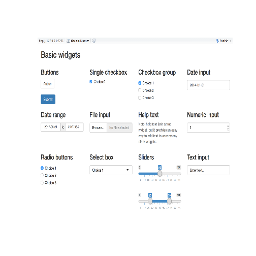

# R Shiny Intro

In this lesson, we are going to go through a very brief introduction to R Shiny, which helps you create dynamic web apps in R. We will talk about creating a basic web app, how to make things interact, practice a very simple app, and look at examples of complex apps that include things like maps, charts and graphs, and markdown documents. Start by making sure the shiny package is installed:


```r
install.packages("shiny")
library(shiny)
```

## Lesson Outline:

- [What is This Shiny Thing?](#What-is-This-Shiny-Thing)
- [Setting Up Your First R Shiny App](#Setting-Up-Your-First_R_Shiny-App)
- [Components of the User Interface](#Components-of-the-User-Interface)
- [Components of the Server](#Component-of-the-Server)
- [Reactives Make an App Work](#Reactives-Make-an-App_Work)
- [Examples of R Shiny Apps](#Examples-of-R_Shiny-Apps)

## Lesson Exercises:
- [Exercise 6.1](#Exercise-61)

## What is This Shiny Thing?

"Shiny is an R package that makes it easy to build interactive web applications (apps) straight from R." ~from shiny.rstudio.com/tutorial/written-tutorial/lesson1/


```r
runExample("01_hello")
runExample("06_tabsets")
```

These must be run from a server of some sort. This can be Rstudio for a local app, or a dedicated physical server running RStudio Server with Shiny Server software. Finally, there are ways to make Shiny apps into stand-alone applications that run on a local PC without RStudio, but that is way beyond the scope of an introduction.

## Setting Up Your First R Shiny App

In R Studio, you can create a new Shiny app by either going to File > New File > Shiny Web App...
Or the new file dropdown (green circle w/ white plus sign) > Shiny Web App

Then, you will be prompted to create a name for the app, select application type (a selection between single or multiple file method), and a location for the app to be saved. I prefer the multiple file method because it is easier for me to switch between the UI and Server files to find where I am working on a section of either file.

This will automatically create an example app that you can run automatically by pushing the "Run App" button at the top right of the script pane.

You will see that when you use the multiple file method, two files are made and stored in a folder with the name of the app. Those two files are ui.R and server.R and the names cannot be changed.
The single file method also makes a file, called app.R, which also cannot be changed.

## Components of the User Interface

The user interface (ui) object controls the layout and appearance of your app. All apps run within the fluidPage() or navbarPage() function. These functions make it so the ui will be able to adjust automatically to different window sizes and handle reactives. 

The example that is created when you start a new app is in the sidebar layout within a fluidPage(), which makes the interface arrangement somewhat like a grid with a sidebar on the left for selecting things and a main panel that shows the results of selections. There is also a title panel, which is like a header for the page.


```r
ui <- fluidPage(
  titlePanel("title panel"),

  sidebarLayout(
    sidebarPanel("sidebar panel"),
    mainPanel("main panel")
  )
)
```

An alternative to the fluidPage is the navbarPage, which give the option of having a navigation bar at the top with tabs for separate functions. I will show an example at the end, but we will stick with the fluidPage for this introductory session.

You add content by placing it in a Panel function. You can use HTML5 tags to enhance text or add images and break lines. These are created by using functions such as h1("header1"), or p("paragraph"). You can add images with something like img(src = "my_image.png", height = 72, width = 72).

You create inputs with Widgets. The example created in the basic shiny app is a slider by calling:


```r
sliderInput("bins",
                        "Number of bins:",
                        min = 1,
                        max = 50,
                        value = 30)
```

Here is examples from RSudio of the input widgets and what the look like:


```r
library("png")
pp <- readPNG("basic-widgets.png")
plot.new() 
rasterImage(pp,0,0,1,1)
```



These input widgets send arguments to the server functions to create outputs that appear in the main panel of the app. You will see that the first argument of the sliderInput() function is the name of the input object ("bins"). This is called by name in the server function, so make sure you use the exact name in both the server and the ui, and also that each pair has a unique name. The next argument for the widgets is the label. Both the name and label are required. Some widgets need additional instructions to work, such as the minimum and maximum reaches of the slider in our example.

In the main panel, you should expect something to happen based on your inputs. This is the result of an output from the server functions. They will be called by the type of output you create in the server function. And they will be displayed by adding an R object to the ui.

Our example uses plotOutput() because the object created (rendered) in the server is a plot. These can be dataTableOutput, htmlOutput, imageOutput, plotOutput, tableOutput, textOutput, uiOutput (raw HTML), or verbatimTextOutput. Each requires the single argument of a character string, which is used as the name of the reactive element (object).

## Components of the Server

The server is where the real action happens. It is where all the R functions are called that produce whatever you are looking for as output to the ui. Basically, you create an input in the ui, then the server processes those inputs to create an output that is displayed again in the ui.

The example server.R begins with the shinyServer() function that passes that it is a function with inputs and outputs. This must be the wrapper of all functions within the server for it to work. More arguments can be passed through this function on more advanced apps.


```r
library(shiny)
# Global objects can be created here.

# Define server logic required to create outputs
shinyServer(function(input, output) {
  #insert code here to create outputs
    
  output$distPlot <- renderPlot({

        # generate bins based on input$bins from ui.R
        x    <- faithful[, 2]
        bins <- seq(min(x), max(x), length.out = input$bins + 1)

        # draw the histogram with the specified number of bins
        hist(x, breaks = bins, col = 'darkgray', border = 'white')

    })
})

# No code here... ever
```

Notice that the name of the output ("distPlot") is the exact same in the ui file and function.

Scoping has a lot to with how fast an app works. Those items that need to only be created once when the app is launched can be placed outside of the shinyServer() function. Those that need be created only once each time a user launches the app should be placed within that function, but outside of any output$... functions.

## Reactives Make an App Work Faster

Reactives are different than the the output functions, and using them will make the app faster and reduce the amout of times that data is loaded to memory. They basically are creating a function that keeps reusable data in memory instead of going to look for that data repeatedly and only change when the input for that data has changed. For instance if your app has three inputs, each time you change one input, the whole output function must be reran for all three inputs. Using a reactive will let the app automatically know that only input one has changed and will then only look for updates based on that one input.

## Examples of R Shiny Apps

We have already seen the "Hello World" example that RStudio creates when you start a new app.
Let's take a look at some more complex examples.

https://shiny.rstudio.com/gallery/

Internal EPA Region 7 apps:
R7 R Users group
AIRPORT

## Exercise 6.1

For this presentation, there is no time for an exercise, so a great place to start and get some experience is:
https://shiny.rstudio.com/tutorial/
