# Basic Data analysis with R

This lesson will cover calculating basic statistics with R, conducting statistical tests, building simple linear models, and if there is time, we can talk a bit about `randomForest` .  We will continue to use the 2007 NLA data for the examples (e.g. `nla_wq_subset`)

## Lesson Outline:

- [Basic Statistics](#basic-statist)
- [Data visualization for data analysis](#data-visualization-for-data-analysis)
- [Some tests: t-test and ANOVA](#some-tests-ttest-and-anova)
- [Correlations and Linear modeling](#correlations-and-linear-modeling)
- [Random Forest](#random-forest)

## Lesson Exercises:
- [Exercise 6.1](#exercise-61)
- [Exercise 6.2](#exercise-62)
- [Exercise 6.3](#exercise-63)

## Basic Statistics

First step in analyzing a dataset like this is going to be to dig through some basic statistics as well as some basic plots.  

We can get a summary of the full data frame:


```r
#Get a summary of the data frame
summary(nla_wq_subset)
```

```
##    SITE_ID             RT_NLA            EPA_REG         
##  Length:1086        Length:1086        Length:1086       
##  Class :character   Class :character   Class :character  
##  Mode  :character   Mode  :character   Mode  :character  
##                                                          
##                                                          
##                                                          
##    WSA_ECO9         LAKE_ORIGIN             PTL               NTL         
##  Length:1086        Length:1086        Min.   :   1.00   Min.   :    5.0  
##  Class :character   Class :character   1st Qu.:  10.00   1st Qu.:  309.5  
##  Mode  :character   Mode  :character   Median :  25.50   Median :  575.0  
##                                        Mean   : 109.22   Mean   : 1175.8  
##                                        3rd Qu.:  89.75   3rd Qu.: 1172.0  
##                                        Max.   :4679.00   Max.   :26100.0  
##       CHLA           SECMEAN      
##  Min.   :  0.07   Min.   : 0.040  
##  1st Qu.:  2.98   1st Qu.: 0.650  
##  Median :  8.02   Median : 1.380  
##  Mean   : 29.38   Mean   : 2.195  
##  3rd Qu.: 26.08   3rd Qu.: 2.850  
##  Max.   :936.00   Max.   :36.710
```

Or, we can pick and choose what stats we want.  For instance:


```r
#Stats for Total Nitrogen
mean(nla_wq_subset$NTL)
```

```
## [1] 1175.79
```

```r
median(nla_wq_subset$NTL)
```

```
## [1] 575
```

```r
min(nla_wq_subset$NTL)
```

```
## [1] 5
```

```r
max(nla_wq_subset$NTL)
```

```
## [1] 26100
```

```r
sd(nla_wq_subset$NTL)
```

```
## [1] 2200.842
```

```r
IQR(nla_wq_subset$NTL)
```

```
## [1] 862.5
```

```r
range(nla_wq_subset$NTL)
```

```
## [1]     5 26100
```

In these cases we took care of our NA values during our data clean up, but there may be reasons you would not want to do that.  If you retained NA values, you would need to think about how to handle those.  One way is to remove it from the calculation of the statistics using the `na.rm = TRUE` argument.  For instance:


```r
#An example with NA's
x <- c(37,22,NA,41,19)
mean(x) #Returns NA
```

```
## [1] NA
```

```r
mean(x, na.rm = TRUE) #Returns mean of 37, 22, 41, and 19
```

```
## [1] 29.75
```

It is also useful to be able to return some basic counts for different groups.  For instance, how many lakes in the NLA were natural and how many were man made.


```r
#The table() funciton is usefule for returning counts
table(nla_wq_subset$LAKE_ORIGIN)
```

```
## 
## MAN-MADE  NATURAL 
##      611      475
```

The `table()` function is also useful for looking at multiple columns at once.  A contrived example of that:


```r
x <- c(1,1,0,0,1,1,0,0,1,0,1,1)
y <- c(1,1,0,0,1,0,1,0,1,0,0,0)
xy_tab <- table(x,y)
xy_tab
```

```
##    y
## x   0 1
##   0 4 1
##   1 3 4
```

```r
prop.table(xy_tab)
```

```
##    y
## x            0          1
##   0 0.33333333 0.08333333
##   1 0.25000000 0.33333333
```

Lastly, we can use what we learned in the [data aggregation](data_aggregation.md#using-groups-to-summarize-data) lesson and can combine these with some `dplyr` and get summary stats for groups.  


```r
orig_stats_ntl <- nla_wq_subset %>%
  group_by(LAKE_ORIGIN) %>%
  summarize(mean_ntl = mean(NTL),
            median_ntl = median(NTL),
            sd_ntl = sd(NTL))
orig_stats_ntl
```

```
## # A tibble: 2 × 4
##   LAKE_ORIGIN  mean_ntl median_ntl   sd_ntl
##         <chr>     <dbl>      <int>    <dbl>
## 1    MAN-MADE  825.3617        531  939.357
## 2     NATURAL 1626.5516        624 3096.758
```

And, just because it is cool, a markdown table!

The code,

```r
knitr::kable(orig_stats_ntl)
```

produces markdown,


<pre>
|LAKE_ORIGIN |  mean_ntl| median_ntl|   sd_ntl|
|:-----------|---------:|----------:|--------:|
|MAN-MADE    |  825.3617|        531|  939.357|
|NATURAL     | 1626.5516|        624| 3096.758|
</pre>


which renders in html to something like this.


|LAKE_ORIGIN |  mean_ntl| median_ntl|   sd_ntl|
|:-----------|---------:|----------:|--------:|
|MAN-MADE    |  825.3617|        531|  939.357|
|NATURAL     | 1626.5516|        624| 3096.758|

## Exercise 6.1
1. Look at some of the basic stats for other columns in our data.  What is the standard deviation for PTL?  What is the median Secchi depth?  Play around with others.
2. Using some `dplyr` magic, let's look at mean Secchi by reference class (RT_NLA). 
3. The `quantile()` function allows greater control over getting different quantiles of your data.  For instance you can use it to get the min, median and max with `quantile(nla_wq_subset$NTL, probs = c(0,0.5,1))`.  Re-write this to return the 33rd and 66th quantiles.

## Data visualization for data analysis

While we have already covered visualization and talked about these, I wanted to include them here as they really are an integral part of exploratory data analysis. In particular distributions and bi-variate relationships are better displayed graphically.  

We can look at histograms and density:


```r
#A single histogram using base
hist(nla_wq_subset$NTL)
```

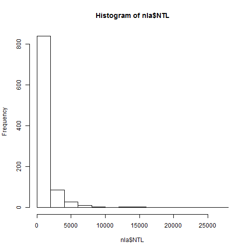

```r
#Log transform it
hist(log1p(nla_wq_subset$NTL)) #log1p adds one to deal with zeros
```

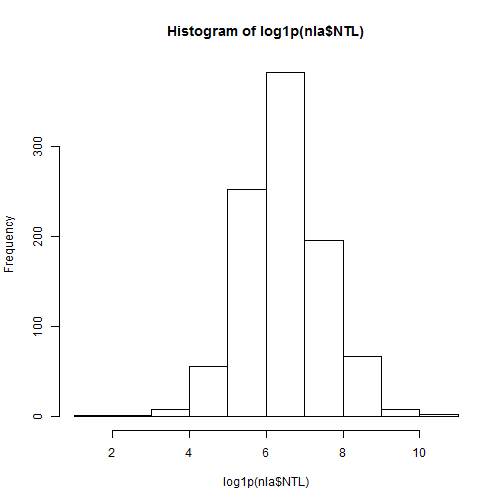

```r
#Density plot
plot(density(log1p(nla_wq_subset$NTL)))
```

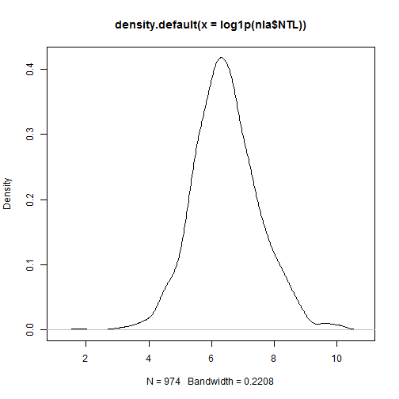

And boxplots:


```r
#Simple boxplots
boxplot(nla_wq_subset$CHLA)
```


```r
boxplot(log1p(nla_wq_subset$CHLA))
```

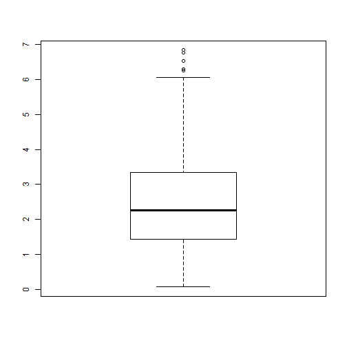

```r
#Boxplots per group
boxplot(log1p(nla_wq_subset$CHLA)~nla_wq_subset$EPA_REG)
```

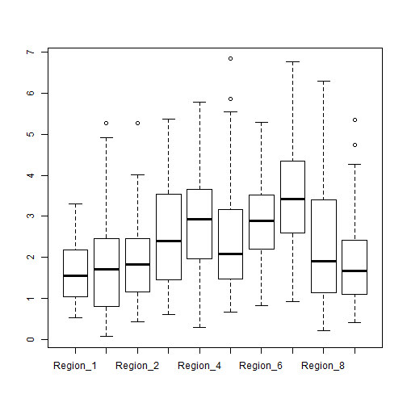

And scatterplots:


```r
#A single scatterplot
plot(log1p(nla_wq_subset$PTL),log1p(nla_wq_subset$CHLA))
```

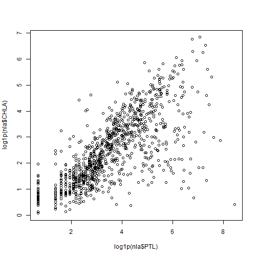

```r
#A matrix of scatterplot
plot(log1p(nla_wq_subset[,6:9]))
```

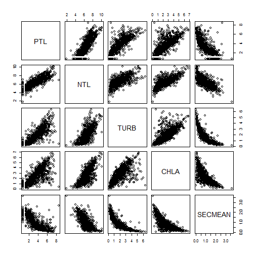

Lastly, it might be nice to look at these on a per variable basis or on some grouping variable. First we could look at the density of each measured variable. This requires some manipulation of the data which will allow us to use facets in ggplot to create a density distribution for each of the variables.


```r
#Getting super fancy with tidyr, plotly (commented out for md), and ggplot2 to visualize all variables
library(tidyr)
library(ggplot2)
library(plotly)
nla_gather <- gather(nla_wq_subset,parameter,value,6:9)
dens_gg <-ggplot(nla_gather,aes(x=log1p(value))) +
  geom_density() +
  facet_wrap("parameter") +
  labs(x="log1p of measured value")
ggplotly(dens_gg)
```

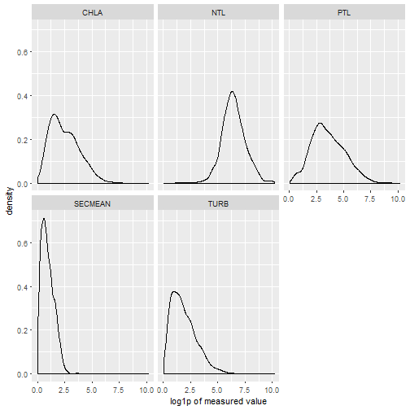

```r
#dens_gg
```

Next we could look at a scatterplot matrix of the relationship between phosphorus and chlorophyl by each EPA Region.  No need to re-do the shape of the data frame for this one.


```r
ggplot(nla_wq_subset, aes(x=log1p(PTL),y=log1p(NTL))) +
  geom_point() +
  geom_smooth(method = "lm") +
  facet_wrap("EPA_REG")
```

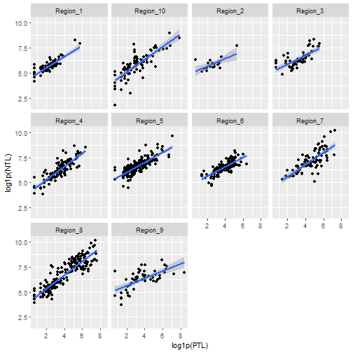

### Exercise 6.2
1. Build a scatterplot that looks at the relationship between PTL and NTL.  
2. Build a boxplot that shows a boxplot of secchi by the reference class (RT_NLA)

## Some tests: t-test and ANOVA
There are way more tests than we can show examples for.  For today we will show two very common and straightforward tests.  The t-test and an ANOVA.

### t-test
First we will look at the t-test to test and see if `LAKE_ORIGIN` shows a difference in `SECMEAN`.  In other words can we expect a difference in clarity due to whether a lake is man-made or natural.  This is a two-tailed test. There are two approaches for this 1) using the formula notation if your dataset is in a "long" format or 2) using two separate vectors if your dataset is in a "wide" format.


```r
#Long Format - original format for LAKE_ORIGIN and SECMEAN
t.test(nla_wq_subset$SECMEAN ~ nla_wq_subset$LAKE_ORIGIN)
```

```
## 
## 	Welch Two Sample t-test
## 
## data:  nla_wq_subset$SECMEAN by nla_wq_subset$LAKE_ORIGIN
## t = -6.1022, df = 696.06, p-value = 1.737e-09
## alternative hypothesis: true difference in means is not equal to 0
## 95 percent confidence interval:
##  -1.3024529 -0.6683482
## sample estimates:
## mean in group MAN-MADE  mean in group NATURAL 
##               1.763715               2.749116
```

```r
#Wide Format - need to do some work to get there - tidyr is handy!
wide_nla <- spread(nla_wq_subset,LAKE_ORIGIN,SECMEAN)
names(wide_nla)[8:9]<-c("man_made", "natural")
t.test(wide_nla$man_made, wide_nla$natural)
```

```
## 
## 	Welch Two Sample t-test
## 
## data:  wide_nla$man_made and wide_nla$natural
## t = -6.1022, df = 696.06, p-value = 1.737e-09
## alternative hypothesis: true difference in means is not equal to 0
## 95 percent confidence interval:
##  -1.3024529 -0.6683482
## sample estimates:
## mean of x mean of y 
##  1.763715  2.749116
```

Same results, two different ways to approach.  Take a look at the help (e.g. `?t.test`) for more details on other types of t-tests (e.g. paired, one-tailed, etc.)

### ANOVA
ANOVA can get involved quickly and I haven't done them since my last stats class, so I'm not the best to talk about these, but the very basics require fitting a model and wrapping that in the `aov` function.  In the [Getting More Help section](#getting-more-help) I provide a link that would be a good first start for you ANOVA junkies.  For today's lesson though, lets look at the simple case of a one-vay analysis of variance and check if reference class results in differences in our chlorophyll


```r
# A quick visual of this:
boxplot(log1p(nla_wq_subset$CHLA)~nla_wq_subset$RT_NLA)
```

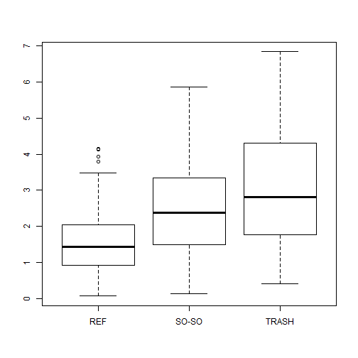

```r
# One way analysis of variance
nla_anova <- aov(log1p(CHLA)~RT_NLA, data=nla_wq_subset)
nla_anova #Terms
```

```
## Call:
##    aov(formula = log1p(CHLA) ~ RT_NLA, data = nla_wq_subset)
## 
## Terms:
##                    RT_NLA Residuals
## Sum of Squares   209.9731 1636.6244
## Deg. of Freedom         2      1083
## 
## Residual standard error: 1.229307
## Estimated effects may be unbalanced
```

```r
summary(nla_anova) #The table
```

```
##               Df Sum Sq Mean Sq F value Pr(>F)    
## RT_NLA         2    210  104.99   69.47 <2e-16 ***
## Residuals   1083   1637    1.51                   
## ---
## Signif. codes:  0 '***' 0.001 '**' 0.01 '*' 0.05 '.' 0.1 ' ' 1
```

```r
anova(nla_anova) #The table with a bit more
```

```
## Analysis of Variance Table
## 
## Response: log1p(CHLA)
##             Df  Sum Sq Mean Sq F value    Pr(>F)    
## RT_NLA       2  209.97 104.987  69.472 < 2.2e-16 ***
## Residuals 1083 1636.62   1.511                      
## ---
## Signif. codes:  0 '***' 0.001 '**' 0.01 '*' 0.05 '.' 0.1 ' ' 1
```

So now that we know a difference exists, we can look at this more carefully, perhaps with a Tukey's Honest Significance Test.


```r
tukey_test <- TukeyHSD(nla_anova, ordered = TRUE, conf.level = 0.95)
tukey_test
```

```
##   Tukey multiple comparisons of means
##     95% family-wise confidence level
##     factor levels have been ordered
## 
## Fit: aov(formula = log1p(CHLA) ~ RT_NLA, data = nla_wq_subset)
## 
## $RT_NLA
##                  diff       lwr       upr p adj
## SO-SO-REF   0.9579075 0.7020595 1.2137554     0
## TRASH-REF   1.5843368 1.2670871 1.9015865     0
## TRASH-SO-SO 0.6264293 0.3870602 0.8657985     0
```

```r
summary(tukey_test)
```

```
##        Length Class  Mode   
## RT_NLA 12     -none- numeric
```

## Exercise 6.3

1. Run an ANOVA to see if mean chlorophyll differs across EPA Regions (EPA_REG).
2. Run a Tukey's HSD to look at the per region comparisons.

## Correlations and Linear modeling
The last bit of basic stats we will cover is going to be linear relationships.

### Correlations
Let's first take a look at correlations.  These can be done with `cor()`.


```r
#For a pair
cor(log1p(nla_wq_subset$PTL),log1p(nla_wq_subset$NTL))
```

```
## [1] 0.8145613
```

```r
#For a correlation matrix
cor(log1p(nla_wq_subset[,6:9]))
```

```
##                PTL        NTL       CHLA    SECMEAN
## PTL      1.0000000  0.8145613  0.7365462 -0.7657098
## NTL      0.8145613  1.0000000  0.7399339 -0.7093518
## CHLA     0.7365462  0.7399339  1.0000000 -0.7895962
## SECMEAN -0.7657098 -0.7093518 -0.7895962  1.0000000
```

```r
#Spearman Rank Correlations
cor(log1p(nla_wq_subset[,6:9]),method = "spearman")
```

```
##                PTL        NTL       CHLA    SECMEAN
## PTL      1.0000000  0.8224621  0.7733400 -0.8305105
## NTL      0.8224621  1.0000000  0.7274128 -0.7270149
## CHLA     0.7733400  0.7274128  1.0000000 -0.8272483
## SECMEAN -0.8305105 -0.7270149 -0.8272483  1.0000000
```

You can also test for differences using:


```r
cor.test(log1p(nla_wq_subset$PTL),log1p(nla_wq_subset$NTL))
```

```
## 
## 	Pearson's product-moment correlation
## 
## data:  log1p(nla_wq_subset$PTL) and log1p(nla_wq_subset$NTL)
## t = 46.233, df = 1084, p-value < 2.2e-16
## alternative hypothesis: true correlation is not equal to 0
## 95 percent confidence interval:
##  0.7935253 0.8336529
## sample estimates:
##       cor 
## 0.8145613
```

### Linear models
Basic linear models in R can be built with the `lm()` function.  If you aren't buiding stadard least squares regressin models, (e.g. logistic) or aren't doing linear models then you will need to look elsewhere (e.g `glm()`, or `nls()`).  For today our focus is going to be on simple linear models.  Let's look at our ability to model chlorophyll, given the other variables we have.


```r
# The simplest case
chla_tp <- lm(log1p(CHLA) ~ log1p(PTL), data=nla_wq_subset) #Creates the model
summary(chla_tp) #Basic Summary
```

```
## 
## Call:
## lm(formula = log1p(CHLA) ~ log1p(PTL), data = nla_wq_subset)
## 
## Residuals:
##     Min      1Q  Median      3Q     Max 
## -5.2291 -0.4557 -0.0214  0.5441  2.9293 
## 
## Coefficients:
##             Estimate Std. Error t value Pr(>|t|)    
## (Intercept)  0.17559    0.06830   2.571   0.0103 *  
## log1p(PTL)   0.64516    0.01799  35.852   <2e-16 ***
## ---
## Signif. codes:  0 '***' 0.001 '**' 0.01 '*' 0.05 '.' 0.1 ' ' 1
## 
## Residual standard error: 0.8828 on 1084 degrees of freedom
## Multiple R-squared:  0.5425,	Adjusted R-squared:  0.5421 
## F-statistic:  1285 on 1 and 1084 DF,  p-value: < 2.2e-16
```

```r
names(chla_tp) #The bits
```

```
##  [1] "coefficients"  "residuals"     "effects"       "rank"         
##  [5] "fitted.values" "assign"        "qr"            "df.residual"  
##  [9] "xlevels"       "call"          "terms"         "model"
```

```r
chla_tp$coefficients #My preference
```

```
## (Intercept)  log1p(PTL) 
##   0.1755893   0.6451571
```

```r
coef(chla_tp) #Same thing, but from a function
```

```
## (Intercept)  log1p(PTL) 
##   0.1755893   0.6451571
```

```r
head(resid(chla_tp)) # The resdiuals
```

```
##          1          2          3          4          5          6 
## -1.2158956 -0.9282839  0.2711610 -0.3524484  0.1081555 -0.3605840
```

We can also do multiple linear regression.


```r
chla_tp_tn_turb <- lm(log1p(CHLA) ~ log1p(PTL) + log1p(NTL), data = nla_wq_subset)
summary(chla_tp_tn_turb)
```

```
## 
## Call:
## lm(formula = log1p(CHLA) ~ log1p(PTL) + log1p(NTL), data = nla_wq_subset)
## 
## Residuals:
##     Min      1Q  Median      3Q     Max 
## -4.0306 -0.4654  0.0144  0.5076  3.0738 
## 
## Coefficients:
##             Estimate Std. Error t value Pr(>|t|)    
## (Intercept) -2.06569    0.18943  -10.90   <2e-16 ***
## log1p(PTL)   0.34836    0.02899   12.02   <2e-16 ***
## log1p(NTL)   0.51005    0.04059   12.57   <2e-16 ***
## ---
## Signif. codes:  0 '***' 0.001 '**' 0.01 '*' 0.05 '.' 0.1 ' ' 1
## 
## Residual standard error: 0.8251 on 1083 degrees of freedom
## Multiple R-squared:  0.6007,	Adjusted R-squared:    0.6 
## F-statistic: 814.7 on 2 and 1083 DF,  p-value: < 2.2e-16
```

There's a lot more we can do with linear models including dummy variables (character or factors will work), interactions, etc.  That's a bit more than we want to get into.  Again the link below is a good place to start for more info.

### Exercise 6.4
1. Use `lm()` to look at using secchi depth to predict chlorophyll.

## Random Forest

Random forests were developed by Leo Breiman at UC-Berkely ([Breiman 2001](http://dx.doi.org/10.1023/A:1010933404324)).  At their simplest, a random forest is a collection (or ensemble) of classification (or regression) trees.  Each tree is developed based on a resampling of both the data and variables.  They have been shown to have superior predictive perfomance as well as to be robust to violation of the standard suite of assumptions that often plague other approaches.  In my opinion, if you want to learn one machine learning approach, this is it.  If you want to read more, a few good references are:

- [Cutler et. al. (2007):Random forests for classification in ecology](http://dx.doi.org/10.1890/07-0539.1)
- [Fern´andez-Delgado et al. 2014: Do we Need Hundreds of Classifiers to Solve Real World Classification Problems?](http://jmlr.org/papers/volume15/delgado14a/delgado14a.pdf) (HT:[Simply Statistics](http://simplystatistics.org/2014/12/17/a-non-comprehensive-list-of-awesome-things-other-people-did-in-2014/))

The implementation in R is accessed through the `randomForest` package.  Let's install this, load it up and start to look around.


```r
install.packages("randomForest")
library("randomForest")
help(package="randomForest")
```

There are quite a few functions included with this package, but the one we are most interested in is the workhorse `randomForest()` function.  For our examples we will look at classification trees.  The bare minimum we need for this to work are just our independent (x) and dependent variables (y).  Let's see if we can predict iris species from the morphology measurements...


```r
rf_x<-select(iris,Petal.Width, Petal.Length, Sepal.Width, Sepal.Length)
rf_y<-iris$Species
iris_rf<-randomForest(x=rf_x,y=rf_y)
iris_rf
```

```
## 
## Call:
##  randomForest(x = rf_x, y = rf_y) 
##                Type of random forest: classification
##                      Number of trees: 500
## No. of variables tried at each split: 2
## 
##         OOB estimate of  error rate: 4%
## Confusion matrix:
##            setosa versicolor virginica class.error
## setosa         50          0         0        0.00
## versicolor      0         47         3        0.06
## virginica       0          3        47        0.06
```

Can we predict species, well, I'd say so!  

We can also call `randomForest()` using a formula for a data frame like,


```r
iris_rf2<-randomForest(Species~.,data=iris)
iris_rf2
```

```
## 
## Call:
##  randomForest(formula = Species ~ ., data = iris) 
##                Type of random forest: classification
##                      Number of trees: 500
## No. of variables tried at each split: 2
## 
##         OOB estimate of  error rate: 4%
## Confusion matrix:
##            setosa versicolor virginica class.error
## setosa         50          0         0        0.00
## versicolor      0         47         3        0.06
## virginica       0          3        47        0.06
```

The only thing we haven't seen before here is the ".".  That indicates all the other variables in the data frame.  It is just a shortcut and you could explicitly name the variables to use.

Lastly, we can look at a couple of plots that tell us a little bit more about the model with some of the plotting functions that come with randomForest.


```r
#Error vs num of trees
plot(iris_rf2)
```

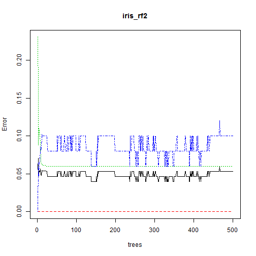

```r
#Variable Importance
varImpPlot(iris_rf2)
```

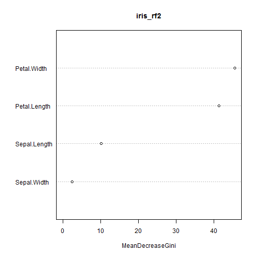

The default plot shows error for the total model and and each of the classes as a function of the number of trees. Variable importance is plotting the decrease in Gini as each variable is added to the model.  

For the basics, that is it! 

## Exercise 6.5

For this exercise we are going to use a random forest and try to predict the NLA reference class from the water quality measurements.

1. Add a new section to the script
2. Build your model to predict RT_NLA.  You may specify the model however makes the most sense
3. Print to the screen your result, plot the error and variable importance. When finished put a green sticky up and we will come around to check.

## Getting More Help

One nice site that covers basic stats in R is [Quick R: Basic Statistics](http://www.statmethods.net/stats/index.html).  There are others, but that is a good first stop.
