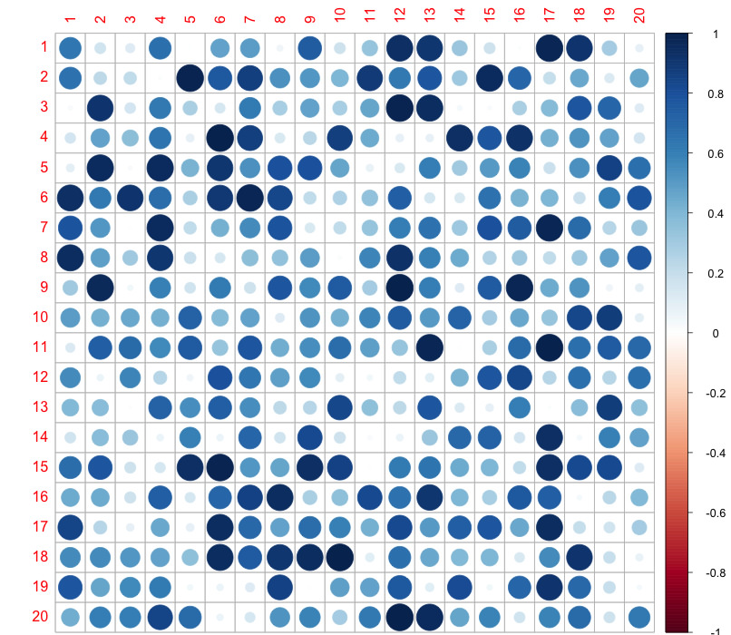
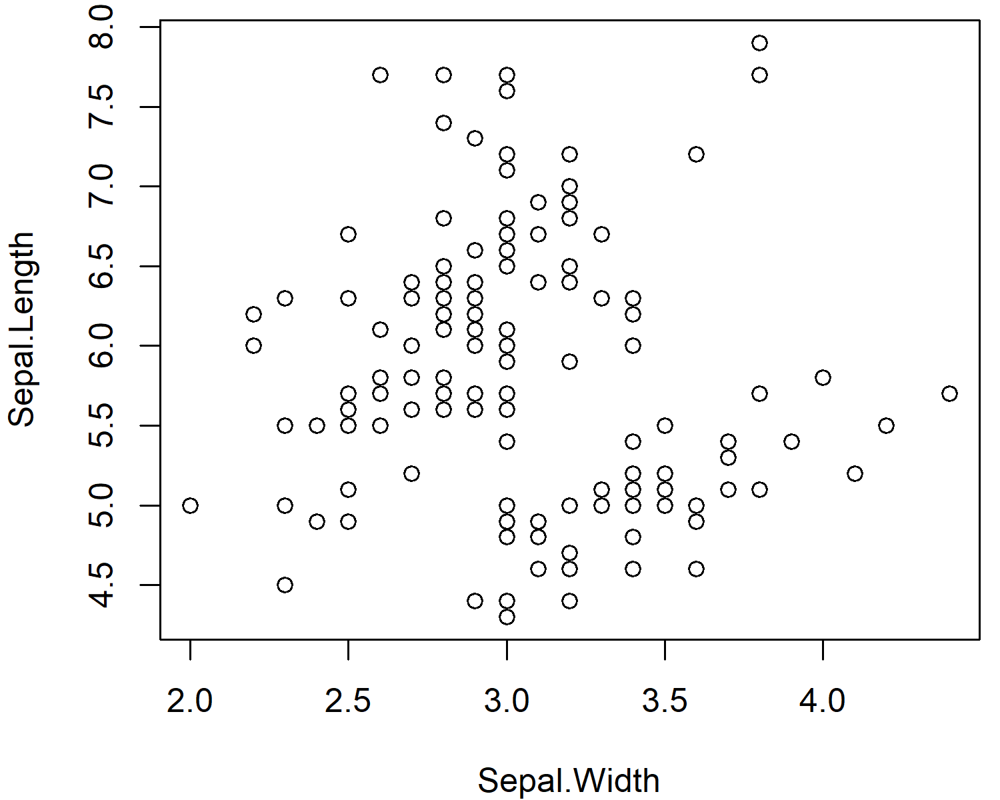
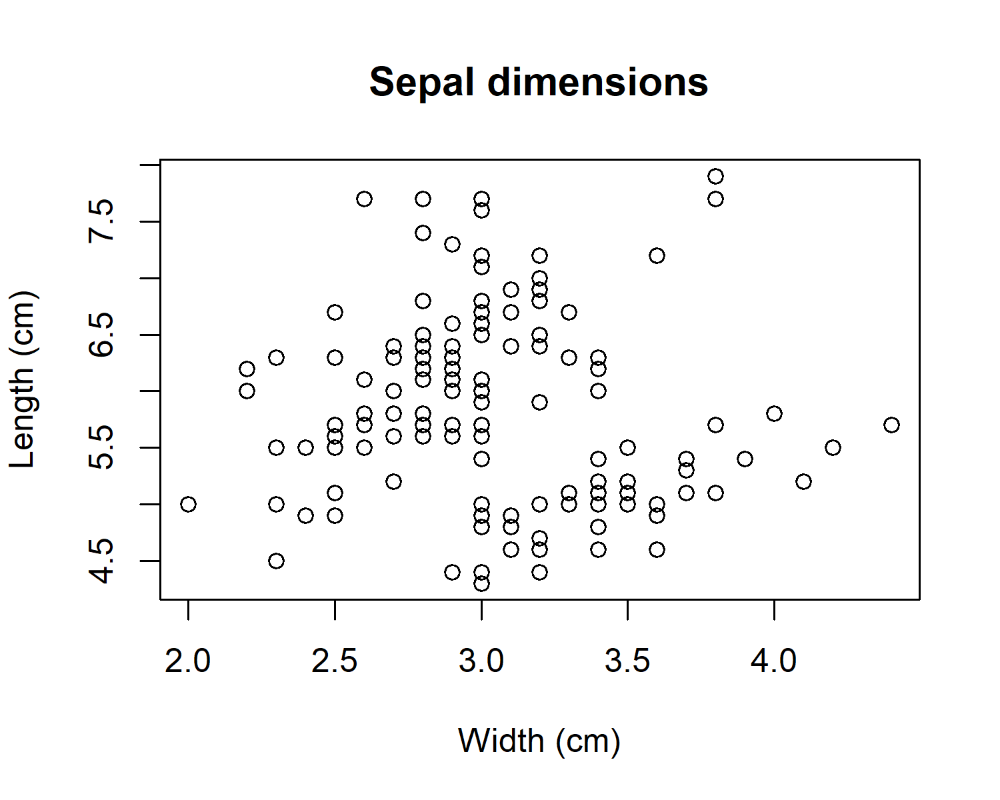
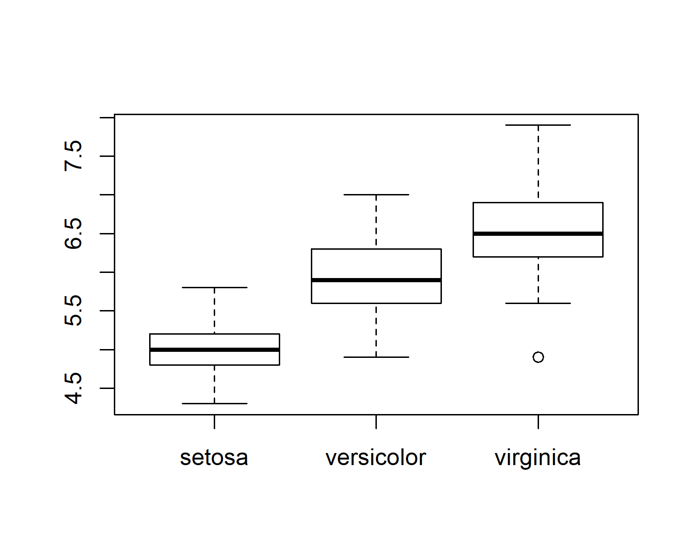
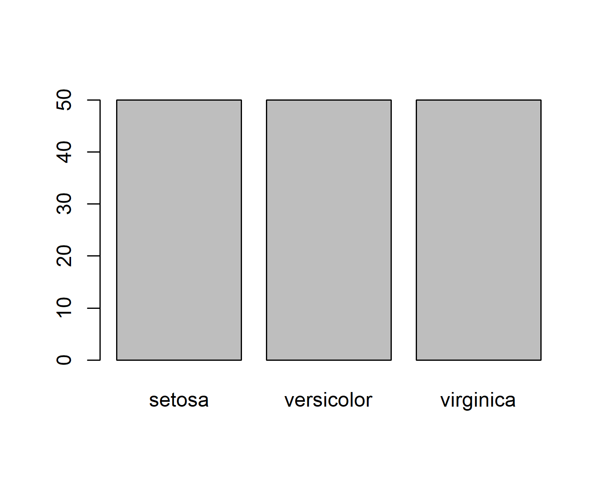
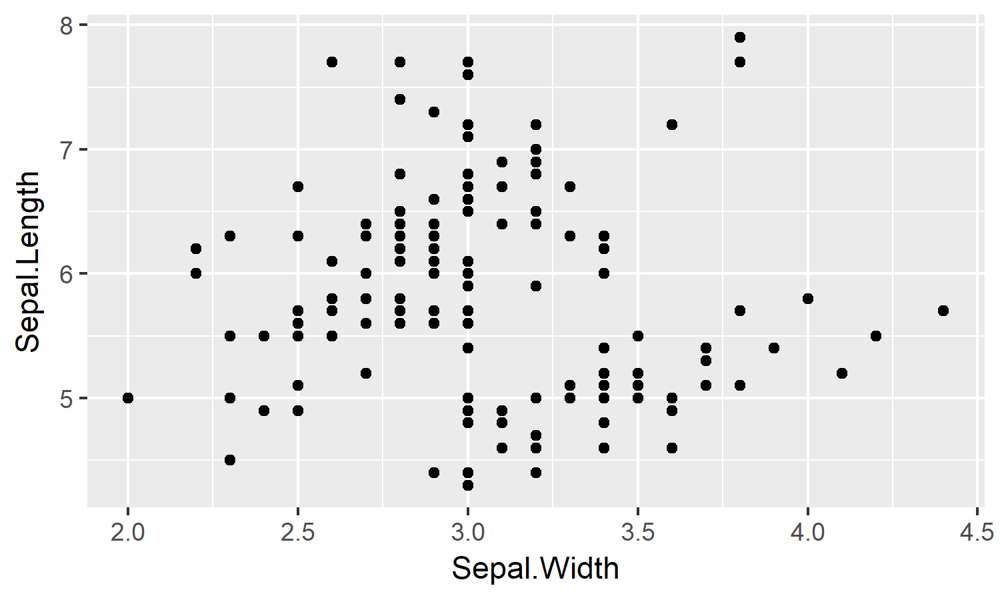
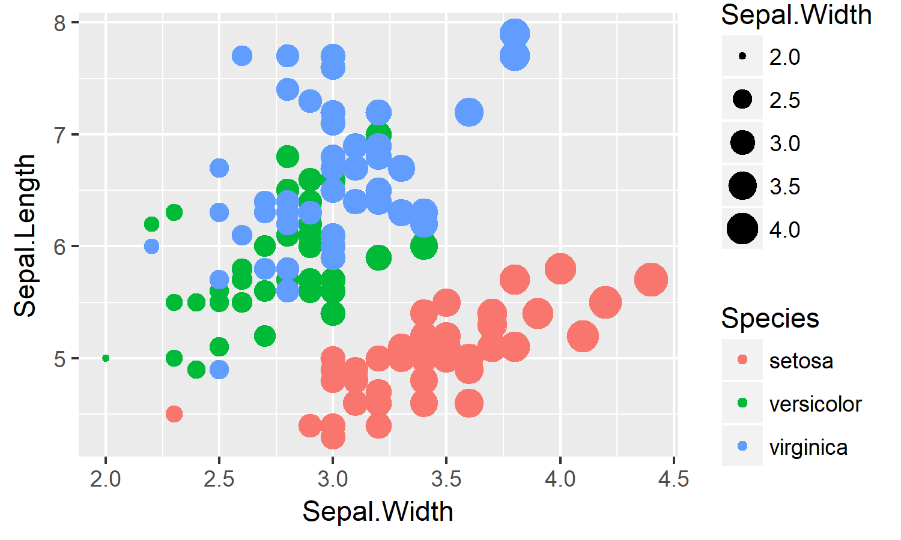
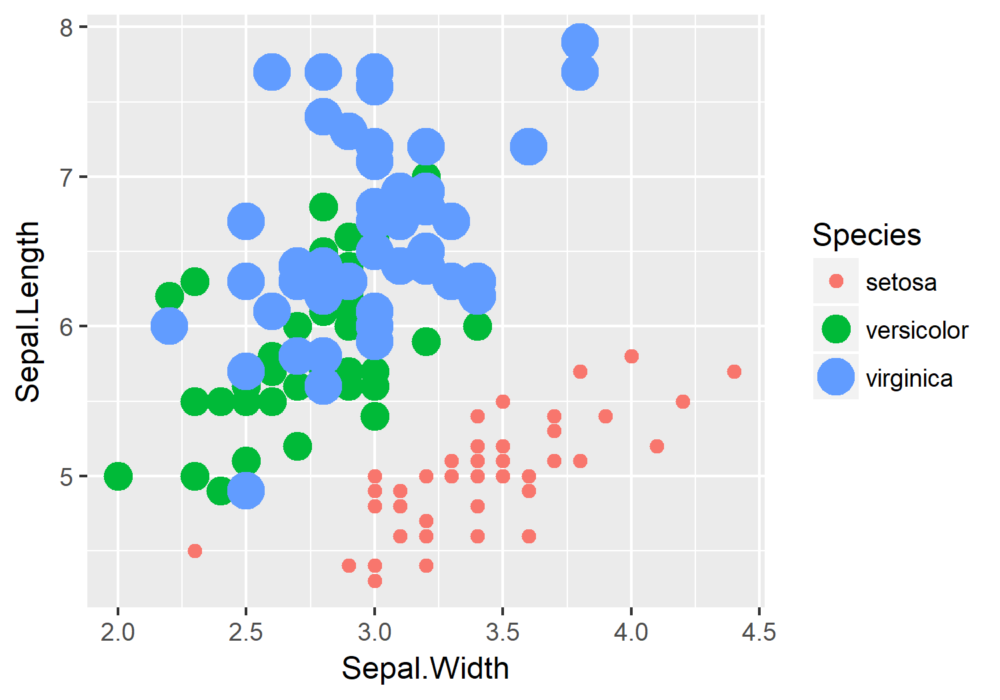
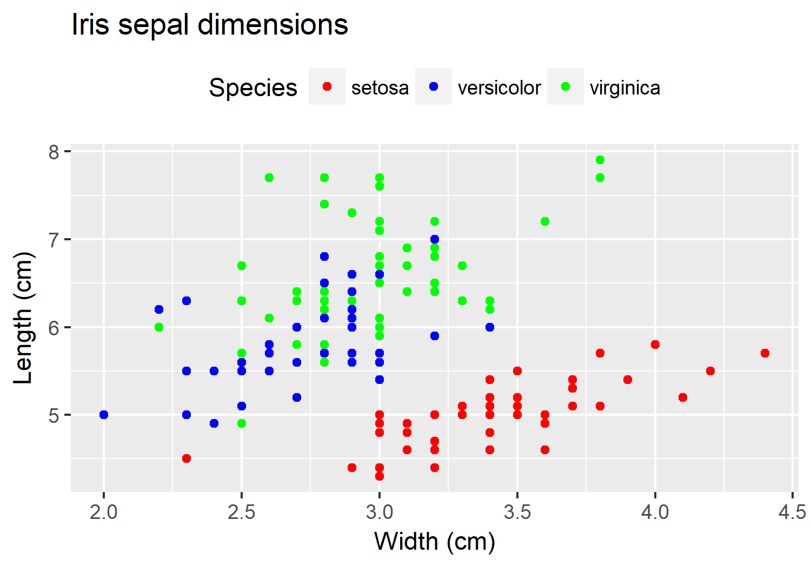
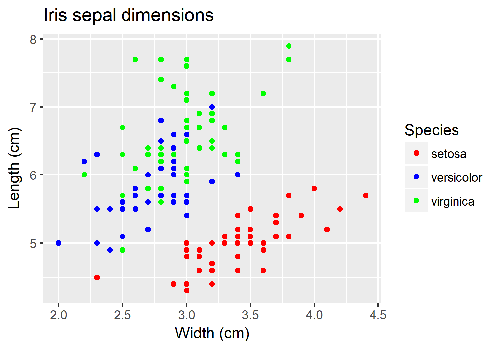

<insertHTML:[columns.html]

Data Visualization
========================================================
date: November 5, 2017
author: Marcus W Beck
autosize: false
css: frm.css
transition: none
width: 960
height: 700


Lesson outline
========================================================
A whirlwind tour of data viz
* Simple plots with base R
* `ggplot2`: introduction
* `ggplot2`: scatterplots
* `ggplot2`: barchart
* `ggplot2`: customizing 
* Other cool stuff

Motivation
========================================================
* You can make some really cool graphs in R

<div align='center'>

</div>

Motivation
========================================================
* You can make some really cool graphs in R

<div align='center'>

</div>

Motivation
========================================================
* You can make some really cool graphs in R

<div align='center'>

</div>

Motivation
========================================================
* You can make some really cool graphs in R

3d and interactive: 
https://blog.plot.ly/post/101360048217/7-plotly-graphs-in-3d-stocks-cats-and-lakes

A CERF example:
https://fawda123.github.io/ADOSR/depth_ex

Simple plots with base R
========================================================
* Base graphics in R (i.e, those that come with the software) can do most anything for you
* But they're kind of ugly in the default format (bad for pubs)
* Customization is tedious...
* Easy to use for quick, exploratory plots

Simple plots with base R
========================================================
* Let's load the `iris` dataset from the [datasets](https://stat.ethz.ch/R-manual/R-devel/library/datasets/html/00Index.html) package
* Measurements on 150 flowers from three species
* *Fisher, R. A. (1936) The use of multiple measurements in taxonomic problems. Annals of Eugenics, 7, Part II, 179–188.*

```r
data(iris)
str(iris)
```

```
'data.frame':	150 obs. of  5 variables:
 $ Sepal.Length: num  5.1 4.9 4.7 4.6 5 5.4 4.6 5 4.4 4.9 ...
 $ Sepal.Width : num  3.5 3 3.2 3.1 3.6 3.9 3.4 3.4 2.9 3.1 ...
 $ Petal.Length: num  1.4 1.4 1.3 1.5 1.4 1.7 1.4 1.5 1.4 1.5 ...
 $ Petal.Width : num  0.2 0.2 0.2 0.2 0.2 0.4 0.3 0.2 0.2 0.1 ...
 $ Species     : Factor w/ 3 levels "setosa","versicolor",..: 1 1 1 1 1 1 1 1 1 1 ...
```

Simple plots with base R
========================================================
* Let's load the `iris` dataset from the [datasets](https://stat.ethz.ch/R-manual/R-devel/library/datasets/html/00Index.html) package
* Measurements on 150 flowers from three species
* *Fisher, R. A. (1936) The use of multiple measurements in taxonomic problems. Annals of Eugenics, 7, Part II, 179–188.*

```r
data(iris)
head(iris)
```

```
  Sepal.Length Sepal.Width Petal.Length Petal.Width Species
1          5.1         3.5          1.4         0.2  setosa
2          4.9         3.0          1.4         0.2  setosa
3          4.7         3.2          1.3         0.2  setosa
4          4.6         3.1          1.5         0.2  setosa
5          5.0         3.6          1.4         0.2  setosa
6          5.4         3.9          1.7         0.4  setosa
```

Simple plots with base R
========================================================
* The scatterplot can be created with `plot`
* It can be created with one line... `plot(y ~ x, data)`
* This literally says... from the data object, plot the variables y (on the y-axis) against x (on the x-axis)

```r
plot(Sepal.Length ~ Sepal.Width, data = iris)
```

Simple plots with base R
========================================================

```r
plot(Sepal.Length ~ Sepal.Width, data = iris)
```



Simple plots with base R
========================================================
* We can also use alternative notation without using the data argument

```r
plot(iris$Sepal.Width, iris$Sepal.Length)
```
* As compared to...

```r
plot(Sepal.Length ~ Sepal.Width, data = iris)
```
* Note the arrangement of y/x variables in each

Simple plots with base R
========================================================
* We can also use alternative notation without using the data argument

```r
plot(iris$Sepal.Width, iris$Sepal.Length)
```


Simple plots with base R
========================================================
* But check out the axis labels...

```r
plot(iris$Sepal.Width, iris$Sepal.Length)
```


Simple plots with base R
========================================================
* `plot` has lots of optional arguments, called within `plot` or separately using `par`
<div align='center'>

</div> 

Simple plots with base R
========================================================
* Change axis labels, give it a title...

```r
plot(iris$Sepal.Width, iris$Sepal.Length, xlab = 'Width (cm)', ylab = 'Length (cm)', main = 'Sepal dimensions')
```



Simple plots with base R
========================================================
* The plot margins are too big, let's change that

```r
par(mar = c(4.5, 4.5, 1, 1))
plot(iris$Sepal.Width, iris$Sepal.Length, xlab = 'Width (cm)', ylab = 'Length (cm)', main = 'Sepal dimensions')
```



Simple plots with base R
========================================================
* Other base plot functions - bar plots

```r
barplot(table(iris$Species))
```



Simple plots with base R
========================================================
* Other base plot functions - histogram

```r
hist(iris$Sepal.Length)
```


Simple plots with base R
========================================================
* Other base plot functions - box plots

```r
boxplot(Sepal.Length ~ Species, data = iris)
```


Simple plots with base R
========================================================
* Other base plot functions - paired scatter plots

```r
pairs(iris)
```


ggplot2: overview
========================================================
* Base graphics are okay for exploratory stuff
* ggplot2 is meant to improve on base by linking the graph components following a **grammar of graphics** - like parts of speech
* Makes thinking, reasoning, and communicatings graphics easier
* Start with a foundational component to add additional pieces

<div align='center'>

</div>

ggplot2: overview
========================================================
* We'll start by installing and loading [tidyverse](https://www.tidyverse.org/), which includes ggplot2 (you should have this from the earlier session)

```r
install.packages('tidyverse')
library(tidyverse)
```
To verify it's loaded...

```r
loadedNamespaces()
```

```
 [1] "Rcpp"       "highr"      "cellranger" "compiler"   "plyr"      
 [6] "bindr"      "methods"    "forcats"    "utils"      "tools"     
[11] "grDevices"  "digest"     "lubridate"  "jsonlite"   "evaluate"  
[16] "tibble"     "nlme"       "gtable"     "lattice"    "pkgconfig" 
[21] "rlang"      "psych"      "parallel"   "haven"      "bindrcpp"  
[26] "xml2"       "httr"       "dplyr"      "stringr"    "knitr"     
[31] "graphics"   "datasets"   "stats"      "hms"        "grid"      
[36] "glue"       "base"       "R6"         "readxl"     "foreign"   
[41] "readr"      "modelr"     "reshape2"   "tidyr"      "purrr"     
[46] "ggplot2"    "magrittr"   "scales"     "rvest"      "assertthat"
[51] "mnormt"     "tidyverse"  "colorspace" "labeling"   "stringi"   
[56] "lazyeval"   "munsell"    "broom"     
```

ggplot2: overview
========================================================
* The general concepts of `ggplot2` revolve around the **data**, plot **layers**, **aesthetics**, and **mapping**
* This is by far the biggest hurdle in learning `ggplot`
* Just remember, the **aesthetics** are parts of the plot **layers** that **map** the variables in the **data** to the plot
* We'll demonstrate when this system breaks down to understand how it works

ggplot2: overview
========================================================
* We'll start with a very simple scatterplot with the iris data

```r
head(iris)
```

```
  Sepal.Length Sepal.Width Petal.Length Petal.Width Species
1          5.1         3.5          1.4         0.2  setosa
2          4.9         3.0          1.4         0.2  setosa
3          4.7         3.2          1.3         0.2  setosa
4          4.6         3.1          1.5         0.2  setosa
5          5.0         3.6          1.4         0.2  setosa
6          5.4         3.9          1.7         0.4  setosa
```

ggplot2: overview
========================================================
* All ggplot plots start with the `ggplot` function
* It will typically need two pieces of information, the **data** and how the data are **mapped** to the plot **aesthetics**

```r
ggplot(data = iris, aes(x = Sepal.Width, y = Sepal.Length))
```
* This says, make a `ggplot` object for the iris **data**, where the variables Sepal.Width and Sepal.Length are **mapped** to the **x** and **y** aesthetics

ggplot2: overview
========================================================
* The `aes` function defines the mapping of variables to aesthetics

```r
aes(x = Sepal.Width, y = Sepal.Length)
```

```
* x -> Sepal.Width
* y -> Sepal.Length
```

ggplot2: overview
========================================================
* What happens when we run this function?

```r
ggplot(data = iris, aes(x = Sepal.Width, y = Sepal.Length))
```


* We get an empty plot - this is our foundation

ggplot2: overview
========================================================
* We add plot elements to the base plot using `+`

```r
ggplot(data = iris, aes(x = Sepal.Width, y = Sepal.Length)) +
  geom_point()
```



ggplot2: overview
========================================================
* We add plot elements to the base plot using `+`

```r
ggplot(data = iris, aes(x = Sepal.Width, y = Sepal.Length)) +
  geom_point()
```
* "geoms" are plot layers that put the mapping of aesthetics in action
* There are many geoms: [http://ggplot2.tidyverse.org/reference/](http://ggplot2.tidyverse.org/reference/)

ggplot2:overview
========================================================
* We can swap out any geom that uses x/y aesthetics

```r
ggplot(data = iris, aes(x = Sepal.Width, y = Sepal.Length)) +
  geom_line()
```


ggplot2: overview
========================================================
* We can swap out any geom that uses x/y aesthetics

```r
ggplot(data = iris, aes(x = Sepal.Width, y = Sepal.Length)) +
  geom_count()
```



ggplot2: overview
========================================================
* We can swap out any geom that uses x/y aesthetics

```r
ggplot(data = iris, aes(x = Sepal.Width, y = Sepal.Length)) +
  geom_density_2d()
```


ggplot2: overview
========================================================
* We can swap out any geom that uses x/y aesthetics

```r
ggplot(data = iris, aes(x = Sepal.Width, y = Sepal.Length)) +
  geom_linerange()
```
```
Error: geom_linerange requires the following missing aesthetics: ymin, ymax
Execution halted
```
* Oh snap, what happened?

ggplot2: overview
========================================================
* We can swap out any geom that uses x/y aesthetics

```r
?geom_linerange
```
<div align='center'>

</div>

ggplot2: overview
========================================================
* Let's return to the `geom_point` layer, what are its aesthetics?

```r
?geom_point
```
<div align='center'>

</div>

ggplot2: overview
========================================================
* Let's add some more aesthetics

```r
ggplot(data = iris, aes(x = Sepal.Width, y = Sepal.Length, 
                        colour = Species)) +
  geom_point()
```


ggplot2: overview
========================================================
* Let's add some more aesthetics

```r
ggplot(data = iris, aes(x = Sepal.Width, y = Sepal.Length, 
                        colour = Species, size = Sepal.Width)) +
  geom_point()
```


ggplot2: overview
========================================================
* Let's add some more aesthetics, what's the difference?

```r
ggplot(data = iris, aes(x = Sepal.Width, y = Sepal.Length, 
                        colour = Species, size = Species)) +
  geom_point()
```



ggplot2: overview
========================================================
* We'll use this plot going forward

```r
ggplot(data = iris, aes(x = Sepal.Width, y = Sepal.Length, 
                        colour = Species)) +
  geom_point()
```
Let's save it as an object:

```r
p <- ggplot(data = iris, aes(x = Sepal.Width, y = Sepal.Length, 
                             colour = Species)) +
  geom_point()
class(p)
```

```
[1] "gg"     "ggplot"
```

ggplot2: overview
========================================================
* Let's modify the plot a bit

```r
p <- p + xlab('Width (cm)') + ylab('Length (cm)') +
  ggtitle('Iris sepal dimensions')
p
```



ggplot2: overview
========================================================
* Let's modify the plot a bit

```r
p <- p + scale_colour_manual(values = c('red', 'blue', 'green'))
p
```



ggplot2: overview
========================================================
adding lines, themes

ggplot2: barchart
========================================================
ex

ggplot2: customizing
========================================================
ex

Other cool stuff
========================================================
* Some arguments for [base](https://simplystatistics.org/2016/02/11/why-i-dont-use-ggplot2/) graphics v [ggplot2](http://varianceexplained.org/r/why-I-use-ggplot2/), most people are using ggplot2 these days

Sources of help
========================================================
ex
