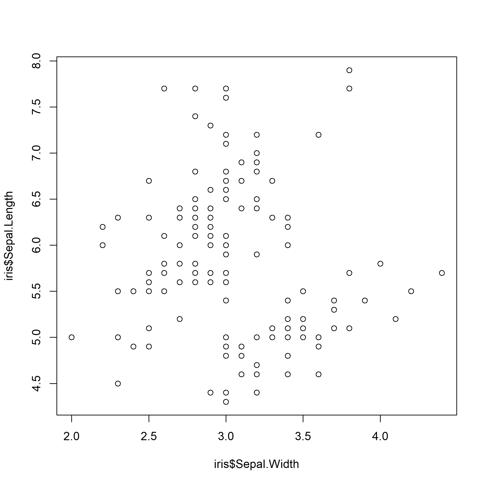

<insertHTML:[columns.html]

Data Visualization
========================================================
date: November 5, 2017
author: Marcus W Beck
autosize: true
css: frm.css
transition: none


Lesson outline
========================================================
* Simple plots with base R
* `ggplot2`: introduction
* `ggplot2`: scatterplots
* `ggplot2`: barchart
* `ggplot2`: customizing 
* Other cool stuff

Motivation
========================================================
* You can make some really cool graphs in R

<div align='center'>

</div>

Motivation
========================================================
* You can make some really cool graphs in R

<div align='center'>

</div>

Motivation
========================================================
* You can make some really cool graphs in R

<div align='center'>

</div>

Motivation
========================================================
* You can make some really cool graphs in R

3d and interactive: 
https://blog.plot.ly/post/101360048217/7-plotly-graphs-in-3d-stocks-cats-and-lakes

A CERF example:
https://fawda123.github.io/ADOSR/depth_ex

Simple plots with base R
========================================================
* Base graphics in R (i.e, those that come with the software) can do most anything for you
* But they're kind of ugly in the default format (bad for pubs)
* Customization is tedious...
* Easy to use for quick, exploratory plots

Simple plots with base R
========================================================
* The scatterplot can be created with one line... `plot(y ~ x, data)`

```r
data(iris)
plot(Sepal.Length ~ Sepal.Width, data = iris)
```


Simple plots with base R
========================================================
* The scatterplot can be created with one line... `plot(data$x, data$y)`

```r
plot(iris$Sepal.Width, iris$Sepal.Length)
```



`ggplot2`: overview
========================================================
ex

`ggplot2`: scatterplots
========================================================
ex

`ggplot2`: barchart
========================================================
ex

`ggplot2`: customizing
========================================================
ex

Other cool stuff
========================================================
ex

Sources of help
========================================================
ex
