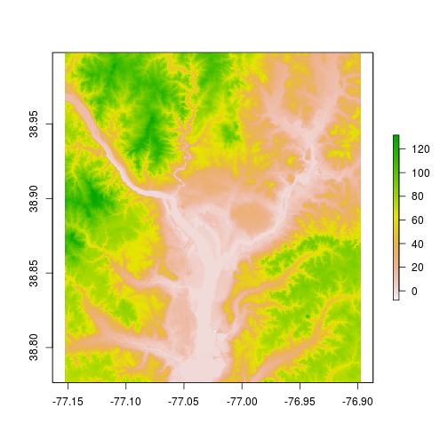

# Reading and Writing Raster and Vector Data
So, now that we have the base packages installed and loaded we can work on getting our data into and out of R.  While it is possible to store spatial data as R objects (e.g. via .Rda/Rdata files) that is probably not the best approach.  It is better to store spatial data in widely used files (e.g. shapefiles,.tiff, or geojson) or in spatial databases (e.g. file geodatabse or PostGIS) and then read that data into R for analysis then write the results back out to your file format of choice.  In this lesson we will explore several ways to read and write multiple vector and raster data types.

## Lesson Outline
- [Vector data: shapefiles](#vector-data-shapefiles)
- [Vector data: geojson](#vector-data-geojson)
- [Vector data: Other](#vector-data-other)
- [Raster data: GeoTIFF](#raster-data-geotiff)
- [Raster data: ASCII](#raster-data-arcinfo-ascii)
- [Writing rasters](#writing-rasters)
- [Geospatial data packages](#geospatial-data-packages)

## Lesson Exercises
- [Exercise 2.0](#exercise-20)
- [Exercise 2.1](#exercise-21)
- [Exercise 2.2](#exercise-22)

## Before we start: Workflow with RStudio
I am a bit of a stickler on workflow.  If you standardize that part of your analysis, then it frees up valuable brain cells for other more interesting tasks.  For the rest of the workshop our workflow will follow these rules:

- We will work in an RStudio Project
- Our data will be stored in the project in a `data` folder
- All of our analysis and examples will be scripted and live in a `scripts` folder
- We will manage our paths with the fantastic [`here` package](https://cran.r-project.org/package=here).
- This last one really isn't a part of the workflow, but it fit here.  The script I am working on will be updated and on the web at:
    - AM: <https://github.com/jhollist/rspatial_workshop_am/blob/master/scripts/workshop_code.R>.
    - PM: <https://github.com/jhollist/rspatial_workshop_pm/blob/master/scripts/workshop_code.R>

## Exercise 2.0
We will work through this together.

1. Create a new RStudio project and name it `rspatial_workshop_am` or `rspatial_workshop_pm` depending on the time!
2. In your project create a `data` folder.
3. In your project create a `scripts` folder.
4. Create a new script, save it to your `scripts` folder and call it `workshop_code.R`
5. In the `workshop_code.R` add the following and save:


```r
# Packages
library(here)
library(sf)
library(raster)
library(dplyr)
```

## Get the example data
For this workshop, I have collected several example datasets to use and have included them in this repository.  So, let's first grab the dataset.  It is stored as a zip file.  You can download it [directly from this link](https://github.com/usepa/rspatial_workshop/blob/master/data/data.zip?raw=true), or we could use R.  I prefer to use the `httr` package because base `download.file` can act funny on different platforms.  We will save it to our `data` folder. 


```r
library(httr)
url <- "https://github.com/usepa/rspatial_workshop/blob/master/data/data.zip?raw=true"
GET(url, write_disk(here("data/data.zip"), overwrite = TRUE))
```

Oh and while we are being a bit #rstats crazy...  Let unzip it with R too!


```r
unzip(here("data/data.zip"), exdir = here("data"), overwrite = TRUE)
```


## Vector data: shapefiles
For many, shapefiles are going to be the most common way to interact with spatial data.  With `sf`, reading in in shapefiles is straightforward via the `st_read()` function.


```r
dc_metro <- st_read("data/Metro_Lines.shp")
```

```
## Cannot open data source data/Metro_Lines.shp
```

```
## Error in CPL_read_ogr(dsn, layer, as.character(options), quiet, type, : Open failed.
```

We will get more into working with `sf` object and visualizing spatial data later, but just to prove that this did something:


```r
dc_metro
```

```
## Simple feature collection with 8 features and 4 fields
## geometry type:  MULTILINESTRING
## dimension:      XY
## bbox:           xmin: -77.08576 ymin: 38.83827 xmax: -76.91327 ymax: 38.97984
## epsg (SRID):    4326
## proj4string:    +proj=longlat +datum=WGS84 +no_defs
##      GIS_ID            NAME                            WEB_URL OBJECTID
## 1 Metro_004             red http://wmata.com/rail/maps/map.cfm        1
## 2 Metro_005          yellow http://wmata.com/rail/maps/map.cfm        2
## 3 Metro_003          orange http://wmata.com/rail/maps/map.cfm        3
## 4 Metro_002           green http://wmata.com/rail/maps/map.cfm        4
## 5 Metro_002 yellow - rush + http://wmata.com/rail/maps/map.cfm        5
## 6 Metro_001            blue http://wmata.com/rail/maps/map.cfm        6
## 7 Metro_001 orange - rush + http://wmata.com/rail/maps/map.cfm        7
## 8 Metro_006          silver http://wmata.com/rail/maps/map.cfm        8
##                         geometry
## 1 MULTILINESTRING((-77.020294...
## 2 MULTILINESTRING((-77.041576...
## 3 MULTILINESTRING((-77.068482...
## 4 MULTILINESTRING((-76.985022...
## 5 MULTILINESTRING((-76.985024...
## 6 MULTILINESTRING((-77.068428...
## 7 MULTILINESTRING((-76.952228...
## 8 MULTILINESTRING((-77.047123...
```

```r
plot(dc_metro)
```


The spatial data types that `sf` recognizes follow the general concept of points, lines and polygons.  You can see for this that the Metro Lines are read in as a MUTLILINESTRING.  Details on these are beyond what we can cover in this short workshop, but the `sf` documentation does a good job, in particular the [Simple Features in R vignette](https://r-spatial.github.io/sf/articles/sf1.html).

### Writing shapefiles

Writing shapefiles is just as easy as reading them, assuming you have an `sf` object to work with.  We will just show this using `st_write`.

Before we do this, we can prove that the shapefile doesn't exist.


```r
list.files("data", "dc_metro")
```

```
## character(0)
```

Now to write the shapefile:


```r
st_write(dc_metro, "data/dc_metro.shp")
```

```
## Writing layer `dc_metro' to data source `data/dc_metro.shp' using driver `ESRI Shapefile'
```

```
## Warning in CPL_write_ogr(obj, dsn, layer, driver,
## as.character(dataset_options), : GDAL Error 1: Failed to create file .shp
## file.
```

```
## Warning in CPL_write_ogr(obj, dsn, layer, driver, as.character(dataset_options), : GDAL Error 4: Failed to open Shapefile `data\dc_metro.shp'.
```

```
## Creating layer dc_metro failed.
```

```
## Error in CPL_write_ogr(obj, dsn, layer, driver, as.character(dataset_options), : Layer creation failed.
```

```r
# Is it there?
list.files("data", "dc_metro")
```

```
## character(0)
```

## Vector data: geojson

Last vector example we will show is geojson.  For most desktop GIS users this will not be encountered too often, but as more and more GIS moves to the web, geojson will become increasingly common.  We will still rely on `st_read()` for the geojson.

### Reading in geojson

To read in with `rgdal` we use "dsn" and "layer" a bit differently.  The "dsn" is the name (and path) of the file, and "layer" is going to be set as "OGRGeoJSON". 


```r
dc_metro_sttn <- st_read("data/metrostations.geojson")
```

```
## Cannot open data source data/metrostations.geojson
```

```
## Error in CPL_read_ogr(dsn, layer, as.character(options), quiet, type, : Open failed.
```

And to see that something is there...
 

```r
# Let's use the defualt print method
dc_metro_sttn
```

```
## Simple feature collection with 40 features and 10 fields
## geometry type:  POINT
## dimension:      XY
## bbox:           xmin: -77.085 ymin: 38.84567 xmax: -76.93526 ymax: 38.97609
## epsg (SRID):    4326
## proj4string:    +proj=longlat +datum=WGS84 +no_defs
##    OBJECTID   GIS_ID                                         NAME
## 1         1 mstn_007                             Columbia Heights
## 2         2 mstn_020                         Georgia Ave Petworth
## 3         3 mstn_034                                       Takoma
## 4         4 mstn_004                                Brookland-CUA
## 5         5 mstn_017                                  Fort Totten
## 6         6 mstn_003                                 Benning Road
## 7         7 mstn_009                                     Deanwood
## 8         8 mstn_028                           NoMa - Gallaudet U
## 9         9 mstn_035                                Tenleytown-AU
## 10       10 mstn_018                           Friendship Heights
## 11       11 mstn_016                             Foggy Bottom-GWU
## 12       12 mstn_013                                Farragut West
## 13       13 mstn_012                               Farragut North
## 14       14 mstn_010                                Dupont Circle
## 15       15 mstn_040                Woodley Park-Zoo Adams Morgan
## 16       16 mstn_022                                LEnfant Plaza
## 17       17 mstn_032                                  Smithsonian
## 18       18 mstn_015                             Federal Triangle
## 19       19 mstn_002                           Archives-Navy Meml
## 20       20 mstn_039                                   Waterfront
## 21       21 mstn_027                         Navy Yard - Ballpark
## 22       22 mstn_014                            Federal Center SW
## 23       23 mstn_021                                 Judiciary Sq
## 24       24 mstn_005                                Capitol South
## 25       25 mstn_023                                 McPherson Sq
## 26       26 mstn_024                                 Metro Center
## 27       27 mstn_019                         Gallery Pl-Chinatown
## 28       28 mstn_026      Mt Vernon Sq - 7th St Convention Center
## 29       29 mstn_036 U St/African-Amer Civil War Memorial/Cardozo
## 30       30 mstn_031                             Shaw-Howard Univ
## 31       31 mstn_037                                Union Station
## 32       32 mstn_008                             Congress Heights
## 33       33 mstn_001                                    Anacostia
## 34       34 mstn_011                               Eastern Market
## 35       35 mstn_029                                  Potomac Ave
## 36       36 mstn_033                               Stadium Armory
## 37       37 mstn_030                             Rhode Island Ave
## 38       38 mstn_025                                Minnesota Ave
## 39       39 mstn_038                                 Van Ness-UDC
## 40       40 mstn_006                               Cleveland Park
##                                                    WEB_URL
## 1   http://wmata.com/rail/station_detail.cfm?station_id=75
## 2   http://wmata.com/rail/station_detail.cfm?station_id=76
## 3   http://wmata.com/rail/station_detail.cfm?station_id=29
## 4   http://wmata.com/rail/station_detail.cfm?station_id=27
## 5   http://wmata.com/rail/station_detail.cfm?station_id=28
## 6   http://wmata.com/rail/station_detail.cfm?station_id=90
## 7   http://wmata.com/rail/station_detail.cfm?station_id=65
## 8  http://wmata.com/rail/station_detail.cfm?station_id=108
## 9   http://wmata.com/rail/station_detail.cfm?station_id=10
## 10  http://wmata.com/rail/station_detail.cfm?station_id=11
## 11  http://wmata.com/rail/station_detail.cfm?station_id=40
## 12  http://wmata.com/rail/station_detail.cfm?station_id=38
## 13   http://wmata.com/rail/station_detail.cfm?station_id=4
## 14   http://wmata.com/rail/station_detail.cfm?station_id=6
## 15   http://wmata.com/rail/station_detail.cfm?station_id=7
## 16  http://wmata.com/rail/station_detail.cfm?station_id=82
## 17  http://wmata.com/rail/station_detail.cfm?station_id=54
## 18  http://wmata.com/rail/station_detail.cfm?station_id=53
## 19  http://wmata.com/rail/station_detail.cfm?station_id=81
## 20  http://wmata.com/rail/station_detail.cfm?station_id=83
## 21  http://wmata.com/rail/station_detail.cfm?station_id=84
## 22  http://wmata.com/rail/station_detail.cfm?station_id=58
## 23  http://wmata.com/rail/station_detail.cfm?station_id=23
## 24  http://wmata.com/rail/station_detail.cfm?station_id=59
## 25  http://wmata.com/rail/station_detail.cfm?station_id=36
## 26   http://wmata.com/rail/station_detail.cfm?station_id=1
## 27  http://wmata.com/rail/station_detail.cfm?station_id=21
## 28  http://wmata.com/rail/station_detail.cfm?station_id=70
## 29  http://wmata.com/rail/station_detail.cfm?station_id=73
## 30  http://wmata.com/rail/station_detail.cfm?station_id=72
## 31  http://wmata.com/rail/station_detail.cfm?station_id=25
## 32  http://wmata.com/rail/station_detail.cfm?station_id=86
## 33  http://wmata.com/rail/station_detail.cfm?station_id=85
## 34  http://wmata.com/rail/station_detail.cfm?station_id=60
## 35  http://wmata.com/rail/station_detail.cfm?station_id=61
## 36  http://wmata.com/rail/station_detail.cfm?station_id=63
## 37  http://wmata.com/rail/station_detail.cfm?station_id=26
## 38  http://wmata.com/rail/station_detail.cfm?station_id=64
## 39   http://wmata.com/rail/station_detail.cfm?station_id=9
## 40   http://wmata.com/rail/station_detail.cfm?station_id=8
##                             LINE                     ADDRESS X.x
## 1                  green, yellow         3030 14TH STREET NW  17
## 2                  green, yellow      3700 GEORGIA AVENUE NW  NA
## 3                            red         327 CEDAR STREET NW  72
## 4                            red      801 MICHIGAN AVENUE NE  NA
## 5             red, green, yellow      550 GALLOWAY STREET NE  33
## 6           blue, orange, silver        4500 BENNING ROAD NE   6
## 7                         orange    4720 MINNESOTA AVENUE NE  21
## 8                            red       200 FLORIDA AVENUE NE  NA
## 9                            red    4501 WISCONSIN AVENUE NW  73
## 10                           red    5337 WISCONSIN AVENUE NW  35
## 11          blue, orange, silver            2301 I STREET NW  NA
## 12          blue, orange, silver          900 18TH STREET NW  28
## 13                           red  1001 CONNECTICUT AVENUE NW  27
## 14                           red         1525 20TH STREET NW  23
## 15                           red         2700 24TH STREET NW  NA
## 16 grn, yllw, orange, blue, slvr      600 MARYLAND AVENUE SW  NA
## 17          blue, orange, silver 1200 INDEPENDENCE AVENUE SW  68
## 18          blue, orange, silver          302 12TH STREET NW  30
## 19                 green, yellow  701 PENNSYLVANIA AVENUE NW  NA
## 20                         green             399 M STREET SW  81
## 21                         green             200 M STREET SE  NA
## 22          orange, blue, silver           401 3RD STREET SW  29
## 23                           red             450 F STREET NW  NA
## 24          blue, orange, silver           355 1ST STREET SE  12
## 25          blue, orange, silver            1400 I STREET NW  NA
## 26     red, blue, orange, silver          607 13TH STREET NW  49
## 27            red, green, yellow             630 H STREET NW  NA
## 28                 green, yellow             700 M STREET NW  NA
## 29                 green, yellow            1300 U STREET NW  NA
## 30                 green, yellow          1701 8TH STREET NW  NA
## 31                           red           701 1ST STREET NE  76
## 32                         green      1290 ALABAMA AVENUE SE  18
## 33                         green         1101 HOWARD ROAD SE   2
## 34          blue, orange, silver  701 PENNSYLVANIA AVENUE SE  25
## 35          blue, orange, silver          700 14TH STREET SE  NA
## 36          blue, orange, silver          192 19TH STREET SE  NA
## 37                           red  919 RHODE ISLAND AVENUE NE  NA
## 38                        orange     400 MINNESOTA AVENUE NE  NA
## 39                           red  4200 CONNECTICUT AVENUE NW  78
## 40                           red  3599 CONNECTICUT AVENUE NW  15
##    avg_wkday.x X.y avg_wkday.y                       geometry
## 1      12608.3  17     12608.3 POINT(-77.0325544130882 38....
## 2           NA  NA          NA POINT(-77.0234631972137 38....
## 3       6023.5  72      6023.5 POINT(-77.0181789925646 38....
## 4           NA  NA          NA POINT(-76.9945365689642 38....
## 5       7442.0  33      7442.0 POINT(-77.002205364201 38.9...
## 6       3067.2   6      3067.2 POINT(-76.9383671319143 38....
## 7       1761.2  21      1761.2 POINT(-76.9352590469192 38....
## 8           NA  NA          NA POINT(-77.0030227321829 38....
## 9       7101.2  73      7101.2 POINT(-77.0795896368441 38....
## 10      9519.0  35      9519.0 POINT(-77.084998118688 38.9...
## 11          NA  NA          NA POINT(-77.0502800382973 38....
## 12     22365.4  28     22365.4 POINT(-77.0406977114452 38....
## 13     26012.4  27     26012.4 POINT(-77.0397031233431 38....
## 14     18291.8  23     18291.8 POINT(-77.0434166573705 38....
## 15          NA  NA          NA POINT(-77.0524203221932 38....
## 16          NA  NA          NA POINT(-77.0219107735302 38....
## 17     11671.6  68     11671.6 POINT(-77.0280685258322 38....
## 18      9703.1  30      9703.1 POINT(-77.0281342902871 38....
## 19          NA  NA          NA POINT(-77.0219166779746 38....
## 20      4440.0  81      4440.0 POINT(-77.0175074963564 38....
## 21          NA  NA          NA POINT(-77.0050879350566 38....
## 22      6352.1  29      6352.1 POINT(-77.0158705045136 38....
## 23          NA  NA          NA POINT(-77.0166412451066 38....
## 24      8630.3  12      8630.3 POINT(-77.0051417041544 38....
## 25          NA  NA          NA POINT(-77.033636466218 38.9...
## 26     28199.5  49     28199.5 POINT(-77.0280802893592 38....
## 27          NA  NA          NA POINT(-77.0219176806835 38....
## 28          NA  NA          NA POINT(-77.0219166711418 38....
## 29          NA  NA          NA POINT(-77.027498186088 38.9...
## 30          NA  NA          NA POINT(-77.0219139919702 38....
## 31     32611.1  76     32611.1 POINT(-77.0074165779102 38....
## 32      2912.2  18      2912.2 POINT(-76.9885142092577 38....
## 33      7356.4   2      7356.4 POINT(-76.9953730185932 38....
## 34      6038.7  25      6038.7 POINT(-76.996003408071 38.8...
## 35          NA  NA          NA POINT(-76.9854975975333 38....
## 36          NA  NA          NA POINT(-76.9770911770343 38....
## 37          NA  NA          NA POINT(-76.9959392002222 38....
## 38          NA  NA          NA POINT(-76.946750000542 38.8...
## 39      6624.4  78      6624.4 POINT(-77.0629884863183 38....
## 40      4637.5  15      4637.5 POINT(-77.0580448228721 38....
```

### Writing geojson

Just as with shapefiles, writing to a geojson file can be accomplished with `st_write()`.


```r
st_write(dc_metro_sttn, "data/stations.geojson")
```

## Vector data: Other

We have barely touched the surface on the types of vector data formats that can be read in via `st_read()`.  The full list is available via <http://www.gdal.org/ogr_formats.html>.  With the defaults we can read File Geodatabase, PostGIS, GeoPackage, Arc Export files ...

In short, if you have it, we can probably read it, but for todays short workshop that is a bit beyond the scope.

## Exercise 2.1
For this first exercise we will just focus on getting a shapefile read into R.  We will be using the sticky notes I handed out to let me know who needs help and who has finished the exercise.  Once everyone is done, we will move on.

1. Using `st_read()`, read in the US Census Tiger Line Files of the state boundaries (tl_2015_us_state).  Assign it to an object called `us_states`.
2. Once it is read in use `summary` to look at some of the basics and then plot the data. 

## Raster data: GeoTIFF
We will now use the `raster` packages `raster()` function to read in some raster files.  Our first examples will be GeoTIFF.

Using `raster()` is just as easy as `st_read()`


```r
dc_elev <- raster("data/dc_ned.tif")
```

```
## Error in .rasterObjectFromFile(x, band = band, objecttype = "RasterLayer", : Cannot create a RasterLayer object from this file. (file does not exist)
```

```r
dc_elev
```

```
## class       : RasterLayer 
## dimensions  : 798, 921, 734958  (nrow, ncol, ncell)
## resolution  : 0.0002777778, 0.0002777778  (x, y)
## extent      : -77.15306, -76.89722, 38.77639, 38.99806  (xmin, xmax, ymin, ymax)
## coord. ref. : +proj=longlat +datum=NAD83 +no_defs +ellps=GRS80 +towgs84=0,0,0 
## data source : C:\data\rspatial_workshop\data\dc_ned.tif 
## names       : dc_ned 
## values      : -5.316066, 131.4813  (min, max)
```

```r
plot(dc_elev)
```



One thing to note is that, by default, `raster` actually leaves the data on disk as opposed to pulling it all into memory (like most things do in R). This allows us to work with rasters that are significantly larger than are available memory.  Only downside is that if we want to use other R functions on really big rasters we might have some issues.  Anyway, `raster` is best available (and is pretty good) method for working with rasters in R.  That is changing as other options are in development, most notably [the `stars` package](https://github.com/r-spatial/stars).

## Writing rasters:
Writing out to a raster file is done with `writeRaster`.  It has three arguments, "x" which is the `raster` object, "filename" which is the output file, and "format" which is the output raster format.  In practice, you can usually get away with not specifying the format as `raster` will try to infer the file format from the file name.  If you want to see the possible formats you can use `writeFormats()`.

To write out to a GeoTIFF:


```r
writeRaster(dc_elev, "dc_elev_example.tif", overwrite = T)
```

## Exercise 2.2
For this exercise let's get some practice with reading in raster data using the `raster` function.

1. Read in "dc_nlcd.tif". Assign it to an object names `dc_nlcd`.
2. Plot the object to make sure everything is working well.


## Geospatial data packages
There are a few packages on CRAN that provide access to spatial data. While this isn't necessarily data I/O, it is somewhat related.  We won't go into details as the intreface and data types for these are unique to the packages and a bit different than the more generic approach we are working on here.  That being said, these are useful and you should be aware of them.

A couple of interesting examples.

- [`censusapi`](https://cran.r-project.org/package=censusapi): This package provides a wrapper the API provided by the US Census Bureau.  Anything that is made available from that (e.g. decennial, ACS, etc.) can be accessed from this package.
- [`tidycensus`](https://cran.r-project.org/package=tidycensus): Provides a user-friendly interface and data format for accessing Census data.
- [`elevatr`](https://cran.r-project.org/package=elevatr): (WARNING: Horn Tooting Ahead) This package wraps several elevation API's that return either point elevation data as and `sp` object (`sf` support to come soon-ish) or a `raster` DEM for a given area, usually specified by the bounding box of an input `sp` object (ditto `sf` support).

