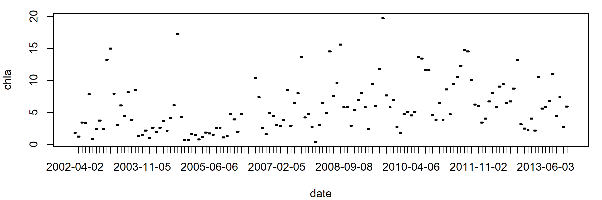

<insertHTML:[columns.html]

Analysis of Time Series Data Using R
========================================================
date: November 5, 2017
author: Marcus W Beck
autosize: true
css: frm.css
transition: none
width: 960
height: 700


========================================================
<div align='center'>

</div>

========================================================
<div align='center'>

</div>

========================================================
<div align='center'>

</div>

Lesson outline
========================================================
* Properties of time series
* Types of WQ/estuarine time series
* Exploratory analysis
* Quick QAQC 
* Formal trend tests


What is a time series
========================================================
* As Hagrid says, anything with a time stamp
* Otherwise, it's a steady state dataset
* In theory, all data sets are time series
* Time series analysis considers observation **order** as a defining factor

What is a time series
========================================================
**Observations indexed and ordered by a time stamp**, they come in many shapes and sizes


What is a time series
========================================================
**Observations indexed and ordered by a time stamp**, they can be composed of parts (real or artificial)


What is a time series
========================================================
**Observations indexed and ordered by a time stamp**, they can be multivariate


What is a time series
========================================================
**Observations indexed and ordered by a time stamp**, they can be multivariate


Properties of time series
========================================================
incremental: true

Assumptions for basic parametric models:
* Residuals are individually normally distributed
* Constant variance or homogeneity (i.e., even spread of residuals)
* Explanatory variables are deterministic
* Independence of observations or no pattern in residuals

Properties of time series
========================================================
Assumptions for basic parametric models:

```r
x <- rnorm(100)
y <- x + rnorm(100)
par(mfrow = c(1, 3))
plot(x); plot(y)
plot(y ~ x)
abline(reg = lm(y ~ x))
```


Properties of time series
========================================================
Assumptions for basic parametric models:

```r
par(mfrow = c(2, 2))
mod1 <- lm(y ~ x)
plot(mod1)
```


Properties of time series
========================================================
Assumptions for basic parametric models:

```r
x <- cumsum(x)
y <- cumsum(y)
par(mfrow = c(1, 3))
plot(x); plot(y)
plot(y ~ x)
abline(reg = lm(y ~ x))
```


Properties of time series
========================================================
Assumptions for basic parametric models:

```r
mod2 <- lm(y ~ x)
par(mfrow = c(2, 2))
plot(mod2)
```


Properties of time series
========================================================
Assumptions for basic parametric models:

```r
par(mfrow = c(1, 2))
acf(resid(mod1))
acf(resid(mod2))
```


Properties of time series
========================================================
incremental: true

* Time series violate the common assumption that observations are independent
* Time is a 'nuisance' variable that must be accounted for
* Time has interesting properties that can be leveraged for analysis
* The structure of time series also represents analysis overhead

Exercise 1: A gentle introduction
========================================================
incremental: true

1) Load the datasets `sapdc` and `apacp`

2) What are the variables?

3) What is the time range?

4) What is the time step?

5) Bonus: plot a time series

Exercise 1: A gentle introduction
========================================================
1) Load the datasets `sapdc` and `apacp`

https://USEPA.github.io/cerf_r/lessons/data/sapdc.RData

https://USEPA.github.io/cerf_r/lessons/data/apacp.RData

```r
load('data/sapdc.RData')
load('data/apacp.RData')
```
2) what are the variables?

3) What is the time range?

4) What is the time step?

5) Bonus: plot a time series

Exercise 1: A gentle introduction
========================================================

```r
head(sapdc)
```

```
        DateTimeStamp Temp  Sal DO_obs ATemp   BP WSpd      Tide
1 2012-01-01 00:00:00 14.9 33.3    5.0  11.9 1022  0.5 0.8914295
2 2012-01-01 00:30:00 14.9 33.4    5.5  11.3 1022  0.6 1.0011830
3 2012-01-01 01:00:00 14.9 33.4    5.9   9.9 1021  0.6 1.0728098
4 2012-01-01 01:30:00 14.8 33.3    6.4  10.0 1022  2.4 1.1110885
5 2012-01-01 02:00:00 14.7 33.2    6.6  11.4 1022  1.3 1.1251628
6 2012-01-01 02:30:00 14.7 33.3    6.1  10.7 1021  0.0 1.1223799
```

```r
head(apacp)
```

```
        date    po4   nh4   no2   no3   no23 chla
1 2002-04-02 0.0040 0.028 0.002 0.047 0.0490 1.80
2 2002-04-30 0.0140 0.138 0.005 0.115 0.1200 1.20
3 2002-06-04 0.0060 0.049 0.002 0.024 0.0260 3.40
4 2002-07-02 0.0155 0.088 0.002    NA 0.0395 3.35
5 2002-08-06 0.0110 0.040 0.003 0.036 0.0390 7.80
6 2002-09-10 0.0260 0.039 0.003 0.013 0.0160 0.80
```

Exercise 1: A gentle introduction
========================================================

https://beckmw.shinyapps.io/swmp_comp/

<div align='center'>

</div>

Types of WQ/estuarine time series
========================================================
* discrete monitoring data (e.g., nutrient data)
  * Many large systems have these data
  * Good for trend analysis
  * Typically a monthly time step
  * Detection limits can be an issue
  
  ***
<div align='center'>

</div>

Types of WQ/estuarine time series
========================================================
* continuous sonde data (e.g., dissolved oxygen, tidal height)
  * More common for site-level analysis
  * Time steps can be 'continuous'
  * Good for signal processing
  * Observations are more correlated
  


Exercise 2: A less gentle introduction
========================================================
Now we will import the raw data for apacp, sapdc and format for time series analysis

1) Load the datasets in R

https://usepa.github.io/cerf_r/lessons/data/apacp.txt
https://usepa.github.io/cerf_r/lessons/data/sapdc.txt

2) Format the time series column

Exercise 2: A less gentle introduction
========================================================

1) Load the datasets in R


```r
apacp <- read.table('https://usepa.github.io/cerf_r/lessons/data/apacp.txt', 
                    header = T, sep = ',')
sapdc <- read.table('https://usepa.github.io/cerf_r/lessons/data/sapdc.txt', 
                    header = T, sep = ',')
str(apacp)
```

```
'data.frame':	140 obs. of  7 variables:
 $ date: Factor w/ 140 levels "2002-04-02","2002-04-30",..: 1 2 3 4 5 6 7 8 9 10 ...
 $ po4 : num  0.004 0.014 0.006 0.0155 0.011 0.026 0.0095 0.0065 0.0105 0.014 ...
 $ nh4 : num  0.028 0.138 0.049 0.088 0.04 0.039 0.0365 0.061 0.061 0.237 ...
 $ no2 : num  0.002 0.005 0.002 0.002 0.003 0.003 0.009 0.0055 0.004 0.003 ...
 $ no3 : num  0.047 0.115 0.024 NA 0.036 ...
 $ no23: num  0.049 0.12 0.026 0.0395 0.039 ...
 $ chla: num  1.8 1.2 3.4 3.35 7.8 ...
```

Exercise 2: A less gentle introduction
========================================================
incremental: true

2) Format the time series column

Let's step back a second...

* R recognizes two types of time objects
* The time column must be one of these types (in most cases)
  * **Date** for dates, and **POSIXct** for date/time
* Converting the time column to one of these two objects is half the battle  

Exercise 2: A less gentle introduction
========================================================
Why can't we use the text format of the date?


```r
plot(chla ~ date, apacp)
```



Many analyses require a formatted date or date/time object, much easier to manipulate

Exercise 2: A less gentle introduction
========================================================
Time can be specified many different ways:

11/5/17

5/11/17

Nov. 5, 2017

11-5-2017

11/5/17 1:30

11-5-2017 01:30:00

The [lubridate](https://github.com/tidyverse/lubridate) package is your friend

Exercise 2: A less gentle introduction
========================================================

The [lubridate](https://github.com/tidyverse/lubridate) package is your friend

We'll start with **Date** conversions because they are simpler:
* ymd, ydm, mdy, myd, dmy, dym, yq


Exercise 2: A less gentle introduction
========================================================

The [lubridate](https://github.com/tidyverse/lubridate) package is your friend

We'll start with date conversions because they are simpler:


```r
library(lubridate)
apacp$date <- ymd(apacp$date)
class(apacp$date)
```

```
[1] "Date"
```

```r
plot(chla ~ date, apacp)
```


Exercise 2: A less gentle introduction
========================================================

**POSIXct** objects are more complicated
* Includes a date and time component
* Usually have to consider the timezone

Any of these functions will work:
* ymd_hms, ymd_hm, ymd_h, dmy_hms, dmy_hm, dmy_h, mdy_hms, mdy_hm, mdy_h, ydm_hms, ydm_hm, ydm_h

Exercise 2: A less gentle introduction
========================================================
incremental: true


```r
head(sapdc)
```

```
        DateTimeStamp Temp  Sal DO_obs ATemp   BP WSpd      Tide
1 2012-01-01 00:00:00 14.9 33.3    5.0  11.9 1022  0.5 0.8914295
2 2012-01-01 00:30:00 14.9 33.4    5.5  11.3 1022  0.6 1.0011830
3 2012-01-01 01:00:00 14.9 33.4    5.9   9.9 1021  0.6 1.0728098
4 2012-01-01 01:30:00 14.8 33.3    6.4  10.0 1022  2.4 1.1110885
5 2012-01-01 02:00:00 14.7 33.2    6.6  11.4 1022  1.3 1.1251628
6 2012-01-01 02:30:00 14.7 33.3    6.1  10.7 1021  0.0 1.1223799
```

```r
sapdc$DateTimeStamp <- ymd_hms(sapdc$DateTimeStamp)
class(sapdc$DateTimeStamp)
```

```
[1] "POSIXct" "POSIXt" 
```

Exercise 2: A less gentle introduction
========================================================

The time zone must also be specified, otherwise it defaults to Zulu time or your computer's time

```r
tz(sapdc$DateTimeStamp)
```

```
[1] "UTC"
```
* R does not have a predefined list of time zones
* R uses the operating system's time zones
* Most computers recognize [Olson names](http://en.wikipedia.org/wiki/List_of_tz_database_time_zones), "Country/City" format
* Important for comparing data, may shift sooner/later if not specified

Exercise 2: A less gentle introduction
========================================================
* Sapelo Island is on the Atlantic Coast in Georgia
* Time stamps in NERRS data do not observe DST

```r
sapdc$DateTimeStamp <- ymd_hms(sapdc$DateTimeStamp, tz = 'America/Jamaica')
```


Exploratory analysis
========================================================
Basic plots (use lubridate for conditional plots), decomposition plots, acf

QAQC screening
========================================================
complete cases? 
censored data?
bogus data?
missing observations (omit? impute?)

Formal trend analysis methods
========================================================
Kendall tests

Exercises
========================================================
exercise

<!-- put this in the last slide -- use jquery to append page # to all sections -->

<script src="https://ajax.googleapis.com/ajax/libs/jquery/3.1.1/jquery.min.js"></script>
<script>

for(i=0;i<$("section").length;i++) {
if(i==0) continue
$("section").eq(i).append("<p style='font-size:medium;position:fixed;left:10px;bottom:10px;'>" + i + "</p>")
}

</script>
