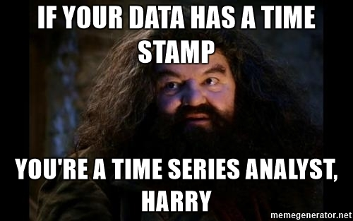
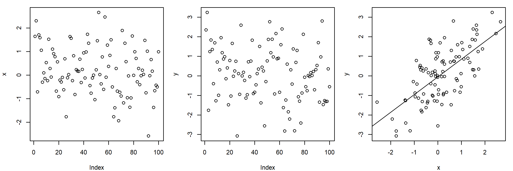
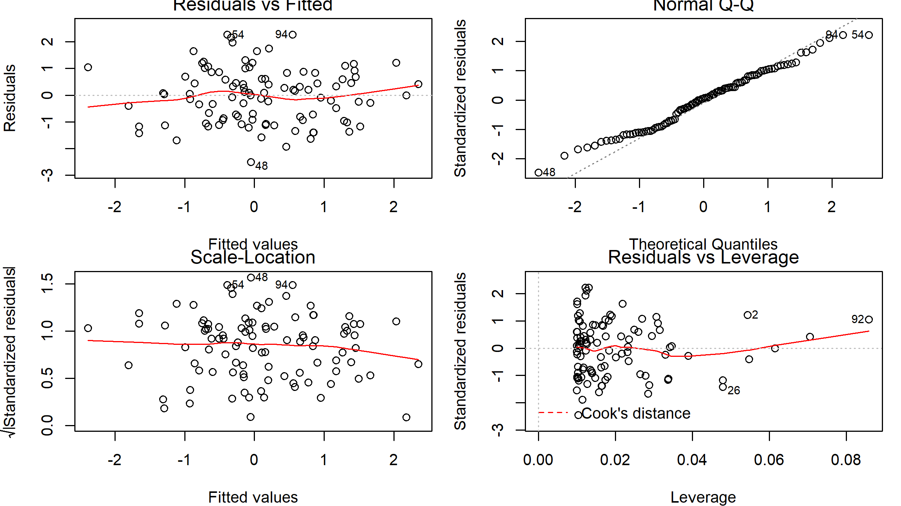
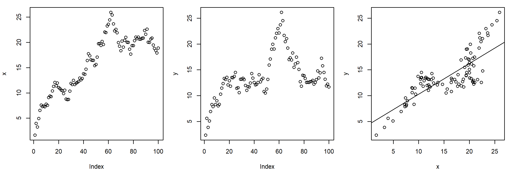
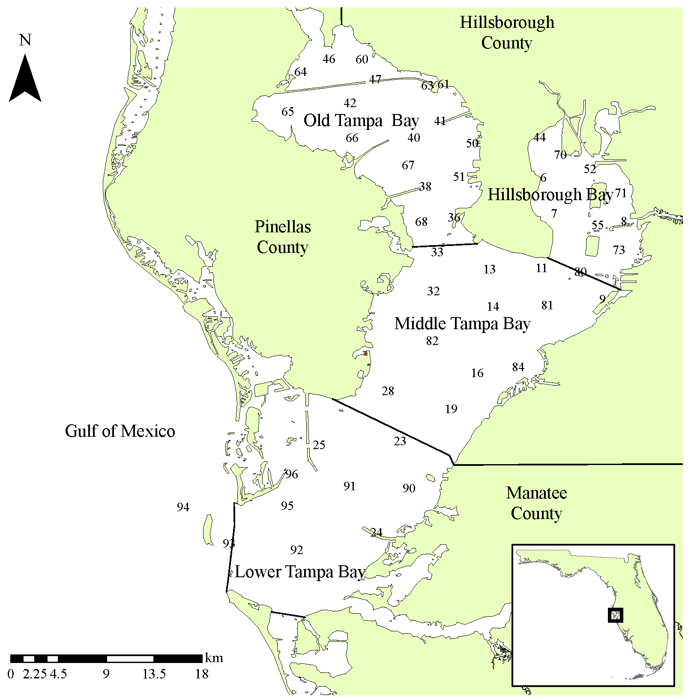
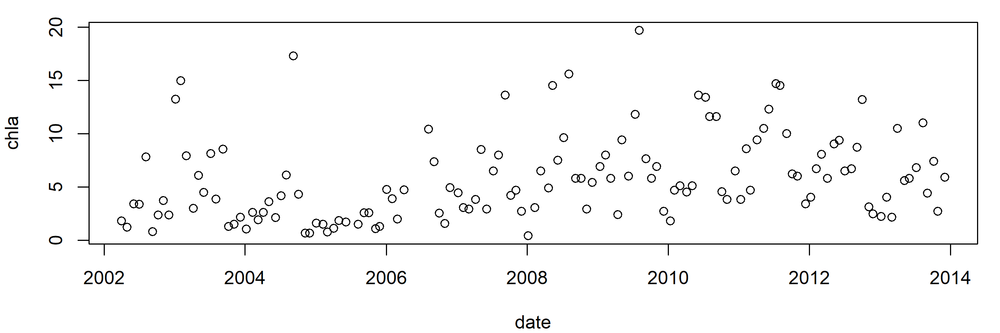
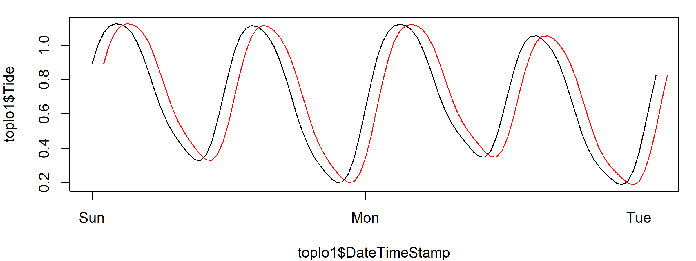
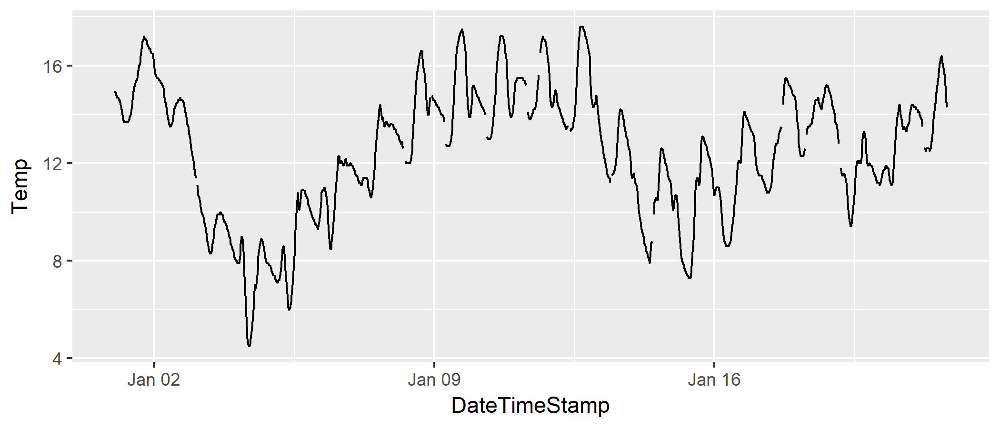
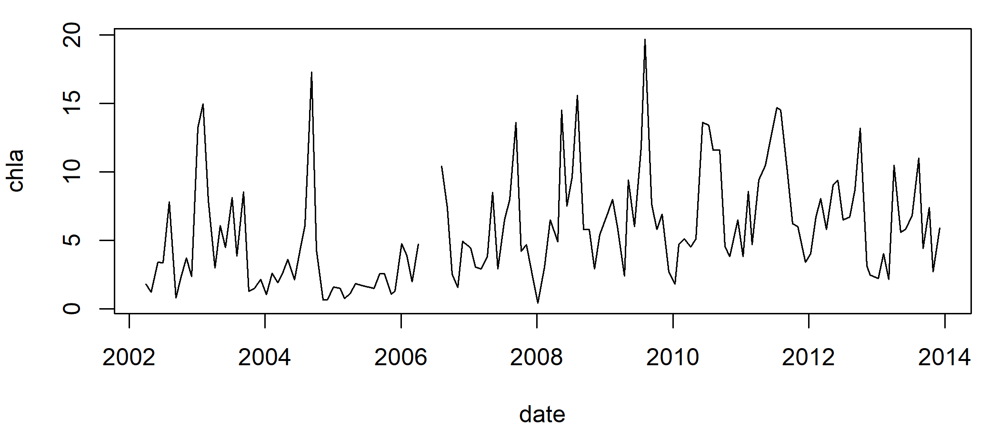

<insertHTML:[columns.html]

Analysis of Time Series Data Using R
========================================================
date: November 5, 2017
author: Marcus W Beck
autosize: true
css: frm.css
transition: none
width: 960
height: 700


========================================================
<div align='center'>

</div>

========================================================
<div align='center'>

</div>

========================================================
<div align='center'>

</div>

Lesson outline
========================================================
* Properties of time series
* Types of WQ/estuarine time series
* Exploratory analysis
* Quick QAQC 
* Formal trend tests


What is a time series
========================================================
* As Hagrid says, anything with a time stamp
* Otherwise, it's a steady state dataset
* In theory, all data sets are time series
* Time series analysis considers observation **order** as a defining factor

What is a time series
========================================================
**Observations indexed and ordered by a time stamp**, they come in many shapes and sizes


What is a time series
========================================================
**Observations indexed and ordered by a time stamp**, they can be composed of parts (real or artificial)


What is a time series
========================================================
**Observations indexed and ordered by a time stamp**, they can be multivariate


What is a time series
========================================================
**Observations indexed and ordered by a time stamp**, they can be multivariate


Properties of time series
========================================================
incremental: true

Assumptions for basic parametric models:
* Residuals are individually normally distributed
* Constant variance or homogeneity (i.e., even spread of residuals)
* Explanatory variables are deterministic
* Independence of observations or no pattern in residuals

Properties of time series
========================================================
Assumptions for basic parametric models:

```r
x <- rnorm(100)
y <- x + rnorm(100)
par(mfrow = c(1, 3))
plot(x); plot(y)
plot(y ~ x)
abline(reg = lm(y ~ x))
```



Properties of time series
========================================================
Assumptions for basic parametric models:

```r
par(mfrow = c(2, 2))
mod1 <- lm(y ~ x)
plot(mod1)
```



Properties of time series
========================================================
Assumptions for basic parametric models:

```r
x <- cumsum(x)
y <- cumsum(y)
par(mfrow = c(1, 3))
plot(x); plot(y)
plot(y ~ x)
abline(reg = lm(y ~ x))
```



Properties of time series
========================================================
Assumptions for basic parametric models:

```r
mod2 <- lm(y ~ x)
par(mfrow = c(2, 2))
plot(mod2)
```


Properties of time series
========================================================
Assumptions for basic parametric models:

```r
par(mfrow = c(1, 2))
acf(resid(mod1))
acf(resid(mod2))
```


Properties of time series
========================================================
incremental: true

* Time series violate the common assumption that observations are independent
* Time is a 'nuisance' variable that must be accounted for
* Time has interesting properties that can be leveraged for analysis
* The structure of time series also represents analysis overhead

Exercise 1: A gentle introduction
========================================================
incremental: true

1) Load the datasets `sapdc` and `apacp`

2) What are the variables?

3) What is the time range?

4) What is the time step?

5) Bonus: plot a time series

Exercise 1: A gentle introduction
========================================================
1) Load the datasets `sapdc` and `apacp`

https://USEPA.github.io/cerf_r/lessons/data/sapdc.RData

https://USEPA.github.io/cerf_r/lessons/data/apacp.RData

```r
load('data/sapdc.RData')
load('data/apacp.RData')
```
2) what are the variables?

3) What is the time range?

4) What is the time step?

5) Bonus: plot a time series

Exercise 1: A gentle introduction
========================================================

```r
head(sapdc)
```

```
        DateTimeStamp Temp  Sal DO_obs ATemp   BP WSpd      Tide
1 2012-01-01 00:00:00 14.9 33.3    5.0  11.9 1022  0.5 0.8914295
2 2012-01-01 00:30:00 14.9 33.4    5.5  11.3 1022  0.6 1.0011830
3 2012-01-01 01:00:00 14.9 33.4    5.9   9.9 1021  0.6 1.0728098
4 2012-01-01 01:30:00 14.8 33.3    6.4  10.0 1022  2.4 1.1110885
5 2012-01-01 02:00:00 14.7 33.2    6.6  11.4 1022  1.3 1.1251628
6 2012-01-01 02:30:00 14.7 33.3    6.1  10.7 1021  0.0 1.1223799
```

```r
head(apacp)
```

```
        date    po4   nh4   no2   no3   no23 chla
1 2002-04-02 0.0040 0.028 0.002 0.047 0.0490 1.80
2 2002-04-30 0.0140 0.138 0.005 0.115 0.1200 1.20
3 2002-06-04 0.0060 0.049 0.002 0.024 0.0260 3.40
4 2002-07-02 0.0155 0.088 0.002    NA 0.0395 3.35
5 2002-08-06 0.0110 0.040 0.003 0.036 0.0390 7.80
6 2002-09-10 0.0260 0.039 0.003 0.013 0.0160 0.80
```

Exercise 1: A gentle introduction
========================================================

https://beckmw.shinyapps.io/swmp_comp/

<div align='center'>

</div>

Types of WQ/estuarine time series
========================================================
* discrete monitoring data (e.g., nutrient data)
  * Many large systems have these data
  * Good for trend analysis
  * Typically a monthly time step
  * Detection limits can be an issue
  
  ***
<div align='center'>

</div>

Types of WQ/estuarine time series
========================================================
* continuous sonde data (e.g., dissolved oxygen, tidal height)
  * More common for site-level analysis
  * Time steps can be 'continuous'
  * Good for signal processing
  * Observations are more correlated
  


Exercise 2: A less gentle introduction
========================================================
Now we will import the raw data for apacp, sapdc and format for time series analysis

1) Load the datasets in R

https://usepa.github.io/cerf_r/lessons/data/apacp.txt
https://usepa.github.io/cerf_r/lessons/data/sapdc.txt

2) Format the time series column

Exercise 2: A less gentle introduction
========================================================

1) Load the datasets in R


```r
apacp <- read.table('https://usepa.github.io/cerf_r/lessons/data/apacp.txt', 
                    header = T, sep = ',')
sapdc <- read.table('https://usepa.github.io/cerf_r/lessons/data/sapdc.txt', 
                    header = T, sep = ',')
str(apacp)
```

```
'data.frame':	140 obs. of  7 variables:
 $ date: Factor w/ 140 levels "2002-04-02","2002-04-30",..: 1 2 3 4 5 6 7 8 9 10 ...
 $ po4 : num  0.004 0.014 0.006 0.0155 0.011 0.026 0.0095 0.0065 0.0105 0.014 ...
 $ nh4 : num  0.028 0.138 0.049 0.088 0.04 0.039 0.0365 0.061 0.061 0.237 ...
 $ no2 : num  0.002 0.005 0.002 0.002 0.003 0.003 0.009 0.0055 0.004 0.003 ...
 $ no3 : num  0.047 0.115 0.024 NA 0.036 ...
 $ no23: num  0.049 0.12 0.026 0.0395 0.039 ...
 $ chla: num  1.8 1.2 3.4 3.35 7.8 ...
```

Exercise 2: A less gentle introduction
========================================================
incremental: true

2) Format the time series column

Let's step back a second...

* R recognizes two types of time objects
* The time column must be one of these types (in most cases)
  * **Date** for dates, and **POSIX** for date/time
* Converting the time column to one of these two objects is half the battle  

Exercise 2: A less gentle introduction
========================================================
Why can't we use the text format of the date?


```r
plot(chla ~ date, apacp)
```


Many analyses require a formatted date or date/time object, much easier to manipulate

Exercise 2: A less gentle introduction
========================================================
Time can be specified many different ways:

11/5/17

5/11/17

Nov. 5, 2017

11-5-2017

11/5/17 1:30

11-5-2017 01:30:00

The [lubridate](https://github.com/tidyverse/lubridate) package is your friend

Exercise 2: A less gentle introduction
========================================================

The [lubridate](https://github.com/tidyverse/lubridate) package is your friend

We'll start with **Date** conversions because they are simpler:
* ymd, ydm, mdy, myd, dmy, dym, yq

Exercise 2: A less gentle introduction
========================================================
incremental: true

The [lubridate](https://github.com/tidyverse/lubridate) package is your friend

We'll start with date conversions because they are simpler:


```r
library(lubridate)
apacp$date <- ymd(apacp$date)
class(apacp$date)
```

```
[1] "Date"
```

```r
plot(chla ~ date, apacp)
```



Exercise 2: A less gentle introduction
========================================================
incremental: true

**POSIX** objects are more complicated
* Includes a date and time component
* Usually have to consider the timezone

Any of these functions will work:
* ymd_hms, ymd_hm, ymd_h, dmy_hms, dmy_hm, dmy_h, mdy_hms, mdy_hm, mdy_h, ydm_hms, ydm_hm, ydm_h

Exercise 2: A less gentle introduction
========================================================
incremental: true


```r
head(sapdc)
```

```
        DateTimeStamp Temp  Sal DO_obs ATemp   BP WSpd      Tide
1 2012-01-01 00:00:00 14.9 33.3    5.0  11.9 1022  0.5 0.8914295
2 2012-01-01 00:30:00 14.9 33.4    5.5  11.3 1022  0.6 1.0011830
3 2012-01-01 01:00:00 14.9 33.4    5.9   9.9 1021  0.6 1.0728098
4 2012-01-01 01:30:00 14.8 33.3    6.4  10.0 1022  2.4 1.1110885
5 2012-01-01 02:00:00 14.7 33.2    6.6  11.4 1022  1.3 1.1251628
6 2012-01-01 02:30:00 14.7 33.3    6.1  10.7 1021  0.0 1.1223799
```

```r
sapdc$DateTimeStamp <- ymd_hms(sapdc$DateTimeStamp)
class(sapdc$DateTimeStamp)
```

```
[1] "POSIXct" "POSIXt" 
```

Exercise 2: A less gentle introduction
========================================================
incremental: true

The time zone must also be specified, otherwise it defaults to Zulu time or your computer's time

```r
tz(sapdc$DateTimeStamp)
```

```
[1] "UTC"
```
* R does not have a predefined list of time zones
* R uses the operating system's time zones
* Most computers recognize [Olson names](http://en.wikipedia.org/wiki/List_of_tz_database_time_zones), "Country/City" format
* Important for comparing data, may shift sooner/later if not specified

Exercise 2: A less gentle introduction
========================================================
incremental: true

* Sapelo Island is on the Atlantic Coast of Georgia
* Time stamps in NERRS data do not observe DST

```r
sapdc$DateTimeStamp <- ymd_hms(sapdc$DateTimeStamp, tz = 'America/Jamaica')
class(sapdc$DateTimeStamp)
```

```
[1] "POSIXct" "POSIXt" 
```

```r
tz(sapdc$DateTimeStamp)
```

```
[1] "America/Jamaica"
```

```r
head(sapdc)
```

```
        DateTimeStamp Temp  Sal DO_obs ATemp   BP WSpd      Tide
1 2012-01-01 00:00:00 14.9 33.3    5.0  11.9 1022  0.5 0.8914295
2 2012-01-01 00:30:00 14.9 33.4    5.5  11.3 1022  0.6 1.0011830
3 2012-01-01 01:00:00 14.9 33.4    5.9   9.9 1021  0.6 1.0728098
4 2012-01-01 01:30:00 14.8 33.3    6.4  10.0 1022  2.4 1.1110885
5 2012-01-01 02:00:00 14.7 33.2    6.6  11.4 1022  1.3 1.1251628
6 2012-01-01 02:30:00 14.7 33.3    6.1  10.7 1021  0.0 1.1223799
```

A final note about time zones
========================================================
What happens when we work with data from two different time zones?


```r
toplo1 <- sapdc[1:100, ]
toplo2 <- toplo1 
toplo2$DateTimeStamp <- ymd_hms(toplo2$DateTimeStamp, tz = 'America/Regina')
head(toplo1$DateTimeStamp)
```

```
[1] "2012-01-01 00:00:00 EST" "2012-01-01 00:30:00 EST"
[3] "2012-01-01 01:00:00 EST" "2012-01-01 01:30:00 EST"
[5] "2012-01-01 02:00:00 EST" "2012-01-01 02:30:00 EST"
```

```r
head(toplo2$DateTimeStamp)
```

```
[1] "2012-01-01 00:00:00 CST" "2012-01-01 00:30:00 CST"
[3] "2012-01-01 01:00:00 CST" "2012-01-01 01:30:00 CST"
[5] "2012-01-01 02:00:00 CST" "2012-01-01 02:30:00 CST"
```

A final note about time zones
========================================================
incremental: true

What happens when we work with data from two different time zones?

```r
plot(toplo1$DateTimeStamp, toplo1$Tide, type = 'l')
lines(toplo2$DateTimeStamp, toplo2$Tide, col = 'red')
```



**POSIX** objects are always referenced by the time zone

Exploratory analysis
========================================================
incremental: true

* Now that the **Date** (apadb) and **POSIX** objects (sapdc) are formatted, exploratory analysis is much easier
* We can leverage the full power of [lubridate](https://github.com/tidyverse/lubridate)
* Several functions are available to extract components of **Date** and **POSIX** objects
  * year, month, day, mday, wday, qday, yday, dec_time, hour, minute, second

Exploratory analysis
========================================================
incremental: true

* **Date** objects


```r
apacp <- apacp %>% 
  mutate(
    yr = year(date), 
    mo = month(date), 
    molb = month(date, label = TRUE),
    mdy = mday(date),
    wdy = wday(date), 
    qdy = qday(date),
    ydy = yday(date)
  )
head(apacp, 4)
```

```
        date    po4   nh4   no2   no3   no23 chla   yr mo molb mdy wdy qdy
1 2002-04-02 0.0040 0.028 0.002 0.047 0.0490 1.80 2002  4  Apr   2   3   2
2 2002-04-30 0.0140 0.138 0.005 0.115 0.1200 1.20 2002  4  Apr  30   3  30
3 2002-06-04 0.0060 0.049 0.002 0.024 0.0260 3.40 2002  6  Jun   4   3  65
4 2002-07-02 0.0155 0.088 0.002    NA 0.0395 3.35 2002  7  Jul   2   3   2
  ydy
1  92
2 120
3 155
4 183
```

Exploratory analysis
========================================================
incremental: true

* The same functions work for **POSIX** objects, plus those that work on time (hour, minute, second)


```r
sapdc <- sapdc %>% 
  mutate(
    mo = month(DateTimeStamp, label = TRUE),
    dy = mday(DateTimeStamp),
    hr = hour(DateTimeStamp),
    mn = minute(DateTimeStamp), 
    sc = second(DateTimeStamp)
  )
head(sapdc)
```

```
        DateTimeStamp Temp  Sal DO_obs ATemp   BP WSpd      Tide  mo dy hr
1 2012-01-01 00:00:00 14.9 33.3    5.0  11.9 1022  0.5 0.8914295 Jan  1  0
2 2012-01-01 00:30:00 14.9 33.4    5.5  11.3 1022  0.6 1.0011830 Jan  1  0
3 2012-01-01 01:00:00 14.9 33.4    5.9   9.9 1021  0.6 1.0728098 Jan  1  1
4 2012-01-01 01:30:00 14.8 33.3    6.4  10.0 1022  2.4 1.1110885 Jan  1  1
5 2012-01-01 02:00:00 14.7 33.2    6.6  11.4 1022  1.3 1.1251628 Jan  1  2
6 2012-01-01 02:30:00 14.7 33.3    6.1  10.7 1021  0.0 1.1223799 Jan  1  2
  mn sc
1  0  0
2 30  0
3  0  0
4 30  0
5  0  0
6 30  0
```

Exploratory analysis
========================================================
incremental: true

* Some analyses will require time as a numeric value, use the decimal time function


```r
dctm <- dec_time(apacp$date)
names(dctm)
```

```
[1] "day_num"  "month"    "year"     "dec_time"
```

```r
head(dctm$day_num)
```

```
[1] 0.2547945 0.3315068 0.4273973 0.5041096 0.6000000 0.6958904
```

```r
head(dctm$year)
```

```
[1] 2002 2002 2002 2002 2002 2002
```

```r
head(dctm$dec_time)
```

```
[1] 2002.255 2002.332 2002.427 2002.504 2002.600 2002.696
```

Exploratory analysis
========================================================

* Exploratory plots are much easier with columns for each time component


```r
ggplot(apacp, aes(x = date, y = chla)) + 
  geom_line()
```


Exploratory analysis
========================================================

* The date axis can be formatted with [scale_x_date ](http://ggplot2.tidyverse.org/reference/scale_date.html)


```r
ggplot(apacp, aes(x = date, y = chla)) + 
  geom_line() + 
  scale_x_date(date_labels = "%Y - %m")
```


Exploratory analysis
========================================================

* The date axis can be formatted with [scale_x_date ](http://ggplot2.tidyverse.org/reference/scale_date.html)


```r
ggplot(apacp, aes(x = date, y = chla)) + 
  geom_line() + 
  scale_x_date(date_labels = "%Y - %m", date_breaks = '2 years')
```


Exploratory analysis
========================================================

* Similarly, a **POSIX** date/time axis can be formatted with [scale_x_datetime](http://ggplot2.tidyverse.org/reference/scale_x_datetime.html)


```r
toplo <- sapdc[1:1000, ]
ggplot(toplo, aes(x = DateTimeStamp, y = Temp)) + 
  geom_line()
```



Exploratory analysis
========================================================

* Similarly, a **POSIX** date/time axis can be formatted with [scale_x_datetime](http://ggplot2.tidyverse.org/reference/scale_x_datetime.html)


```r
toplo <- sapdc[1:1000, ]
ggplot(toplo, aes(x = DateTimeStamp, y = Temp)) + 
  geom_line() + 
  scale_x_datetime(date_labels = "%d %H")
```


Exploratory analysis
========================================================

* Similarly, a **POSIX** date/time axis can be formatted with [scale_x_datetime](http://ggplot2.tidyverse.org/reference/scale_x_datetime.html)


```r
toplo <- sapdc[1:1000, ]
ggplot(toplo, aes(x = DateTimeStamp, y = Temp)) + 
  geom_line() + 
  scale_x_datetime(date_labels = "%d %H", date_breaks = '36 hours')
```


Exploratory analysis
========================================================

* Exploratory plots are much easier with columns for each time component


```r
ggplot(apacp, aes(x = factor(yr), y = chla)) + 
  geom_boxplot()
```


Exploratory analysis
========================================================

* Exploratory plots are much easier with columns for each time component


```r
ggplot(apacp, aes(x = molb, y = chla)) + 
  geom_boxplot()
```


Exploratory analysis
========================================================

* Exploratory plots are much easier with separate columns for each time component


```r
ggplot(apacp, aes(x = ydy, y = chla, colour = factor(yr))) + 
  geom_line()
```


Exploratory analysis
========================================================
incremental: true

* We can easily summarize the data with [dplyr](http://dplyr.tidyverse.org/)
* Get average, median, variance, max/min, etc. by a grouping variable


```r
apacp_sum <- apacp %>% 
  group_by(yr) %>% 
  summarise(
    med = median(chla, na.rm = T), 
    sd = sd(chla, na.rm = T), 
    min = min(chla, na.rm = T),
    max = max(chla, na.rm = T)
  )
head(apacp_sum)
```

```
# A tibble: 6 x 5
     yr    med        sd   min    max
  <dbl>  <dbl>     <dbl> <dbl>  <dbl>
1  2002 2.3500 2.0667171 0.800  7.800
2  2003 5.2865 4.4708274 1.282 14.952
3  2004 2.6000 4.5184135 0.650 17.300
4  2005 1.4950 0.5755097 0.740  2.560
5  2006 4.7100 2.7980739 1.560 10.425
6  2007 4.3250 3.2404288 2.700 13.600
```

Exercise 3
========================================================

1) Summarize the dissolved oxygen data at sapdc by hour - find the mean (mean function) and standard deviation (sd function)

2) Plot the hourly averages 

3) Bonus: Plot the hourly averages +/- standard deviation (hint: geom_ribbon)


Exercise 3
========================================================


```r
toplo <- sapdc %>% 
  mutate(hr = hour(DateTimeStamp)) %>% 
  group_by(hr) %>% 
  summarise(
    ave = mean(DO_obs, na.rm = T), 
    std = sd(DO_obs, na.rm = T)
  )
ggplot(toplo, aes(x = hr, y = ave)) +
  geom_ribbon(aes(ymax = ave + std, ymin = ave - std)) +
  geom_line()
```


QAQC screening
========================================================

* The raw data will probably need pre-processing depending on the analysis
* Issues can be simple to complex
  * complete cases? 
  * regular or irregular time step?
  * censored data?
  * bogus data?
  * missing observations (omit? impute?)
* For all cases, plot the data first!

QAQC screening
========================================================

* If you are lucky, your data will have QAQC flags
* If not, ask yourself what are aceptable characteristics of your data?
* How will you deal with unacceptable characteristics? 

QAQC screening
========================================================

* Simple cases can be dealt with using [dplyr](http://dplyr.tidyverse.org/)
* Two different approaches:

Substitute with NA...

```r
apacp_filt <- apacp %>% 
  mutate(
    chla = ifelse(chla > 19, NA, chla)
  )
```

...or remove data

```r
apacp_filt <- apacp %>% 
  filter(chla <= 19)
```

QAQC screening
========================================================

* A common requirement for analysis is a regular time step with no missing values

```r
head(apacp)
```

```
        date    po4   nh4   no2   no3   no23 chla   yr mo molb mdy wdy qdy
1 2002-04-02 0.0040 0.028 0.002 0.047 0.0490 1.80 2002  4  Apr   2   3   2
2 2002-04-30 0.0140 0.138 0.005 0.115 0.1200 1.20 2002  4  Apr  30   3  30
3 2002-06-04 0.0060 0.049 0.002 0.024 0.0260 3.40 2002  6  Jun   4   3  65
4 2002-07-02 0.0155 0.088 0.002    NA 0.0395 3.35 2002  7  Jul   2   3   2
5 2002-08-06 0.0110 0.040 0.003 0.036 0.0390 7.80 2002  8  Aug   6   3  37
6 2002-09-10 0.0260 0.039 0.003 0.013 0.0160 0.80 2002  9  Sep  10   3  72
  ydy
1  92
2 120
3 155
4 183
5 218
6 253
```

```r
sum(is.na(apacp$chla))
```

```
[1] 3
```

QAQC screening
========================================================
incremental: true

* A common analysis requirement is a regular time step with no missing values
* This is a pain to deal with, interpolation from a new date (or datetimestamp) vector is needed

```r
dts <- seq.Date(min(apacp$date), max(apacp$date), by = 'month')
chla_int <- approx(x = apacp$date, y = apacp$chla, xout = dts)
plot(chla ~ date, apacp, type = 'l')
lines(dts, chla_int$y, col = 'blue')
```


QAQC screening
========================================================
incremental: true

* Missing values are also tricky, two scenarios:
  * Simply remove the missing data
  * Impute (or predict) the missing data
* For imputation, what's the best way to predict?
  * Replace with overall or seasonal mean
  * Linear interpolation
  * Last observation carried forward
* Check out the [imputeTS](https://cran.r-project.org/web/packages/imputeTS/index.html) and [imputeTestbench](https://cran.r-project.org/web/packages/imputeTestbench/index.html) packages

Kendall and Seasonal Kendall tests
========================================================
incremental: true

* Trend analysis can mean several things
  * What is the change over time?
  * In what time periods have the changes occurred?
  * What is the magnitude and direction of change?
  * Is this change significant?
  * Is this change significant relative to natural variation?
* Kendall tests let you answer these questions

Kendall and Seasonal Kendall tests
========================================================
incremental: true

* But remember, these tests:
  * Only give you a direction, magnitude, and significance value
  * Depend entirely on the time interval you choose
  * They only evaluate monotonic changes
  * They are not descriptive

Kendall and Seasonal Kendall tests
========================================================

* We will use functions in the [EnvStats](https://cran.r-project.org/web/packages/EnvStats/index.html) package


```r
library(EnvStats)
```

Kendall tests
========================================================

The **Kendall test** for time series:

$$S = \sum_{i = 1}^{n - 1}\sum_{j = i + 1}^{n} sign\left[\left(X_j - X_i\right)\left(Y_j - Y_i\right)\right]$$

$$\hat{\tau} = \frac{2S}{n\left(n - 1\right)}$$

$\hat{\tau}$ will vary from -1 to 1 similar to a correlation coefficient, follows an approximate normal-distribution for hypothesis-testing

Kendall tests
========================================================

The **Kendall test** for time series:

$$\hat{\beta}_1 = Median\left(\frac{Y_j - Y_i}{X_j - X_i}\right), i < j$$

$\hat{\beta}_1$ is the Theil (Sen) non-parametric estimate of slope or the rate of change in the interval

All you need to know:

* $\hat{\tau}$ is direction and magnitude of trend 
* $\hat{\beta}_1$ is the linear rate of change

Seasonal Kendall tests
========================================================

The **Seasonal Kendall test** is exactly the same... 

...except separate tests by month across years (January 1981, 1982, ..., February 1981, 1982, ...), results are pooled.

* Overall $\hat{\tau}$ is the weighted average of the seasonal estimates
* Overall $\hat{\beta_1}$ is the median of all two-point slope estimates within each season 

Use the seasonal Kendall test if you expect **normal** seasonal variation as a confounding effect, this assumes **no heterogeneity** between seasons

Seasonal Kendall tests
========================================================

Let's see if there's a change from 2002 to 2014:


```r
plot(chla ~ date, apacp, type = 'l')
```



Seasonal Kendall tests
========================================================
incremental: true

Run the test, requires month and decimal time:


```r
# add decimal date, month
apacp$dec_time <- decimal_date(apacp$date) 
apacp$mo <- month(apacp$date)

# run test
trnd <- kendallSeasonalTrendTest(chla ~ mo + dec_time, apacp)
trnd$estimate
```

```
         tau        slope    intercept 
   0.3426876    0.3979609 -656.0408110 
```

```r
trnd$p.value
```

```
Chi-Square (Het)        z (Trend) 
    5.700662e-01     1.728328e-07 
```

Seasonal Kendall tests
========================================================
incremental: true

What do these results mean?


```r
trnd$estimate
```

```
         tau        slope    intercept 
   0.3426876    0.3979609 -656.0408110 
```

```r
trnd$p.value
```

```
Chi-Square (Het)        z (Trend) 
    5.700662e-01     1.728328e-07 
```

* There is a **significant** (p < 0.05), **positive** trend from 2002 to 2014
* The estimated rate of increase is ~ 0.40 ug/L per year of chlorophyll
* There is no heterogeneity between seasons (p > 0.05)

Exercise 4
========================================================

1) Filter the nutrient data to test a different pair of years

2) Run the Seasonal Kendall test on a different nutrient parameter

3) Evaluate the results - what is the trend? Is it significant? Do you satisfy heterogeneity assumption?

Exercise 4
========================================================

* Ammonium trends from 2005 to 2008


```r
ggplot(apacp, aes(x = factor(yr), y = nh4)) + 
  geom_boxplot()
```


Exercise 4
========================================================


```r
# subset
totst <- apacp %>% 
  filter(yr > 2004 & yr < 2009)

# run test
trnd <- kendallSeasonalTrendTest(nh4 ~ mo + dec_time, totst)
trnd$estimate
```

```
         tau        slope    intercept 
 0.084848485  0.003930489 -8.269395447 
```

```r
trnd$p.value
```

```
Chi-Square (Het)        z (Trend) 
       0.2404153        0.5409930 
```

Seasonal Kendall tests
========================================================
incremental: true

* Use it if you want to detect trend independent of seasonal variation
* No heterogeneity between seasons
* If violated, aggregate by years and use regular Kendall
* Both methods are simple - monotonic trend only

Summary
========================================================
incremental: true

* We have just scratched the surface, time series analysis is wide and deep
  * Spectral analysis
  * Forecasting and prediction
  * Auto-regressive and moving average modelling
  * Descriptive trend analysis
* In all cases, time is a variable that is controlled or leveraged, it cannot be ignored!

Summary
========================================================

Additional resources:

* [CRAN Time Series task view](https://cran.r-project.org/web/views/TimeSeries.html)
* [Statistical Methods in Water Resources ](https://pubs.usgs.gov/twri/twri4a3/pdf/twri4a3-new.pdf), Helsel and Hirsch 2002
* [Time Series Analysis: With Applications in R](https://www.amazon.com/Time-Analysis-Applications-Springer-Statistics/dp/0387759581/ref=pd_sim_14_1?_encoding=UTF8&pd_rd_i=0387759581&pd_rd_r=XDPZ0G6AX33V554GH5A9&pd_rd_w=AuOkZ&pd_rd_wg=cuVAc&psc=1&refRID=XDPZ0G6AX33V554GH5A9), Cryer and Chan 2010
* [Time Series Analysis and Its Applications](https://www.amazon.com/Time-Analysis-Its-Applications-Statistics/dp/144197864X/ref=pd_sim_14_7?_encoding=UTF8&pd_rd_i=144197864X&pd_rd_r=XDPZ0G6AX33V554GH5A9&pd_rd_w=AuOkZ&pd_rd_wg=cuVAc&psc=1&refRID=XDPZ0G6AX33V554GH5A9), Shumway and Stoffer 2011

<!-- put this in the last slide -- use jquery to append page # to all sections -->

<script src="https://ajax.googleapis.com/ajax/libs/jquery/3.1.1/jquery.min.js"></script>
<script>

for(i=0;i<$("section").length;i++) {
if(i==0) continue
$("section").eq(i).append("<p style='font-size:medium;position:fixed;right:10px;top:10px;'>" + i + " / " + $("section").length + "</p>")
}

</script>
