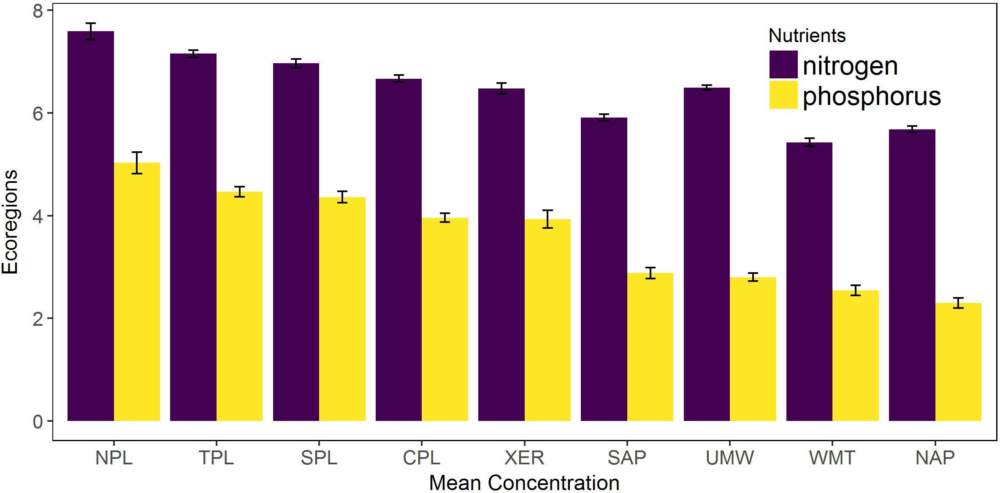

# Data Visualization

Visualizing  data is an area where R really shines.  For this we will split our focus between base and an installed package, `ggplot2`.  I will show some quick and easy graphics that we can produce with base R, but we won't spend anytime customizing them. Instead, we will move on quickly to `ggplot2`, which is now (I have no data to back this up), the de-facto standard for visualizing data in R.  Given that `ggplot2` is general package for creating essentially ALL types of visualizations, it can seem quite complex (and it is).  What I hope you will get out of this section is a basic understanding of how to create a figure and, most importantly, how to find help and examples that you can build off of for your own visualizations.

## Lesson Outline:

- [Simple plots with base R](#simple-plots-with-base-r)
- [Introduction to `ggplot2`: scatterplot](#introduction-to-ggplot2-scatterplot)
- [Introduction to `ggplot2`: barchart](#introduction-to-ggplot2-barchart)
- [Customizing `ggplot2` plots](#customizing-ggplot2-plots)
- [Cool stuff and getting help with `ggplot2`](#cool-stuff-and-getting-help-with-ggplot2)

## Lesson Exercises:
- [Exercise 5.1](#exercise-41)
- [Exercise 5.2](#exercise-42)

## Some examples for inspiration!
Before we get started, I do like to show what is possible.  A couple of geospatial examples of maps created in R.

A few (now somewhat dated) examples of maps built with R show this:


And some fairly complicated figures:


And lastly some cool examples using `ggplot2` with `plotly`.

<http://blog.revolutionanalytics.com/2014/11/3-d-plots-with-plotly.html>

Now that we are sufficiently motivated, lets take a step back to the very basics.

## Simple plots with base R
When you first get a dataset and are just starting to explore it, you want do be able to quickly visualize different bits and pieces about the data.  I tend to do this, initially, with base R. We will cover some quick plots with base R.  Later we are going to go into more detail on `ggplot2` which is becoming the gold standard of viz in R.  For now we will look at some of the simple, yet very useful, plots that come with base R.  

The workhorse function for plotting data in R is `plot()`.  With this one command you can create almost any plot you can conceive of, but for this workshop we are just going to look at the very basics of the function.  The most common way to use `plot()` is for scatterplots.  Let's look at some scatterplots of the NLA data.


```r
plot(nla_wq_subset$CHLA,nla_wq_subset$NTL)
```


Hey, a plot!  Not bad.  Let's customize a bit because those axis labels aren't terribly useful and we need a title. For that we can use the `main`, `xlab`, and `ylab` arguments.


```r
plot(nla_wq_subset$CHLA,nla_wq_subset$NTL,main="NLA Nutrient and Chlorophyll",
     xlab="Chlorophyll a",ylab="Total Nitrogen")
```


Now, let's look at boxplots and histograms.

Two great ways to use boxplots are straight up and then by groups. For this we will use `boxplot()` and in this case it is looking for a vector as input.


```r
boxplot(nla_wq_subset$CHLA)
```


As plots go, well, um, not great.  Let's try it with a bit more info and create a boxplot for each of the groups.  This is using formula notation which is in the base form of `y ~ x`.  Thinking about this form a 2-dimensional plot standpoint it makes sense as your x-axis is the group and y is the value of interest.  We will use a log transformation for this.  And a quick note on logs in R, the `log()` function provides this and has to arguments.  The first is the vector of numeric values you wish to transform, and the second is the base.  Default base for `log()` is the the natural log.  A convenience function `log10()` is the equivalent of doing `log(100,base=10)`.  We will use `log10()` for these examples.


```r
boxplot(nla_wq_subset$CHLA ~ nla_wq_subset$EPA_REG)
```


```r
#Given the spread, maybe  a log transform makes sense
boxplot(log10(nla_wq_subset$CHLA) ~ nla_wq_subset$EPA_REG)
```


And finally, histograms.


```r
hist(nla_wq_subset$PTL)
```


```r
#And log again specifying number of breaks (e.g. bins)
hist(log10(nla_wq_subset$PTL), breaks=10)
```


## Introduction to `ggplot2`: scatterplot

More can certainly be done with base graphics, but we will move to `ggplot2` for our more complex plotting.  If you are interested, there has been some interesting back and forth on `ggplot2` versus base.  Read [here for the base case](http://simplystatistics.org/2016/02/11/why-i-dont-use-ggplot2/) and [here for the `ggplot2` case](http://varianceexplained.org/r/why-I-use-ggplot2/).  In short, to each their own!  For me, I am mostly team `ggplot2`.

A lot has been written and discussed about `ggplot2`.  In particular see [here](http://ggplot2.org/), [here](http://docs.ggplot2.org/current/) and [here](https://github.com/karthikram/ggplot-lecture).  The gist of all this, is that `ggplot2` is an implementation of something known as the "grammar of graphics."  This separates the basic components of a graphic into distinct parts (e.g. like the parts of speech in a sentence).  You add these parts together and get a figure.

Before we start developing some graphics, we need to do a bit of package maintenance as `ggplot2` is not installed by default.


```r
install.packages("ggplot2")
library("ggplot2")
```

First thing we need to do is to create our ggplot object.  Everything we do will build off of this object.  The bare minimum for this is the data (handily, `ggplot()` is expecting a data frame) and `aes()`, or the aesthetics layers.  Oddly (at least to me), this is the main place you specify your x and y data values.


```r
# aes() are the "aesthetics" info.  When you simply add the x and y
# that can seem a bit of a confusing term.  You also use aes() to 
# change color, shape, size etc. of some items 
nla_gg <- ggplot(nla_wq_subset,aes(x=CHLA,y=NTL))
```

Great, nothing happened...  All we did at this point is create an object that contains our data and what we want on the x and y axes.  We haven't said anything about what type of plot we want to make.  That comes next with the use of geometries or `geom_`'s.  

So if we want to simply plot points we can add that geometry to the ggplot object.  

A side note on syntax.  You will notice that we add new "things" to a ggplot object by adding new functions.  In concept this is very similar to the piping we talked about earlier.  Essentially it takes the output from the first function as the input to the second.  So to add points and create the plot, we would do:


```r
#Different syntax than you are used to
nla_gg + 
  geom_point()
```


```r
#This too can be saved to an object
nla_scatter <- nla_gg +
                geom_point()

#Call it to show the plot
nla_scatter
```


Not appreciably better than base, in my opinion.  But what if we want to add some stuff...

First a title and some axes labels.  These are part of `labs()`.


```r
#Getting fancy to show italics and greek symbols
x_lab <- expression(paste("Chlorophyll ",italic(a), " (", mu, "g/L)"))
y_lab <- expression(paste("Total Nitrogen ", "(", mu, "g/L)"))
nla_scatter <- nla_scatter +
                labs(title="Nitrogen and Chlorophyll in US Lakes",
                     x=x_lab, y=y_lab)
nla_scatter
```


Now to add some colors, shapes etc to the point.  Look at the `geom_point()` documentation for this.


```r
nla_scatter <-  nla_scatter +
                geom_point(aes(color=RT_NLA, shape=RT_NLA),size=2)
nla_scatter
```


You'll notice we used `aes()` again, but this time inside of the geometry.  This tells ggplot2 that this aes only applies to the points.  Other geometries will not be affected by this.

In short, this is much easier than using base.  Now `ggplot2` really shines when you want to add stats (regression lines, intervals, etc.). 

Lets add a loess line with 95% confidence intervals


```r
nla_scatter_loess <- nla_scatter +
                geom_smooth(method = "loess")
nla_scatter_loess
```


Try that in `base` with so little code!

Or we could add a simple linear regression line with:


```r
nla_scatter_lm <- nla_scatter +
                  geom_smooth(method="lm")
nla_scatter_lm
```


And if we are interested in the regressions by group we could do it this way.


```r
nla_scatter_lm_group <- nla_scatter +
                        geom_smooth(method="lm", 
                                    aes(group=RT_NLA))
nla_scatter_lm_group
```


Or, if we wanted our regression lines to match the color.


```r
nla_scatter_lm_color <- nla_scatter +
                        geom_smooth(method="lm", 
                                    aes(color=RT_NLA))
nla_scatter_lm_color
```


Notice, that we specified the `aes()` again, but for `geom_smooth()`.  We only specified the x and y in the original `ggplot` object, so if want to do something different in the subsequent functions we need to overwrite it for the function in which we want a different mapping (i.e. groups).

In short, some of the initial setup for ggplot is a bit more verbose than base R, but when we want to do some more complex plots it is much easier in `ggplot2`.  

Before we get into another exercise, lets look at some of the other geometries.  In particular, boxplots and histograms.  If you want to see all that you can do, take a look at the list of `ggplot2` [geom functions](http://docs.ggplot2.org/current/).


## Exercise 5.1
Let's now build some plots with `ggplot2`

1. Add this code in a new section of your `nla_analysis.R` script.

3. Build a scatter plot showing the relationship between PTL and CHLA (`log10()` transform both) with each LAKE_ORIGIN value a different color.  For some optional fun add in a regression line for each value of LAKE_ORIGIN.  There are many ways to do the log transforms.  Either try some ideas out or search online for some help.  

## Introduction to `ggplot2`: barchart

(These instructions inspired by the [R Graphics Cookbook](http://www.cookbook-r.com/Graphs/Plotting_means_and_error_bars_(ggplot2)/#bar-graphs))

I didn't mention this before, but prior to jumping into coding any figure I like to think a bit about what I want to show and will actually sketch that out on paper.  Doing this also forces you to start thinking about what data you need in order to create that figure. In the case of the bar chart with error bars at a minimum we will need some mean value to plot and some representation of error for the error bars.  Another common thing to do is plot this for multiple categories and for multiple values.  
For this example, we will be interested in looking at Nitrogen and Phosphorus concentrations across ecoregions.  Let's first start with the data.

### Data for bar chart: NLA 2012

We will be using the same NLA 2007 water quality data for the bar chart with error bars.  Specifically we will be interested in total nitrogen, total phosphorus, and ecoregion.  First, if we haven't done it already, let's load up our packages:


```r
library(dplyr) # For some basic data massaging
library(tidyr) # Also for some basic data massaging
library(ggplot2) # For the plots
```

Next, we will be using our `nla_wq_subset` data.  To remind you it looks like:


```r
tbl_df(nla_wq_subset)  
```

```
## # A tibble: 1,086 × 9
##          SITE_ID RT_NLA  EPA_REG WSA_ECO9 LAKE_ORIGIN   PTL   NTL  CHLA
##            <chr>  <chr>    <chr>    <chr>       <chr> <int> <int> <dbl>
## 1  NLA06608-0001    REF Region_8      WMT     NATURAL     6   151  0.24
## 2  NLA06608-0002  SO-SO Region_4      CPL    MAN-MADE    36   695  3.84
## 3  NLA06608-0003  TRASH Region_6      CPL     NATURAL    43   738 16.96
## 4  NLA06608-0004  SO-SO Region_8      WMT    MAN-MADE    18   344  4.60
## 5  NLA06608-0006    REF Region_1      NAP    MAN-MADE     7   184  4.08
## 6  NLA06608-0007    REF Region_5      UMW     NATURAL     8   493  2.43
## 7  NLA06608-0008  SO-SO Region_7      TPL    MAN-MADE    66   801 30.24
## 8  NLA06608-0010  SO-SO Region_5      UMW     NATURAL    10   473  4.38
## 9  NLA06608-0012  TRASH Region_6      SPL    MAN-MADE   159  1026  4.90
## 10 NLA06608-0013  SO-SO Region_2      CPL    MAN-MADE    28   384 16.03
## # ... with 1,076 more rows, and 1 more variables: SECMEAN <dbl>
```


### Manipulating the data
Remember, for this example we are going to plot mean nutrients vs. ecoregions, thus, we will need to summarize the per lake data on an ecoregional basis and get the mean and standard error for each nutrient within each ecoregion.   Also, many of the `ggplot2` functions will easily create separate plots if a categorical factor is supplied.  We will keep this in mind because we want different bars for each of the variables.

Given this we need a data frame that looks like:

|Ecoregion|Nutrient|Mean|Standard Error|
|---------|--------|----|--------------|


```r
nla_bar_mean <- nla_wq_subset %>%
  group_by(WSA_ECO9) %>%
  summarize(nitrogen = mean(log1p(NTL)),
            phosphorus = mean(log1p(PTL))) %>%
  gather("variable", "mean", 2:3)

nla_bar_se <- nla_wq_subset %>%
  group_by(WSA_ECO9) %>%
  summarize(nitrogen = sd(log1p(NTL))/sqrt(length(NTL)),
            phosphorus = sd(log1p(PTL))/sqrt(length(PTL))) %>%
  gather("variable", "std_error", 2:3)
```

Now we have two separate data frames, but what we really want is a single data frame with both the mean and standard error.  To get this we need to join these 


```r
nla_bar_data <- full_join(nla_bar_mean, nla_bar_se)
nla_bar_data
```

```
## # A tibble: 18 × 4
##    WSA_ECO9   variable     mean  std_error
##       <chr>      <chr>    <dbl>      <dbl>
## 1       CPL   nitrogen 6.665325 0.07066966
## 2       NAP   nitrogen 5.681802 0.06330981
## 3       NPL   nitrogen 7.585325 0.16348056
## 4       SAP   nitrogen 5.908134 0.06768542
## 5       SPL   nitrogen 6.961988 0.08281829
## 6       TPL   nitrogen 7.151022 0.06829739
## 7       UMW   nitrogen 6.487875 0.04962580
## 8       WMT   nitrogen 5.427034 0.07648467
## 9       XER   nitrogen 6.476153 0.10301489
## 10      CPL phosphorus 3.958591 0.08800836
## 11      NAP phosphorus 2.299099 0.09810943
## 12      NPL phosphorus 5.025606 0.21280461
## 13      SAP phosphorus 2.879714 0.10302636
## 14      SPL phosphorus 4.358820 0.11254340
## 15      TPL phosphorus 4.463773 0.10016581
## 16      UMW phosphorus 2.800388 0.07693035
## 17      WMT phosphorus 2.545780 0.09880419
## 18      XER phosphorus 3.931829 0.17158026
```

Now that was easy!  

I am being sarcastic, because getting the data ready is really about 90% of the effort.  In reality this usually takes me a couple of iterations of getting things wrong.  So if it is not immediately obvious why we did these steps, that is not unusual.  Now we can use this to build out our plot.


```r
nla_bar <- ggplot(nla_bar_data,aes(x = WSA_ECO9, y = mean, fill = variable)) +
  geom_bar(stat = "identity", position = position_dodge()) +
  geom_errorbar(aes(ymin=mean-std_error, ymax=mean+std_error),
                  width=.2,                    # Width of the error bars
                  position=position_dodge(.9))

nla_bar
```


So that looks pretty good, but there might other changes you want to see with this figure.  We will consider three:

### Re-order x-axis

I find bar charts to be fairly difficult to read accurately so getting order of the ecoregions is not easy.  One way to get at that is to order the x-axis based on one of the variables.  For this we will re-order the axis, in descending order of mean Phosphorus.  `ggplot2` uses the order of a factor to do this. And while we could do this with base R, that'd make our heads hurt, so Hadley to the rescue with the `forcats` package and some `magrittr` kung fu.


```r
library(forcats)
# First create a character vector of levels in the proper order
eco9_ord <- nla_bar_data %>%
  filter(variable == "phosphorus") %>%
  arrange(desc(mean)) %>%
  .$WSA_ECO9

nla_bar_data <- nla_bar_data %>%
  mutate(desc_ecoregion = fct_relevel(factor(WSA_ECO9,eco9_ord)))
```

Now with that done, we can recreate our plot from above


```r
nla_bar <- ggplot(nla_bar_data,aes(x = desc_ecoregion, y = mean, fill = variable)) +
  geom_bar(stat = "identity", position = position_dodge()) +
  geom_errorbar(aes(ymin=mean-std_error, ymax=mean+std_error),
                  width=.2,                    # Width of the error bars
                  position=position_dodge(.9))

nla_bar
```


### Change color of bars

Believe it or not, there is a fair bit of research behind which colors we should use for plots that aid in interpretation, are readable by those with colorblindness, etc.  So the default is probably good while we build the plot, but we almost always want to move beyond that.  For this we will use the [`viridis` package](https://cran.r-project.org/web/packages/viridis/vignettes/intro-to-viridis.html)


```r
library(viridis)
nla_bar <- nla_bar +
  scale_fill_viridis(discrete=TRUE)

nla_bar
```


### Move beyond the default theme

Lastly, the default theme is fine, but we probably want to tweak it some.  In particular for this plot let's change up the background and fix our legend title.

First, let's fix the legend title.


```r
nla_bar <- nla_bar +
  guides(fill = guide_legend(title = "Nutrients"))

nla_bar
```


Now let's work on a different look and feel.


```r
nla_bar <- nla_bar +
   labs(x = "Mean Concentration", y = "Ecoregions")+
   theme(text = element_text(family="serif"),
         panel.background = element_blank(), panel.grid = element_blank(), 
         panel.border = element_rect(fill = NA), 
         plot.title  = element_text(family="sans",size=12,face="bold",vjust=1.1),
         legend.position = c(0.85,0.85), legend.key = element_rect(fill = 'white'),
         legend.text = element_text(family="sans",size=15), 
         legend.title = element_text(family="sans",size=11),
         axis.title.x = element_text(family="sans",vjust = -0.5, size = 12),
         axis.title.y = element_text(family="sans",vjust = 1.5, size = 12),
         axis.text.x = element_text(family="sans",size = 11),
         axis.text.y = element_text(family="sans",size = 11))
nla_bar
```


This shows the way to do that with a bunch of custom settings.  For a quicker version of doing this, you can use some of the canned themes in `ggplot2` or use the `ggthemes` package for many additional ones.  Some example sof using one of the `ggplot2` ones is below.  Also note, I am not saving these to an object so result is a temporary view of what the plot would have looked like.


```r
nla_bar + 
  theme_bw()
```


```r
nla_bar +
  theme_classic()
```


```r
nla_bar +
  theme_minimal()
```


And some fun examples for the `ggthemes` package.


```r
library(ggthemes)
nla_bar +
  theme_economist()
```


```r
nla_bar + 
  theme_excel()
```


```r
nla_bar + 
  theme_tufte()
```


```r
nla_bar +
  theme_fivethirtyeight()
```


### Saving the figure

Once you have the details of your figure, figured (he, he) out you need to move it from the screen and into your manuscript.  This requires saving the output to a file.  The `ggplot2` package comes with a function to facilitate this, `ggsave()`.  To output a ggplot2 object to a high resolution jpeg:


```r
ggsave(filename = "nla_bar_chart.jpg",
       plot = nla_bar,
       width = 8,
       height = 4,
       units = "in", 
       dpi = 300)
```

This should get you pretty close to providing the figures required by the journal you are submitting too.  If there are additional things you need to do your figure you can either edit the file directly in an image processing program (e.g. gimp or irfanview) or you can manipulate the file in R with the `magick` package, essentially an R client for ImageMagick.  Using `magick` is a bit beyond the scope of what we want to do today, but I will show a quick example of something I had to do for a paper recently: remove white space around borders of the image.  We can do with this using the auto crop functionality in `magick`.


```r
library(magick)
nla_fig <- image_read("nla_bar_chart.jpg")
nla_fig <- image_trim(nla_fig)
image_write(nla_fig, "nla_bar_chart_trim.jpg" )
```

The original tiff:


The trimmed version:



## Exercise 5.2

1.) Let's make a similar chart, but instead of nutrients, let's plot mean and standard error of chlorophyll and secchi by EPA region (EPA_REG).

2.) To get you started, the data needs to be manipulated:


```r
#Packages needed
library(dplyr)
library(tidyr)
library(ggplot2)
nla_chla_secc_mean <- nla_wq_subset %>%
  group_by(EPA_REG) %>%
  summarize(chla = mean(CHLA),
            secchi = mean(TURB)) %>%
  gather("variable","mean",2:3)

nla_chla_secc_se <- nla_wq_subset %>%
  group_by(EPA_REG) %>%
  summarize(chla = sd(log1p(CHLA))/sqrt(length(CHLA)),
            secchi = sd(log1p(TURB))/sqrt(length(TURB))) %>%
  gather("variable","se",2:3)
          
nla_chla_secc_data <- full_join(nla_chla_secc_mean, nla_chla_secc_se)
```

3.) Now look back at the examples and see if you can create a bar chart that shows the mean,  and error bars of CHLA and TURB by EPA_REG.

## Cool stuff and getting help with `ggplot2`
In this last section we won't have an exercise, but I did want to show some other things that `ggplot2` can do and show some other functions that people have built on top of `ggplot2` that are pretty cool.  Lastly, I provide some links on more reading as well as some nice (and fun) data visualization galleries.

### Facets
First thing I want to show are facets.  Facets allow you to lay out multiple plots in a grid.  With a single facet the result is similar to what we already accomplished by coloring/sizing points based on a factor in the dataset, but it separates into different plots and we can easily add an additional factor to organize by column.  Looking at some of the examples provided with `facet_grid()` shows us how these can work.


```r
tp_chla <- ggplot(nla_wq_subset,aes(x=log10(PTL),y=log10(CHLA))) + geom_point()

tp_chla + facet_grid(RT_NLA ~ .)
```


```r
tp_chla +
  stat_smooth() +
  facet_grid(RT_NLA ~ LAKE_ORIGIN)
```


### Sources of Help on `ggplot2`
- [Winston Chang's Cookbook](http://www.cookbook-r.com/Graphs/): Many great step-by-step examples.  Good starting point for you own plots
- [Offical `ggplot2` documentation](http://docs.ggplot2.org/current/): The authoritative source.  Also many great examples.  The [aesthetics vignette](http://docs.ggplot2.org/current/vignettes/ggplot2-specs.html) is good to know about.

### R Data Viz Examples
- Cool rCharts examples: [rCharts Gallery](http://rcharts.io/gallery/)
- ggplot examples: [Google Image Search](http://goo.gl/P0q2Lx)
- R Data Viz, gone wrong:[Accidental aRt](http://accidental-art.tumblr.com) 
  - [My own claim to fame](http://accidental-art.tumblr.com/post/96720455195/was-trying-to-mess-with-projections-in-ggplot)

### Some additional information

- Three dimensional plots:  There are many ways to do three dimensional plots in R.  A nice implementation of this with the help of a little javascript magic is plotly.  A lot of nice examples here: <https://plot.ly/r/#3d-charts> and <https://plot.ly/~jackp/17249.embed>.  There are also some additional packages that support this, namely [scatterplot3d](https://cran.r-project.org/package=scatterplot3d)

- Animations: Additionally, you can create animations.  The only one I have played with is [`gganimate`](https://github.com/dgrtwo/gganimate) which allows you to use what we know about `ggplot2` and create animations.  It is not on CRAN yet so would need to be installed by using the `devtools` package:


```r
library(devtools)
install_github("dgrtwo/gganimate")
```
